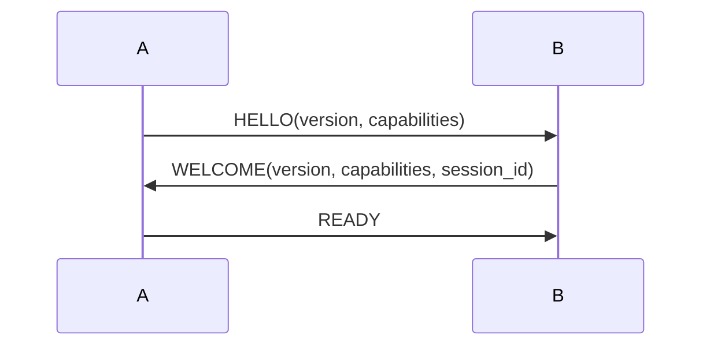

## 9. 六维技术支持深度评估——MDI/API/ABI/MCP/ACP/A2A

### 9.1 本章引言

在基础语法适配性分析之上，本章进一步评估MyST在六个关键技术维度（MDI/API/ABI/MCP/ACP/A2A）的支持能力和拓展可能性，为更广泛的Agent技术文档场景提供决策依据。这六个维度覆盖了从文档接口定义、应用编程接口、底层二进制接口，到新兴的Model Context Protocol、Agent通信协议以及应用间互操作协议的完整技术栈。

### 9.2 MDI（Markdown as Interface）维度

**现有基础**：项目已有的MDI v1.0解析器在markdown-it-py基础上实现了`{endpoint}`/`{param}`/`{response}`/`{error}`等directive，对应MDIDocument/Interface/Parameter等数据模型（[models.py](file:///d:/spaces/SpecWeave/.agents/scripts/mdi/models.py)）。当前解析器在代码层面已预留Directive扩展点，但存量文档使用率为0%。

**MyST Domain机制**：Sphinx的Domain机制（`sphinx.domains`模块）为不同编程语言/技术领域提供自定义directive/role/交叉引用命名空间。MyST继承了这一设计哲学，允许为特定领域定义完整的语义扩展集。

**mdi域设计建议**：

- **Directives**: `{mdi:interface}`, `{mdi:param}`, `{mdi:response}`, `{mdi:error}`, `{mdi:model}`, `{mdi:event}`, `{mdi:enum}`
- **Roles**: `{mdi:type}`, `{mdi:param-ref}`, `{mdi:iface-ref}`, `{mdi:model-ref}`, `{mdi:enum-ref}`
- **交叉引用**: `:mdi:iface:`角色自动解析跨文档接口引用，支持跳转和重构

**与IDL对比**：

| 维度 | OpenAPI | Protobuf | MyST-MDI |
|---|---|---|---|
| 机器可解析性 | 最高 | 最高 | 高（语义明确） |
| 人可读性 | 中（YAML/JSON） | 低 | 最高 |
| 学习曲线 | 陡 | 陡 | 平缓 |
| 表达灵活性 | 低（Schema约束） | 低 | 高 |
| 代码生成 | 成熟工具链 | 成熟 | 需自建 |
| 文档即代码 | 分离 | 分离 | 统一 |

**可行性评级**：高度可行

### 9.3 API（应用程序编程接口）维度

**Sphinx生态现状**：

- `sphinx.ext.autodoc`：从Python docstring自动生成API文档
- `sphinx-autoapi`：不import代码静态分析生成API文档
- `sphinxcontrib-httpdomain`：HTTP API专用domain（支持`:http:get:`/`:http:post:`等role）
- `sphinxcontrib-openapi`：从OpenAPI spec自动生成文档
- `sphinx-jsdomain`/`sphinx-cppdomain`/`sphinx-javadomain`：多语言API文档支持

**MyST对API文档的支撑能力**：

- 代码块+`:key: value`选项：天然适合参数/响应定义
- 可执行代码块（myst.yml中设置`execute: true`）：支持文档内可运行示例
- `{figure}`+`{caption}`：API截图和图示
- 表格支持：用于状态码、错误码等二维数据展示

**HTTP API扩展建议**：

````markdown
```{http:endpoint} POST /api/v1/users
:auth: bearer
:rate-limit: 100/min
:content-type: application/json

创建新用户。

```{http:param} email
:type: string
:required: true
:format: email
:location: body
```
````

**多语言API文档**：Sphinx的jsdomain/cppdomain/javadomain可直接通过MyST使用，无需额外适配。

**可行性评级**：高度可行（生态成熟）

### 9.4 ABI（应用程序二进制接口）维度

**Sphinx内置支持**：

- `sphinx.domains.c`：C函数/类型/宏文档
- `sphinx.domains.cpp`：C++类/模板/命名空间文档
- 第三方：sphinx-rust（Rust API文档）

**ABI文档特殊需求**：内存布局描述、调用约定、二进制兼容性版本、FFI边界、系统调用号。

**abi域设计建议**：

- **Directives**: `{abi:struct}`, `{abi:function}`, `{abi:syscall}`, `{abi:layout}`
- **Options**: `:calling-convention:`, `:alignment:`, `:size:`, `:compat-version:`
- **Roles**: `{abi:type}`, `{abi:field-offset}`
- 内存布局可通过list-table或Mermaid图表表达

**示例**：

````markdown
```{abi:struct} UserRecord
:size: 64
:alignment: 8
:compat: v1.0+

```{abi:field} id
:offset: 0
:type: uint64_t
:size: 8
```

```{abi:field} name
:offset: 8
:type: char[32]
:size: 32
```
````

**评估**：技术可行但需求场景有限（Agent开发中较少涉及底层ABI文档），建议作为P2优先级。

**可行性评级**：中等可行（需求频次低）

### 9.5 MCP（Model Context Protocol）维度

**MCP核心概念**：Host-Client-Server架构，Tools（工具调用）、Resources（资源访问）、Prompts（提示模板）三原语。MCP为LLM提供标准化的能力描述和调用接口，是当前Agent生态的核心协议之一。

**MCP与文档的天然亲和性**：MCP Server本身就是一个结构化能力描述接口，与MyST的结构化表达高度匹配。MyST的Directive机制可以精确表达MCP Server的工具、资源、提示模板定义。

**mcp域设计建议**：

- **Directives**:
  * `{mcp:server}` - MCP Server定义（:name:, :version:, :transport:选项）
  * `{mcp:tool}` - 工具定义（:name:, :description:）
  * `{mcp:resource}` - 资源定义（:uri:, :mime-type:）
  * `{mcp:prompt}` - 提示模板定义（:name:, :arguments:）
- **Roles**:
  * `{mcp:tool-ref}` - 工具引用
  * `{mcp:server-ref}` - Server引用

**创新构想：文档即MCP Server**

> 利用MyST的结构化directive，文档本身可以被解析为一个MCP Server描述：
> - `{mcp:tool}`块 → MCP Tool定义
> - `{mcp:resource}`块 → MCP Resource定义
> - 解析器直接从.md生成MCP Server的JSON Schema
> - LLM阅读文档即可理解可用工具，文档和实现使用同一份定义

这一构想实现了"文档即代码、文档即服务"的极致形态，消除了文档与实现之间的中间转换层。

**示例**：

````markdown
```{mcp:server} github-tools
:version: 1.0.0
:transport: stdio

GitHub MCP工具集，提供代码仓库和Issue管理能力。

```{mcp:tool} create_issue
:description: 在指定仓库创建Issue

```{mcp:param} repo
:type: string
:required: true
仓库全名（owner/repo格式）
```

```{mcp:param} title
:type: string
:required: true
Issue标题
```
```
````

**可行性评级**：高度可行+高价值（与Agent场景高度契合）

### 9.6 ACP（Agent Communication Protocol）维度

**ACP核心概念**：Agent间消息格式、协议握手、能力协商、会话管理、错误传播。ACP定义了多Agent系统中Agent如何发现彼此、协商能力、建立会话、交换消息。

**acp域设计建议**：

- **Directives**:
  * `{acp:message}` - 消息定义（:type:, :direction:, :schema:选项）
  * `{acp:handshake}` - 握手流程
  * `{acp:capability}` - 能力声明
  * `{acp:session}` - 会话管理规则
- **Roles**: `{acp:msg-ref}`, `{acp:cap-ref}`
- 消息序列图：可通过Mermaid sequenceDiagram表达

**示例**：

````markdown
```{acp:handshake} 双向能力协商
:initator: Agent-A
:responder: Agent-B



- 版本协商：双方取version交集的最高版本
- 能力协商：交集为本会话可用能力
```
````

**可行性评级**：中等可行（协议规范尚在演进，但文档表达需求明确）

### 9.7 A2A（Application-to-Application）维度

**Google A2A协议参考**：Agent Card（能力描述）、Task（任务单元）、Message（消息）、Artifact（产出物）、Part（内容片段）。A2A是Google推出的Agent互操作协议，旨在实现不同厂商Agent之间的标准化通信。

**A2A通信模式**：

- **同步RPC**：请求-响应模式
- **异步任务**：长时运行任务+状态轮询/回调
- **事件驱动**：发布-订阅模式
- **数据流**：流式传输（如Token流）

**a2a域设计建议**：

- **Directives**:
  * `{a2a:agent-card}` - Agent能力卡片
  * `{a2a:task}` - 任务类型定义
  * `{a2a:stream}` - 流式端点
  * `{a2a:event}` - 事件定义
- **Roles**: `{a2a:agent-ref}`, `{a2a:task-ref}`

**Agent Card示例**：

````markdown
```{a2a:agent-card} code-reviewer
:version: 2.1.0
:endpoint: https://agents.example.com/code-reviewer
:protocol: a2a/1.0

代码审查Agent，支持多语言代码审查和安全扫描。

**Capabilities:**
- `streaming`: 支持流式输出审查结果
- `push-notifications`: 支持完成后回调通知

**Skills:**
- Python代码审查
- JavaScript安全扫描
- SQL注入检测
```
````

**可行性评级**：高度可行（A2A是Agent生态的重要方向，文档需求强烈）

### 9.8 六维对比总表

| 维度 | 生态成熟度 | Agent场景价值 | 实现难度 | 推荐优先级 |
|---|---|---|---|---|
| MDI | 已有基础 | 最高（核心场景） | 低 | P0 |
| API | 高（sphinxcontrib生态成熟） | 高 | 低 | P0 |
| ABI | 中（C/C++ domain成熟，自定义需扩展） | 低（Agent场景少用） | 中 | P2 |
| MCP | 新兴但结构清晰 | 最高（与AI Agent高度契合） | 低-中 | P0 |
| ACP | 低（协议尚在演进） | 中 | 中 | P1 |
| A2A | 低-中（Google刚发布） | 高（Agent互操作是趋势） | 中 | P1 |

**关键发现**：MCP维度的"文档即MCP Server"构想最具创新性——MyST文档本身可被解析为MCP Server描述，实现文档与实现的统一，这是传统IDL（OpenAPI/Protobuf）难以做到的"文档即代码"极致形态。建议在平衡方案实施中优先设计mcp域。

---
