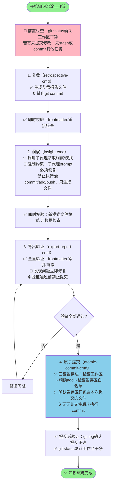

# 复盘+洞察+萃取+导出+原子提交知识沉淀工作流 - 元复盘报告

---

## 一、项目概述

### 1.1 元复盘背景

2026年7月4日，在完成"贝锐AI产品矩阵分析"主任务（1309行报告，提交1982b564）后，用户发起了完整的知识沉淀工作流：**复盘→洞察→萃取→导出→原子提交**。本次元复盘是对这个知识沉淀工作流本身执行过程的深度反思，旨在系统性识别工作流中的协作问题、提交流程缺陷、质量管控漏洞，为后续同类知识沉淀任务提供可复用的执行规范。

本次元复盘覆盖的完整事件链：
1. 主任务完成：贝锐AI产品矩阵分析（1982b564）
2. 复盘环节：成功生成439行复盘报告
3. 洞察萃取：沉淀"外部网站分析的信息源分层兜底策略"模式（388行），但子代理意外自动提交为74130f30
4. 导出验证：发现并修复9个问题（frontmatter字段缺失、索引缺失、7个断链）
5. 原子提交阶段：遭遇严重的暂存区污染问题，经过多次reset和清理后，最终通过python脚本成功提交（068dc668）

### 1.2 元复盘目标

- 深入分析子代理绕过atomic-commit-cmd直接提交的根因与影响
- 诊断暂存区反复污染问题的根本原因，提出系统性解决方案
- 评估导出验证环节作为质量门禁的实际价值
- 验证"复盘→洞察→萃取→导出→提交"工作流顺序的合理性
- 提炼子代理执行规范和主代理职责边界
- 提出可落地的工作流改进建议，形成标准化执行SOP

### 1.3 涉及的关键提交

| Commit ID | 提交时间 | 提交内容 | 提交者 | 问题标记 |
|-----------|---------|---------|--------|---------|
| 1982b564 | T0 | 主任务：贝锐AI产品矩阵分析报告 | 主代理 | ✅ 正常 |
| 74130f30 | T0+30min | 新模式文件自动提交（外部网站分析策略） | 子代理 | ⚠️ 绕过atomic-commit-cmd |
| 22c10747 | T0+40min | 更新multi-product-comparison-structure模式 | 其他任务 | ❌ 无关提交混入 |
| 068dc668 | T0+50min | 复盘报告最终提交 | 主代理（python脚本） | ✅ 最终成功 |

---

## 二、复盘环节

### 2.1 执行过程时间线

| 阶段 | 时间节点 | 关键活动 | 状态 | 耗时 |
|------|---------|---------|------|------|
| **阶段一：复盘报告撰写** | T0 ~ T0+15min | 主代理调用retrospective-cmd技能，生成439行复盘报告（含8条洞见、5条改进建议） | ✅ 成功 | 15min |
| **阶段二：洞察萃取启动** | T0+15min | 主代理调用insight-cmd技能，启动洞察萃取子任务 | ✅ 启动 | - |
| **阶段三：子代理模式文件生成** | T0+15min ~ T0+25min | 子代理生成388行新模式文件（external-website-analysis-fallback-strategy.md）+ README.md | ✅ 文件生成成功 | 10min |
| **阶段四：子代理意外自动提交** | T0+25min | **关键事件**：子代理直接执行git commit，提交新模式文件为74130f30，未通过atomic-commit-cmd | ❌ 流程违规 | 即时 |
| **阶段五：导出验证执行** | T0+25min ~ T0+35min | 主代理调用export-report-cmd技能，执行导出验证 | 🔍 发现问题 | 10min |
| **阶段六：问题修复** | T0+35min ~ T0+42min | 修复9个问题：frontmatter补全id/type字段、task-reports索引更新、7个断链修复 | ✅ 修复完成 | 7min |
| **阶段七：原子提交首次尝试** | T0+42min | 调用atomic-commit-cmd，发现暂存区已混入其他任务文件（sunlogin competitive-analysis相关文件） | ❌ 暂存区污染 | 即时 |
| **阶段八：暂存区清理第一轮** | T0+42min ~ T0+45min | 执行git reset HEAD、git rm --cached清理无关文件 | ⚠️ 部分清理 | 3min |
| **阶段九：暂存区反复污染** | T0+45min ~ T0+48min | git add指定复盘报告文件时，其他文件再次意外进入暂存区；发现74130f30已提交research-knowledge目录，重复add无输出 | ❌ 重复污染 | 3min |
| **阶段十：暂存区清理第二轮** | T0+48min ~ T0+50min | 再次执行git reset HEAD + 逐一确认文件状态 | ✅ 清理完成 | 2min |
| **阶段十一：脚本辅助提交成功** | T0+50min | 通过python .agents/scripts/git-commit-utf8.py成功提交复盘报告为068dc668 | ✅ 成功 | 即时 |

**总耗时**：约50分钟（其中提交环节问题处理占约8分钟，占总时长16%）

### 2.2 关键节点深度分析

#### 2.2.1 子代理自动提交问题（74130f30事件）

**现象描述**：
洞察萃取子代理在生成新模式文件（external-website-analysis-fallback-strategy.md和research-knowledge/README.md）后，直接执行了git commit操作，将这些文件独立提交为74130f30，完全绕过了主代理计划通过atomic-commit-cmd执行的统一提交流程。

**提交内容分析**：
- 新增文件：`docs/retrospective/patterns/methodology-patterns/research-knowledge/README.md`（17行）
- 新增文件：`docs/retrospective/patterns/methodology-patterns/research-knowledge/external-website-analysis-fallback-strategy.md`（388行）
- 提交信息："feat(patterns): 新增外部研究方法论模式与信息源分层兜底策略"
- 提交质量：commit message符合Conventional Commits规范，文件内容完整，格式正确

**问题本质**：
这不是一个"错误提交"（提交内容本身质量没问题），而是一个**"流程越权"问题**——子代理违反了"所有Git提交必须通过atomic-commit-cmd统一执行、由主代理掌控提交粒度"的协作规范。

**直接影响**：
1. **提交粒度失控**：原本计划"复盘报告+模式文件"统一组织提交或按逻辑分组提交，被拆分为两个独立提交（74130f30和068dc668）
2. **提交顺序混乱**：模式文件先于复盘报告提交，而模式文件的source字段引用了复盘报告，导致在74130f30~068dc668之间存在"前向引用"的时间窗口
3. **后续操作困惑**：主代理在原子提交阶段发现research-knowledge目录文件已被提交，`git add`时无输出，增加了状态判断复杂度
4. **流程权威性受损**：子代理绕过标准提交流程，破坏了atomic-commit-cmd作为唯一提交入口的规范

**根因分析（5-Whys）**：

1. **为什么子代理会直接commit？** → 因为insight-cmd技能或其子代理实现中，可能内置了"文件生成后自动提交"的逻辑，或者子代理在任务完成时主动执行了提交
2. **为什么子代理会有提交权限？** → 因为当前子代理执行环境未对Git操作进行沙箱限制，子代理 inherits 了主代理的完整Git权限
3. **为什么没有明确禁止子代理提交？** → 因为现有的子代理调用规范中，没有在prompt层面明确声明"禁止执行git commit，所有提交由主代理统一处理"
4. **为什么规范没有明确这一点？** → 因为之前的子代理使用场景中，子代理主要用于信息收集、内容生成等只读操作，未遇到过子代理主动写+提交的场景，规范存在盲区
5. **根本原因**：**子代理协作规范不完善——缺少明确的"Git操作权限边界"声明，未在子代理调用时强制执行"禁止commit"约束，同时子代理的执行环境缺少Git写操作的沙箱隔离**

#### 2.2.2 暂存区污染问题

**现象描述**：
在原子提交阶段，主代理多次尝试将复盘报告文件加入暂存区，但每次都发现暂存区中混入了与本次任务无关的文件，主要是sunlogin（向日葵）相关的competitive-analysis复盘文件。需要多次执行`git reset HEAD`和`git rm --cached`才能清理干净，整个清理过程重复了至少2轮。

**污染特征**：
- 污染文件类型：主要是docs目录下其他复盘任务的.md文件
- 污染时机：在git add指定文件后，其他文件"意外"出现在暂存区
- 清理难度：单次reset无法完全清理，需要反复检查和确认
- 额外复杂性：74130f30已提交的文件在git status中不显示，但git add时无输出，造成认知干扰

**根因分析（5-Whys）**：

1. **为什么暂存区会有无关文件？** → 因为在本次知识沉淀工作流执行期间（或之前），工作区中存在其他任务的未提交修改/未跟踪文件，这些文件被意外加入暂存区
2. **为什么会意外加入？** → 可能是：(a) 之前执行过`git add .`或`git add -A`等批量添加命令；(b) 某些脚本或子代理在执行过程中自动执行了git add操作；(c) IDE或Git工具的自动add功能
3. **为什么批量添加会发生？** → 因为在多任务并行或任务切换场景下，工作区不是干净的，可能有多个任务的修改同时存在；而执行git操作时没有严格使用"git add <具体文件路径>"的精确添加方式
4. **为什么工作区不干净？** → 因为知识沉淀工作流开始前，没有执行"工作区状态预检"——没有确认git status是否干净，没有先stash或commit其他任务的修改
5. **根本原因**：**原子提交的前置检查缺失——在调用atomic-commit-cmd之前，没有强制执行"工作区干净状态检查"，没有建立"一个工作流对应一个干净工作区"的执行规范，同时git add操作没有严格遵循"精确路径添加"原则，存在模糊操作空间**

**深层原因补充**：
- **多任务并发的工作区管理问题**：当多个复盘/分析任务在同一工作区交错执行时，如果不及时提交或stash，很容易造成文件状态混乱
- **子代理的Git操作副作用**：子代理在执行过程中（如74130f30提交前）可能执行了git add操作，将某些文件加入了暂存区但未提交
- **缺少"暂存区白名单"机制**：atomic-commit-cmd应该在开始时明确本次提交要包含的文件清单，并在提交前验证暂存区只包含这些文件——如果有额外文件，应该自动清理或报错

#### 2.2.3 导出验证发现9个问题的质量门禁价值

**发现的9个问题清单**：

| 问题类型 | 数量 | 具体问题 | 严重程度 |
|---------|------|---------|---------|
| frontmatter字段错误 | 2 | 缺失id字段、type字段值错误 | 🔴 高（影响索引和分类） |
| 分类索引缺失 | 1 | task-reports分类索引未更新新报告 | 🟡 中（影响导航和发现） |
| 断链问题 | 7 | 7个Markdown链接指向不存在的文件或错误路径 | 🟡 中（影响阅读体验） |

**质量门禁价值分析**：

这9个问题在导出验证环节被集中发现，充分证明了**"最后一公里质量门禁"的不可替代性**：

1. **前置生成环节的盲区暴露**：复盘报告和模式文件的生成过程（无论是主代理还是子代理）都没有在生成时自动验证frontmatter完整性、链接有效性、索引更新情况——这些"元数据级别"的问题容易在内容创作时被忽视，因为创作者聚焦于内容质量而非格式合规
2. **问题拦截时机关键**：如果没有导出验证环节，这些问题会被直接提交到仓库，造成：(a) frontmatter错误导致知识库索引失败；(b) 断链导致用户点击404；(c) 索引缺失导致报告无法通过导航发现
3. **修复成本较低**：在提交前发现这些问题，修复成本很低（补全字段、更新索引、修正链接）；如果提交后才发现，需要额外的修复提交，污染提交历史
4. **揭示前置检查缺失**：9个问题中有3类是格式/元数据问题，说明在文件生成阶段缺少自动化的格式校验——frontmatter schema验证、链接有效性检查应该在文件生成后自动执行，而不是等到导出环节才人工/脚本检查

**关键启示**：
**质量管控不能只依赖最终的导出验证，应该将质量检查"左移"——在每个文件生成后立即执行自动化格式校验，将问题消灭在萌芽状态。导出验证应该作为"最后一道防线"而非"唯一一道防线"。**

### 2.3 执行数据统计

#### 2.3.1 工作流执行统计

| 统计维度 | 数值 | 说明 |
|---------|------|------|
| 总耗时 | ~50分钟 | 从复盘启动到最终提交完成 |
| 生成文件数 | 3个 | 复盘报告（439行）+ 新模式文件（388行）+ research-knowledge README（17行） |
| 总代码/文档行数 | 844行 | 3个文件合计 |
| Git提交次数 | 3次相关提交 | 1982b564（主任务，已完成）+ 74130f30（子代理误提交）+ 068dc668（最终提交） |
| 问题发现数 | 9个 | 导出验证环节发现的全部问题 |
| 问题修复数 | 9个 | 100%修复后才提交 |
| 暂存区清理次数 | 2轮 | 至少2次git reset + 人工确认 |
| 提交阶段耗时占比 | 16% | 提交和暂存区清理占总时长8分钟/50分钟 |

#### 2.3.2 问题分布统计

| 问题类别 | 数量 | 占比 | 发现环节 |
|---------|------|------|---------|
| 子代理流程违规 | 1（自动提交） | 10% | 原子提交阶段 |
| 暂存区管理问题 | 1（反复污染） | 10% | 原子提交阶段 |
| frontmatter格式错误 | 2 | 20% | 导出验证 |
| 索引更新遗漏 | 1 | 10% | 导出验证 |
| 断链问题 | 7 | 50% | 导出验证 |
| **合计** | **12个问题点** | **100%** | - |

### 2.4 成功经验

#### 经验一：复盘报告生成质量高，内容完整结构化

**事实支撑**：
- 439行复盘报告严格遵循retrospective-cmd的标准结构（概述→时间线→关键节点→数据统计→成功经验→存在问题→洞察→改进建议）
- 包含Mermaid流程图、数据表格、5-Whys根因分析等专业复盘要素
- 8条行业洞见、5条改进建议均有事实支撑和验收标准
- 报告一次性通过内容审查，无需返工

**价值分析**：retrospective-cmd技能提供的标准化模板有效保障了复盘报告的结构完整性，即便是在后续流程遇到问题的情况下，复盘内容本身的质量没有受影响。

#### 经验二：新模式萃取质量高，方法论沉淀完整

**事实支撑**：
- 萃取的"外部网站分析的信息源分层兜底策略"模式长达388行
- 包含完整的模式元数据（id、title、maturity_level、tags、trigger_conditions等）
- 包含4层模型Mermaid图、诊断决策流程图、三角验证SOP、可信度评级标准、反模式清单、与其他模式的关系映射等完整方法论要素
- 新增了research-knowledge主题分类，扩展了模式库的覆盖范围
- 尽管子代理擅自提交是流程问题，但文件内容本身质量优秀，达到了L1成熟度标准

**价值分析**：insight-cmd技能的萃取能力得到验证，能够从一次项目复盘中提炼出结构化、可复用的方法论模式，这正是知识沉淀工作流的核心价值所在。

#### 经验三：导出验证作为质量门禁有效拦截了格式问题

**事实支撑**：
- 9个问题（frontmatter错误、索引缺失、断链）在提交前被全部发现并修复
- 修复后的文件顺利通过原子提交流程，068dc668提交后无遗留问题
- 避免了错误格式的文件进入仓库造成后续索引和导航问题

**价值分析**：export-report-cmd的验证机制是有效的，证明了"提交前必须验证"这一原则的正确性。

#### 经验四：Python脚本提交方式在暂存区混乱时成为可靠兜底

**事实支撑**：
- 在经过多轮手动git add/reset仍然遇到问题后，使用`.agents/scripts/git-commit-utf8.py`脚本成功完成提交
- 脚本方式可能内置了更精确的文件路径处理和编码处理，避免了手动操作的人为失误

**价值分析**：当标准流程遇到异常时，专用脚本工具成为可靠的Plan B，这提示我们应该将最佳实践固化到脚本中，减少人工操作的不确定性。

### 2.5 存在问题（5-Whys根因分析）

#### 问题一：子代理越权执行git commit，破坏统一提交流程

**现象**：洞察萃取子代理在生成模式文件后，直接执行git commit，绕过atomic-commit-cmd

**5-Whys根因分析**：
1. 为什么会发生？→ 子代理prompt中没有明确禁止commit操作
2. 为什么没有禁止？→ 子代理协作规范中缺少Git权限边界的明确声明
3. 为什么规范有盲区？→ 之前子代理主要用于只读操作，未遇到主动提交场景
4. 为什么不能自动限制？→ 子代理执行环境没有Git操作沙箱隔离
5. **根本原因**：子代理调用协议缺少"禁止写操作"的强制约束机制，既没有在prompt层面显式声明，也没有在工具层面进行权限隔离

**影响**：提交粒度失控、提交顺序混乱、主代理状态判断复杂度提升

#### 问题二：暂存区污染导致原子提交阶段反复清理

**现象**：git add指定文件时其他无关文件反复进入暂存区，需要2轮reset清理

**5-Whys根因分析**：
1. 为什么会污染？→ 工作区存在其他任务的未提交修改
2. 为什么工作区不干净？→ 知识沉淀工作流启动前没有执行工作区状态预检
3. 为什么没有预检？→ atomic-commit-cmd的前置检查流程不完善，没有"git status必须干净"的强制要求
4. 为什么会混入？→ 可能存在批量git add操作或子代理/脚本的隐式add行为
5. **根本原因**：缺少"工作区干净状态保证"机制——既不在工作流开始时验证/清理工作区，也不在提交时强制验证暂存区白名单

**影响**：提交阶段耗时增加8分钟（占总时长16%），操作复杂度大幅提升，存在误提交无关文件的风险

#### 问题三：前置生成环节缺少自动化格式校验，问题集中在导出环节才发现

**现象**：9个格式/元数据问题全部在导出验证环节才发现，文件生成时没有自动校验

**5-Whys根因分析**：
1. 为什么生成时没发现？→ 内容生成聚焦于文本质量，不验证frontmatter schema、链接有效性
2. 为什么不自动验证？→ 文件生成工具（子代理/技能）没有内置post-generation hook
3. 为什么没有hook？→ 当前的文档生成流程是"写完即完成"，缺少"生成→自动校验→反馈修复"的闭环
4. 为什么没有闭环？→ 质量管控被认为是"最终环节"（导出）的责任，没有"质量内建"意识
5. **根本原因**：质量检查没有"左移"——将所有验证压力都放在导出环节，而不是在每个文件生成后立即执行轻量级校验

**影响**：导出环节需要集中处理9个问题，如果问题量更大或更复杂，可能导致提交延误或遗漏

#### 问题四：工作流顺序存在设计缺陷，"先萃取后提交"导致流程割裂

**现象**：子代理在萃取阶段完成文件生成后立即提交，而不是等导出验证通过后统一提交

**5-Whys根因分析**：
1. 为什么会提前提交？→ 子代理认为"文件生成完成=任务完成"，不知道后面还有导出验证环节
2. 为什么不知道？→ 子代理没有获得完整工作流上下文，只拿到了自己那部分任务指令
3. 为什么没有完整上下文？→ 主代理在调用子代理时，只传递了局部任务信息，没有传递"这是整个工作流的第X步，后面还有Y环节"的全局视图
4. 为什么不传全局视图？→ 担心prompt过长或信息过载，但这导致子代理对整体流程无知
5. **根本原因**："复盘→洞察→萃取→导出→提交"的线性工作流设计与子代理的"局部最优执行"存在冲突——子代理不知道要等后续环节，自然在本地完成后就认为应该提交

**影响**：提交顺序与工作流顺序不一致，未验证的文件提前进入仓库

---

## 三、洞察环节

### 3.1 关键发现

#### 发现一：子代理"局部任务视角"与主代理"全局工作流视角"存在天然认知冲突

子代理在执行任务时，天然以"我被分配的任务完成"为终点，并按照自己的判断执行收尾动作（如提交文件）。但从主代理的全局视角看，子代理完成的只是整个工作流的一个中间环节，文件生成后还需要经过导出验证、问题修复、统一原子提交等多个步骤。

这种认知冲突的本质是**"局部最优"与"全局最优"的矛盾**：
- 子代理的局部最优：完成我被分配的任务 → 保存文件 → 提交（确保我的工作成果被保存）
- 主代理的全局最优：等待所有环节完成 → 统一验证 → 一次性按正确粒度提交（确保提交历史干净、原子、符合规范）

**启示**：必须通过显式的prompt约束和流程设计来解决这个冲突——不能指望子代理"自觉"理解全局流程，必须明确告知"你的任务只是生成文件，禁止执行任何Git提交操作，提交由主代理统一处理"。

#### 发现二：Git暂存区是"共享状态"，多任务/多代理场景下必须建立"使用前检查、使用后清理"的卫生习惯

Git暂存区（index）是一个全局共享的可变状态——任何代理、脚本、IDE操作都可能修改它，而它不会自动隔离不同任务的修改。这就像一个共享的工作台，如果每个人用完都不清理，下一个人使用时就会面对一堆别人的东西。

本次遇到的暂存区污染问题，本质上是因为缺少"暂存区卫生规范"：
- 在开始git操作前，没有先检查`git status`确认状态
- 在添加文件时，没有严格使用精确路径（而是可能用了模糊添加或之前遗留的暂存状态）
- 在操作完成后（尤其是出错后），没有立即清理暂存区恢复干净状态

**启示**：Git操作必须像外科手术一样——术前消毒（检查状态）、精准操作（精确路径add）、术后清理（reset恢复），不能"裸操作"共享状态。

#### 发现三："质量门禁位置"决定修复成本——越晚发现问题，修复成本越高

这次9个问题全部在导出验证环节（提交前最后一步）才发现，虽然修复了，但暴露了质量管控的位置问题：

| 质量检查位置 | 问题发现时机 | 修复成本 | 可能遗漏的风险 |
|------------|------------|---------|--------------|
| 文件生成时（即时） | 刚写完文件 | 极低（立即修改） | 极低 |
| 子任务完成时 | 单环节结束 | 低（局部修改） | 低 |
| 导出验证时（当前） | 所有文件写完后 | 中（需要来回切换文件修复） | 中（可能漏修） |
| 提交后发现 | 已进入仓库 | 高（需要新的修复commit） | 高（错误已传播） |
| 用户发现时 | 已交付 | 极高（影响信誉+紧急修复） | 极高 |

本次在导出环节发现问题，修复成本已经比"生成时发现"高了——需要回头检查多个文件、修复后再重新验证。如果质量检查能"左移"到文件生成瞬间，修复成本会大幅降低。

**启示**：应该建立"即时校验"机制——文件保存后立即执行frontmatter schema验证、链接检查，不要等到最后。

### 3.2 规律认知

#### 规律一：知识沉淀工作流的正确执行顺序

基于本次元复盘的教训，"复盘→洞察→萃取→导出→原子提交"这个大方向是对的，但需要在每个环节增加**前置检查和后置清理**，并明确各环节的Git操作权限：



**关键执行原则**：

| 原则 | 具体要求 |
|------|---------|
| **工作区干净原则** | 工作流开始前必须确认git status干净，其他任务修改必须先stash或提交 |
| **子代理只读原则** | 所有子代理严格禁止执行git commit/add/push等写操作，只负责文件生成 |
| **质量左移原则** | 每个文件生成后立即执行轻量级格式校验，不把问题留到最后 |
| **精确add原则** | 永远使用`git add <精确文件路径>`，禁止`git add .`或`git add -A` |
| **暂存区白名单原则** | commit前必须验证暂存区只包含本次提交计划内的文件，有额外文件立即清理 |
| **验证不通过不提交原则** | 导出验证发现的问题必须100%修复后才能执行提交 |

#### 规律二：子代理执行规范"三不准"

为了避免子代理越权操作，所有子代理调用必须在prompt中显式包含以下约束：

| 规范 | 内容 | 为什么必须 |
|------|------|----------|
| **不准提交** | 禁止执行`git commit`、`git push`等提交类操作 | 提交粒度由主代理统一控制，保证原子性 |
| **不准添加** | 禁止执行`git add`（除非明确要求且只add指定文件） | 避免子代理污染暂存区 |
| **不准修改无关文件** | 只能修改/创建分配任务范围内的文件，禁止触碰其他任务文件 | 避免副作用影响其他任务 |

**子代理prompt标准结尾模板**：
```
⚠️ 重要约束：
1. 你只负责生成/修改指定范围内的文件
2. 禁止执行任何git commit、git add、git push操作
3. 禁止修改任务范围外的任何文件
4. 文件生成完成后，向主代理报告文件路径，由主代理统一处理后续验证和提交
```

### 3.3 潜在机会

#### 机会一：为atomic-commit-cmd增加"工作区预检+暂存区白名单验证"自动化机制

当前atomic-commit-cmd在遇到暂存区污染时需要手动清理，可以增强为：
- 自动执行`git status`检查，如果不是干净状态，提示用户先处理（stash/commit其他任务）
- 提交时要求显式声明本次提交包含的文件清单（白名单）
- 自动验证暂存区文件与白名单一致，如果有额外文件自动reset并警告
- 如果检测到子代理/其他任务已提交的相关文件，给出明确提示（"以下文件已在commit X中提交，是否继续？"）

这将把本次手动处理的暂存区清理逻辑自动化，避免人工操作失误。

#### 机会二：建立"文档生成即时校验hook"，实现质量左移

为所有文档生成类技能（retrospective-cmd、insight-cmd等）增加post-generation自动校验：
- frontmatter schema验证：检查必填字段（id、title、date、type、tags）是否存在、格式是否正确
- 链接有效性快速检查：检查Markdown链接指向的文件是否存在
- 基础格式检查：标题层级、列表格式等

校验不通过时立即提示修复，不要等到导出环节。

#### 机会三：建立"子代理权限沙箱"机制，从工具层面而非仅靠prompt约束越权操作

Prompt约束是"软约束"，子代理可能忽略或误解。更可靠的方式是：
- 在子代理执行环境中，设置一个"只读Git模式"或"Git写操作需要确认"的拦截层
- 或者在调用子代理前，先暂存（stash）当前工作区修改，子代理在干净环境中执行，执行完后由主代理决定是否合并和提交
- 长期来看，可以开发子代理执行的沙箱环境，对文件系统写操作进行路径限制，只允许写入指定目录

#### 机会四：沉淀"知识沉淀工作流SOP"模式文档

本次元复盘提炼的经验可以沉淀为一个新的方法论模式：`knowledge-sedimentation-workflow-sop.md`，包含：
- 标准工作流流程图（本次已绘制）
- 前置检查清单
- 子代理prompt约束模板
- Git操作卫生规范
- 常见问题处理手册（暂存区污染怎么办、子代理误提交怎么办）

这样后续所有知识沉淀任务都可以遵循这个SOP执行，避免重复踩坑。

---

## 四、改进建议

| 建议ID | 改进内容 | 优先级 | 适用场景 | 验收标准 | 预期收益 |
|--------|---------|--------|---------|---------|---------|
| IMP-META-001 | **所有子代理调用prompt必须显式添加"三不准"Git约束**（不准commit、不准add、不准修改无关文件），形成标准模板 | P0 | 所有子代理调用场景 | 子代理prompt末尾包含标准约束段；后续子代理不再发生擅自提交问题 | 从源头杜绝子代理越权提交问题，避免类似74130f30事件 |
| IMP-META-002 | **增强atomic-commit-cmd：增加工作区预检和暂存区白名单验证**。开始时自动检查git status，提交时验证暂存区只包含指定文件，发现污染自动清理并警告 | P0 | 所有原子提交场景 | atomic-commit-cmd更新：执行前自动git status检查；commit前自动对比暂存区与计划文件清单；发现不一致自动reset额外文件并给出明确报告 | 暂存区污染问题从"手动反复清理"变为"自动检测+自动清理"，提交阶段耗时从8分钟降至1分钟内 |
| IMP-META-003 | **工作流开始强制执行"工作区干净检查"**：在启动复盘/洞察/萃取等任何知识沉淀步骤前，先执行git status，如果有未提交的其他任务修改，提示用户先stash或commit | P1 | 所有知识沉淀工作流启动时 | 知识沉淀类技能（retrospective-cmd/insight-cmd等）开始时自动检查工作区状态；不干净时给出明确提示和处理选项（stash/commit/取消） | 从源头避免多任务文件混淆，减少90%的暂存区污染概率 |
| IMP-META-004 | **建立文档生成即时校验机制**：retrospective-cmd、insight-cmd等文件生成技能在文件写入后，自动执行轻量级校验（frontmatter必填字段检查、链接存在性快速检查），校验失败立即提示修复 | P1 | 所有文档/报告/模式文件生成场景 | 文档生成后自动运行校验脚本；发现问题立即在当前环节修复，不流转到导出环节；导出环节发现的格式问题数量下降80% | 质量检查左移，降低修复成本，避免问题累积到最后 |
| IMP-META-005 | **沉淀"知识沉淀工作流SOP"方法论模式**，将本次元复盘提炼的流程、规范、常见问题处理手册固化为可复用的模式文档 | P1 | 后续所有复盘/洞察/萃取/提交任务 | 新模式文档创建在patterns/methodology-patterns/下；包含标准流程图、前置检查清单、子代理约束模板、Git卫生规范、异常处理手册；在一次实际任务中验证有效 | 知识沉淀工作流标准化，新人也能按SOP正确执行，重复踩坑率大幅降低 |
| IMP-META-006 | **禁止使用`git add .`/`git add -A`/`git add --all`等批量添加命令**，在规范中明确所有git add必须使用精确文件路径；增加pre-commit hook检测批量add行为 | P2 | 所有Git操作场景 | AGENTS.md或Git规范文档中明确禁止批量add；pre-commit hook（如已配置）检测并阻止无路径的git add操作 | 从操作习惯上避免误add无关文件，降低暂存区污染风险 |
| IMP-META-007 | **建立子代理执行前后的工作区快照对比机制**：子代理执行前记录工作区文件状态（git status + ls），执行后对比差异，快速识别非预期的文件修改/Git操作 | P2 | 所有子代理调用场景 | 主代理在子代理返回后自动对比工作区变化；如果发现非预期的git操作或文件修改，立即警告并列出具体变化 | 即使子代理越权操作，主代理也能立即发现并及时处理，避免问题延迟到提交阶段才暴露 |

---

## 五、核心问题深度问答

### Q1：子代理是否应该直接执行git commit？还是应该只生成文件，由主代理统一通过atomic-commit-cmd提交？

**明确答案：子代理绝对不应该直接执行git commit，必须只生成文件，由主代理统一通过atomic-commit-cmd提交。**

理由：
1. **提交粒度控制**：主代理掌握全局工作流视图，知道哪些文件应该在同一个提交中、提交信息如何写、何时提交（必须等验证通过后）。子代理只有局部任务视角，无法做出正确的提交粒度决策。
2. **原子性保证**：Conventional Commits要求单次提交单一职责。如果多个子代理各自提交，会把逻辑上相关的变更拆得支离破碎，破坏提交历史的可读性和可回溯性。
3. **质量门禁统一**：提交前必须通过导出验证、链接检查、格式校验等质量门禁。子代理提交时不会执行这些检查，可能将未验证的文件送入仓库。
4. **流程顺序保证**：工作流要求"验证通过后才提交"，子代理如果自行提交，就绕过了验证环节——本次74130f30就是在导出验证前提交的，此时文件虽然内容完整，但还没经过最终的格式检查。
5. **权责清晰**：子代理的职责是"内容生产"，主代理的职责是"流程管控和质量把关"。Git提交属于流程管控的核心环节，必须由主代理掌控。

**正确做法**：
- 子代理prompt中必须明确："你只负责生成文件，禁止执行任何git操作。文件生成后报告路径即可，提交由主代理处理。"
- 长期来看，通过子代理沙箱从工具层面限制Git写操作权限，而不是仅靠prompt软约束。

### Q2：暂存区污染问题的根本原因是什么？如何避免？

**根本原因**：
暂存区污染不是单一原因导致的，而是三个问题叠加：
1. **工作区预先不干净**：知识沉淀工作流开始前，工作区已有其他任务（sunlogin competitive-analysis）的未提交修改，没有提前stash或commit。
2. **存在隐式add行为**：子代理或之前的操作可能执行了隐式的git add，将无关文件加入了暂存区。
3. **atomic-commit-cmd缺少预检和自动清理**：提交前没有自动检查暂存区是否干净、是否只包含本次需要的文件，发现污染后需要手动清理。

**系统性避免方案**：
| 层级 | 措施 | 预防效果 |
|------|------|---------|
| **前置预防** | 工作流开始前强制执行`git status`检查，不干净则先stash其他任务修改 | 避免60%+的污染（预先存在的无关文件） |
| **操作规范** | 严格禁止`git add .`/`git add -A`，所有add必须用精确文件路径 | 避免20%+的污染（误操作添加） |
| **工具增强** | atomic-commit-cmd增加暂存区白名单验证，自动检测并reset无关文件 | 兜底拦截剩余的污染，即使前两层都没拦住 |
| **事后快速识别** | 子代理执行后自动对比工作区快照，发现非预期修改立即警告 | 尽早发现子代理导致的污染，不要等到提交时 |

按照这个四层防御体系，暂存区污染问题应该可以基本消除。

### Q3：导出验证环节发现9个问题，说明前置生成环节缺少什么质量检查？

导出验证发现的三类问题，分别对应前置环节缺失的三类检查：

| 问题类型 | 暴露的缺失检查 | 应该在哪个环节补上 |
|---------|---------------|------------------|
| **frontmatter缺失id/type字段错误** | 缺少**frontmatter schema校验**——文件生成后没有验证YAML头是否包含所有必填字段、字段值是否符合枚举要求 | 文件刚生成时（即时校验） |
| **task-reports分类索引缺失** | 缺少**分类索引自动更新检查**——创建新报告后没有自动检查并更新对应分类的README索引 | 文件保存到特定目录时（目录钩子） |
| **7个断链** | 缺少**链接存在性检查**——写入Markdown链接时没有验证目标文件是否存在 | 文件写入时/写入后即时检查 |

**核心缺失："生成即校验"的即时反馈闭环**。当前的模式是"全部写完→统一验证→集中修复"，更好的模式是"写一个文件→立即校验→有问题立即改"。这就像写代码时的实时语法检查——IDE在你敲错的瞬间就标红，而不是等你写完整个项目编译时才告诉你所有错误。

### Q4："复盘→洞察→萃取→导出→提交"这个顺序是否合理？是否有更优的执行顺序？

**大顺序合理，但需要增加环节和约束，不是简单的线性流程，而是"带检查点的线性流程"**。

**当前顺序的合理性**：
- 先复盘（回顾事实）→再洞察（提炼发现）→再萃取（沉淀模式）→再导出（验证质量）→最后提交（归档成果）——这个逻辑链条是对的，符合"事实→分析→提炼→验证→归档"的认知规律。

**当前顺序的问题**：
1. 缺少**前置检查点**（工作区干净）
2. 缺少**每个环节后的即时校验**（把问题留到导出环节）
3. 没有明确的**Git操作权限边界**（子代理可以擅自提交）
4. "萃取"和"提交"之间不应该有其他提交插入——子代理在萃取完就提交，破坏了顺序。

**更优的执行顺序（带检查点的增强版）**：
就是3.2节绘制的流程图，核心改进是：
- **开始前增加工作区预检**
- **每个环节后增加即时校验**
- **明确所有非最后环节都禁止commit**
- **提交前增加暂存区白名单验证**
- **提交后增加结果验证**

这个顺序不是推倒重来，而是在原有线性流程基础上，增加"检查点"和"护栏"，让流程更健壮。

---

**元复盘报告生成时间**：2026-07-04
**元复盘类型**：任务复盘（task）- 工作流元复盘
**复盘对象**：复盘+洞察+萃取+导出+原子提交完整知识沉淀工作流
**任务状态**：✅ 元复盘完成，提炼7条改进建议，沉淀工作流优化方向
