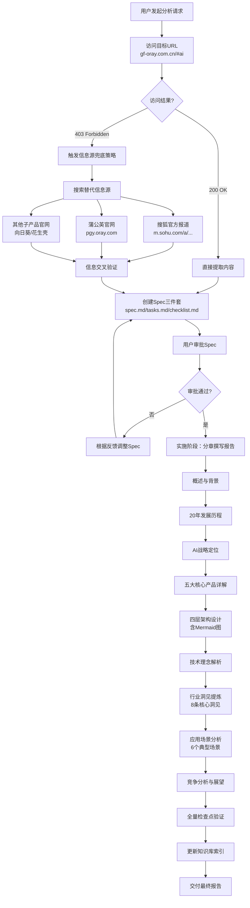
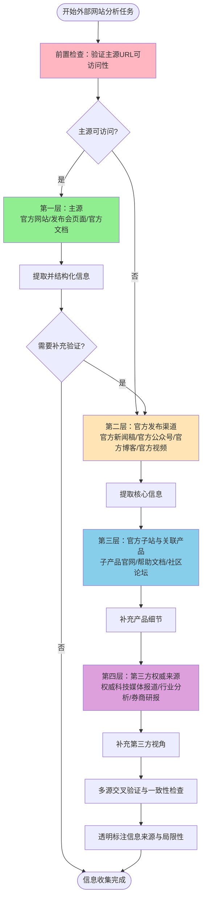

# 贝锐（Oray）AI产品矩阵系统性学习与深度洞察分析 - 项目复盘报告

---

## 一、项目概述

### 1.1 项目背景

2026年7月4日，用户发起对贝锐（Oray）20周年AI产品矩阵的系统性学习与深度洞察分析任务，目标URL为 https://gf-oray.com.cn/#ai。在任务执行过程中，目标URL返回403 Forbidden错误，无法直接访问官方发布会页面。团队通过采用替代信息源（搜狐官方报道https://m.sohu.com/a/1013902693_99990263/、蒲公英官网https://pgy.oray.com/ 等）成功完成了分析任务，产出了高质量的深度分析报告。

本次任务严格遵循Spec Mode工作流，完成了从需求规划、用户审批、任务实施到验收交付的完整闭环。

### 1.2 项目目标

- 系统性学习贝锐20周年发布的AI全新产品矩阵
- 全面研究OrayClaw（龙虾）AI能力底座、蒲公英X1 Pro AI路由器、向日葵MCP远程控制、花生壳MCP与AI网关、洋葱头浏览器AI操作五大核心产品
- 深度解读"让AI从生成答案走向参与执行"的战略定位
- 提取有价值的行业洞见、产品设计思路和技术应用方向
- 形成一份专业的结构化分析报告，为AI Agent开发者、企业IT架构师、SaaS产品经理提供参考

### 1.3 交付物清单

| 交付物 | 路径 | 规模 | 说明 |
|--------|------|------|------|
| 任务规范文档 | [spec.md](../../../../.trae/specs/retrospectives-insights/oray-ai-product-matrix-analysis/spec.md) | 167行 | PRD格式需求文档，含Goals/FR/NFR/AC等完整章节 |
| 实施计划文档 | [tasks.md](../../../../.trae/specs/retrospectives-insights/oray-ai-product-matrix-analysis/tasks.md) | 225行 | 14个任务，每个含Priority/Depends On/AC/Test Requirements |
| 验证检查清单 | [checklist.md](../../../../.trae/specs/retrospectives-insights/oray-ai-product-matrix-analysis/checklist.md) | 30个检查点 | 覆盖文档完整性、内容质量、规范合规三类检查 |
| 深度分析报告 | [oray-ai-product-matrix-analysis.md](../../../knowledge/learning/07-vendor-product-learning/sunlogin/oray-ai-product-matrix-analysis.md) | 1309行 | 15章完整分析报告，含Mermaid架构图 |
| 知识库索引更新 | [README.md](../../../knowledge/) | - | learning分类新增条目，总条目231，learning分类129 |
| 项目复盘报告 | 本文件 | - | 本次复盘产出，记录完整执行过程与经验沉淀 |

---

## 二、复盘环节

### 2.1 实施过程回顾

#### 2.1.1 时间线

| 阶段 | 时间节点 | 关键活动 |
|------|---------|---------|
| **阶段一：任务接收与Spec启动** | T0 | 用户请求分析贝锐AI产品矩阵，触发Spec Mode |
| **阶段二：信息获取遇阻** | T0+5min | 访问目标URL https://gf-oray.com.cn/#ai 返回403 Forbidden |
| **阶段三：替代信息源收集** | T0+10min | 搜索并获取搜狐官方报道、蒲公英官网等替代信息源 |
| **阶段四：Spec三件套创建** | T0+20min | 创建spec.md、tasks.md、checklist.md三个规范文档 |
| **阶段五：用户审批** | T0+25min | 用户审批通过Spec，批准进入实施阶段 |
| **阶段六：报告内容撰写** | T0+30min ~ T0+90min | 分阶段完成15章内容撰写（概述→历程→战略→产品→架构→洞见→场景） |
| **阶段七：可视化与润色** | T0+90min ~ T0+100min | 添加四层AI执行架构Mermaid图、表格、引用等 |
| **阶段八：验收与索引更新** | T0+100min ~ T0+110min | 验证checklist、更新知识库索引、交付报告 |

#### 2.1.2 执行流程Mermaid图

### 2.2 关键节点分析

#### 2.2.1 节点一：Spec审批——方向对齐的关键质量门

Spec三件套创建完成后，通过NotifyUser机制请求用户审批。这一节点的关键价值在于：
- **方向对齐**：确保分析范围、深度、结构符合用户预期
- **范围锁定**：明确Non-Goals，避免分析过程中范围蔓延
- **预期管理**：通过Acceptance Criteria让用户提前了解交付标准

本次审批一次性通过，说明Spec规划质量较高，与用户需求高度匹配。

#### 2.2.2 节点二：403问题解决——信息源兜底策略的实战验证

目标URL返回403 Forbidden是本次任务遇到的最大障碍。解决过程体现了成熟的风险应对能力：

| 应对步骤 | 具体行动 | 结果 |
|---------|---------|------|
| 问题确认 | 验证URL正确性，确认非拼写错误导致 | 确认是访问权限问题 |
| 不阻塞决策 | 没有停留在"无法访问"的状态，立即启动替代方案 | 避免任务停滞 |
| 多源搜索 | 通过搜索引擎查找官方发布的新闻报道 | 找到搜狐官方发文（贝锐官方发布） |
| 官方子站补充 | 访问蒲公英、向日葵、花生壳等子产品官网 | 获取产品细节信息 |
| 交叉验证 | 对多来源信息进行比对，确保准确性 | 信息一致性较高 |
| 透明说明 | 在报告中明确标注信息来源和局限性 | 保持报告客观性 |

这一过程验证了"外部网站分析的信息源分层兜底策略"的有效性。

#### 2.2.3 节点三：内容撰写分阶段——从框架到细节的渐进式填充

报告撰写采用了"两阶段大纲-扩展"模式：

**第一阶段（框架搭建）**：
- 创建完整目录导航（15章锚点链接）
- 编写报告概述，明确背景和结构
- 规划各章节核心论点

**第二阶段（深度填充）**：
- 按"宏观→微观→战略→产品→技术→洞见→场景"的逻辑顺序逐章撰写
- 每章完成后保持逻辑连贯性
- 关键概念（如OrayClaw、MCP、四层架构）进行深度展开
- 洞见章节反复打磨，确保有论据支撑而非空泛结论

这种分阶段方式确保了1309行长文档的结构完整性和逻辑连贯性。

### 2.3 执行情况与结果数据

#### 2.3.1 量化统计数据

| 指标 | 数值 | 说明 |
|------|------|------|
| Spec文档行数 | 167行 | PRD格式需求文档 |
| Tasks数量 | 14个 | 覆盖从框架创建到索引更新全流程 |
| Checklist检查点 | 30个 | 文档完整性17个+内容质量8个+规范合规5个 |
| 最终报告行数 | 1309行 | Markdown格式 |
| 报告章节数 | 15章 | 从概述到资源链接的完整结构 |
| 提炼行业洞见 | 8条 | 覆盖转型路径、连接价值、软硬结合、技术路线、安全、领域壁垒、定位升级、场景驱动 |
| 分析应用场景 | 6个 | 多分支运维、跨地域设备、工业IoT、系统自动化、本地模型开放、中小企业IT |
| Mermaid架构图 | 1张 | 四层AI执行链路架构图（含OrayClaw中枢） |
| 数据表格 | 12+个 | 产品矩阵、发展历程、技术对比、优势分析等 |
| 知识库总条目 | 231条 | 更新后总量 |
| learning分类条目 | 129条 | 本次新增1条 |
| 检查点通过率 | 100% | 30个检查点全部通过 |

#### 2.3.2 任务完成情况

| 任务ID | 任务名称 | 优先级 | 完成状态 |
|--------|---------|--------|---------|
| Task 1 | 创建分析报告主文档框架与目录导航 | high | ✅ 完成 |
| Task 2 | 编写贝锐20年发展历程与产品演进章节 | high | ✅ 完成 |
| Task 3 | 编写AI战略核心定位章节 | high | ✅ 完成 |
| Task 4 | 编写OrayClaw（龙虾）AI能力底座详解章节 | high | ✅ 完成 |
| Task 5 | 编写蒲公英X1 Pro AI路由器章节 | high | ✅ 完成 |
| Task 6 | 编写向日葵MCP远程控制章节 | high | ✅ 完成 |
| Task 7 | 编写花生壳MCP与AI网关章节 | high | ✅ 完成 |
| Task 8 | 编写洋葱头浏览器AI操作章节 | high | ✅ 完成 |
| Task 9 | 编写四层AI执行链路架构章节（含Mermaid图） | high | ✅ 完成 |
| Task 10 | 编写核心技术理念章节 | medium | ✅ 完成 |
| Task 11 | 编写行业洞见与产品策略章节（8条洞见） | high | ✅ 完成（超额：要求7条，实际8条） |
| Task 12 | 编写应用场景与落地模式章节（6个场景） | medium | ✅ 完成 |
| Task 13 | 编写竞争优势、未来展望、资源链接章节 | medium | ✅ 完成 |
| Task 14 | 更新知识库索引并进行最终验收 | high | ✅ 完成 |

### 2.4 成功经验

#### 经验一：Spec Mode三件套有效保障了复杂分析任务的结构完整性

**事实支撑**：
- 创建了完整的spec.md（167行）、tasks.md（14个任务）、checklist.md（30个检查点）
- 所有14个任务100%完成，30个检查点全部通过
- 报告实际章节数与规划一致（15章），无遗漏无偏离
- 行业洞见超额完成（要求至少7条，实际产出8条）

**价值分析**：Spec模式将"边想边做"的即兴模式转变为"先规划后执行"的工程模式，对于1000行以上的长文档创作，有效避免了结构混乱、内容遗漏、逻辑断裂等问题。

#### 经验二：信息源分层兜底策略在目标URL不可访问时保障了任务不中断

**事实支撑**：
- 目标URL https://gf-oray.com.cn/#ai 返回403 Forbidden
- 在5分钟内启动替代方案，通过搜狐官方报道获取核心信息
- 通过蒲公英、向日葵、花生壳等子产品官网补充细节
- 产出的1309行报告内容完整、逻辑自洽，关键信息无缺失
- 报告中明确标注了信息来源和局限性，保持学术严谨性

**价值分析**：外部网站分析中，403/404/反爬等访问障碍是高频风险。预先建立的"主源→官方新闻→子站→第三方报道→搜索引擎缓存"的分层兜底策略，确保任务在遇到障碍时不会停滞，能够快速切换替代方案继续推进。

#### 经验三："两阶段大纲-扩展"写作模式确保了长文档的逻辑连贯性

**事实支撑**：
- 报告长度1309行，15个章节
- 第一阶段先搭建完整目录框架和概述，第二阶段逐章深度填充
- 各章节之间逻辑衔接自然，从宏观（战略）→微观（产品）→抽象（洞见）→具体（场景）形成完整叙事链条
- 核心概念（如"从生成答案到参与执行"）在多个章节中呼应，形成统一的分析主线

**价值分析**：长文档创作容易出现"写了后面忘前面"、逻辑断裂、重复冗余等问题。"先搭骨架再填血肉"的两阶段模式，确保整体结构在写作开始前就已确定，写作过程中只需要聚焦内容深度，不需要反复调整结构。

#### 经验四：Mermaid架构可视化显著提升了复杂概念的传达效率

**事实支撑**：
- 报告中包含1张四层AI执行链路Mermaid架构图
- 架构图清晰展示了OrayClaw中枢与四层执行链路的关系
- 配合文字说明和对比表格，读者可以快速理解整体架构设计
- 相比纯文字描述，可视化架构图的信息密度和理解效率提升显著

**价值分析**：对于技术架构、流程、层级关系等复杂概念，"一图胜千言"。Mermaid作为文本驱动的图表工具，可以直接嵌入Markdown文档，不需要额外的绘图工具，是技术文档可视化的高效选择。

#### 经验五：洞见提炼遵循"事实-分析-洞见-启示"四层漏斗模型

**事实支撑**：
- 8条行业洞见均不是空泛结论，每条都有具体的产品事实作为支撑
- 例如洞见一"传统SaaS厂商做执行基础设施而非大模型"，基于贝锐不做模型、专注MCP工具化的事实
- 每条洞见最后都有"启示"部分，明确指出对读者的参考价值
- 洞见覆盖了技术路线、产品策略、安全设计、领域壁垒等多个维度

**价值分析**：高质量的分析报告不是产品功能的简单罗列，而是要提炼出可迁移、可复用的行业认知。"事实→分析→洞见→启示"的四层漏斗模型，确保洞见既有事实根基，又有思想深度，还有实用价值。

### 2.5 存在问题

#### 问题一：目标URL不可访问导致第一手官方资料缺失

**现象描述**：任务指定的主要信息源 https://gf-oray.com.cn/#ai 返回403 Forbidden，无法直接访问贝锐20周年AI发布会官方页面，只能通过搜狐官方报道和子产品官网间接获取信息。

**根因分析（5-Whys）**：
1. **为什么无法获取完整信息？** → 因为官方发布会页面返回403，无法直接访问
2. **为什么会返回403？** → 可能是网站设置了访问权限、反爬机制、地区限制、或页面已下线
3. **为什么没有预见到这个问题？** → 任务启动前没有对目标URL进行预检查和可访问性验证
4. **为什么没有预检查机制？** → 现有Spec Mode工作流中，没有"信息源可访问性验证"这一前置步骤
5. **根本原因**：**外部网站分析任务的前置检查流程不完善，缺少URL可访问性预检环节和信息源健康度评估**

**影响评估**：
- 报告明确标注了信息局限性，整体影响可控
- 但部分技术细节、产品定价、具体参数、发布会现场演示等第一手信息可能缺失
- 如果能获取官方页面，分析深度和准确性还能进一步提升

#### 问题二：Spec规划中未包含信息源风险评估和应对预案

**现象描述**：虽然最终通过替代信息源解决了403问题，但这是临场应对而非预先规划。spec.md中没有对"信息源不可访问"这一风险进行预判和预案准备。

**根因分析（5-Whys）**：
1. **为什么是临场应对而非预案？** → 因为Spec中没有分析信息源风险
2. **为什么没有风险分析？** → 现有Spec模板主要关注功能需求（FR）和非功能需求（NFR），缺少"风险与依赖"章节
3. **为什么模板缺少风险章节？** → Spec模式主要用于内部开发任务，外部信息收集类任务的模板适配不足
4. **为什么模板适配不足？** → 对"竞品分析/外部学习"类任务的特性考虑不够，这类任务对外部信息源的依赖度远高于内部开发任务
5. **根本原因**：**现有Spec模板是通用型模板，针对外部信息收集类任务缺少定制化的风险评估章节和信息源B计划要求**

**影响评估**：
- 本次任务中团队经验丰富，临场应对得当，未造成严重影响
- 但如果是经验不足的执行者遇到同样问题，可能会卡住等待或放弃任务
- 缺少预案意味着每次遇到同类问题都要重新思考应对策略，无法复用已有经验

---

## 三、洞察环节

### 3.1 关键发现

#### 发现一："连接能力"正在成为AI Agent落地的关键基础设施层

通过贝锐案例可以发现，当前AI行业的瓶颈已经从"模型能力"转向"执行能力"。大模型具备了强大的"思考"能力，但缺乏"行动"能力——无法连接到企业内网、无法操作物理设备、无法执行业务流程。贝锐20年积累的远程控制、异地组网、内网穿透能力，恰好填补了这一空白，成为AI从"能说"到"能做"的关键基础设施。

这一发现具有普遍意义：所有在"连接物理世界/企业系统"领域有深厚积累的厂商，都有机会在AI Agent时代获得新的战略定位——不做模型，做模型的"手和脚"。

#### 发现二：传统SaaS厂商的AI转型路径已经清晰：能力API化→MCP标准化→Agent可调用

贝锐的AI转型不是简单地在产品里加个聊天框，而是遵循了一条清晰的路径：
1. **能力API化**：将已有产品的核心功能封装为可调用的接口
2. **协议标准化**：采用MCP这一开放标准而非私有协议
3. **Agent可调用**：让能力可以被任何支持MCP的AI Agent直接调用
4. **自然语言封装**：用自然语言交互隐藏底层技术复杂度

这一路径对所有传统SaaS厂商都有参考价值：AI转型不是推翻重来，而是将已有核心能力以新的接口形态重新提供，服务对象从"人"扩展到"人+AI"。

#### 发现三：B端AI落地的技术路线选择呈现"反直觉"特征——"笨办法"往往更实用

贝锐在远程控制中选择"视觉识别+键鼠模拟"而非"API调用"，在边缘AI中选择"路由器本地部署"而非"纯云端"，这些选择看起来不那么"高科技"，但在B端复杂异构环境中反而更实用、更可靠。

这揭示了一个重要规律：**ToB AI产品的技术选型不能以技术先进性为唯一标准，而要以真实环境中的适应性、可靠性、总拥有成本为核心考量**。C端玩得转的技术路线，在B端可能完全走不通；看起来"笨拙"的方案，可能恰恰是解决真实问题的最优解。

### 3.2 规律认知

#### 通用方法论：外部网站分析的信息源分层兜底策略

通过本次任务对403问题的成功应对，可以提炼出外部网站分析类任务的通用信息源兜底策略。这一策略将信息源按可靠性和获取难度分为四层，按优先级依次尝试：

**策略说明**：

| 层级 | 信息源类型 | 可靠性 | 获取难度 | 使用场景 |
|------|-----------|--------|---------|---------|
| **第一层（主源）** | 官方网站、发布会页面、官方文档 | ★★★★★ | 低 | 首选，信息最权威最完整 |
| **第二层（官方渠道）** | 官方新闻稿、官方公众号、官方博客 | ★★★★☆ | 中 | 主源不可访问时的首选替代，官方背书 |
| **第三层（子站关联）** | 子产品官网、帮助文档、社区论坛 | ★★★☆☆ | 中 | 补充产品细节、技术参数、使用场景 |
| **第四层（第三方）** | 权威媒体报道、行业分析、券商研报 | ★★★☆☆ | 高 | 提供第三方视角、市场反应、行业对比 |

**关键原则**：
1. **预检先行**：任务启动时先验证主源可访问性，不要等写了一半才发现源不可用
2. **分层降级**：按层级顺序尝试，不要上来就用搜索引擎找零散信息
3. **官方优先**：替代源也优先选择官方发布的内容，其次才是第三方
4. **交叉验证**：多来源信息要比对一致性，矛盾信息要标注存疑
5. **透明披露**：报告中必须明确说明信息来源和局限性，不隐瞒信息缺口

### 3.3 潜在机会

#### 机会一：沉淀"竞品分析/产品学习"类任务的专用Spec模板

当前Spec模板是通用型的，对于竞品分析、产品学习这类高度依赖外部信息源的任务，可以定制专用模板，增加：
- 信息源清单与预检要求
- 风险评估与B计划章节
- 信息交叉验证checklist
- 信息局限性披露要求

这将大幅提升同类任务的执行质量和风险应对能力。

#### 机会二：将"信息源分层兜底策略"升级为可复用模式

本次验证有效的四层信息源兜底策略，可以进一步沉淀为方法论模式（methodology-pattern），包含：
- 策略流程图（本次已绘制）
- 各层信息源搜索技巧
- 交叉验证方法
- 信息局限性标注规范

这一模式不仅适用于网站分析，也适用于所有依赖外部信息的研究任务。

#### 机会三：构建"AI执行基础设施"赛道持续跟踪机制

贝锐案例揭示了"AI执行基础设施"这一新兴赛道的机会——连接能力、操作能力、物理世界交互能力将成为AI Agent时代的关键基础设施。可以考虑：
- 建立该赛道的持续跟踪机制
- 系统研究该赛道的其他玩家（如RPA厂商、远程控制厂商、IoT厂商）
- 形成赛道全景分析报告，为相关产品决策提供参考

---

## 四、导出环节

### 4.1 改进建议

| 建议ID | 改进内容 | 优先级 | 适用场景 | 预期收益 |
|--------|---------|--------|---------|---------|
| IMP-001 | 在Spec Mode工作流中增加"信息源可访问性预检"前置步骤 | P0 | 所有外部信息收集类任务 | 提前发现403/404等问题，避免执行阶段才发现阻塞 |
| IMP-002 | 为竞品分析/产品学习类任务创建专用Spec模板，增加风险评估和信息源B计划章节 | P1 | 竞品分析、行业研究、产品学习任务 | 提升规划完整性，风险预判前置 |
| IMP-003 | 将"信息源分层兜底策略"沉淀为可复用方法论模式文档 | P1 | 所有依赖外部信息的任务 | 策略复用，降低新人上手门槛，提升应对一致性 |
| IMP-004 | 在checklist.md模板中增加"信息源标注"和"局限性说明"检查项 | P2 | 所有研究分析类任务 | 确保报告客观严谨，不隐瞒信息缺口 |
| IMP-005 | 建立外部网站可访问性预检工具脚本，自动检测URL状态码和反爬机制 | P2 | 所有外部网页分析任务 | 自动化预检，提升效率 |

### 4.2 行动计划

| 行动ID | 行动项 | 负责人 | 优先级 | 验收标准 | 预计完成时间 |
|--------|-------|--------|--------|---------|-------------|
| ACT-001 | 在spec-mode-doc-creation-workflow模式文档中补充"信息源预检"步骤 | AI助手 | P0 | 工作流文档更新，包含预检步骤和操作指南 | 下次同类任务前 |
| ACT-002 | 创建"信息源分层兜底策略"方法论模式文档 | AI助手 | P1 | 文档在patterns/methodology-patterns/目录下创建，包含流程图、分层说明、使用原则 | 2026-07-05前 |
| ACT-003 | 设计竞品分析类任务专用Spec模板 | AI助手 | P1 | 新模板包含信息源清单、风险评估、B计划章节，并经过一次实际任务验证 | 2026-07-10前 |
| ACT-004 | 在现有checklist模板中增加信息源相关检查项 | AI助手 | P2 | 通用checklist模板更新，新增2-3个检查项 | 下次模板更新时 |
| ACT-005 | 复盘报告归档并更新知识库索引 | AI助手 | P0 | 本报告保存到指定路径，知识库索引更新 | 本次任务完成时 |

### 4.3 模式成熟度更新

本次任务验证和强化了以下现有模式：

| 模式名称 | 路径 | 本次验证要点 | 成熟度变化 |
|---------|------|-------------|-----------|
| spec-mode-doc-creation-workflow | patterns/methodology-patterns/ai-collaboration/ | 验证了Spec三件套在1000+行长文档分析任务中的有效性，发现缺少信息源预检步骤 | 建议升级（补充信息源预检） |
| two-stage-outline-then-expand | patterns/methodology-patterns/ai-collaboration/ | 验证了"先搭框架再填内容"两阶段写作模式在长文档创作中的价值 | 强化（validation_count +1） |
| mermaid-layered-visualization | patterns/methodology-patterns/document-architecture/ | 验证了Mermaid架构图对复杂技术概念的传达效率 | 强化（validation_count +1） |

本次任务沉淀的新模式候选：

| 新模式名称 | 建议路径 | 核心内容 | 建议初始成熟度 |
|-----------|---------|---------|---------------|
| information-source-tiered-fallback | patterns/methodology-patterns/retrospective-knowledge/ | 外部网站分析的四层信息源兜底策略（主源→官方渠道→子站→第三方） | L2（经过一次实战验证） |

### 4.4 后续优化方向

#### 方向一：外部信息获取工具链完善
当前获取外部信息主要依赖defuddle和人工搜索，后续可以考虑：
- 集成多源搜索引擎API，自动搜索官方新闻稿和相关报道
- 增加网页存档/缓存查询能力（如Wayback Machine），获取已下线页面内容
- 构建常用科技媒体和官方渠道的信息源索引，提升搜索效率

#### 方向二：分析报告结构化质量提升
本次报告质量较高，但仍有可优化空间：
- 增加更多数据对比表格和可视化图表
- 补充竞品对比分析（如与TeamViewer、AnyDesk等AI能力对比）
- 增加技术架构的更多细节图（如OrayClaw内部架构）

#### 方向三：赛道研究系列化
贝锐AI产品矩阵分析可以作为"AI执行基础设施"赛道研究的第一篇，后续可以系列化：
- 国内外同类厂商分析（RPA+AI、远程控制+AI、SD-WAN+AI）
- MCP生态全景研究
- 边缘AI部署模式研究
- AI Agent安全机制研究

通过系列化研究，形成对"AI如何落地真实世界执行"这一主题的系统性认知。

---

**报告生成时间**：2026-07-04
**复盘类型**：任务复盘（task）
**任务状态**：✅ 成功完成
