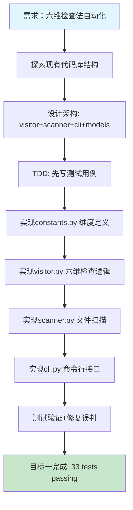
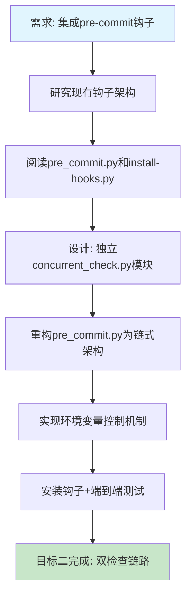
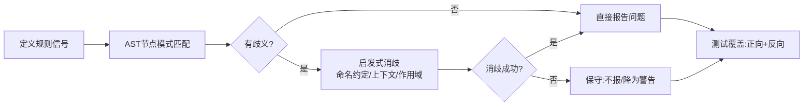
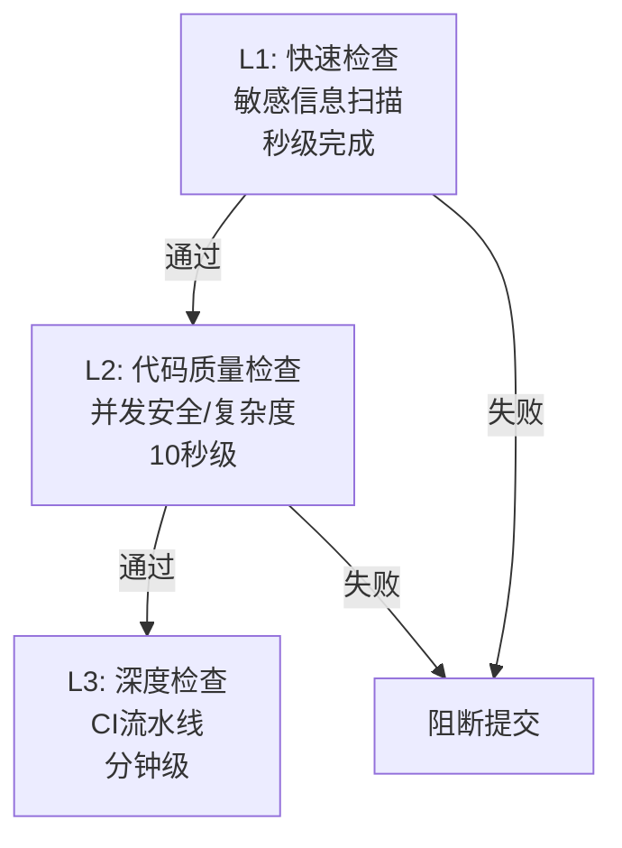

# 并发模块安全检查器（六维检查法）开发与pre-commit集成 — 任务复盘报告

> **任务名称**：并发模块安全检查器（六维检查法）从静态分析工具到Git pre-commit钩子的完整开发与集成
> **复盘日期**：2026-07-08
> **任务周期**：2026-07-08（单日两个连续任务）
> **报告类型**：任务结项复盘

## 文件索引

| 文件 | 说明 |
|------|------|
| [README.md](README.md) | 完整复盘报告（本文件） |
| [insight-extraction.md](insight-extraction.md) | 洞察萃取（5个核心可复用模式+交叉洞察） |

**沉淀至模式库的模式**：
- [chain-pre-commit-hooks.md](../../../../patterns/code-patterns/chain-pre-commit-hooks.md) — 链式pre-commit钩子架构（L2）
- [ast-disambiguation-five-methods.md](../../../../patterns/code-patterns/ast-disambiguation-five-methods.md) — AST静态分析五类消歧法（L2）

**导出至团队Wiki（知识库最佳实践）**：
- [git-hook-chain-architecture.md](../../../../knowledge/best-practices/git-hook-chain-architecture.md) — 链式pre-commit钩子架构实践指南（面向开发者）
- [ast-static-analysis-disambiguation.md](../../../../knowledge/best-practices/ast-static-analysis-disambiguation.md) — Python AST静态分析实践：五类消歧法降低误报（面向开发者）

***

## 一、任务概述

### 1.1 任务背景

在flexloop/chaos并发模块的代码审查与冲突解决机制开发过程中，团队总结出了并发代码审查的"六维检查法"（超时、幂等、边界、防御、配置、国际化）。此前六维检查法依赖人工审查，效率低且容易遗漏。用户要求将这套方法论转化为可自动化执行的静态分析工具，并集成到Git pre-commit钩子中，实现提交前自动扫描。

### 1.2 任务目标

1. **目标一**：生成针对并发模块的自动化测试脚本，验证六维检查法
2. **目标二**：将六维检查规则集成到Git pre-commit钩子中，实现提交前自动扫描

### 1.3 交付物清单

| 类别 | 文件 | 行数 | 说明 |
|------|------|------|------|
| 核心库 | `lib/check_concurrent_safety/__init__.py` | 12 | 模块入口，导出公共API |
| 核心库 | `lib/check_concurrent_safety/constants.py` | 50 | 六维常量定义、并发方法/类名集合 |
| 核心库 | `lib/check_concurrent_safety/models.py` | 33 | Issue/Report数据模型 |
| 核心库 | `lib/check_concurrent_safety/visitor.py` | 465 | AST访问器，六维检查核心逻辑 |
| 核心库 | `lib/check_concurrent_safety/scanner.py` | 90 | 文件扫描器，AST解析+报告生成 |
| 核心库 | `lib/check_concurrent_safety/cli.py` | 117 | CLI命令行接口 |
| 入口脚本 | `check-concurrent-safety.py` | 23 | CLI入口包装器 |
| 单元测试 | `tests/test_check_concurrent_safety.py` | 534 | 33个单元测试，覆盖六维+CLI+干净代码 |
| 钩子模块 | `hooks/concurrent_check.py` | 173 | pre-commit并发安全检查钩子 |
| 钩子入口 | `hooks/pre_commit.py` | 246 | pre-commit主入口（重构为链式检查架构） |
| 安装脚本 | `hooks/install-hooks.py` | 150 | 钩子安装器（更新提示信息） |
| **合计** | **11个文件** | **约1893行** | （不含__pycache__） |

***

## 二、复盘环节

### 2.1 实施过程回顾

**阶段一：静态分析工具开发（上午）**

**阶段二：pre-commit钩子集成（下午）**

**关键时间线事件**：

1. **架构设计决策**：采用Python AST（ast模块）而非正则表达式进行静态分析 —— 这是关键决策，决定了后续所有检查的准确性基础
2. **误判修复循环**：开发过程中遇到5类误判问题，逐一修复
3. **钩子架构决策**：不新增独立pre-commit钩子文件，而是作为第二检查链集成到现有`pre_commit.py`，保持单一钩子入口

### 2.2 关键节点分析

| 节点 | 问题 | 解决方案 | 经验 |
|------|------|---------|------|
| Thread.join()误判 | `str.join()`被识别为线程join | 实现`_is_thread_join()`方法，通过变量名模式（thread/worker）和类型构造判断 | **AST静态分析的核心挑战是消歧义**——同名方法在不同上下文中语义完全不同 |
| 集合变量误判 | `_pending_set`被识别为列表append | 检查变量名后缀（`_set`/`_dict`/`_map`）排除集合类型 | **命名约定是静态分析的重要信号**，但也意味着依赖代码规范 |
| 循环深度遗漏 | for循环未跟踪嵌套深度 | 添加`visit_For`方法与`visit_While`统一管理`loop_depth`计数器 | AST访问器必须覆盖所有相关节点类型，遗漏一个节点类型就会导致一类问题漏报 |
| JSON输出失败 | FileReport缺少passes属性 | 让FileReport继承ResultGroupMixin | **测试必须覆盖CLI所有输出格式**，而非仅核心逻辑 |
| 钩子import路径 | 脚本直接运行时sys.path[0]是hooks目录而非scripts目录 | 在main()入口统一添加scripts_dir到sys.path | **Git钩子运行环境与直接运行脚本的sys.path不同**，必须在设计时考虑 |

### 2.3 执行情况与结果数据

| 指标 | 数值 |
|------|------|
| 新增/修改文件 | 11个（7个核心+1个入口+1个测试+2个钩子） |
| 核心代码行数 | ~960行（visitor+scanner+cli+models+constants） |
| 测试代码行数 | 534行 |
| 钩子代码行数 | ~419行（concurrent_check + pre_commit重构） |
| 单元测试数量 | 33个 |
| 检查维度 | 6个（TIMEOUT/IDEMPOTENT/BOUNDARY/DEFENSIVE/CONFIG/I18N） |
| 端到端验证 | 通过（干净代码100分/有缺陷代码正确阻断） |
| 回归测试 | 1497个已有测试通过（13个预存在失败与本次无关） |
| 误报修复次数 | 5次 |
| 环境变量控制 | 5个（SKIP/WARN_ONLY/DIM/VERBOSE + 兼容SKIP=风格） |

### 2.4 成功经验

1. **遵循现有架构模式**：检查器的模块组织（lib/ + cli入口 + tests/）完全参照了现有`lib/checks/sensitive_info.py`的结构，降低了集成成本
2. **TDD驱动开发**：先写33个测试用例定义期望行为，再实现逻辑，核心visitor逻辑一次通过大部分测试
3. **在真实代码上验证**：使用conflict_resolution.py作为验证基准（已修复代码得100分，故意有缺陷的代码得9分），确保检查器不是"温室花朵"
4. **链式钩子架构**：将pre_commit.py重构为`_run_sensitive_check()` → `run_concurrent_check()`链式调用，既保持了向后兼容，又清晰分离了关注点
5. **完整的环境变量控制**：参考敏感信息检查的SKIP/WARN_ONLY模式，提供了一致的用户体验

### 2.5 存在问题

1. **静态分析的固有限制**：基于AST的静态分析无法追踪运行时类型（如一个变量实际是threading.Lock还是自定义类），只能通过命名约定启发式判断，存在误报/漏报可能
2. **中文比较检测范围有限**：当前I18N维度仅检测`==`/`!=`直接比较中文字符串的场景，未覆盖`in`操作符中文匹配、状态机中文流转等复杂场景
3. **边界维度（BOUNDARY）的列表查找检测**：依赖变量名模式（`*_list`）判断线性查找，对不遵循命名规范的代码会漏报
4. **钩子只扫描暂存文件**：如果开发者分批提交，可能只提交了部分文件，导致跨文件的并发问题未被检测到
5. **缺少自动修复能力**：与敏感信息检查的`--fix`不同，并发安全问题无法自动修复，只能人工处理

***

## 三、洞察环节

### 3.1 关键发现

**发现1：方法论→工具的转化关键在于"信号识别"**

六维检查法本质上是一组启发式规则（heuristics），而非形式化验证。将方法论转化为自动化工具的核心挑战不是"实现检查逻辑"，而是"找到可自动化的信号"：
- 超时维度 → 信号：`acquire()`/`join()`调用是否有timeout参数
- 幂等维度 → 信号：`list.append()`前是否有`not in`守卫
- 边界维度 → 信号：循环内是否有`x in list`模式
- 防御维度 → 信号：可变默认参数、返回内部可变对象
- 配置维度 → 信号：`time.sleep()`是否使用字面量
- I18N维度 → 信号：字符串比较中是否有中文字符

每条规则都有"能自动检测"和"不能自动检测"的边界。好的静态分析工具不是100%覆盖，而是在"检测率"和"误报率"之间找到平衡。

**发现2：现有钩子架构是"单入口多检查链"模式，新增检查应遵循链式扩展而非新增钩子文件**

在研究现有pre-commit架构时发现，项目采用的是"一个pre-commit钩子Python文件，内部串联多个检查"的模式，而不是"每个检查一个独立钩子文件"（如pre-commit框架的多钩子模式）。这种模式的优势是：
- Windows/Linux跨平台只需维护一套shell包装器
- 检查顺序可控（敏感信息优先阻断，避免不必要的扫描）
- 输出格式统一，用户体验一致

如果采用独立钩子文件方案，需要同时维护pre-commit、pre-commit.cmd、shell包装器等多个文件，增加维护成本。

**发现3：AST静态分析开发的5类误判模式**

在开发visitor.py过程中反复遇到的误判模式：

| 误判类型 | 示例 | 根因 | 解决策略 |
|---------|------|------|---------|
| **同名不同义** | `str.join()` vs `Thread.join()` | AST只看方法名，不看接收者类型 | 结合变量名模式+调用上下文消歧 |
| **类型推断缺失** | `items = []`是list还是deque？ | Python动态类型，AST无类型信息 | 变量名后缀约定+赋值语句追踪 |
| **上下文遗漏** | for循环内的查找 vs 顶层查找 | AST节点遍历遗漏相关节点类型 | 完整覆盖AST节点（For/While/If等） |
| **作用域穿透** | 函数参数是list还是外部传入的set？ | 无法追踪跨函数数据流 | 仅在函数/方法内部做局部分析 |
| **测试代码污染** | 测试函数中的故意错误被报告 | 检查器不应扫描测试代码 | 按函数名（test_）跳过 |

### 3.2 规律认知

**AST静态分析工具开发的标准模式**：

核心原则：**宁可漏报（false negative），不可误报（false positive）**——误报会让开发者不信任工具，最终跳过检查；漏报可以通过逐步完善规则来弥补。

**Git钩子集成的三层信任模型**：

pre-commit钩子应放在L1-L2层，执行快速的高价值检查。耗时的深度检查（如完整项目扫描、集成测试）应放在CI层。本次并发安全检查单文件扫描毫秒级，适合pre-commit层。

### 3.3 潜在机会

1. **规则可配置化**：当前六维规则硬编码在visitor.py中，未来可支持YAML配置文件自定义规则阈值和排除模式
2. **IDE实时诊断**：核心visitor逻辑可被Language Server Protocol(LSP)复用，提供编码时实时提示，而非仅在提交时检查
3. **增量扫描优化**：当前钩子扫描所有暂存Python文件，可通过git diff只扫描变更行相关的代码上下文
4. **更多并发模式检测**：当前六维是基础检查，可扩展检测：
   - 死锁：多锁获取顺序不一致
   - 竞态条件：共享变量读写无锁保护
   - 线程池泄漏：未正确shutdown
   - 异步陷阱：async函数内调用阻塞IO
5. **CI流水线集成**：在pre-commit基础上增加full scan模式，作为MR/PR门禁，扫描全量代码而非仅变更文件

***

## 四、导出环节

### 4.1 改进建议

| 问题 | 改进措施 | 优先级 | 预期效果 | 状态 |
|------|---------|--------|---------|------|
| I18N维度中文比较检测覆盖不全 | 扩展检测`in`操作符、字典key中文匹配、状态流转中文常量 | 中 | 减少国际化问题漏报 | 待规划 |
| 边界维度依赖变量命名约定 | 引入数据流分析追踪列表/集合实际类型 | 中 | 降低对命名规范的依赖 | 待规划 |
| 无自动修复能力 | 对可自动修复的问题（如可变默认参数→None守卫）提供--fix | 低 | 提升开发者体验 | 待规划 |
| 钩子不扫描跨文件问题 | 在CI层增加全量扫描门禁 | 高 | 形成pre-commit+CI双层防护 | 待规划 |
| 规则不可配置 | 支持.concurrent-safety.yml配置文件 | 低 | 满足不同项目定制需求 | 待规划 |

### 4.2 行动计划

| 优先级 | 改进项 | 具体措施 | 建议时间 | 状态 |
|--------|--------|---------|---------|------|
| 高 | CI全量扫描门禁 | 在CI流水线中增加check-concurrent-safety.py全量扫描，设置评分阈值 | 2026-07-15 | 待规划 |
| 中 | I18N维度增强 | 扩展visitor._check_chinese_comparison()覆盖in操作符和字典get | 2026-07-12 | 待规划 |
| 中 | 增加更多并发模式 | 调研死锁/竞态条件的可检测信号，新增维度或子规则 | 2026-07-20 | 待规划 |
| 低 | 自动修复能力 | 参照sensitive_info --fix模式，实现可变默认参数的自动修复 | 2026-07-25 | 待规划 |

### 4.3 模式沉淀

| 模式 ID | 成熟度 | 触发原因 | 复用场景 |
|---------|--------|---------|---------|
| 链式pre-commit检查架构 | L2（已验证） | 新增检查时发现单入口多链模式优于多钩子 | 未来新增任何pre-commit检查（如复杂度检查、安全扫描）都应遵循此模式 |
| AST消歧五法（同名消歧/类型推断/上下文覆盖/作用域限制/测试跳过） | L2（已验证） | visitor开发中反复遇到误判，总结出五类消歧策略 | 未来开发任何Python AST静态分析工具时可直接套用 |
| 方法论→工具转化：信号识别法 | L1（待复用） | 六维检查法从人工审查转化为自动化工具 | 将任何人工代码审查checklist转化为自动化工具时使用 |

### 4.4 后续优化方向

短期（1周内）：
- 在conflict_resolution.py等并发模块上全量运行，收集误报数据，调优规则
- 编写使用文档，说明六维检查的含义和常见修复方式

中期（2-4周）：
- 增加CI全量扫描门禁
- 扩展更多并发反模式检测（死锁顺序、竞态条件）

长期：
- 探索IDE集成（LSP实时诊断）
- 支持自定义规则配置
- 与其他静态分析工具（ruff/mypy）整合

***

> **报告编制**：本文档基于开发全生命周期数据综合编制，所有数据均有事实依据支撑。报告采用Markdown格式编写，遵循"事实→分析→洞察→建议"的逻辑结构，确保复盘结论可追溯、改进建议可执行。
>
> **完成状态语义**：
> - [x] 已执行：事实收集、过程分析、洞察提炼、报告撰写、钩子安装验证
> - [x] 已评估，结论：核心目标达成，工具可用，钩子工作正常
