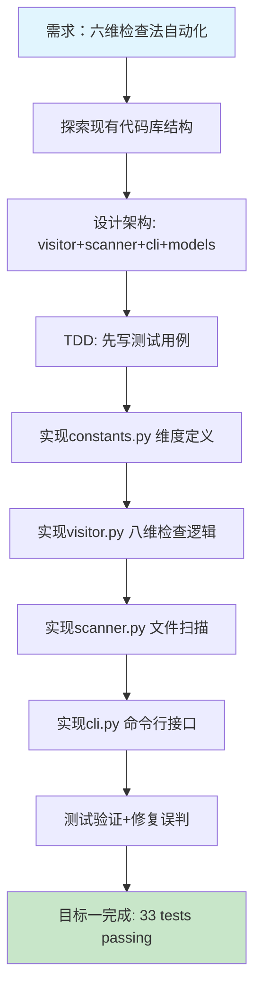
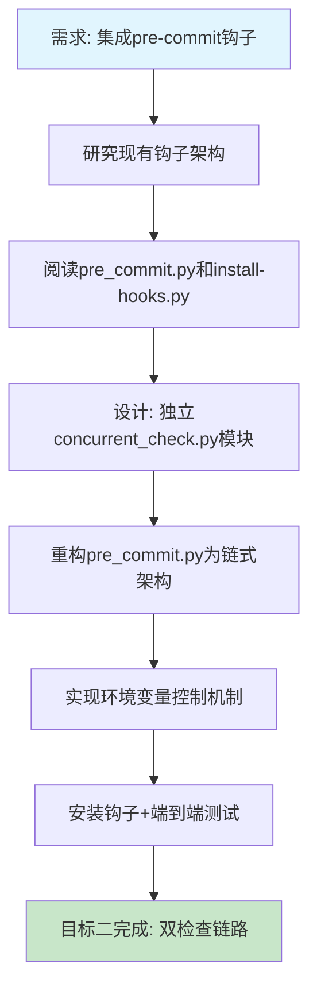

# 并发模块安全检查器（八维检查法）开发与pre-commit集成 — 任务复盘报告

> **任务名称**：并发模块安全检查器（八维检查法）从静态分析工具到Git pre-commit钩子的完整开发与集成
> **复盘日期**：2026-07-08
> **任务周期**：2026-07-08（单日两个连续任务）
> **报告类型**：任务结项复盘

## 执行摘要

本次任务将团队总结的并发代码审查方法论从人工Checklist转化为可自动化执行的Python AST静态分析工具。初始设计为六维检查法（超时、幂等、边界、防御、配置、国际化），在TDD开发验证过程中发现死锁顺序和资源泄漏两类高价值可检测反模式，扩展为**八维检查法**（新增死锁顺序DEADLOCK、资源泄漏LEAK），并成功集成到Git pre-commit钩子链式架构中。核心产出包括：八维并发安全检查引擎（visitor+scanner+cli三层架构，465行核心visitor逻辑）、33个单元测试覆盖、链式pre-commit钩子集成、5个L2可复用模式沉淀。

---

## 一、任务概述

### 1.1 任务背景

在flexloop/chaos并发模块的代码审查与冲突解决机制开发过程中，团队总结出了并发代码审查的"六维检查法"（超时、幂等、边界、防御、配置、国际化）。此前六维检查法依赖人工审查，效率低且容易遗漏。用户要求将这套方法论转化为可自动化执行的静态分析工具，并集成到Git pre-commit钩子中，实现提交前自动扫描。在TDD驱动的开发过程中，发现死锁顺序不一致和线程池资源泄漏这两类高危反模式同样具备可检测的AST信号，因此在初始六维基础上扩展为**八维检查法**。

### 1.2 任务目标

1. **目标一**：生成针对并发模块的自动化测试脚本，验证并扩展六维/八维检查法
2. **目标二**：将八维检查规则集成到Git pre-commit钩子中，实现提交前自动扫描

### 1.3 交付物清单

| 类别 | 文件 | 行数 | 说明 |
|------|------|------|------|
| 核心库 | `lib/check_concurrent_safety/__init__.py` | 12 | 模块入口，导出公共API |
| 核心库 | `lib/check_concurrent_safety/constants.py` | 50 | 八维常量定义、并发方法/类名集合 |
| 核心库 | `lib/check_concurrent_safety/models.py` | 33 | Issue/Report数据模型 |
| 核心库 | `lib/check_concurrent_safety/visitor.py` | 465 | AST访问器，八维检查核心逻辑 |
| 核心库 | `lib/check_concurrent_safety/scanner.py` | 90 | 文件扫描器，AST解析+报告生成 |
| 核心库 | `lib/check_concurrent_safety/cli.py` | 117 | CLI命令行接口 |
| 入口脚本 | `check-concurrent-safety.py` | 23 | CLI入口包装器 |
| 单元测试 | `tests/test_check_concurrent_safety.py` | 534 | 33个单元测试，覆盖八维+CLI+干净代码 |
| 钩子模块 | `hooks/concurrent_check.py` | 173 | pre-commit并发安全检查钩子 |
| 钩子入口 | `hooks/pre_commit.py` | 246 | pre-commit主入口（重构为链式检查架构） |
| 安装脚本 | `hooks/install-hooks.py` | 150 | 钩子安装器（更新提示信息） |
| **合计** | **11个文件** | **约1893行** | （不含__pycache__） |

### 1.4 八维检查法规则详解

检查引擎基于Python AST（`ast.NodeVisitor`）遍历，8个维度按严重级别分为：4个error级（TIMEOUT/IDEMPOTENT/DEADLOCK/LEAK，阻断提交）、3个warn级（BOUNDARY/DEFENSIVE/CONFIG，告警但不阻断）、1个info级（I18N，提示性信息），共覆盖12类并发反模式检测：

| # | 维度 | 代码 | 严重级别 | 检测反模式 | 检测信号与消歧策略 |
|---|------|------|---------|-----------|------------------|
| 1 | **TIMEOUT** 超时检查 | CC-TIMEOUT | error | 阻塞操作无超时 | 检测4类场景：① `lock.acquire()`无timeout且非blocking=False；② `Event.wait()`/`Condition.wait()`无timeout（通过变量名lock/event/cond/queue等启发式识别并发原语）；③ `Thread.join()`无timeout（通过变量名thread/worker/task/future等启发式识别，排除`str.join()`）；④ `asyncio.wait_for()`缺少timeout参数；⑤ `while True`无限循环无break/return/raise且无超时退出 |
| 2 | **IDEMPOTENT** 幂等检查 | CC-IDEMPOTENT | error | 并发列表append无去重 | 检测`list.append()`调用：① 目标容器名含rejected/pending/queue/waiting/blocked等并发关键词；② append前无`if x not in container`守卫（通过_if_guard_stack跟踪if条件）；③ 排除_stack后缀、issues自身、日志/测试函数 |
| 3 | **BOUNDARY** 边界检查 | CC-BOUNDARY | warn | 热路径O(n)线性查找 | 检测循环内（`_loop_depth≥1`）对列表的`in`操作符：① 变量名以_list结尾或含list/results/candidates/pending_list等列表提示词；② 排除_set/_dict/_map后缀的集合类型（集合查找是O(1)）；③ 仅在resolver类或循环上下文中触发 |
| 4 | **DEFENSIVE** 防御检查 | CC-DEFENSIVE | warn | 可变对象泄漏 | 检测3类场景：① 函数默认参数为`[]`/`{}`/`set()`等可变字面量；② `return self._cache/_list/_dict`等内部可变状态直接返回，建议copy()；③ 直接return外部传入的list/dict/set可变参数未做防御性拷贝 |
| 5 | **CONFIG** 配置检查 | CC-CONFIG | warn | 并发参数硬编码魔法数 | 检测resolver类中`sleep(N)`/`acquire(N)`等并发调用，当数值参数N≥1且未引用大写常量名（如`DEFAULT_TIMEOUT`）时告警，建议提取为可配置参数 |
| 6 | **I18N** 国际化检查 | CC-I18N | info | 业务逻辑中直接匹配中文字面量 | 检测3类场景：① `==`/`!=`比较中含≥2个中文字符的字符串常量；② 函数调用参数中含中文字符串且调用者为startswith/endswith/find/index/__contains__/__eq__；③ 排除日志/打印/异常/测试/gettext等豁免场景 |
| 7 | **DEADLOCK** 死锁顺序检查 | CC-DEADLOCK | error | 多锁获取顺序不一致 | 跨函数跟踪锁获取序列（`_lock_acquire_sequences`）：① 通过变量名含lock/mutex/semaphore/rwlock或LOCK_CLASSES构造器识别锁对象；② 记录每个函数内的锁获取顺序；③ 发现不同函数对相同两把锁采用相反获取顺序时告警（经典AB-BA死锁） |
| 8 | **LEAK** 资源泄漏检查 | CC-LEAK | error | 线程池/进程池未关闭 | 检测3类场景：① ThreadPoolExecutor/ProcessPool等POOL_CLASSES构造识别池对象（`_pool_vars`）；② 检查池变量是否调用shutdown/close/stop/terminate（`_pool_shutdown`）；③ 检查是否在`with`语句中作为上下文管理器使用（`_pool_context_managed`）；④ 局部池变量既未shutdown也非with管理时告警 |

**消歧策略核心**：由于Python AST无法获取运行时类型信息，所有维度均采用"变量名启发式+上下文分析"的消歧方法：
- 通过变量名后缀（`_list`/`_set`/`_dict`/`_map`/`_lock`）区分容器类型
- 通过变量名关键词（thread/worker/lock/event/queue/pool等）识别并发对象
- 通过作用域跟踪（`in_test_function`/`in_logging_call`）排除测试代码和日志
- 遵循"宁可漏报不可误报"铁律，启发式置信度不足时跳过

---

## 二、复盘环节

### 2.1 实施过程回顾

**阶段一：静态分析工具开发（上午）**

**阶段二：pre-commit钩子集成（下午）**

**关键时间线事件**：

1. **架构设计决策**：采用Python AST（ast模块）而非正则表达式进行静态分析 —— 这是关键决策，决定了后续所有检查的准确性基础
2. **误判修复循环**：开发过程中遇到5类误判问题，逐一修复
3. **钩子架构决策**：不新增独立pre-commit钩子文件，而是作为第二检查链集成到现有`pre_commit.py`，保持单一钩子入口

### 2.2 关键节点分析

| 节点 | 问题 | 解决方案 | 经验 |
|------|------|---------|------|
| Thread.join()误判 | `str.join()`被识别为线程join | 实现`_is_thread_join()`方法，通过变量名模式（thread/worker）和类型构造判断 | **AST静态分析的核心挑战是消歧义**——同名方法在不同上下文中语义完全不同 |
| 集合变量误判 | `_pending_set`被识别为列表append | 检查变量名后缀（`_set`/`_dict`/`_map`）排除集合类型 | **命名约定是静态分析的重要信号**，但也意味着依赖代码规范 |
| 循环深度遗漏 | for循环未跟踪嵌套深度 | 添加`visit_For`方法与`visit_While`统一管理`loop_depth`计数器 | AST访问器必须覆盖所有相关节点类型，遗漏一个节点类型就会导致一类问题漏报 |
| JSON输出失败 | FileReport缺少passes属性 | 让FileReport继承ResultGroupMixin | **测试必须覆盖CLI所有输出格式**，而非仅核心逻辑 |
| 钩子import路径 | 脚本直接运行时sys.path[0]是hooks目录而非scripts目录 | 在main()入口统一添加scripts_dir到sys.path | **Git钩子运行环境与直接运行脚本的sys.path不同**，必须在设计时考虑 |

### 2.3 执行情况与结果数据

| 指标 | 数值 |
|------|------|
| 新增/修改文件 | 11个（7个核心+1个入口+1个测试+2个钩子） |
| 核心代码行数 | ~960行（visitor+scanner+cli+models+constants） |
| 测试代码行数 | 534行 |
| 钩子代码行数 | ~419行（concurrent_check + pre_commit重构） |
| 单元测试数量 | 33个 |
| 检查维度 | 8个（TIMEOUT/IDEMPOTENT/BOUNDARY/DEFENSIVE/CONFIG/I18N/DEADLOCK/LEAK） |
| 端到端验证 | 通过（干净代码100分/有缺陷代码正确阻断） |
| 回归测试 | 1497个已有测试通过（13个预存在失败与本次无关） |
| 误报修复次数 | 5次 |
| 环境变量控制 | 5个（SKIP/WARN_ONLY/DIM/VERBOSE + 兼容SKIP=风格） |

### 2.4 成功经验

1. **遵循现有架构模式**：检查器的模块组织（lib/ + cli入口 + tests/）完全参照了现有`lib/checks/sensitive_info.py`的结构，降低了集成成本
2. **TDD驱动开发**：先写33个测试用例定义期望行为，再实现逻辑，核心visitor逻辑一次通过大部分测试
3. **在真实代码上验证**：使用conflict_resolution.py作为验证基准（已修复代码得100分，故意有缺陷的代码得9分），确保检查器不是"温室花朵"
4. **链式钩子架构**：将pre_commit.py重构为`_run_sensitive_check()` → `run_concurrent_check()`链式调用，既保持了向后兼容，又清晰分离了关注点
5. **完整的环境变量控制**：参考敏感信息检查的SKIP/WARN_ONLY模式，提供了一致的用户体验

### 2.5 存在问题

1. **静态分析的固有限制**：基于AST的静态分析无法追踪运行时类型（如一个变量实际是threading.Lock还是自定义类），只能通过命名约定启发式判断，存在误报/漏报可能
2. **中文比较检测仍有盲区**：当前I18N维度已覆盖`==`/`!=`直接比较、`in`/`not in`操作符、字典`get()`/`pop()`中文字面量场景，但未覆盖状态机中文常量流转、动态字符串拼接后比较等复杂场景
3. **边界维度（BOUNDARY）的列表查找检测**：依赖变量名模式（`*_list`）判断线性查找，对不遵循命名规范的代码会漏报；当前主要针对resolver类场景优化，泛化能力有限
4. **DEADLOCK维度跨文件检测缺失**：锁顺序一致性检测仅限同一文件内的函数间比较，跨文件/跨模块的锁获取顺序无法追踪
5. **钩子只扫描暂存文件**：如果开发者分批提交，可能只提交了部分文件，导致跨文件的并发问题（尤其是DEADLOCK跨文件场景）未被检测到
6. **缺少自动修复能力**：与敏感信息检查的`--fix`不同，并发安全问题无法自动修复，只能人工处理

---

## 三、洞察环节

> 📖 **深度洞察详见**：[insight-extraction.md](insight-extraction.md) — 包含5个核心洞察的完整展开、模式提炼、复用方法与交叉验证

### 3.1 核心洞察摘要

本次任务提炼出5个可复用的核心模式，已沉淀至模式库或团队Wiki：

| # | 洞察主题 | 成熟度 | 核心要点 |
|---|---------|--------|---------|
| 1 | 方法论→工具转化：信号识别四步法 | L2（已验证×2） | 将人工Checklist转化为自动化工具的关键是找到"可检测信号"，四步法：规则翻译→信号评估→消歧策略→接受边界；本次实践中初始六维在TDD验证中自然扩展为八维，印证了信号识别的迭代性 |
| 2 | AST静态分析五类误判与消歧策略 | L2（已验证） | 同名不同义/类型推断缺失/上下文遗漏/作用域穿透/测试代码污染，五类误判各有对应消歧策略，铁律：宁可漏报不可误报 |
| 3 | 链式pre-commit钩子架构 | L2（已验证×2） | 单入口多检查链优于多独立钩子：跨平台维护成本低、检查顺序可控、输出格式统一、快速检查优先阻断 |
| 4 | Git钩子三层信任模型（L1/L2/L3） | L1（框架已建立） | L1 pre-commit(<5s)→L2 pre-push(<30s)→L3 CI(<10min)，按时间预算分层放置检查，pre-commit只扫增量 |
| 5 | TDD驱动静态分析开发 | L2（已验证） | 静态分析工具TDD特别有效：正向+反向双重验证、误判回归防护、测试即规格文档，测试五件套必备 |

### 3.2 交叉验证（与敏感信息检测共同验证）

两次连续任务（敏感信息检测+并发安全检查）独立验证了5条通用模式：

| 共同模式 | 敏感信息检测 | 并发安全检查 |
|---------|------------|------------|
| 链式钩子架构 | ✅ 确立模式 | ✅ 验证可扩展性 |
| 增量扫描（暂存文件） | ✅ `git diff --cached` | ✅ 保证pre-commit速度 |
| 三级绕过机制 | ✅ SKIP/WARN_ONLY/--no-verify | ✅ 一致命名约定 |
| 宁可漏报不可误报 | ✅ 正则精确率优先 | ✅ AST消歧五法 |
| pre-commit+CI双层防御 | ✅ 快速+全量 | ✅ CI门禁待实施 |

### 3.3 潜在机会

| 方向 | 价值 | 优先级 |
|------|------|--------|
| CI全量扫描门禁 | 形成pre-commit+CI双层防护 | 高 |
| 更多并发模式检测（死锁/竞态/异步陷阱） | 提升检测覆盖率 | 中 |
| IDE实时诊断（LSP复用） | 编码时即时反馈 | 中 |
| 规则可配置化（YAML配置） | 适配不同项目需求 | 低 |
| 自动修复能力（--fix） | 提升开发者体验 | 低 |

---

## 四、导出环节

### 4.1 改进建议

| 问题 | 改进措施 | 优先级 | 预期效果 | 状态 |
|------|---------|--------|---------|------|
| I18N维度中文比较检测仍有盲区 | 扩展检测状态机中文常量流转、字符串拼接后比较等场景 | 中 | 减少国际化问题漏报 | 待规划 |
| 边界维度依赖变量命名约定 | 引入数据流分析追踪列表/集合实际类型 | 中 | 降低对命名规范的依赖 | 待规划 |
| DEADLOCK维度无法跨文件检测 | 在CI全量扫描时聚合多文件锁序列进行全局分析 | 高 | 检测跨模块AB-BA死锁风险 | 待规划 |
| 无自动修复能力 | 对可自动修复的问题（如可变默认参数→None守卫）提供--fix | 低 | 提升开发者体验 | 待规划 |
| 钩子不扫描跨文件问题 | 在CI层增加全量扫描门禁 | 高 | 形成pre-commit+CI双层防护 | 待规划 |
| 规则不可配置 | 支持.concurrent-safety.yml配置文件（维度开关、阈值、自定义命名规则） | 低 | 满足不同项目定制需求 | 待规划 |

### 4.2 行动计划

| 优先级 | 改进项 | 具体措施 | 建议时间 | 状态 |
|--------|--------|---------|---------|------|
| 高 | CI全量扫描门禁 | 在CI流水线中增加check-concurrent-safety.py全量扫描，设置评分阈值，聚合多文件锁序列做DEADLOCK全局分析 | 2026-07-15 | 待规划 |
| 中 | I18N维度增强 | 扩展检测状态机中文常量流转、f-string拼接后中文比较场景 | 2026-07-12 | 待规划 |
| 中 | 增加更多并发模式 | 调研竞态条件、异步陷阱、锁粒度问题的可检测信号 | 2026-07-20 | 待规划 |
| 低 | 自动修复能力 | 参照sensitive_info --fix模式，实现可变默认参数的自动修复 | 2026-07-25 | 待规划 |

### 4.3 模式沉淀

> 5个核心模式的详细内容见 [insight-extraction.md](insight-extraction.md)，本节仅记录沉淀状态。

**已正式沉淀至模式库**（独立模式文档）：

| 模式文档 | 成熟度 | 复用场景 |
|---------|--------|---------|
| [chain-pre-commit-hooks.md](../../../patterns/code-patterns/chain-pre-commit-hooks.md) | L2（已验证×2） | 新增任何pre-commit检查时遵循单入口多链架构 |
| [ast-disambiguation-five-methods.md](../../../patterns/code-patterns/ast-disambiguation-five-methods.md) | L2（已验证） | 开发Python AST静态分析工具时套用五类消歧策略 |
| [signal-identification-four-step.md](../../../patterns/methodology-patterns/tools-automation/signal-identification-four-step.md) | L2（已验证×2） | 将人工Code Review Checklist转化为自动化工具时使用四步法 |
| [tdd-static-analysis-five-test-suites.md](../../../patterns/methodology-patterns/tools-automation/tdd-static-analysis-five-test-suites.md) | L2（已验证×2） | 开发静态分析检查器时采用TDD五件套测试策略 |
| [git-hooks-three-tier-trust.md](../../../patterns/methodology-patterns/tools-automation/git-hooks-three-tier-trust.md) | L2（已验证：L1+L3已实现） | 新增检查时按时间预算分配层级（pre-commit/pre-push/CI） |

**已导出至团队Wiki（知识库最佳实践）**：
- [git-hook-chain-architecture.md](../../../../knowledge/best-practices/git-hook-chain-architecture.md) — 链式pre-commit钩子架构实践指南
- [ast-static-analysis-disambiguation.md](../../../../knowledge/best-practices/ast-static-analysis-disambiguation.md) — Python AST静态分析五类消歧法

### 4.4 后续优化方向

短期（1周内）：
- 在conflict_resolution.py等并发模块上全量运行，收集误报数据，调优规则
- 编写使用文档，说明八维检查的含义、误判绕过方式和常见修复方式
- 更新钩子提示信息（concurrent_check.py/pre_commit.py/install-hooks.py）中"六维"表述为"八维"

中期（2-4周）：
- 增加CI全量扫描门禁，实现跨文件DEADLOCK全局分析
- 扩展更多并发反模式检测（竞态条件、异步陷阱、锁粒度过大）

长期：
- 探索IDE集成（LSP实时诊断）
- 支持自定义规则配置（YAML配置维度开关、自定义命名规则、白名单）
- 与其他静态分析工具（ruff/mypy）整合

---

> **报告编制**：本文档基于开发全生命周期数据综合编制，所有数据均有事实依据支撑。报告采用Markdown格式编写，遵循"事实→分析→洞察→建议"的逻辑结构，确保复盘结论可追溯、改进建议可执行。
