# 多智能体冲突解决机制实现与死锁风险修复复盘报告

## 一、执行摘要

本次任务完成了 SpecWeave 多智能体系统的冲突解决机制设计、实现、测试与安全加固。任务分为两个阶段：(1) 基于 AGENTS.md 规范实现三类冲突的13条仲裁规则并完成原子提交；(2) 通过代码审查发现8个潜在问题（含2个高风险死锁/活锁缺陷），全部修复并新增13个针对性测试用例，再次确保39个测试全部通过。过程中还完成了 GitHub 上游仓库配置、Mermaid 架构文档生成、git alias 工具链配置等配套工作。

**关键指标**：

| 指标 | 数值 |
|------|------|
| 核心交付文件 | 4个（初始实现） |
| 初始代码行数 | 993行（新增） |
| 审查修复变更 | +391/-100行 |
| 初始单元测试 | 26个 |
| 新增审查测试 | 13个（死锁预防6 + 性能正确性6 + 可配置性1） |
| 测试总数 | 39个，全部通过（0.28s） |
| 发现并修复问题 | 8个（高风险2 / 中风险3 / 低风险3） |
| Mermaid图表 | 2个（协作流程图 + 冲突解决时序图） |
| git alias | 2个（fixlog / prevent） |

## 二、事实收集

### 2.1 任务时间线

```mermaid
flowchart LR
    A["GitHub上游配置<br/>git remote/fetch/push"] --> B["Mermaid流程图设计<br/>多智能体协作总流程"]
    B --> C["冲突解决时序图<br/>独立详细时序图"]
    C --> D["架构文档写入<br/>docs/architecture/"]
    D --> E["冲突解决机制实现<br/>ConflictResolver核心类"]
    E --> F["26个单元测试<br/>TDD红绿循环"]
    F --> G["原子提交<br/>commit 732fd70"]
    G --> H["代码审查<br/>死锁/性能/正确性分析"]
    H --> I["8个问题修复<br/>+13个新增测试"]
    I --> J["git alias配置<br/>fixlog/prevent"]
    J --> K["代码审查方法论萃取<br/>六维检查法→八维自动化检查器"]
    style G fill:#90EE90
    style H fill:#ffcccc
    style I fill:#ffcccc
```

### 2.2 交付产物清单

| 产物 | 路径 | 状态 |
|------|------|------|
| 冲突解决核心模块 | [conflict_resolution.py](../../../../../.agents/scripts/lib/collaboration/conflict_resolution.py) | ✅ 已提交（含审查修复） |
| 模块公共API | [__init__.py](../../../../../.agents/scripts/lib/collaboration/__init__.py) | ✅ 已提交 |
| 单元测试 | [test_conflict_resolution.py](../../../../../.agents/scripts/tests/test_conflict_resolution.py) | ✅ 已提交（39个测试） |
| 架构文档 | [multi-agent-collab.md](../../../../architecture/multi-agent-collab.md) | ✅ 已提交 |
| Git全局配置 | `~/.gitconfig`（用户主目录下）alias段 | ✅ 已完成（fixlog/prevent） |
| 并发安全检查器 | [check-concurrent-safety.py](../../../../../.agents/scripts/check-concurrent-safety.py) | ✅ 后续任务完成（八维检查器） |

### 2.3 冲突解决机制设计规范

三类冲突13条仲裁规则：

| 冲突类型 | 仲裁角色 | 规则数 | 规则内容 |
|---------|---------|--------|---------|
| 职责冲突 (RESPONSIBILITY) | Orchestrator | 4条 | 优先级分配 → 能力匹配 → 负载均衡 → 历史归属 |
| 技术分歧 (TECHNICAL) | Architect | 5条 | 规范优先 → 最佳实践 → 可维护性 → 最小变更 → Architect终裁 |
| 资源竞争 (RESOURCE) | Orchestrator | 4条 | 串行访问 → 优先级调度 → 锁机制 → 资源隔离 |

升级机制：双方拒绝/超出规范范围 → 升级至人工处理。

### 2.4 代码审查发现的问题

| 级别 | ID | 问题 | 影响 |
|------|----|------|------|
| 🔴 高 | D1 | 资源锁无超时机制 | 持有者崩溃→永久死锁 |
| 🔴 高 | D2 | `rejected_by`无去重 | 同一agent重复添加绕过升级检查→逻辑活锁 |
| 🟡 中 | D3 | 负载均衡只比较前2个agent | 多agent场景低负载agent被忽略→饥饿 |
| 🟡 中 | D4 | 资源优先级判断bug | 优先级相等时跳过排序，高优先级可能饿死 |
| 🟡 中 | D5 | 技术分歧硬编码关键词 | 规则无法配置扩展 |
| 🟢 低 | D6 | `from_str` O(n)线性查找 | 性能微瑕 |
| 🟢 低 | D7 | 可变参数无防御性拷贝 | 并发环境下外部修改导致竞态 |
| 🟢 低 | D8 | 中文spec匹配按空格分词 | 中文无空格导致匹配失效 |

### 2.5 修复措施与测试验证

每个问题均有对应的单元测试覆盖修复效果：

- **D1/D2（死锁预防）**：`TestDeadlockPrevention` 6个测试
  - `test_lock_has_timeout` / `test_custom_lock_timeout`：锁超时机制
  - `test_rejected_by_deduplication` / `test_add_rejection_dedup`：拒绝去重
  - `test_two_distinct_rejections_triggers_escalation` / `test_infinite_loop_prevention_via_escalation`：升级终止循环
- **D3/D4/D7（性能正确性）**：`TestPerformanceAndCorrectness` 6个测试
  - `test_from_str_uses_cache` / `test_multi_agent_load_balancing_selects_lowest` / `test_multi_agent_priority_scheduling`
  - `test_defensive_copy_agents_not_mutated` / `test_capability_match_with_tie_uses_load` / `test_lock_timeout_in_priority_scheduling`
- **D5/D8（可配置性）**：`test_custom_best_practice_rules` 1个测试（含n-gram子串匹配验证）

## 三、过程分析

### 3.1 做得好的地方

1. **TDD流程严格执行**：先写26个测试覆盖所有仲裁规则，再实现代码，再运行测试验证。提交前所有测试通过，确保初始实现质量。
2. **Mermaid图表规范遵循**：使用mermaid-cmd技能，遵守安全编码六规则，自动修复语法问题。
3. **原子提交规范**：第一阶段提交（732fd70）严格遵循Conventional Commits，单一职责，预提交验证（链接检查+测试）。
4. **主动代码审查**：功能完成后主动进行性能/死锁风险分析，而非等待用户发现问题——这是本次任务最关键的质量保障动作。
5. **修复即闭环**：按照fix-prevent-close-loop规范，修复Bug的同时新增预防测试（13个），并在commit message中标记`[prevent: test-case, architecture]`。
6. **工具链配套完善**：主动配置git alias（fixlog/prevent）方便日后快速筛选带预防标记的提交。
7. **Commit message规范审查**：提交前主动检查commit message是否符合AGENTS.md规范，选择正确的type（fix而非feat），标注预防措施。

### 3.2 遇到的问题与解决

1. **Mermaid边标签格式错误**：中文标签在`-->| "标签" |`格式中含空格导致语法错误，使用`--fix`自动修复为`-->|"标签"|`。
2. **测试日志数量不足**：`test_logging_all_steps`断言日志数≥3失败，原因是resolve方法开始时缺少一条日志，补充`开始仲裁`日志后修复。
3. **PowerShell alias配置转义问题**：直接用`git config`在PowerShell中设置带引号的shell函数alias被截断，改为直接编辑`~/.gitconfig`文件解决。
4. **git grep正则转义**：`[`在正则中是特殊字符导致匹配失败，改用`--fixed-strings`（-F）选项按字面匹配解决。

### 3.3 待改进之处

1. **初始实现缺乏防御性编程意识**：锁超时、参数去重、防御性拷贝等并发安全措施在第一版中全部遗漏，说明"实现功能"和"实现健壮的功能"之间有显著差距——代码审查环节不可或缺。
2. **多agent场景测试覆盖不足**：初始测试用例中负载均衡和优先级调度主要验证了2个agent的场景，3个及以上agent的场景未覆盖，导致D3/D4两个逻辑bug在初始测试中未暴露。
3. **中英文混合文本处理未考虑**：spec关键词匹配按英文空格分词设计，未考虑中文无空格分词的情况，对中文用户不友好。
4. **硬编码可配置性缺失**：最佳实践规则硬编码在代码中，无法通过构造参数注入，扩展性差。

### 3.4 关键决策点回顾

| 决策点 | 选择 | 理由 | 效果 |
|--------|------|------|------|
| 冲突类型建模 | 3个枚举类+数据类 | 类型安全、易于扩展 | ✅ 清晰 |
| 仲裁角色分配 | 职责/资源→Orchestrator，技术→Architect | 符合AGENTS.md角色定义 | ✅ 正确 |
| 代码审查时机 | 功能完成+提交后主动审查 | 防止死锁等严重问题进入代码库 | ✅ 发现8个问题 |
| 修复commit类型 | fix而非feat | 主要是修复审查发现的缺陷 | ✅ 符合规范 |
| 锁超时默认值 | 300秒（5分钟） | 足够长不影响正常流程，足够短防止永久死锁 | ✅ 合理 |

## 四、洞察提炼

详见 [insight-extraction.md](insight-extraction.md)

## 五、改进建议

### 5.1 短期改进（本次任务已落实）

1. ✅ **锁超时机制**：所有资源锁分配必须附带超时，防止永久死锁（已实现）
2. ✅ **拒绝列表去重**：`rejected_by`使用set语义防止重复拒绝绕过升级（已实现）
3. ✅ **多agent测试覆盖**：测试用例必须覆盖3个及以上agent的边界场景（已新增测试）
4. ✅ **防御性参数拷贝**：传入的可变参数（dict/list）做deepcopy，防止外部修改（已实现）
5. ✅ **n-gram子串匹配**：支持中英文混合文本的关键词匹配（已实现）

### 5.2 中期改进（部分已落实）

1. ✅ **并发模块审查checklist**：六维检查法已扩展为八维并自动化为pre-commit检查器（[check-concurrent-safety.py](../../../../../.agents/scripts/check-concurrent-safety.py)），在提交阶段自动扫描锁超时、幂等性、边界条件等并发反模式
2. **边界场景测试模板**：为类似仲裁/调度类模块建立测试模板，自动生成N个agent（N=1,2,3,5,10）的测试用例
3. **Git alias扩展**：可以进一步添加`git prevent-*`系列alias（如`git prevent-doc`、`gitprevent-test`）快速筛选不同类型预防措施

### 5.3 长期改进（方法论沉淀）

1. **"实现→审查→加固"三段式SOP**：核心机制类代码不应在实现+测试通过后立即视为完成，应增加"主动安全审查"环节，检查并发安全、边界条件、可配置性等非功能需求。
2. **可配置性默认原则**：业务规则（如优先级权重、阈值、关键词）应默认支持构造函数注入，避免硬编码，增强可测试性和扩展性。
