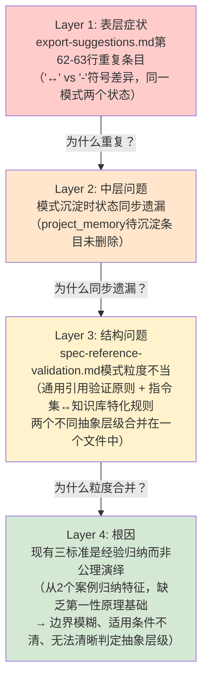
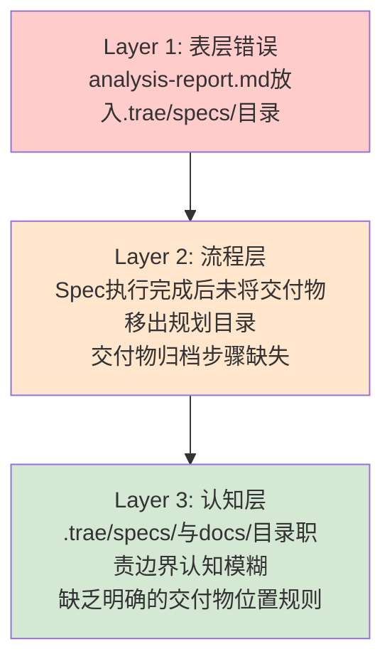

# 执行复盘 - 第一性原理公理化模式拆分任务

## 1. 事实数据汇总

### 1.1 任务基本信息

| 维度 | 数据 |
|------|------|
| 任务主题 | 基于第一性原理公理化分析拆分"指令集-知识库关联对应性前提"模式 |
| Commit | e74d0a3d |
| 变更统计 | 7 files changed, 1528 insertions(+), 121 deletions(-) |
| 执行日期 | 2026-07-09 |
| 分析方法 | 第一性原理六步分析法（问题定义→假设质疑→要素拆解→公理提炼→规则演绎→案例验证） |
| Spec路径 | `.trae/specs/standards-tools/instruction-knowledge-mapping-analysis/` |

### 1.2 产出物清单与统计

| 文件 | 类型 | 行数 | 说明 |
|------|------|------|------|
| `spec-reference-validation.md` | 模式文件（重构） | 154行 | v2.0重构为通用引用验证原则，四步验证法+通用反模式+场景特化索引 |
| `command-knowledge-link.md` | 模式文件（新建） | 307行 | 指令集↔知识库关联公理化特化模式（5公理+13规则+三问法+判定矩阵+验收清单） |
| `analysis-report.md` | 分析报告 | 635行 | 完整六步公理化分析报告，含Mermaid架构总图 |
| `spec.md` | PRD文档 | 285行 | 产品需求文档，9个验收标准、7个开放问题 |
| `checklist.md` | 验证清单 | 48行 | 38个检查点，100%通过 |
| `tasks.md` | 任务分解 | 163行 | 7个任务分解，含测试要求和验收记录 |
| `export-suggestions.md` | 修复 | 8行变更 | 删除重复条目，更新模式表格反映拆分结果 |

### 1.3 关键交付物统计

| 交付项 | 数量 | 说明 |
|--------|------|------|
| 公理 | 5条 | A1目的公理、A2质量门槛公理、A3双向闭环公理、A4信噪比公理、A5入乡随俗公理 |
| 规则 | 13条 | 判定规则5条+内容选择3条+结构规则3条+验证规则2条 |
| 资料类型判定 | 5类 | 类型1多文件档案→类型5零散笔记，含边界情况 |
| 操作工具 | 3个 | 系统性三问法、5类型判定矩阵、8项验收清单 |
| 验证案例 | 9个 | 2个正向案例（first-principles、mermaid）+7个反向案例 |
| 检查点 | 38个 | 过程验证26个+质量验收6个+产出物验证6个，100%通过 |

### 1.4 时间线与关键节点

| 阶段 | 关键活动 | 产出 |
|------|---------|------|
| 问题触发 | 发现export-suggestions.md第62-63行重复条目 | 识别表层症状 |
| 根因分析 | 五层"为什么"追问穿透到公理化基础缺失 | 根因定位 |
| Spec创建 | 编写PRD，明确目标/非目标/验收标准 | spec.md |
| Step 1-3 | 问题定义→假设质疑（12条假设）→要素拆解（五元组） | 基础分析完成 |
| Step 4-5 | 公理提炼（5条）→规则演绎（13条） | 公理规则体系建立 |
| Step 6 | 双案例正向验证+7反例反向验证+现有模式对比 | 验证完成，提出拆分方案 |
| 执行落地 | 重构spec-reference-validation.md、新建command-knowledge-link.md、修复重复条目 | commit e74d0a3d |

---

## 2. 过程分析

### 2.1 完整推理链：从重复条目到模式拆分

这是本次任务最核心的方法论成果——**四层诊断推理链**：

**推理过程详解**：

1. **第1层为什么（表象）**：为什么有重复条目？→ ACT-015先在project_memory记录候选，ACT-008后创建模式文件，export-suggestions.md更新时未删除旧条目
2. **第2层为什么（中层）**：为什么会状态同步遗漏？→ 模式文件标题用"/"合并了两个概念（"Spec引用验证/关联对应性前提"），导致无法清晰对应到单一来源条目
3. **第3层为什么（结构）**：为什么标题要合并两个概念？→ 现有模式将"通用跨文档引用质量门槛"和"指令集↔知识库特定场景映射规则"两个不同抽象层级的问题混在一起
4. **第4层为什么（根因）**：为什么会抽象层级混淆？→ 现有三标准（完整流程/检查清单/项目验证）是从2个案例归纳的经验性检查清单，没有从关联关系的本质目的出发推导规则，导致模式边界定义不清

**关键认知转折**：最初看起来只是"删除一行重复条目"的简单修复，通过五层为什么追问，最终识别出这是一个需要公理化重构才能根本解决的模式粒度问题。如果只删除第63行而不重构模式，未来还会出现类似的边界混乱和重复沉淀问题。

### 2.2 第一性原理六步分析法执行效果评估

| 步骤 | 执行情况 | 效果评价 | 关键产出 |
|------|---------|---------|---------|
| **Step 1: 问题定义** | 五层为什么穿透、症状vs根因区分、四要素陈述、边界划定、双视角重述 | ⭐⭐⭐⭐⭐ 优秀 | 准确定位根因而非停留在表面，避免了"只删行不重构"的短视修复 |
| **Step 2: 假设质疑** | 列出12条隐含假设、5条"不可能"惯例清单、识别物理多文件谬误三层认知根源 | ⭐⭐⭐⭐⭐ 优秀 | 超额完成（要求≥8条），系统性剥离了经验假设，特别是"物理多文件=系统性"谬误的识别是关键突破 |
| **Step 3: 要素拆解** | 五维度拆解（主体/目的/质量/结构/验证）、四学科视角分析、五元组形式化模型、原子停止标准验证 | ⭐⭐⭐⭐⭐ 优秀 | 拆解至真正不可再分的要素，形式化模型为公理提炼奠定坚实基础 |
| **Step 4: 公理提炼** | 5条公理、独立性验证、完备性验证、苏格拉底式提问检验、可信度分级 | ⭐⭐⭐⭐⭐ 优秀 | 3条🟢高可信+2条🔵中可信，公理之间独立无矛盾，覆盖全部关键决策点 |
| **Step 5: 规则演绎** | 13条规则分四类、每条标注公理来源、逆向思维反推禁止项、操作化工具（三问法/判定矩阵） | ⭐⭐⭐⭐⭐ 优秀 | 规则可直接执行而非抽象原则，禁止项清单有效预防常见错误 |
| **Step 6: 案例验证** | 2个正向案例表格化验证、7个反向案例程序化Grep验证、与现有三标准8点对比、明确处理建议 | ⭐⭐⭐⭐⭐ 优秀 | 双案例验证了关键命题（单文件系统性），反向验证了不关联规则，对比分析清晰指出现有模式不足 |

**整体评价**：第一性原理六步分析法在本次模式重构任务中表现卓越，六步全部高质量完成，38个检查点100%通过。特别是Step 2的假设质疑和Step 4的公理提炼，从根本上解决了经验归纳模式的边界模糊问题。

### 2.3 公理化方法 vs 经验归纳：对比分析

| 维度 | 经验归纳（原三标准） | 公理演绎（本次重构） |
|------|-------------------|-------------------|
| **方法论基础** | 从成功案例中总结共同特征 | 从本质要素出发演绎推导规则 |
| **边界清晰度** | 模糊——"逻辑系统性"缺乏操作化定义，适用场景靠直觉判断 | 清晰——5类型判定矩阵+三问法给出明确判定标准 |
| **规则覆盖度** | 3条标准，仅覆盖质量判定维度 | 13条规则，覆盖判定/内容选择/结构/验证四类决策 |
| **可证伪性** | 低——反例出现时可以灵活解释（"特殊情况"） | 高——每条公理和规则都明确标注，出现反例时可直接定位哪条公理需要修正 |
| **演绎能力** | 弱——只能判断"已见过的案例类型"，遇到新情况（如单文件手册）需要重新归纳 | 强——从公理可演绎推出新场景的判定规则，如mermaid单文件案例在公理体系下可直接判定 |
| **分析成本** | 低——总结2-3个案例即可产出 | 高——六步分析+公理验证+多案例验证，本次产出635行分析报告 |
| **样本敏感度** | 高——新增案例可能推翻之前归纳的标准 | 中——公理相对稳定，规则层可根据新案例迭代调整 |
| **可解释性** | 弱——"为什么是这三条标准？因为成功案例都有这些特征" | 强——每条规则可追溯到公理来源，有信息论/认知科学/知识工程等跨学科支撑 |
| **对执行者要求** | 高——需要执行者自行判断"什么是逻辑系统性" | 低——三问法、判定矩阵、验收清单可直接套用 |

**公理化方法的三大优势**：
1. **边界清晰**：抽象层级自然分离（通用原则vs场景特化），从根本上避免模式粒度不当问题
2. **可演绎**：遇到新场景不需要重新归纳，从公理推导即可得出判定规则
3. **可进化**：公理层稳定、规则层可迭代，新案例验证时只需调整规则层而非推翻整个体系

**公理化方法的三大局限**：
1. **前期成本高**：需要完整的六步分析，对简单问题可能过度投入
2. **样本依赖**：公理提炼仍基于现有案例，样本量不足时公理可能有偏差（本次仅2个正向案例）
3. **形式化边界**：内容质量判断不可能100%机械化，边界情况（如类型3小型手册）仍需人工判断

### 2.4 执行过程中的偏差与修正

本次任务执行过程整体顺利，但仍存在以下值得记录的认知偏差和修正：

| 偏差类型 | 初始偏差 | 修正触发 | 修正后认知 |
|---------|---------|---------|-----------|
| **问题范围低估** | 最初认为只是"删除一行重复条目"的简单修复 | Step 1五层为什么追问到第3层时发现模式粒度问题 | 识别出需要公理化重构而非简单修复，调整任务范围从"修bug"升级为"模式重构" |
| **单文件系统性初始怀疑** | Step 2前仍有"单文件可能不够系统"的残余怀疑 | mermaid案例验证：mermaid-guide.md是9章节单文件手册，三问全部通过 | 确认A2公理"逻辑系统性>物理多文件"成立，将其作为核心公理 |
| **拆分方案犹豫** | 分析报告中给出方案A（拆分）和方案B（内部分层）两个选项 | 对比单一职责原则和未来可扩展性后确定方案A更优 | 选择拆分方案，通用原则和场景特化各自独立演进 |
| **信噪比阈值不确定性** | A4公理的80%阈值和R8的8个链接上限最初缺乏把握 | 诚实标注为经验值（🔵中可信），放入待验证假设列表 | 不强行给经验值赋予虚假的确定性，留待未来案例验证 |

**偏差修正的关键机制**：
- 第一性原理Step 2"假设质疑"强制列出所有隐含假设并逐条挑战，有效暴露初始认知偏差
- 苏格拉底式提问（每条公理追问"这是真的吗？证据是什么？有没有反例？"）防止过度自信
- 诚实面对局限（7条局限性声明）避免为了体系自洽而忽略不确定性

---

## 3. 公理化方法的经验总结

### 3.1 公理提炼的实操要点

从本次任务中总结的公理提炼实操经验：

1. **数量控制**：3-5条最佳，少于3条可能不完备，多于5条可能存在可合并的冗余
2. **独立性验证**：逐条尝试"能否从其他公理推出这条？"，能推出则不是公理而是定理/规则
3. **可信度分级**：不要强行追求100%确定，明确标注高/中/低可信度，诚实面对不确定性
4. **跨学科支撑**：尽量从信息论、认知科学、知识工程、软件架构等成熟学科寻找公理依据，而非纯主观判断
5. **苏格拉底式检验**：每条公理追问四个问题——这是真的吗？证据是什么？如果不成立会怎样？有没有反例？

### 3.2 规则演绎的实操要点

1. **分类组织**：按决策类型分类（判定/内容选择/结构/验证），而非按分析顺序罗列
2. **来源标注**：每条规则明确标注源自哪几条公理（如R1←A1+A2），保持推导链可追溯
3. **操作化优先**：规则必须是可执行的，避免"应该注意质量"这类空话——给出具体怎么判断质量
4. **逆向思维**：除了正向推导"应该怎么做"，还要逆向推导"禁止做什么"（禁止项清单）
5. **工具配套**：为关键规则配套操作工具（三问法、判定矩阵、检查清单），降低执行者的认知负荷

### 3.3 案例验证的实操要点

1. **正向案例验证**：选择最典型的成功案例，逐维度对照规则，用表格化方式记录符合度
2. **反向案例验证**：必须验证"不应该做"的案例——7个正确未关联的指令集是本次验证的关键组成部分
3. **关键反例验证**：刻意寻找可能证伪公理的案例（如mermaid单文件案例），如果反例验证通过，公理可信度大幅提升
4. **新旧对比**：将新推导的规则体系与原有经验标准对比，明确指出差异、改进点、遗漏项，便于平滑过渡
5. **程序化验证**：能通过Grep/LS等工具程序化验证的部分尽量程序化验证，减少主观判断

---

## 4. 局限性声明

本次复盘本身也存在以下局限性：

1. **单案例复盘**：仅基于这一次公理化重构任务总结方法论洞察，"四层诊断推理链"和"三层架构优势"等结论需要更多案例验证
2. **观察者偏差**：作为任务执行者复盘自身工作，可能存在确认偏差——倾向于认为自己使用的方法效果更好
3. **缺乏对照组**：没有与"不使用第一性原理，直接经验归纳升级模式"的对照组对比，无法定量评估公理化方法的投入产出比
4. **长期效果未知**：公理化重构的长期价值（如减少未来重复沉淀、降低新执行者学习成本）需要时间验证，本次复盘仅评估即时效果

---

## 5. 补充复盘：分析报告位置修正（2026-07-10）

### 执行摘要

在主任务（commit e74d0a3d）完成后，发现交付物位置错误：`analysis-report.md`（635行第一性原理公理化分析报告）被错误放置在`.trae/specs/standards-tools/instruction-knowledge-mapping-analysis/`目录中。该目录属于Spec规划目录，仅应存放`spec.md`/`tasks.md`/`checklist.md`等规划文档，实际交付物应归档至`docs/retrospective/reports/task-reports/`下。本次修正任务（commit 1fceb689）完成了文件移动、4处引用路径更新，231个链接验证全部通过。

**核心数据**：
- 文件移动：1个文件（git mv）
- 引用更新：3个文件中共4处路径
- 链接验证：231个链接全部通过，无断链
- 原子提交：commit 1fceb689

### 5.1 问题事实与根因分析

#### 5.1.1 问题现象

| 维度 | 错误位置 | 正确位置 |
|------|---------|---------|
| 文件路径 | `.trae/specs/standards-tools/instruction-knowledge-mapping-analysis/analysis-report.md` | `docs/retrospective/reports/task-reports/retrospective-first-principles-pattern-split-20260709/analysis-report.md` |
| 目录性质 | Spec规划目录（规划阶段文档） | 复盘报告交付目录（任务完成后交付物） |
| 目录中应有文件 | spec.md、tasks.md、checklist.md | README.md、analysis-report.md、insight-extraction.md、export-suggestions.md |

#### 5.1.2 三层根因诊断

**Layer 1（表层）**：文件放错了位置。在Spec执行过程中，分析报告作为Spec任务的产出物直接生成在Spec目录下，未在任务收尾阶段迁移至交付物目录。

**Layer 2（流程层）**：Spec Mode工作流的收尾步骤缺失"交付物归档"环节。现有Spec流程包含"编写spec.md→分解tasks.md→执行→验证checklist.md"，但缺少"任务完成后将交付物从规划目录迁移至正式文档目录"的明确步骤。

**Layer 3（认知层/根因）**：`.trae/specs/`与`docs/`的职责边界在认知上模糊：
- `.trae/specs/`：**规划空间**——仅存放任务规划文档（spec.md需求、tasks.md任务分解、checklist.md验收清单），是"做什么/怎么做/怎么验收"的蓝图
- `docs/retrospective/reports/`：**交付空间**——存放任务完成后的实际交付物（复盘报告、分析报告、洞察萃取、导出建议），是"做完了什么/学到了什么"的成果归档
- 混淆了"规划文档"和"执行产出物"的边界，将蓝图与成果放在了同一个目录

#### 5.1.3 为什么引用更新无遗漏？

本次引用更新（3文件4处）全部准确，无遗漏，关键原因：
1. **Grep全局搜索**：使用Grep搜索`analysis-report.md`在整个仓库中的所有引用位置
2. **链接验证兜底**：移动后立即运行`check-links.py`，231个链接验证通过作为最终质量门
3. **反向验证**：确认旧路径已无文件后，所有指向旧路径的链接必然失效，确保了搜索的完备性

### 5.2 经验萃取与预防措施

#### 5.2.1 目录职责边界明确定义

| 目录 | 性质 | 存放内容 | 不应存放 |
|------|------|---------|---------|
| `.trae/specs/<theme>/<spec-name>/` | 🔵 规划空间（蓝图） | spec.md（需求）、tasks.md（任务分解）、checklist.md（验收清单） | 分析报告、复盘报告、交付物文档、任何任务完成后才产生的成果文件 |
| `docs/retrospective/reports/<category>/<report-name>/` | 🟢 交付空间（成果） | README.md（复盘）、execution-retrospective.md、insight-extraction.md、export-suggestions.md、analysis-report.md（分析报告） | spec.md、tasks.md、checklist.md（这些属于规划文档，应留在.trae/specs/） |
| `docs/retrospective/patterns/` | 🟡 模式空间（沉淀） | 萃取后的可复用模式文档（*.md） | 原始分析报告、临时复盘草稿 |

**关键原则**：规划空间是"草稿/蓝图"，交付空间是"成品/归档"。任务完成后，蓝图（spec.md等）留在.trae/specs/作为历史记录，成果（分析报告、复盘等）必须归档到docs/对应目录。

#### 5.2.2 Spec任务收尾检查清单（新增）

未来执行Spec Mode任务时，在checklist.md验收通过后，必须额外执行以下交付物归档检查：

- [ ] **交付物位置验证**：所有非规划类文档（分析报告、完整复盘、洞察萃取等）是否已从`.trae/specs/`迁移至`docs/`对应目录？
- [ ] **引用路径更新**：移动文件后是否Grep搜索所有引用并更新路径？
- [ ] **链接有效性验证**：是否运行`check-links.py`确认所有链接可达？
- [ ] **Spec目录清理**：`.trae/specs/<spec-name>/`下是否仅保留spec.md/tasks.md/checklist.md（以及README.md如果有）？

#### 5.2.3 本次修正的正确做法（可复用流程）

发现交付物位置错误时的修正SOP：

1. **git mv移动文件**：使用`git mv`而非直接cp/rm，保留版本历史
2. **Grep全局搜索引用**：`Grep pattern="analysis-report.md"`找到所有引用位置
3. **逐个更新路径**：根据新旧目录的相对深度，计算正确的相对路径
4. **check-links验证**：运行链接检查脚本，确保无断链
5. **原子提交**：单一职责提交，commit message明确说明"修正xxx文件位置错误，更新N处引用"
