# 指令集↔知识库映射关系的第一性原理公理化分析报告

## 执行摘要

本报告运用第一性原理六步思维框架，对`.agents/commands/`（指令集）与`docs/knowledge/`（知识库）之间的双向关联关系进行系统性公理化分析。

**核心发现**：
1. export-suggestions.md第62-63行是**同一模式的命名变体**（仅`↔`与`-`符号差异），而非两个独立模式，重复根因是模式沉淀时边界定义不清
2. 现有`spec-reference-validation.md`将"Spec引用验证"（通用跨文档引用原则）与"指令集↔知识库关联"（特定场景映射规则）合并在一个模式中，存在粒度不当问题
3. 现有三标准（完整流程/检查清单/项目验证）是经验归纳，本报告从5条公理出发演绎推导出完整规则体系

**公理体系**（5条）：目的公理、质量门槛公理、双向闭环公理、信噪比公理、入乡随俗公理

**规则体系**（13条规则，覆盖判定/内容选择/结构/验证四类决策）

**主要建议**：
- 删除export-suggestions.md第63行重复条目
- 建议将`spec-reference-validation.md`拆分为两个模式：通用Spec引用验证原则 + 指令集↔知识库关联专门规则
- 本框架已通过2个正向案例和7个反向案例验证

---

## Step 1: 问题定义与边界澄清

### 1.1 连续追问"为什么"穿透表象

**表层症状**（第1层为什么）：export-suggestions.md第62-63行存在重复条目——第62行标记"指令集↔知识库关联对应性前提"已完成（路径spec-reference-validation.md），第63行标记"指令集-知识库关联对应性前提"待沉淀（暂记录于project_memory）。

**为什么会重复？**（第2层为什么）：在第一性原理资料搜集项目执行过程中，"双向关联建立任务复盘"（ACT-015）先在project_memory中记录了候选模式，随后"元洞察模式沉淀"（ACT-008）创建了spec-reference-validation.md模式文件，但export-suggestions.md未同步更新删除project_memory中的待沉淀条目。

**为什么沉淀时会出现状态不一致？**（第3层为什么）：现有模式的边界定义模糊——spec-reference-validation.md标题为"Spec引用验证/关联对应性前提"，将"Spec引用验证"（适用于所有跨Spec引用场景）和"指令集↔知识库关联对应性前提"（仅适用于指令集与知识库双向关联场景）两个不同粒度的问题合并在一个模式中，导致沉淀时无法清晰对应到单一来源。

**为什么模式边界会模糊？**（第4层为什么）：现有三标准是从2个案例归纳而来的经验性检查清单，缺乏公理化基础——没有从关联关系的本质目的出发推导规则，而是从成功案例中总结特征，导致模式的适用边界和抽象层级不清晰。

**根因**（第5层为什么）：缺乏对"指令集↔知识库关联"本质的第一性原理理解——没有回答"为什么要建立关联？关联的根本目的是什么？满足什么条件的关联才是有价值的？"这些基础问题，直接从案例归纳操作标准，导致模式粒度混乱、命名不一致、边界模糊。

### 1.2 症状vs根因区分

| 层级 | 表现 | 性质 |
|------|------|------|
| 表层症状 | export-suggestions.md第62-63行重复条目 | 表象（可直接观察） |
| 中层症状 | 关联资源章节可能噪声化、路径风格可能不一致、可能存在断链 | 潜在风险 |
| 中层问题 | spec-reference-validation.md将两个不同抽象层级的模式合并 | 结构问题 |
| **根因** | 缺乏对公理层面关联本质的理解，经验归纳的三标准无法清晰界定模式边界和适用条件 | **本质问题** |

### 1.3 现状/期望/障碍/价值四要素陈述

| 要素 | 内容 |
|------|------|
| **现状** | 9个指令集中仅2个（first-principles.md、mermaid.md）建立了系统性知识库关联；现有模式将通用引用验证与特定场景规则合并；export-suggestions.md存在重复条目；三标准是经验归纳而非公理演绎 |
| **期望** | 建立指令集↔知识库关联的公理化规则体系；清晰界定模式粒度和边界；关联资源章节保持高信噪比；双向关联质量可预测、可验证 |
| **障碍** | 现有三标准虽经2次验证但缺乏公理基础；"逻辑系统性"缺乏操作化定义；模式命名和分类存在历史惯性；仅2个验证案例样本量有限 |
| **价值** | 避免关联资源噪声化导致使用者信任损耗；降低未来建立新关联时的决策成本；确保知识体系双向导航闭环质量；为其他类型跨文档关联提供公理化范式参考 |

### 1.4 边界划定

**范围内**：
- 仅分析`.agents/commands/`目录下指令集文件与`docs/knowledge/`目录下知识库文件之间的双向关联
- 包括关联判定、内容选择、结构组织、验证规则四个维度
- 基于现有2个验证案例和7个未关联反例进行回溯验证

**范围外**：
- 不扩展到Spec间引用验证（spec-reference-validation.md中"Spec引用验证"部分是更通用的原则）
- 不扩展到跨Wiki引用（cross-wiki-reference-directory-first模式覆盖）
- 不扩展到.agents/内部模块间关联、docs/retrospective/内部引用
- 不修改任何现有文件，仅生成分析报告和建议
- 不涉及知识库内容本身的质量标准（仅关注"是否适合作为关联目标"）

### 1.5 双视角问题重述

**AI执行者视角**：当我需要为一个指令集建立知识库关联时，我应该依据什么客观标准判断"是否应该关联"、"关联到哪个/哪些文件"、"如何组织关联结构"？现有三标准虽然给出了方向，但"逻辑系统性"的判断仍有模糊地带，且未覆盖内容选择和结构组织的具体规则。

**人类维护者视角**：当我审查关联建立质量、沉淀新模式、或处理类似export-suggestions.md中重复条目时，如何判断一个模式的正确抽象层级？如何区分"通用原则"和"特定场景规则"？现有模式将二者合并，导致维护时容易出现重复沉淀、边界混乱等问题。

---

## Step 2: 现有假设列举与质疑

### 2.1 隐含假设清单（12条）

| # | 假设内容 | 显式/隐式 | 分类 | 是否可挑战 | 质疑/反例 |
|---|---------|----------|------|-----------|----------|
| 1 | 多个文件在一个目录下 = 系统性资料档案 | 隐式 | 🟡惯例/文化约束 | ✅最值得质疑 | mermaid-guide.md是单文件9章节操作手册，但满足系统性标准；learning/下部分多文件wiki是零散资料聚合 |
| 2 | 必须有README才能作为系统性资料关联入口 | 隐式 | 🔵技术/工程约束 | ✅可改变 | mermaid-guide.md单文件不需要README，可直接关联 |
| 3 | 关联资源章节链接越多越好，越全面越好 | 隐式 | 🟡惯例/文化约束 | ✅最值得质疑 | 数量优先反模式：低质量链接污染信噪比，增加认知负担 |
| 4 | 双向链接必须建立才能形成知识闭环 | 显式 | 🟢物理/逻辑硬约束 | ❌难挑战 | 单向链接导致知识导航断裂，使用者无法从知识库回溯到执行规范 |
| 5 | 跨目录关联路径风格应该全局统一 | 隐式 | 🔵技术/工程约束 | ✅可改变 | 实际实践证明"入乡随俗"更优——.agents/用相对路径，docs/用.agents/前缀，遵循各目录先例 |
| 6 | Spec引用验证 = 指令集-知识库关联对应性前提 | 隐式 | 🟡惯例/文化约束 | ✅最值得质疑 | 前者是适用于所有跨文档引用的通用质量门槛，后者是指令集↔知识库特定场景的具体映射规则，抽象层级不同 |
| 7 | validation_count≥1是系统性资料的必要条件 | 显式 | 🔵技术/工程约束 | ✅可改变 | 新创建的高质量系统性资料可能尚未在项目中应用，但内容本身已满足系统性标准；mermaid案例中mermaid-guide.md在关联前已有多次应用，但如果是新建指南呢？ |
| 8 | 关联应该优先链接到README（入口文件） | 隐式 | 🟡惯例/文化约束 | ✅最值得质疑 | first-principles案例中直接链接到6个具体文件（方法论框架、术语表等），执行者不需要二次导航；仅链接README会增加搜寻成本 |
| 9 | 所有指令集都应该建立知识库关联 | 隐式 | 🟡惯例/文化约束 | ✅最值得质疑 | 7个指令集在知识库中无对应系统性资料，不建立关联是正确决策——为"完整性"而关联会引入噪声 |
| 10 | 链接有效性是关联建立后的一次性验证 | 隐式 | 🔵技术/工程约束 | ✅可改变 | 文件重构/移动可能导致后续断链，但本次分析不深入生命周期维护 |
| 11 | 指令集定义"做什么"，知识库提供"怎么做"，二者天然互补 | 隐式 | 🔵技术/工程约束 | ⚠️部分可挑战 | 部分指令集（如atomic-commit）包含详细操作步骤，知识库中的内容如果是重复指令集内容则不应关联 |
| 12 | "逻辑系统性"是一个二元判断（是/否） | 隐式 | 🟡惯例/文化约束 | ✅最值得质疑 | 实际是连续谱——从零散笔记→单篇文章→小型手册→系统性档案存在中间地带，需要分级判定而非简单二元 |

### 2.2 "不可能"清单（被认为"一直如此"的惯例）

1. ❌ "单文件不可能是系统性资料"——已被mermaid案例证伪
2. ❌ "所有指令集都必须有关联资源章节的知识库链接"——7个反例证明不需要
3. ❌ "路径风格必须统一才能维护"——入乡随俗原则证明各目录遵循先例反而更易维护
4. ❌ "validation_count必须≥1才能关联"——新创建的高质量系统性资料可在首次应用时同步关联
5. ❌ "模式必须覆盖尽可能广的场景才有价值"——粒度适当的小模式比大而全的模式更易维护和复用

### 2.3 "物理多文件=系统性"谬误的认知根源

该谬误的认知根源有三层：
1. **表征启发式偏差**：大脑倾向于用物理表征（文件数量、目录大小）作为判断内容质量的替代指标，因为数文件比分析内容结构认知成本低
2. **目录结构即知识结构幻觉**：误以为文件系统的层级结构天然对应知识的系统性，但文件可以随意组织，多文件可能是内容拆分不当而非系统化组织
3. **first-principles案例锚定**：第一个验证案例是11个文件的大目录，形成了"系统性资料=多文件档案"的锚定效应，直到mermaid单文件案例出现才修正这一偏差

---

## Step 3: 基本要素识别

### 3.1 关联关系五维度拆解

将指令集↔知识库关联拆解为五个不可再分的基本维度：

| 维度 | 基本要素 | 定义 | 原子停止标准验证 |
|------|---------|------|----------------|
| **关联主体** | 指令集端（C）、知识库端（K） | C ∈ `.agents/commands/*.md`：定义触发条件、输入输出、执行流程、RACI、质量验收，回答"做什么"的操作规范<br/>K ∈ `docs/knowledge/**/*.md`：提供背景知识、理论框架、操作细节、案例参考，回答"为什么/怎么做"的参考资料 | ✅继续拆解为文件/章节/段落不改变关联规则结论，在文件层级定义主体足够 |
| **关联目的** | 信息增益（ΔI）、认知负荷降低（ΔL） | 关联的唯一正当理由是：执行者从C出发导航到K获得的信息增益ΔI > 0，且通过直接链接获得ΔI的认知负荷ΔL < 通过搜索/自行查找的认知负荷 | ✅这是信息论层面的基本约束，继续拆解到神经科学层面无实践意义 |
| **关联质量** | 系统性（S）、相关性（R）、时效性（T） | 系统性S：K本身的结构质量（逻辑完整性、自包含性）<br/>相关性R：K与C执行步骤的对应关系紧密程度<br/>时效性T：K内容是否过时 | ✅三要素构成关联质量的充分必要条件，任一缺失则关联价值受损 |
| **关联结构** | 双向性（B）、路径风格（P）、章节组织（O） | 双向性B：C→K链接 + K→C反向链接<br/>路径风格P：遵循目录内链接格式先例<br/>章节组织O：在关联资源内以子章节区分内部关联vs知识库关联 | ✅三要素完全描述关联的结构属性，无遗漏 |
| **关联验证** | 存在性（E）、有效性（V）、一致性（C） | 存在性E：K文件物理存在<br/>有效性V：链接格式正确可点击跳转<br/>一致性C：双向链接互相指向对方 | ✅三要素构成验证的完备检查项 |

### 3.2 多学科视角分析

**信息论视角**：
- 关联是信息检索通道：使用者从C出发，通过链接检索K中的补充信息
- 信号vs噪声：高价值链接是信号，低价值/无关链接是噪声
- 信噪比阈值：每个新增链接都会稀释整体信噪比，应仅当链接的信号强度超过噪声阈值时才添加
- 信息增益：K必须提供C中没有的信息，重复内容无信息增益不应关联

**认知科学视角（认知负荷理论）**：
- 工作记忆容量有限（Miller 7±2原则）：关联资源章节链接过多会超出工作记忆容量，降低决策效率
- 检索成本：直接链接 vs 需要二次导航（如仅链接README再找具体文件）的检索成本差异显著
- 认知地图：双向链接帮助使用者形成"规范-参考"的认知地图，单向链接导致地图断裂
- 决策疲劳：模糊的判定标准（如"自己判断是不是系统性"）增加决策疲劳，明确规则降低执行成本

**知识工程视角**：
- 知识组织体系：指令集属于"过程性知识"（how-to），知识库包含"陈述性知识"（what/why）和部分过程性知识（best-practices）
- 索引原理：关联是知识索引，索引质量取决于检准率和检全率的平衡
- 分层抽象：通用原则vs特定场景规则属于不同抽象层级，混在一起导致索引混乱
- 元数据：标注每个链接与指令步骤的对应关系（如first-principles.md那样）是提升索引质量的元数据

**软件架构视角（耦合vs内聚）**：
- 内聚：每个知识库关联应服务于指令集执行这一单一目的，不应加入无关参考
- 耦合：双向链接是C和K之间的受控耦合，单向链接是不受控耦合（K不知道C引用了它）
- 接口契约：关联建立相当于定义C和K之间的接口契约——K提供什么类型的信息、如何组织
- 先例即接口规范：同目录已有链接风格是既有的接口规范，遵循先例而非重新发明

### 3.3 关联关系形式化模型

指令集↔知识库关联可以形式化为五元组：

```
Link = (C, K, P, Q, V)
其中：
- C: 指令集文件（指令端）
- K: 知识库文件集合（知识端，可以是1个或多个文件）
- P: 关联目的描述（标注K如何支撑C的执行）
- Q: 质量属性（满足S/R/T质量门槛）
- V: 验证状态（通过E/V/C三项验证）
```

关联建立判定函数：
```
ShouldLink(C, K) = True if and only if:
  1. Gain(C,K) > Threshold_gain  （信息增益超过阈值）
  2. Systematic(K) = True       （K满足系统性标准）
  3. Relevant(K,C) = True       （K与C执行相关）
```

### 3.4 原子停止标准验证

每个要素是否真正不可再分：
1. ✅ 关联主体：在文件粒度定义足够，不需要拆解到章节/段落级别
2. ✅ 关联目的：信息增益和认知负荷是基础概念，继续拆解到认知神经科学层面无实践价值
3. ✅ 关联质量：S/R/T三要素是正交的，不重叠且覆盖质量的全部维度
4. ✅ 关联结构：B/P/O三要素描述结构属性完备
5. ✅ 关联验证：E/V/C三项验证是最小完备集

结论：五维度拆解满足原子停止标准——继续拆解不改变关联规则结论，且在当前问题尺度下规律可靠。

---

## Step 4: 关联公理体系提炼

从Step 3的基本要素中，提炼出5条自洽的公理。

### 4.1 公理列表

| 公理ID | 公理内容 | 可信度 | 推导依据 |
|--------|---------|--------|---------|
| **A1**（目的公理） | 指令集↔知识库关联的唯一正当目的是为指令执行者提供可操作的系统性知识支撑，降低执行时的认知搜寻成本。任何不服务于此目的的关联（如为"完整性"、"看起来规范"而建立的关联）都不应存在。 | 🟢高可信 | 关联目的要素+信息论信息增益原理+认知科学认知负荷理论 |
| **A2**（质量门槛公理） | 被关联的知识库条目K必须满足"逻辑系统性"门槛：其内部逻辑结构足以支撑独立学习和参考，读者无需依赖其他零散资料即可理解核心内容并获得可操作指引。物理文件数量（单文件vs多文件）不是判定标准。 | 🟢高可信 | 关联质量要素系统性S+mermaid案例验证+物理多文件谬误证伪 |
| **A3**（双向闭环公理） | 有效关联必须是双向的：若C引用K，则K必须包含反向引用指向C。单向链接导致知识导航闭环断裂，增加使用者迷路概率。 | 🟢高可信 | 关联结构要素双向性B+知识工程索引原理+软件架构受控耦合原则 |
| **A4**（信噪比公理） | 关联资源章节应保持高信噪比（建议有用链接占比≥80%）。每新增一个知识库链接，必须带来相对于已有链接的边际信息增益；无增量信息的重复/低价值链接会降低整体信噪比，不应添加。 | 🔵中可信 | 信息论信噪比原理+认知科学工作记忆容量限制+数量优先反模式教训 |
| **A5**（入乡随俗公理） | 跨目录建立关联时，路径风格、链接格式、章节组织应遵循目标目录的已有先例，而非强制统一为某种全局风格。先例查询成本极低，风格不统一的维护成本极高。 | 🔵中可信 | 关联结构要素路径风格P+first-principles/mermaid双案例验证+软件架构接口契约原则 |

### 4.2 公理独立性验证

逐条验证公理之间不能互相推导：
- A1（目的）不能从其他公理推出：它定义了"为什么关联"，是价值判断基石
- A2（质量门槛）不能从其他公理推出：它定义了"K需要满足什么质量条件"，是质量判定基石
- A3（双向闭环）不能从其他公理推出：它定义了"关联必须是什么结构"，是结构约束
- A4（信噪比）不能从其他公理推出：即使满足A1/A2/A3，仍可能添加过多链接降低信噪比
- A5（入乡随俗）不能从其他公理推出：它定义了风格选择原则，独立于内容质量和结构

结论：5条公理相互独立，不可互推。

### 4.3 公理完备性验证

检查是否存在不能从公理推出的关键规则：
- ✅ "是否应该关联" → 可从A1（目的）+ A2（质量门槛）推导
- ✅ "关联到README还是具体文件" → 可从A1（降低搜寻成本）+ A4（边际信息增益）推导
- ✅ "是否需要双向链接" → 可从A3直接推导
- ✅ "路径风格如何选择" → 可从A5直接推导
- ✅ "单文件能否作为系统性资料" → 可从A2直接推导
- ✅ "是否所有指令集都需要关联" → 可从A1+A2推导（无对应K则不关联）
- ✅ "链接是否需要标注说明" → 可从A1（降低认知负荷）+ A4（提升信噪比）推导

结论：5条公理覆盖了关联建立全生命周期的关键决策点，具备完备性。

### 4.4 苏格拉底式提问检验

**对A1（目的公理）**：
- 这是真的吗？——是的，first-principles和mermaid两个案例中，关联都是为了给执行者提供知识支撑
- 证据是什么？——两个成功案例的关联都服务于执行目的，数量优先反模式证明偏离目的的关联有害
- 如果不成立会怎样？——如果关联可以为任何目的建立，关联资源章节会变成杂项链接集合，失去导航价值
- 有没有反例？——file-creation.md链接到知识库入口README，这是弱关联，信息增益有限，但可以作为导航入口
- 在什么条件下成立？——适用于所有指令集↔知识库关联场景

**对A2（质量门槛公理）**：
- 这是真的吗？——是的，mermaid单文件案例证明系统性与文件数无关，零散笔记关联有害
- 证据是什么？——两个案例都验证了逻辑系统性是核心标准，物理多文件谬误被明确证伪
- 如果不成立会怎样？——如果允许关联零散资料，关联资源章节会快速噪声化
- 有没有反例？——新创建的系统性资料可能还没validation_count，但内容本身已满足系统性
- 在什么条件下成立？——"逻辑系统性"需要操作化定义（见Step 5判定矩阵）

**对A3（双向闭环公理）**：
- 这是真的吗？——是的，两个案例都建立了双向链接
- 证据是什么？——first-principles.md和README互相引用；mermaid.md和mermaid-guide.md互相引用
- 如果不成立会怎样？——单向链接导致从知识库无法回溯到执行规范
- 有没有反例？——暂时没有，双向性是知识网络的基本结构要求
- 在什么条件下成立？——所有正式关联都应满足，临时/弱关联可例外但不推荐

**对A4（信噪比公理）**：
- 这是真的吗？——从信息论和认知科学看是合理的，但80%阈值是经验值
- 证据是什么？——数量优先反模式的教训；认知科学工作记忆容量限制
- 如果不成立会怎样？——链接越多越好会导致关联资源章节变成链接列表
- 有没有反例？——当指令集确实需要参考大量文件时（如first-principles链接6个文件），只要每个文件都有边际信息增益，多链接是合理的
- 在什么条件下成立？——信噪比阈值是经验性的，建议值而非硬约束；核心原则是边际信息增益>0

**对A5（入乡随俗公理）**：
- 这是真的吗？——两个案例都遵循了此原则，路径风格一致
- 证据是什么？——.agents/commands/下都用`../../docs/knowledge/...`相对路径；docs/knowledge/下用`file:///`或`.agents/`前缀
- 如果不成立会怎样？——强制统一风格需要修改大量已有文件，成本高且易引入错误
- 有没有反例？——如果创建全新目录无先例可循时，可以定义新风格，但需成为该目录后续的先例
- 在什么条件下成立？——目录内已有同类链接时必须遵循先例；无先例时可合理选择但需记录决策

---

## Step 5: 关联规则集自下而上推导

从5条公理演绎推导四类规则，每条规则标注公理来源。

### 5.1 第一类：判定规则（何时关联/不关联）

#### R1 ← A1 + A2：关联建立前置验证规则
建立关联前必须验证：(1) 该关联确实能为执行者降低认知搜寻成本（信息增益>0）；(2) 目标K满足逻辑系统性门槛。两个条件任一不满足则不建立关联。

#### R2 ← A2：系统性资料判定矩阵
"逻辑系统性"操作化定义为5种资料类型的判定矩阵：

| 资料类型 | 结构特征 | 完整流程覆盖 | 可操作指引 | 自包含性 | 满足系统性？ | 关联决策 |
|---------|---------|-------------|-----------|---------|-------------|---------|
| **类型1：多文件系统性档案** | 目录下多个文件+README导航，文件分工明确 | ✅ 完整覆盖知识域 | ✅ 含检查清单/步骤/验证点 | ✅ 自包含体系 | ✅ 是 | 应关联，可选择多个关键文件 |
| **类型2：单文件结构化操作手册** | 单文件内有清晰章节结构（≥7章节） | ✅ 覆盖完整操作流程 | ✅ 含规则/检查清单/排查流程 | ✅ 自包含，无需其他资料 | ✅ 是 | 应关联，直接链接该文件 |
| **类型3：小型专题手册（2-3文件）** | 少量文件围绕同一主题，有索引 | ✅ 覆盖特定子领域 | ⚠️ 可能有部分指引 | ⚠️ 部分自包含 | 🔵 边界情况 | 评估后决定：若与指令集执行直接相关可关联，标注为"参考资料" |
| **类型4：单篇概念/理论文章** | 单文件无清晰操作步骤结构 | ❌ 仅解释概念 | ❌ 无操作指引 | ⚠️ 可能自包含但仅理论 | ❌ 否 | 不应关联到"知识库资料档案"，可在正文中作为概念来源引用 |
| **类型5：零散笔记/草稿/WIP** | 无结构、未完成、内容碎片化 | ❌ | ❌ | ❌ | ❌ 否 | 不应关联 |

#### R3 ← A1 + A2：反向判定规则（不关联的情况）
满足以下任一条件则明确不建立关联：
- 知识库中无对应主题的系统性资料（如retrospective等7个指令集当前状态）
- 目标K仅重复指令集已有内容，无信息增益
- 目标K是类型4或类型5资料
- 关联的唯一理由是"其他指令集都有"或"看起来更完整"

#### R4 ← A2："逻辑系统性"操作化判定三问
验证一个资料是否满足系统性门槛时，依次问三个问题：
1. **结构问**：是否有清晰的章节/步骤组织，而非随意的笔记堆砌？
2. **操作问**：是否包含可执行的检查清单、操作步骤、验证标准或决策规则，而非纯理论阐述？
3. **自包含问**：读者是否不需要在目录中跳转到其他零散文件，仅通过该资料（或该资料+明确索引的配套文件）即可获得所需知识？

三个问题全部回答"是"→满足系统性门槛。

#### R5 ← A1：逆向思维反推禁止项（如何建立坏的关联）
从公理反推，以下做法明确禁止：
- ❌ 为"完整性"关联与指令执行无关的资料
- ❌ 关联零散笔记、草稿、纯概念文章
- ❌ 仅因某目录下文件多就判定为系统性资料（物理多文件谬误）
- ❌ 重复关联内容重叠的文件，无边际信息增益
- ❌ 先建立链接再验证目标是否存在/是否满足质量门槛
- ❌ 只建立单向链接不做反向引用
- ❌ 自创路径风格而不查询同目录先例

### 5.2 第二类：内容选择规则（选什么文件、标注什么信息）

#### R6 ← A1 + A4：文件选择优先级规则
选择关联目标文件时，按以下优先级：
1. **最高优先级**：与指令集执行步骤直接对应的具体操作文件（如方法论框架对应6步流程）
2. **次高优先级**：执行中可能需要查阅的参考文件（如术语表、检查清单、验证标准）
3. **可选**：提供深度背景但非执行必需的文件（如学者论述汇编、来源验证日志）
4. **最后考虑**：README作为总览入口——如果已链接多个具体文件，README可作为可选补充；如果仅链接1-2个文件且README能提供导航价值，可链接README

**禁止仅链接README而不链接执行所需的具体文件**——这会迫使执行者二次搜寻，违背A1降低认知负荷的目的。

#### R7 ← A1 + A4：链接标注规则
每个知识库链接必须附带简短说明（—后面的文字），说明该文件对指令执行的价值：
- 好的标注："— 六步操作流程、误区清单、检查清单"（明确告知执行者能获得什么）
- 坏的标注："— 相关资料"（无信息量，增加认知负担）
- 标注长度：控制在15-40字，包含该文件的核心价值和与指令的对应关系

#### R8 ← A4：链接数量指导
- 单文件指令集：知识库链接建议1-4个
- 复杂方法论指令集（如first-principles）：知识库链接建议4-8个
- 超过8个链接时需逐个审查：每个链接是否有不可替代的边际信息增益？能否合并或删减？
- 此为指导值而非硬限制——first-principles链接6个文件，每个对应不同执行步骤，是合理的

### 5.3 第三类：结构规则（子章节组织、路径风格、双向链接）

#### R9 ← A3：双向链接结构规则
- **指令集侧（C）**：在"## 关联资源"章节下新增"### 知识库资料档案"子章节，与内部模块/其他指令集关联区分开
- **知识库侧（K）**：在"交叉引用"或类似章节添加反向链接，指向指令集
- 双向链接必须互相指向对方——C列出K链接，K列出C链接
- 如果K是README，反向链接放在交叉引用章节；如果K是具体文件，反向链接放在文件开头或末尾的"相关文档"章节

#### R10 ← A5：路径风格入乡随俗规则
- 在`.agents/commands/`目录下：使用相对路径`../../docs/knowledge/...`（遵循file-creation.md、first-principles.md、mermaid.md先例）
- 在`docs/knowledge/`目录下：使用`.agents/commands/...`前缀或`file:///d:/AI/.agents/commands/...`绝对路径（遵循知识库README现有风格）
- **建立新关联前必须查询同目录先例**：用Grep搜索同目录下其他文件的链接风格，遵循先例
- 同一目录内的路径风格必须一致，禁止混用

#### R11 ← A3：子章节组织规则
- 指令集侧的关联资源分为两类：(1)内部规范关联（模块、其他指令集、模板、脚本等）；(2)知识库资料档案
- 必须用二级/三级标题区分这两类，不要混排在同一列表中
- - "知识库资料档案"子章节前可加一句引导语，说明这些资料的用途（如"执行本指令集时，可参考以下系统化资料档案作为背景知识与论据支撑"）

### 5.4 第四类：验证规则（链接检查、质量验收）

#### R12 ← A3：链接有效性验证规则
建立双向链接后必须验证：
1. **存在性验证**：目标文件物理存在（LS确认）
2. **格式验证**：路径格式符合同目录先例
3. **双向性验证**：C→K和K→C链接都已添加
4. **工具验证**：运行链接检查脚本验证无断链（check-links.py）

#### R13 ← A1 + A2：关联质量验收清单
关联建立完成后，逐项检查：
- [ ] 每个目标K都通过了R4系统性三问验证
- [ ] 每个链接都有清晰的价值标注
- [ ] 没有仅链接README而遗漏具体执行文件
- [ ] 双向链接已建立，互相指向对方
- [ ] 路径风格遵循同目录先例
- [ ] 关联资源章节内部分类清晰（内部关联vs知识库关联分离子章节）
- [ ] 已运行链接检查无断链
- [ ] 每个链接的边际信息增益>0，无重复或低价值链接

---

## Step 6: 验证与结论

### 6.1 双案例正向验证

#### 验证案例1：first-principles指令集↔知识库关联

| 验证维度 | 实际情况 | 符合规则？ | 规则依据 |
|---------|---------|-----------|---------|
| 是否应该关联 | first-principles知识库是类型1（12文件系统性档案），提供六步流程、检查清单等执行支撑 | ✅符合 | R1、R2 |
| 文件选择 | 链接了6个文件（README+方法论框架+术语表+审查协议+论述汇编+来源验证），每个对应不同执行步骤 | ✅符合 | R6（优先链接具体文件）、R8（6个在合理范围） |
| 链接标注 | 每个链接有明确说明（如"— 六步操作流程、误区清单、检查清单"） | ✅符合 | R7 |
| 子章节组织 | 新增"### 知识库资料档案"子章节，与内部关联分离 | ✅符合 | R9、R11 |
| 路径风格 | 使用`../../docs/knowledge/...`相对路径，遵循.agents/commands/先例 | ✅符合 | R10 |
| 双向链接 | 知识库README"交叉引用"章节添加了反向链接指向first-principles.md | ✅符合 | R3、R9 |
| 系统性验证 | first-principles知识库通过R4三问：结构✅（12文件+README）、操作✅（检查清单/步骤）、自包含✅ | ✅符合 | R4 |

**验证结论**：first-principles案例完全符合从公理推导的所有规则。

#### 验证案例2：mermaid指令集↔知识库关联

| 验证维度 | 实际情况 | 符合规则？ | 规则依据 |
|---------|---------|-----------|---------|
| 是否应该关联 | mermaid-guide.md是类型2（单文件9章节结构化操作手册） | ✅符合 | R1、R2（单文件也满足系统性） |
| 文件选择 | 直接链接到mermaid-guide.md单文件，不链接README（该目录下无专门README） | ✅符合 | R6（直接链接具体操作文件） |
| 链接标注 | 标注为"— 一站式操作手册，涵盖起步模板、安全编码六规则详解..."，说明"指令集定义做什么，操作指南提供怎么做"互补关系 | ✅符合 | R7（标注清晰说明互补关系） |
| 子章节组织 | 同样新增"### 知识库资料档案"子章节 | ✅符合 | R9、R11 |
| 路径风格 | 使用`../../docs/knowledge/...`相对路径，遵循first-principles.md先例 | ✅符合 | R10（入乡随俗遵循先例） |
| 双向链接 | mermaid-guide.md开头添加了反向引用指向mermaid指令集 | ✅符合 | R3、R9 |
| 系统性验证 | mermaid-guide.md通过R4三问：结构✅（9章节）、操作✅（安全编码规则/检查流程/排查指南）、自包含✅ | ✅符合 | R4（关键验证：单文件满足系统性） |

**关键验证点**：mermaid案例验证了A2公理和R2判定矩阵的核心修正——单文件结构化操作手册是类型2系统性资料，打破了"物理多文件=系统性"的谬误。这是公理体系的重要反例验证。

**验证结论**：mermaid案例完全符合从公理推导的所有规则，特别验证了单文件系统性资料的判定逻辑。

### 6.2 反向验证：7个未关联指令集

通过Grep/LS验证.agents/commands/下其他7个指令集的关联状态：

| 指令集 | 知识库是否有对应系统性资料 | 规则判定 | 实际状态 | 一致性？ |
|--------|--------------------------|---------|---------|---------|
| retrospective.md | ❌ 无系统性复盘方法论档案（retrospective/patterns在docs/retrospective/而非docs/knowledge/） | 不关联 | 无知识库关联 | ✅一致 |
| insight.md | ❌ 无对应系统性资料 | 不关联 | 无知识库关联 | ✅一致 |
| atomization.md | ❌ 无对应系统性资料 | 不关联 | 无知识库关联 | ✅一致 |
| atomic-commit.md | ❌ 无对应系统性资料 | 不关联 | 无知识库关联 | ✅一致 |
| export-report.md | ❌ 无对应系统性资料 | 不关联 | 无知识库关联 | ✅一致 |
| file-creation.md | ⚠️ 仅链接到知识库入口README（弱关联），无对应主题系统性档案 | 可作为导航入口但不算正式关联 | 链接README | 🔵 边界一致（弱关联可接受） |
| home-assistant.md | ❌ 以外部官方文档为主，无内部系统性档案 | 不关联 | 无知识库关联（链接外部资源） | ✅一致 |

**反向验证结论**：7个未建立正式知识库关联的指令集，全部符合R3反向判定规则——知识库中确实不存在对应主题的系统性资料，不建立关联是正确决策。这验证了A1+A2公理的一个重要推论：**不是所有指令集都需要知识库关联**，无对应系统性资料时不关联恰恰是正确做法。

### 6.3 learning/目录下大量wiki档案的说明

LS结果显示`docs/knowledge/learning/`下存在大量多文件wiki（01-agent-protocols-interfaces/、02-agent-engineering-methodology/等），这些是外部资料学习整理档案，与当前.agents/commands/下指令集无直接对应关系。

这一事实进一步验证：
1. ✅ 多文件≠需要关联——这些wiki虽然是类型1多文件档案，但与现有指令集执行无直接对应关系（信息增益≈0），因此不建立关联符合R1规则
2. ✅ 如果未来新增指令集需要这些wiki作为支撑，届时再按本框架建立关联即可

### 6.4 与现有spec-reference-validation.md三标准对比

现有spec-reference-validation.md的核心判断三标准：
1. 覆盖完整操作流程
2. 包含结构化检查清单/验证点
3. 经过端到端项目验证（validation_count≥1）

本分析推导的规则体系与现有三标准的差异：

| 对比维度 | 现有spec-reference-validation.md | 本分析推导的公理规则体系 | 差异说明 |
|---------|--------------------------------|------------------------|---------|
| **基础方法论** | 经验归纳（从2个案例总结特征） | 公理演绎（从5条基本公理推导） | 现有模式是"从成功案例学"，本框架是"从本质原理推" |
| **覆盖范围** | 将"Spec引用验证"（通用）与"指令集-知识库关联"（特定）合并 | 本次仅分析指令集↔知识库特定场景，通用引用验证是更上层原则 | **差异1：粒度不同**——现有模式粒度偏大，包含两个不同抽象层级 |
| **判定维度** | 3条标准（流程/检查清单/验证） | 公理A1-A5 + R1-R13，包含目的、质量、结构、信噪比、风格5维度 | **差异2：维度完备性**——现有三标准遗漏了关联目的、信噪比、结构组织、路径风格等维度 |
| **系统性定义** | "逻辑系统性>物理多文件"，但未操作化 | R2判定矩阵（5种类型）+ R4三问法操作化定义 | **差异3：可操作性**——本框架给出明确判定矩阵和三问法，减少主观判断空间 |
| **文件选择规则** | 未涉及（仅说"建立关联"） | R6-R8明确文件选择优先级、标注规则、数量指导 | 现有模式未覆盖内容选择维度 |
| **结构规则** | 提及双向链接和路径风格，但未形成系统规则 | R9-R11明确子章节组织、路径先例查询、双向链接结构 | 现有模式有提及但不系统 |
| **验证规则** | 提及check-links，但未形成完整验收清单 | R12-R13明确四步验证+8项验收清单 | 现有模式验证步骤较简略 |
| **validation_count标准** | 作为必要条件（第3条标准） | 未作为硬公理——新创建的系统性资料在首次应用时即可关联 | 本框架认为validation_count是质量的信号而非必要条件，内容质量本身才是核心 |
| **信噪比原则** | 未涉及 | A4公理明确信噪比原则和边际信息增益要求 | 现有模式未明确"为什么不能乱加链接"的理论基础 |

### 6.5 export-suggestions.md第62-63行重复问题诊断

**问题性质判定**：
- 第62行"指令集↔知识库关联对应性前提"与第63行"指令集-知识库关联对应性前提"是**同一模式的命名变体**，仅存在`↔`（双向箭头）与`-`（连字符）的符号差异，不存在实质内容差异。
- 这不是两个独立模式需要分别沉淀，也不是模式需要拆分（模式拆分是另一个问题），而是**状态同步遗漏**——模式已沉淀到spec-reference-validation.md，但export-suggestions.md中project_memory记录的待沉淀条目未删除。

**重复产生的过程还原**：
1. 任务复盘（ACT-015）先完成，在project_memory中记录了"指令集-知识库关联对应性前提"候选模式（L1→L2升级后）
2. 模式沉淀（ACT-008）后执行，创建了spec-reference-validation.md，但标题合并了"Spec引用验证"和"关联对应性前提"两个概念
3. export-suggestions.md更新时，第62行添加了指向spec-reference-validation.md的条目，第63行（来自更早的project_memory记录）未同步删除
4. 根本原因是模式边界定义模糊——spec-reference-validation.md标题用"/"合并了两个概念，导致无法清晰对应到单一来源条目

**与模式边界问题的关系**：
- 重复条目本身是简单的状态同步问题（删除第63行即可）
- 但重复暴露了更深层的模式粒度问题：spec-reference-validation.md将通用原则和特定场景规则合并，是导致沉淀时对应不清的结构性原因

### 6.6 处理建议

#### 建议1：立即处理export-suggestions.md重复条目
- 删除第63行"指令集-知识库关联对应性前提 | 待沉淀（暂记录于project_memory）..."条目
- 保留第62行，但建议在后续模式更新时调整命名

#### 建议2：spec-reference-validation.md模式拆分/升级方案
基于本分析结论，现有spec-reference-validation.md将两个不同抽象层级的模式合并，建议两种方案择一：

**方案A（推荐）：拆分为两个独立模式**
1. **spec-reference-validation.md**：保留并聚焦"Spec引用验证通用原则"——适用于所有跨文档/跨Spec引用场景的质量门槛，内容包括：引用前质量验证、断链预防、双向引用原则等通用规则
2. **新增command-knowledge-link.md**：基于本分析报告创建"指令集↔知识库关联"专门模式，包含5条公理、13条规则、5类型判定矩阵、三问法、验收清单

**方案B（保守）：升级现有模式，内部分层**
- 保留spec-reference-validation.md单一文件
- 重构内部结构，明确分为两大部分：
  - Part 1：通用Spec引用验证原则（适用于所有场景）
  - Part 2：指令集↔知识库关联专门规则（本分析推导的公理和规则）
- 更新frontmatter和模式分类，明确标注这是两层规则

**选择建议**：推荐方案A（拆分），原因：
1. 两个模式抽象层级不同，适用场景不同，拆分后内聚性更高
2. 未来如果有其他类型的双向关联（如指令集↔复盘模式、Skill↔知识库），通用原则可以复用，专门规则独立演进
3. 单一职责原则：每个模式只解决一个粒度的问题

#### 建议3：框架验证与迭代
- 本框架的公理体系基于2个正向案例和7个反向案例推导，建议在未来新增第3、第4个指令集↔知识库关联时，用本框架验证并迭代规则
- 特别关注边界类型（类型3：2-3文件小型专题手册）的判定，积累更多案例后细化标准
- A4信噪比公理的80%阈值是经验值，可根据实际使用反馈调整

### 6.7 局限性诚实声明

本分析存在以下局限性：

1. **样本量有限** 🟡：仅基于2个正向验证案例（first-principles和mermaid）和7个反向案例，公理体系和规则需要更多案例验证和迭代。特别是边界类型（类型3小型手册）的判定尚无实际案例检验。

2. **"逻辑系统性"判定仍有主观空间** 🟡：尽管提供了R4三问法和R2判定矩阵，但"结构清晰"、"可操作指引"、"自包含"等概念在边界情况下仍需要人工判断，无法做到100%机械化判定。这是所有知识工程问题的固有局限——内容质量判断不可能完全形式化。

3. **信噪比阈值是经验值** 🔵：A4公理建议的"有用链接占比≥80%"和R8的链接数量指导（1-8个）是基于认知科学原理和现有案例的经验估计，缺乏定量数据支撑最优阈值。不同复杂度的指令集可能有不同的合理值。

4. **未覆盖关联生命周期管理** 🔵：本框架聚焦"关联建立"阶段，未覆盖知识库内容重构/过时后如何更新关联、如何检测腐坏关联、关联的版本管理等生命周期问题。这些是后续可以单独分析的主题。

5. **仅分析单向触发场景** 🟡：本框架隐含假设是"从指令集侧出发考虑是否关联知识库"，未系统分析"从知识库侧出发，什么时候知识库应该主动链接到指令集"。双向闭环虽然是公理，但触发条件的分析主要是C→K方向。

6. **未与其他类型跨文档关联对比验证** 🟡：本框架的公理是否适用于其他类型的关联（如Skill↔知识库、指令集↔复盘模式、跨Wiki引用等）尚未验证。A1/A3/A4/A5可能具有通用性，A2的"系统性"标准在不同场景可能需要调整。

7. **分析者认知偏差风险** 🟡：作为第一性原理分析，本报告本身也可能受到确认偏差影响——倾向于构建一个自洽的体系而忽略矛盾证据。尽管刻意进行了苏格拉底式提问和反例验证，但无法完全排除认知偏差的影响。

---

## 关联映射框架总图

```mermaid
flowchart TD
    subgraph 公理层[Axiom Layer - 5条基本公理]
        A1[A1: 目的公理<br/>降低认知搜寻成本]
        A2[A2: 质量门槛公理<br/>逻辑系统性>物理多文件]
        A3[A3: 双向闭环公理<br/>C→K + K→C]
        A4[A4: 信噪比公理<br/>边际信息增益>0]
        A5[A5: 入乡随俗公理<br/>遵循目录先例]
    end

    subgraph 规则层[Rule Layer - 13条演绎规则]
        subgraph 判定规则[判定规则 - 何时关联]
            R1[R1: 前置验证规则<br/>←A1+A2]
            R2[R2: 5类型判定矩阵<br/>←A2]
            R3[R3: 反向判定/不关联<br/>←A1+A2]
            R4[R4: 系统性三问法<br/>←A2]
            R5[R5: 禁止项清单<br/>←A1-A5逆向]
        end

        subgraph 内容规则[内容选择规则 - 关联什么]
            R6[R6: 文件优先级<br/>←A1+A4]
            R7[R7: 链接标注规范<br/>←A1+A4]
            R8[R8: 链接数量指导<br/>←A4]
        end

        subgraph 结构规则[结构规则 - 如何组织]
            R9[R9: 双向链接结构<br/>←A3]
            R10[R10: 路径风格先例<br/>←A5]
            R11[R11: 子章节分离<br/>←A3]
        end

        subgraph 验证规则[验证规则 - 如何验收]
            R12[R12: 链接四步验证<br/>←A3]
            R13[R13: 8项验收清单<br/>←A1-A4]
        end
    end

    subgraph 操作层[Operational Layer - 判定矩阵]
        direction TB
        T1[类型1: 多文件档案<br/>✅应关联]
        T2[类型2: 单文件手册<br/>✅应关联]
        T3[类型3: 小型手册<br/>🔵评估后决定]
        T4[类型4: 概念文章<br/>❌不关联]
        T5[类型5: 零散笔记<br/>❌不关联]

        Q1{1.结构问：章节组织清晰？}
        Q2{2.操作问：有检查清单/步骤？}
        Q3{3.自包含问：无需依赖零散资料？}
    end

    subgraph 验证层[Validation Layer - 案例验证]
        V1[✅first-principles<br/>多文件案例验证]
        V2[✅mermaid<br/>单文件案例验证]
        V3[✅7个反例<br/>不关联判定验证]
    end

    A1 --> R1 & R3 & R6 & R7 & R13
    A2 --> R1 & R2 & R3 & R4 & R5 & R13
    A3 --> R5 & R9 & R11 & R12
    A4 --> R5 & R6 & R7 & R8 & R13
    A5 --> R5 & R10

    R2 --> T1 & T2 & T3 & T4 & T5
    R4 --> Q1 & Q2 & Q3

    V1 --> 规则层
    V2 --> 规则层
    V3 --> 规则层
```



---

## 局限性与待验证假设汇总

| 类型 | 内容 | 可信度 | 验证方式 |
|------|------|--------|---------|
| 🟡待验证假设 | 5条公理可推广到其他类型跨文档关联（Skill↔知识库等） | 中 | 未来在其他关联场景应用验证 |
| 🟡待验证假设 | 类型3（2-3文件小型手册）的边界判定标准 | 中 | 积累边界案例后细化 |
| 🔵经验参数 | 信噪比≥80%阈值是合理的 | 中 | 实际使用中反馈调整 |
| 🔵经验参数 | 单指令集知识库链接1-8个是合理范围 | 中 | 根据指令集复杂度积累数据 |
| 🟡分析局限 | 仅2个正向案例，样本量有限 | 低 | 新增关联时持续验证 |
| 🟡分析局限 | 未覆盖关联生命周期管理（更新/腐坏检测） | 低 | 后续单独分析 |
| 🟡认知风险 | 分析本身可能存在确认偏差 | 低 | 邀请他人挑战公理和规则 |

---

## 后续行动建议

| # | 行动项 | 优先级 | 责任方 | 验收标准 |
|---|--------|--------|--------|---------|
| 1 | 删除export-suggestions.md第63行重复条目 | 高 | 维护者 | 文件中无重复条目，仅保留第62行 |
| 2 | 评估并执行spec-reference-validation.md拆分（方案A）或升级（方案B） | 中 | 方法论维护者 | 模式边界清晰，指令集↔知识库关联有独立规则文档 |
| 3 | 若选择拆分方案，基于本报告创建command-knowledge-link.md模式 | 中 | 方法论维护者 | 新模式包含公理、规则、判定矩阵、检查清单，成熟度L2 |
| 4 | 未来新增指令集↔知识库关联时，使用本框架R13验收清单验证 | 中 | 所有执行者 | 关联建立后对照8项清单检查 |
| 5 | 积累第3+个关联案例时，回顾本框架并迭代公理/规则 | 低 | 方法论维护者 | 根据新案例修正规则，更新成熟度 |
| 6 | （可选）将公理化分析方法应用于其他跨文档关联场景验证通用性 | 低 | 研究者 | 验证公理在其他场景的适用性 |

---

*本报告基于第一性原理六步思维框架生成，严格遵循公理演绎方法，所有规则可追溯至5条基本公理。报告未修改任何现有文件，仅提供分析结论和建议。*

*分析日期：2026-07-09*
*分析方法：第一性原理公理化分析*
*验证案例：first-principles、mermaid（2个正向）、7个反向案例*
