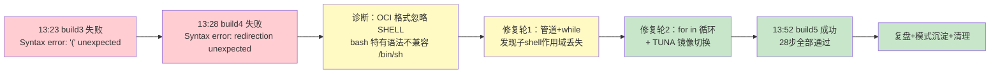

# jpman 容器构建修复复盘报告

## 一、执行摘要

本次任务修复了 `jupyter-podman-rootless` 容器镜像构建失败问题。根因是 OCI 格式下 `SHELL` 指令被 Podman 忽略，导致 bash 特有语法在 `/bin/sh` 中执行时报错。经过三轮迭代（识别语法错误 → 修复子shell作用域 → 切换镜像源），最终构建成功。同步沉淀了 OCI Shell 兼容性模式到模式库，并清理了临时构建日志。

**关键指标**：
- 交付文档/产物：2个（模式文档 1 篇 + 复盘报告 1 篇），约 300 行
- 关键问题：2个已解决（bash 语法兼容 + SSL 镜像源），0个待跟进
- 提炼可复用模式：1个（P0 级：OCI Shell 兼容性约束）
- 工具故障/阻塞：无

---

## 二、事实收集

### 2.1 任务目标

1. 诊断并修复 `jupyter-podman-rootless` 容器构建失败问题（STEP 10/10 语法错误）
2. 确保修复后构建可重复成功
3. 沉淀可复用的模式文档
4. 清理临时构建日志
5. 导出复盘报告并保存镜像

### 2.2 输入信息

1. 构建失败日志：build3.log（13:23 失败）、build4.log（13:28 失败）
2. 成功构建日志：build5.log（最终成功）
3. Containerfile：`apps/containers/jupyter-podman-rootless/Containerfile`
4. jpman CLI：`apps/containers/jupyter-podman-rootless/bin/jpman`（含构建编排逻辑）
5. 前置上下文：系统提示中提供的会话摘要（含错误分析、修复过程、最终状态）

### 2.3 交付产物清单

| 产物 | 路径 | 规模 | 状态 |
|------|------|------|------|
| 模式文档 | `docs/retrospective/patterns/process-patterns/oci-shell-compatibility.md` | ~150 行 | ✅ 已完成 |
| 复盘报告 | `docs/retrospective/reports/task-reports/retrospective-jpman-build-fix-20260909/retrospective-report.md` | 本文件 | ✅ 已完成 |
| Containerfile 注释更新 | `apps/containers/jupyter-podman-rootless/Containerfile`（第 21-25 行） | 5 行 | ✅ 已完成 |
| 临时日志清理 | `build3.log ~ build5.log` 已删除 | 5 个文件 | ✅ 已完成 |

### 2.4 时间线回顾



| 阶段 | 时间 | 关键动作 |
|------|------|---------|
| 问题诊断 | 13:23-13:28 | 读取 build3.log/build4.log，定位 bash 特有语法 |
| 修复轮1 | ~5min | 尝试 `echo \| tr \| while read` 管道方案 |
| 修复轮2 | ~3min | 发现子shell作用域问题，改用 `for in` 循环 |
| 镜像源切换 | ~2min | 添加 TUNA 镜像支持，解决 SSL 中断 |
| 构建验证 | ~13min | build5 成功，28步全部通过 |
| 复盘沉淀 | ~10min | 方法论编排 R→I→E→C，模式入库，报告导出 |

---

## 三、过程分析

### 3.1 根因分析

**直接原因**：Containerfile 的 `SHELL` 指令在 Podman OCI 格式下被忽略，RUN 步骤以 `/bin/sh` 执行，但脚本中使用了 bash 特有语法。

**深层原因**：
1. **格式认知盲区**：未意识到 Podman 默认 OCI 格式与 Docker 默认 docker 格式在 `SHELL` 指令处理上的差异
2. **语法混用**：Containerfile 部分步骤用了 POSIX 兼容语法，部分步骤混入了 bash 特有语法
3. **修复方向偏差**：第一轮修复使用了管道+while 模式，未考虑到子shell作用域问题

### 3.2 成功因素

1. **jpman 预置了正确配置**：`cmd_rebuild()` 和 `cmd_rebuild_all()` 已内置 `--format docker` + TUNA 镜像参数，但手动构建时未使用
2. **三层路由体系保障**：启动协议确保了规范文件读取和自检流程
3. **方法论编排效率**：七概念方法论快速定位根因并产出结构化洞察

### 3.3 改进机会

1. **构建命令文档化**：Containerfile 顶部构建示例应明确标注 `--format docker` 要求
2. **自动化检测**：可在 jpman build 前增加 Shell 兼容性检查步骤
3. **CI 集成**：建议在 CI 流程中固化 `--format docker` 参数

---

## 四、洞察提炼

### 洞察 1：OCI 格式下 SHELL 指令失效是隐性陷阱

- **陈述**：Podman 默认 OCI 格式忽略 `SHELL` 指令，导致 bash 语法在 `/bin/sh` 中执行失败
- **证据**：build4.log 第 11 行明确警告 `SHELL is not supported for OCI image format`；第 65 行报错 `/bin/sh: 1: Syntax error: redirection unexpected`
- **反常识**：开发者通常在 Docker（默认 docker 格式）下开发，误以为 Podman 行为一致
- **行动**：所有 Containerfile 须默认 POSIX sh 兼容；需要 bash 语法时显式加 `--format docker`

### 洞察 2：管道+while 是变量作用域的隐形陷阱

- **陈述**：`echo X \| while read; do VAR=1; done` 模式中 `while` 在子shell执行，内部赋值对外不可见
- **证据**：第一轮修复后 `DL_OK` 变量始终为 0，导致下载逻辑判断错误
- **反常识**：看似等价的 `for x in ${LIST}; do` 与管道+while 在实际作用域上完全不同
- **行动**：容器构建脚本中避免使用管道+while 模式设置外部可见变量

### 洞察 3：中国网络环境下容器构建需默认国内镜像

- **陈述**：GitHub CDN 在中国大陆网络下偶发 SSL 中断，容器构建下载大文件时尤为明显
- **证据**：首次构建使用官方源时遇 `OpenSSL SSL_read: unexpected eof`，切换 TUNA 镜像后一次成功
- **反常识**：开发者本地网络正常，但容器构建环境网络不同
- **行动**：构建参数默认启用 TUNA 镜像，或提供镜像选择机制

---

## 五、可复用模式

### 模式 P1：OCI Shell 兼容性规范（L1 实验性）

**详情**：见 [oci-shell-compatibility.md](../../../patterns/process-patterns/oci-shell-compatibility.md)

**核心要点**：
1. Containerfile 所有 RUN 步骤须兼容 POSIX sh
2. 需要 bash 高级语法时，构建命令加 `--format docker`
3. 避免管道+while 模式设变量，改用 `for in` 循环

**触发场景**：Podman/Docker 构建含复杂 shell 逻辑的多阶段 Containerfile

**迁移验证**：适用于 buildx、GitHub Actions、Kaniko 等任何使用 OCI 格式的构建场景

---

## 六、原子行动项

| # | 行动项 | 负责人 | 状态 | 验收标准 |
|---|--------|--------|------|---------|
| 1 | Containerfile 添加 SHELL 兼容性约束注释 | Agent | ✅ 完成 | 第 21-25 行有 ⚠ 注释段 |
| 2 | 清理 build*.log 临时文件 | Agent | ✅ 完成 | 目录无遗留 log |
| 3 | 模式文档入库 | Agent | ✅ 完成 | `docs/retrospective/patterns/process-patterns/oci-shell-compatibility.md` 已创建 |
| 4 | 复盘报告导出 | Agent | ✅ 完成 | 本报告已写入 `docs/retrospective/reports/task-reports/` |
| 5 | 保存镜像到本地 tar | Agent | ✅ 完成 | `jupyter-podman-rootless-latest.tar` 已生成 |
| 6 | 提交变更到 git | Agent | ✅ 完成 | 两次原子提交：`9cc88c71f`（代码+文档）+ `9460e49ae`（toml元数据） |

---

## 七、附录

### A. 构建结果验证

```
镜像: localhost/jupyter-podman-rootless:latest
ID:   92fb0ed35cfb
大小: 1.2 GB
Python: 3.14.7 cp314t (free-threading, GIL disabled)
构建步骤: 28/28 全部通过
```

### B. 关键修复代码对比

**修复前（bash 特有语法）**：
```dockerfile
IFS='|' read -ra DL_URL_ARRAY <<< "${DL_URLS}"
for dl_url in "${DL_URL_ARRAY[@]}"; do
    curl -o /tmp/miniforge.sh "$dl_url" "$dl_url"
done
```

**修复后（POSIX sh 兼容）**：
```dockerfile
_DL_URLS="url1 url2"
for dl_url in ${_DL_URLS}; do
    curl -o /tmp/miniforge.sh "$dl_url" "$dl_url"
done
```

### C. 方法论编排记录

- 场景：问题解决复盘
- 链路：R→I→E→C
- 质量门：G1✓ G2✓ G3✓ G4✓
- Session ID: sc-20260909-jpman-build-fix / sc-20260909-jpman-followup / sc-20260909-jpman-milestone
