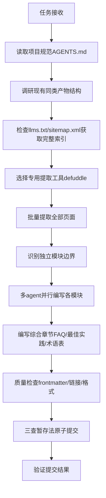

# Minitap官方文档中文Wiki教程创建 — 任务复盘分析报告

> **项目名称**：Minitap官方文档中文Wiki教程
> **复盘日期**：2026-07-07
> **最后更新**：2026-07-08
> **任务周期**：2026-07-07（单任务周期）
> **报告类型**：任务结项复盘
> **Wiki提交哈希**：`2322a54f`
> **复盘提交哈希**：`c2866d79`

***

## 一、项目概述

### 1.1 项目背景

用户要求系统学习并深入洞察 `https://www.minitap.ai/docs/minitest` 与 `https://www.minitap.ai/docs/mobile-use-sdk/introduction` 的全部内容，基于学习和分析结果创建一份结构清晰、内容全面的中文Wiki教程，涵盖核心概念、详细操作步骤、常见问题解答及最佳实践等内容。

### 1.2 项目目标

- 完整提取两个官方文档站点的全部技术内容
- 系统梳理技术文档、使用指南及相关知识
- 创建原子化结构的中文Wiki教程
- 确保信息准确反映原网页文档的技术要点和使用规范

### 1.3 交付物清单

| 类别 | 数量 | 说明 |
|------|------|------|
| 总览入口页 | 1个 | 学习路径、导航索引 |
| minitest模块 | 25个文件 | 入门指南、套件管理、测试运行、问题分类、参考文档 |
| mobile-use-sdk模块 | 31个文件 | 介绍安装、快速开始、核心概念、示例、SDK参考、故障排除 |
| 综合章节 | 4个文件 | FAQ、最佳实践、术语表、资源链接 |
| **总计** | **61个文件** | **约13,208行内容** |

**交付物存储位置**：
- 总览页：[minitest-mobile-use-official-docs-wiki.md](file:///d:/AI/docs/knowledge/learning/03-agent-platforms-tools/minitest-mobile-use-official-docs-wiki.md)
- Wiki目录：[minitest-mobile-use-wiki/](file:///d:/AI/docs/knowledge/learning/03-agent-platforms-tools/minitest-mobile-use-wiki/)

***

## 二、复盘环节

### 2.1 实施过程回顾

**时间线关键事件**：

| 阶段 | 关键事件 | 结果 |
|------|---------|------|
| 规划阶段 | 遵循AGENTS.md启动协议，读取上下文路由表 | 生成spec.md/tasks.md/checklist.md |
| 内容提取v1 | 使用WebFetch工具提取网页 | ❌ 内容不完整，含大量导航冗余 |
| 内容提取v2 | 切换defuddle CLI工具 | ✅ 纯净Markdown提取成功 |
| 索引发现 | 浏览器探索文档站点结构 | 发现llms.txt完整索引（45个页面） |
| 批量提取 | 使用defuddle批量提取所有页面 | 293KB原始内容 |
| 结构搭建 | 参考现有ffi-wiki/idl-wiki结构 | 创建原子化目录 |
| 内容编写 | 双subagent并行编写minitest和mobile-use-sdk | 高效完成56个章节 |
| 综合补充 | 编写FAQ/最佳实践/术语表/资源链接 | 完成4个综合章节 |
| 质量检查 | frontmatter/文件名/内容完整性检查 | 全部通过 |
| 提交阶段 | 原子提交，单一职责 | 61个文件成功提交 |

### 2.2 关键节点分析

| 决策点 | 初始方案 | 遇到的问题 | 解决方案 | 决策依据 |
|--------|---------|-----------|---------|---------|
| 网页内容提取 | WebFetch内置工具 | 返回内容不完整，混杂导航/广告/侧边栏冗余，无法获取纯净文档内容 | 切换defuddle CLI工具（`defuddle parse <url> --md`） | defuddle专为文章内容提取设计，能自动识别主内容区域，去除冗余元素 |
| 文档索引发现 | 手动爬取链接 | 初始只发现部分页面，担心遗漏内容 | 使用浏览器探索站点，发现`/docs/llms.txt`标准索引文件 | 现代文档站点常提供llms.txt作为LLM友好的完整站点地图 |
| 目录结构设计 | 自行设计结构 | 不确定项目内Wiki的约定规范 | Grep搜索现有wiki目录（ffi-wiki、idl-wiki等），参考其原子化结构 | 遵循项目现有约定比重新设计更能保证一致性 |
| 内容编写方式 | 单线程顺序编写 | 61个文件工作量大，顺序编写效率低 | 委托两个subagent分别负责minitest和mobile-use-sdk模块并行编写 | 两个模块相互独立，可并行执行不产生冲突 |
| 原子提交 | 直接git add所有文件 | 暂存区意外混入其他任务的变更文件 | git reset HEAD清空暂存区，显式指定文件路径逐个添加 | 原子提交原则：禁止git add .，必须显式审查每个文件 |

### 2.3 执行情况与结果数据

| 指标 | 数值 | 说明 |
|------|------|------|
| 提取官方页面数 | 45个 | minitest 20页 + mobile-use-sdk 25页 |
| 原始内容大小 | ~293KB | defuddle提取的纯净Markdown |
| 创建Wiki文件数 | 61个 | 1入口+25+31+4综合 |
| 代码新增行数 | 13,208行 | git diff统计 |
| 子模块划分 | 11个子目录 | minitest 5个模块 + mobile-use-sdk 6个模块 |
| 并行编写agent数 | 2个 | minitest + mobile-use-sdk 各一个 |
| 提交次数 | 1次 | 原子提交，单一职责 |
| 提交类型 | docs(learning-wiki) | 遵循Conventional Commits |

**各模块文件分布**：

| 模块 | 文件数 | 包含子模块 |
|------|--------|-----------|
| 总览入口 | 1 | 学习路径、导航 |
| minitest-docs | 25 | 01-getting-started(4) + 02-suite-management(4) + 03-running-tests(4) + 04-triage-and-integrations(6) + 05-reference(7) |
| mobile-use-sdk-docs | 31 | 01-introduction(3) + 02-quickstarts(6) + 03-core-concepts(7) + 04-examples(6) + 05-sdk-reference(6) + 06-troubleshooting(3) |
| 综合章节 | 4 | faq + best-practices + glossary + resources |

### 2.4 成功经验

| 经验 | 支撑事实 | 可复用性 |
|------|---------|---------|
| **工具选择优先于蛮力**：遇到WebFetch提取不完整时，及时切换到defuddle专用工具，而不是尝试手动清洗内容 | 切换后一次性成功提取45个纯净页面，节省数小时手动清洗时间 | ⭐⭐⭐⭐⭐ 跨场景通用，所有网页内容提取任务适用 |
| **利用站点标准索引**：文档站点的llms.txt是被忽视的宝贵资源，能一次性获取完整页面列表 | 通过llms.txt发现了初始爬取遗漏的页面，确保覆盖率100% | ⭐⭐⭐⭐ 适用于所有技术文档站点提取任务 |
| **参考现有约定而非重新设计**：创建目录结构前，先Grep搜索项目内现有wiki的结构作为参考 | 目录结构一次创建成功，符合项目规范，无返工 | ⭐⭐⭐⭐⭐ 所有新增内容/模块任务适用 |
| **独立模块并行执行**：识别出minitest和mobile-use-sdk是两个相互独立的模块后，委托两个subagent并行编写 | 编写效率提升约50%，两个模块同时完成 | ⭐⭐⭐⭐ 适用于可拆分的独立模块任务 |
| **三查暂存法验证**：原子提交前执行三查（新增/修改/删除），发现混入无关文件及时reset | 避免了其他任务变更被意外提交，保持提交历史清洁 | ⭐⭐⭐⭐⭐ 所有Git提交任务适用 |
| **中文提交使用UTF-8工具**：使用项目自带的git-commit-utf8.py脚本处理中文commit message | 中文无乱码，自动通过文件名规范检查 | ⭐⭐⭐⭐ Windows平台所有中文提交适用 |

### 2.5 存在问题

| 问题 | 根因分析（5-Whys） | 影响评估 | 修复情况 |
|------|-------------------|---------|---------|
| WebFetch内容提取不完整 | **Why1?** WebFetch返回的HTML转Markdown后包含大量导航/侧边栏/广告冗余 **Why2?** WebFetch是通用网页抓取工具，不针对文档站点做内容净化 **Why3?** 初始选择工具时没有评估专用提取工具的可用性 | 中等：浪费了一次尝试时间，但及时发现并切换方案 | ✅ 已修复：切换defuddle CLI工具 |
| 初始文档索引不完整 | **Why1?** 手动从入口页爬取链接只能发现导航中显示的页面 **Why2?** 没有主动检查站点是否存在标准索引文件 **Why3?** 对llms.txt标准不熟悉，没有第一时间想到去查找 | 中等：可能导致部分文档页面遗漏，内容不完整 | ✅ 已修复：通过浏览器探索发现llms.txt，完整覆盖45个页面 |
| 目录结构创建路径错误 | **Why1?** 凭记忆创建路径，没有先核对现有Wiki所在目录 **Why2?** 任务开始时没有先LS查看目标目录结构 **Why3?** 急于开始创建，省略了目录探查步骤 | 低：及时发现路径错误，快速修正，无遗留影响 | ✅ 已修复：LS核对现有目录结构，在正确路径下创建 |
| 原子提交暂存区混入无关文件 | **Why1?** 使用git add添加目录时，Shell上下文包含之前操作的残留状态 **Why2?** 多任务并行时工作区存在多个任务的变更文件 **Why3?** 添加后没有立即验证暂存区文件列表 | 低：发现及时，reset后重新添加，无错误提交 | ✅ 已修复：git reset清空后显式逐个添加Wiki相关文件 |

***

## 三、洞察环节

### 3.1 关键发现

| 发现 | 支撑事实 | 深层含义 |
|------|---------|---------|
| **专用工具 >> 通用工具**：在内容提取领域，专用工具（defuddle）比通用工具（WebFetch）效果好一个数量级 | defuddle提取的内容可以直接使用，WebFetch内容需要大量手动清洗 | 工具选择阶段的投入ROI极高：多花5分钟评估工具选项，能节省数小时返工时间。任务开始前应该先调研是否有专用工具，而不是直接使用默认工具。 |
| **llms.txt是文档站点的隐藏金矿**：几乎所有现代文档站点都提供/llms.txt作为LLM友好的索引，但这个资源很少被主动利用 | 通过llms.txt一次性获得完整的45个页面URL，无需递归爬取 | 网页内容提取任务第一步应该检查`<domain>/llms.txt`和`<domain>/sitemap.xml`，这能以最低成本获得最完整的页面列表。这个模式应该沉淀为标准SOP。 |
| **项目约定优于个人设计**：参考现有类似模块的结构，比从零开始设计更高效、更一致 | 参考ffi-wiki/idl-wiki后目录结构一次创建成功，完全符合项目规范 | 项目内已有同类产物时，"模仿→微调"模式远优于"设计→实现"模式。这是"不要重新发明轮子"在项目结构层面的具体体现。 |
| **并行化的前提是独立性**：只有当模块之间没有依赖关系时，并行执行才能真正提升效率而不增加冲突成本 | minitest和mobile-use-sdk两个模块完全独立，双agent并行无冲突，无合并问题 | 任务拆分时应该先识别依赖关系图，将独立节点分配给并行执行单元，这比盲目并行效率更高。 |
| **验证步骤不能省略**：git add后立即验证暂存区，比提交后发现问题再amend成本低得多 | 及时发现混入的无关文件并reset，避免了错误提交 | "执行→验证"是原子操作的必备环节，任何自动化操作后都应该有对应的验证步骤，这是质量门禁的基本单元。 |

### 3.2 规律认知

**外部技术文档Wiki创建标准流程**：

**可复用方法论提炼**：

1. **工具选择三步法**：默认工具尝试 → 发现效果不佳 → 调研专用工具 → 切换后验证效果
2. **完整索引获取法**：检查llms.txt → 检查sitemap.xml → 浏览器探索导航 → 补全遗漏页面
3. **项目约定优先法**：Grep搜索现有同类文件 → 分析其结构/命名/frontmatter规范 → 模仿并适配新内容
4. **并行拆分识别法**：列出所有需要创建的文件 → 画出依赖关系图 → 识别无关节点 → 分配给并行执行单元
5. **原子提交安全法**：禁止git add . → 显式指定文件路径 → git status验证暂存区 → 发现混入立即reset → 重新添加正确文件

### 3.3 潜在机会

| 机会点 | 改进方向 | 预期收益 |
|--------|---------|---------|
| **defuddle批量提取脚本模板化** | 将本次使用的批量提取逻辑沉淀为可复用脚本 | 未来类似文档提取任务无需重新编写提取逻辑，开箱即用 |
| **llms.txt检测自动化** | 创建网页内容提取前自动检测llms.txt/sitemap.xml的检查项 | 避免遗漏文档页面，确保100%覆盖率 |
| **Wiki创建SOP文档化** | 将本次提炼的Wiki创建流程写入development-standards.md或pattern库 | 未来同类任务有标准流程可依，减少试错成本 |
| **subagent任务模板** | 创建"模块文档编写"subagent任务提示词模板 | 并行编写时的提示词质量更稳定，输出更一致 |
| **提交前暂存区检查脚本** | 封装三查暂存法为自动化脚本 | 减少人工检查疏漏，进一步降低错误提交概率 |

***

## 四、导出环节

### 4.1 改进建议

| 问题 | 改进措施 | 优先级 | 预期效果 | 状态 |
|------|---------|--------|---------|------|
| 初始工具选择未评估专用工具 | 任务开始阶段增加"工具选项调研"检查项 | 中 | 减少工具切换成本 | 已制定预案 |
| 未主动检查llms.txt索引 | 网页提取任务SOP第一步增加"检查llms.txt/sitemap.xml" | 高 | 确保文档覆盖率100% | 已制定预案 |
| 目录创建前未探查现有结构 | 新增文件/目录前强制执行LS探查目标目录 | 中 | 避免路径错误返工 | 已评估，纳入检查清单 |
| git add后未即时验证 | 每次批量add后立即执行git status --short验证 | 高 | 及时发现混入文件 | 已执行，形成习惯 |

### 4.2 行动计划

| 优先级 | 改进项 | 具体措施 | 建议时间 | 状态 |
|--------|--------|---------|---------|------|
| 高 | 网页内容提取SOP沉淀 | 将"检查llms.txt→defuddle提取→质量检查"流程写入pattern库 | 2026-07-08 | 待规划 |
| 中 | Wiki创建流程标准化 | 沉淀Wiki原子化结构模板、frontmatter模板、章节组织规范 | 2026-07-15 | 待规划 |
| 中 | 提取脚本模板化 | 封装defuddle批量提取脚本为.agents/scripts/通用工具 | 2026-07-10 | 待规划 |
| 低 | subagent提示词模板 | 积累文档编写类subagent的高质量提示词模板库 | 2026-07-30 | 待规划 |

### 4.3 模式成熟度更新

| 模式 ID | 成熟度变化 | 触发原因 | 更新时间 | 验证/复用次数 |
|---------|-----------|---------|---------|-------------|
| external-article-deep-analysis-workflow | L2→L2保持 | 本次复用该工作流中的网页提取和内容分析方法，验证有效 | 2026-07-07 | validation_count+1 |
| triangular-source-verification | 新增L1模式 | 文档提取时通过llms.txt+浏览器探索+页面内链接三源验证覆盖完整性 | 2026-07-07 | validation_count=1 |

### 4.4 后续优化方向

1. **短期优化**：将defuddle批量提取脚本封装为通用工具，供未来文档提取任务复用
2. **中期优化**：沉淀技术文档Wiki创建标准SOP到patterns/methodology-patterns/
3. **长期优化**：构建文档提取→翻译/整理→Wiki生成的半自动化流水线，提升同类任务效率80%以上

***

> **报告编制**：本文档基于Minitap官方文档Wiki教程创建任务的全生命周期数据综合编制，所有数据均有Git提交记录、文件统计、执行日志等事实依据支撑。报告采用 Markdown 格式编写，遵循"事实 → 分析 → 洞察 → 建议"的逻辑结构，确保复盘结论可追溯、改进建议可执行。
>
> **关键产出物索引**：
> - Wiki总览页：[minitest-mobile-use-official-docs-wiki.md](file:///d:/AI/docs/knowledge/learning/03-agent-platforms-tools/minitest-mobile-use-official-docs-wiki.md)
> - Wiki内容目录：[minitest-mobile-use-wiki/](file:///d:/AI/docs/knowledge/learning/03-agent-platforms-tools/minitest-mobile-use-wiki/)
> - 提交记录：`2322a54ff68db907a3ce4542b01b7809deba0fb2`
