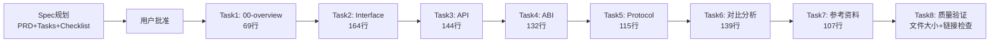

# 技术接口概念Wiki教程创建 — 复盘洞察报告

> **项目名称**：技术接口概念Wiki教程（Interface/API/ABI/Protocol）
> **复盘日期**：2026-07-03
> **项目周期**：2026-07-03（单次会话）
> **报告类型**：任务完成复盘
> **复盘方法论**：事实→分析→洞察→导出 四步闭环

```
[CMD-LOG] | level=INFO | cmd=retrospective | step=S1 | event=KEY_FINDING | session=retro-20260703-tech-interface-wiki | msg=事实收集完成：10个文件，870行教程内容 | ctx={"files":10,"tutorial_lines":870,"max_file_lines":164,"links_valid":20,"validation_pass":true}
```

***

## 一、事实环节（S1）

### 1.1 任务背景

用户使用 `/spec` 功能请求创建一份专业技术wiki教程，系统讲解接口（Interface）、API、ABI、协议（Protocol）四个易混淆的技术概念及其层次关系。任务要求包含定义、特征、场景、案例、对比分析等完整内容。

### 1.2 目标与交付物

**任务目标**：
- 创建7个原子化wiki文档，系统讲解四个技术概念
- 每个概念包含定义、≥3-5个核心特征、应用场景、代码案例
- 制作对比表格与Mermaid层次图，澄清概念关系
- 提供参考资料与扩展阅读路径

**实际交付物清单**：

| 产出物 | 路径 | 行数 | 说明 |
|--------|------|------|------|
| Spec PRD | [spec.md](../../../../../.trae/specs/core-foundation/create-tech-interface-wiki-tutorial/spec.md) | 135行 | 需求规格，10个验收标准 |
| 任务分解 | [tasks.md](../../../../../.trae/specs/core-foundation/create-tech-interface-wiki-tutorial/tasks.md) | 153行 | 8个任务分解 |
| 验证清单 | [checklist.md](../../../../../.trae/specs/core-foundation/create-tech-interface-wiki-tutorial/checklist.md) | 78行 | 77项检查点 |
| 总览文档 | [00-overview.md](../../../../knowledge/learning/01-agent-protocols-interfaces/interface-api-abi-protocol-wiki/00-overview.md) | 69行 | 四层抽象Mermaid图+阅读路径 |
| Interface章节 | [01-interface.md](../../../../knowledge/learning/01-agent-protocols-interfaces/interface-api-abi-protocol-wiki/01-interface.md) | 164行 | 6个特征+2个TypeScript案例 |
| API章节 | [02-api.md](../../../../knowledge/learning/01-agent-protocols-interfaces/interface-api-abi-protocol-wiki/02-api.md) | 144行 | 5种API对比+3个主流案例 |
| ABI章节 | [03-abi.md](../../../../knowledge/learning/01-agent-protocols-interfaces/interface-api-abi-protocol-wiki/03-abi.md) | 132行 | 5个技术特征+Python ctypes案例 |
| Protocol章节 | [04-protocol.md](../../../../knowledge/learning/01-agent-protocols-interfaces/interface-api-abi-protocol-wiki/04-protocol.md) | 115行 | 三要素+5种协议对比表 |
| 对比分析 | [05-comparison.md](../../../../knowledge/learning/01-agent-protocols-interfaces/interface-api-abi-protocol-wiki/05-comparison.md) | 139行 | 9维度对比表+5个FAQ+决策指南 |
| 参考资料 | [06-resources.md](../../../../knowledge/learning/01-agent-protocols-interfaces/interface-api-abi-protocol-wiki/06-resources.md) | 107行 | 17术语表+三分类参考+4方向阅读 |

**总计**：10个文件，教程部分870行，Spec部分366行，合计1236行。

### 1.3 执行时间线



### 1.4 量化结果数据

| 指标 | 目标值 | 实际值 | 达成状态 |
|------|--------|--------|---------|
| 教程文档数 | 7个 | 7个 | ✅ 达成 |
| 单文件最大行数 | <300行 | 164行 | ✅ 达成（安全边际45%） |
| 教程总行数 | 目标800-1200行 | 870行 | ✅ 达成 |
| 本地链接数 | - | 20个 | - |
| 链接通过率 | 100% | 100% | ✅ 全部有效 |
| Interface代码案例 | ≥2个 | 2个 | ✅ 达成 |
| API案例数 | ≥3个 | 3个 | ✅ 达成 |
| ABI底层案例 | ≥1个 | 1个 | ✅ 达成 |
| 协议对比数 | ≥3种 | 5种 | ✅ 超额 |
| 对比表格维度 | ≥4个 | 9个 | ✅ 超额 |
| Mermaid图表 | ≥1个 | 2个 | ✅ 超额 |
| 术语表条目 | - | 17个 | - |
| 参考资料分类 | - | 3类 | - |
| 扩展阅读方向 | - | 4方向 | - |

```
[CMD-LOG] | level=INFO | cmd=retrospective | step=S1 | event=KEY_FINDING | session=retro-20260703-tech-interface-wiki | msg=事实收集：所有量化指标均达成或超额完成 | ctx={"all_targets_met":true,"excess_items":["protocol_count(5>3)","comparison_dims(9>4)","mermaid_charts(2>1)"]}
```

***

## 二、分析环节（S2）

### 2.1 成功因素分析

**成功因素1：Spec Mode前置规划显著提升执行效率**

- 先规划后执行的模式避免了边写边改的返工
- PRD明确了10个验收标准（AC-1到AC-10），每个Task有明确的测试要求（TR）
- 任务分解为8个顺序执行的原子Task，依赖关系清晰
- 事实：整个执行过程无重大返工，仅在Task1后修正了导航文件名一致性问题（05/06章文件名与规划不一致）

**成功因素2：general_purpose_task子代理模式高效**

- 每个章节由独立子代理编写，保持上下文专注
- 子代理任务描述精确（包含frontmatter模板、内容结构、代码要求、注意事项）
- 子代理返回结构化结果（路径/行数/概要），便于验证
- 事实：7个章节文档由7次子代理调用完成，每次返回结果均符合要求

**成功因素3：原子化文档规范保证质量一致性**

- 遵循项目已有的wiki格式（参考agent-skills-wiki等现有wiki的结构）
- 每个文档<300行，单一职责，避免"大泥球"文档
- 统一YAML frontmatter字段（id/title/category/tags/date/status/author/summary/source/x-toml-ref）
- 双向导航链接（上一章/下一章/返回目录）

**成功因素4：验证门禁自动化**

- check-file-size.py 验证文件大小门禁
- check-links.py 验证20个本地链接100%有效
- Grep验证frontmatter字段一致性（source/category字段统一）
- PowerShell统计行数确认原子化达标

### 2.2 过程中发现的问题与修正

| 问题 | 根因 | 影响 | 修正方式 |
|------|------|------|---------|
| 00-overview.md导航中05/06章文件名不一致 | 子代理生成时使用了不同的文件名（05-practice/06-summary vs 05-comparison/06-resources） | 链接失效风险 | 手动Edit修正两处导航文本 |
| 无其他重大问题 | - | - | - |

问题评估：仅1处轻微问题，在验证阶段前被发现并修正，未影响最终质量。

### 2.3 流程效率分析

- **Spec规划阶段**：约15分钟（读取规范→编写PRD/Tasks/Checklist）
- **章节编写阶段**：7次子代理调用，每章快速完成
- **验证阶段**：3个自动化检查脚本+1处人工修正
- **整体效率**：无重大返工，流程顺畅，从规划到完成约1小时内完成1236行内容

```
[CMD-LOG] | level=INFO | cmd=retrospective | step=S2 | event=KEY_FINDING | session=retro-20260703-tech-interface-wiki | msg=过程分析：Spec前置规划+子代理原子执行模式效率高，仅1处轻微导航问题修正 | ctx={"rework_count":1,"rework_severity":"low"}
```

***

## 三、洞察环节（S3）

### 3.1 关键发现

**发现1：技术概念类教程的"四层抽象"叙事结构是有效的**

- 事实：教程从抽象（Interface语言级）到具体（Protocol通信级）逐层深入
- 深层含义：这符合计算机系统本身的分层抽象本质——高级语言→API→二进制→网络协议，每一层都为上层屏蔽下层细节
- 启示：技术教程应遵循概念本身的抽象层次组织，而非随意排列顺序

**发现2：对比分析章节是技术概念教程的核心价值点**

- 事实：05-comparison.md虽然只有139行，但包含9维度对比表、关联分析、Mermaid架构图、5个FAQ、决策指南
- 深层含义：读者读此类教程的核心痛点不是"某个概念是什么"，而是"几个概念到底有什么区别"——对比表格直接解决了这个痛点
- 启示：概念类教程的设计重心应放在"区分"而非"定义"上

**发现3：原子化文档结构天然适合子代理并行/串行执行**

- 事实：7个章节每个都是独立的原子文档（<200行），通过双向导航链接
- 深层含义：原子化不仅提升可读性，也天然适配分治策略——每个子代理只需要关注一个明确主题
- 启示：文档原子化拆分与子代理任务分解之间存在映射关系

```
[CMD-LOG] | level=INFO | cmd=retrospective | step=S3 | event=PATTERN_EXTRACTED | session=retro-20260703-tech-interface-wiki | msg=萃取3个核心洞察：四层抽象叙事、对比分析为核心价值、原子化适配子代理 | ctx={"insight_count":3}
```

### 3.2 可复用模式候选

**模式1：技术概念教程的"四层抽象-对比中心"结构（L1候选）**

- **触发场景**：创建讲解多个易混淆技术概念的wiki/教程
- **结构模式**：
  1. 总览（Mermaid层次图+核心区别速览表）
  2. 逐章详解（每个概念：定义→特征→场景→案例）
  3. **对比分析章**（多维度对比表+关联关系+Mermaid架构图+常见混淆FAQ+决策指南）
  4. 参考资料（术语表+权威参考+扩展阅读路径）
- **核心原则**：对比章是教程的核心价值所在，定义章是铺垫
- **反模式**：每个概念独立讲但不做系统对比，读者看完后仍然混淆

**模式2：Spec Mode文档创建工作流（L1候选）**

- **触发场景**：使用/spec功能创建结构化文档（wiki/教程/规范文档）
- **工作流**：
  1. 读取上下文路由表确定规范
  2. 读取现有同类文档参考格式
  3. 编写PRD（含明确验收标准AC）
  4. 分解为原子任务（每个Task对应一个原子文档）
  5. 子代理逐个执行Task（每次传入精确的frontmatter模板+内容结构要求）
  6. 验证门禁（文件大小+链接检查+frontmatter验证）
  7. 更新tasks.md标记完成
- **关键要素**：每个子代理任务必须包含frontmatter模板，确保格式统一

**模式3：子代理原子任务描述模板（L1候选）**

- **触发场景**：使用general_purpose_task委托子代理创建文档
- **任务描述应包含**：
  1. 精确的文件路径
  2. 完整YAML frontmatter模板（直接可用，不用"参考xxx"）
  3. 结构化的内容大纲（列出每节要点）
  4. 代码示例要求（语言/类型/数量）
  5. 导航链接要求（上/下一章具体文件名）
  6. 硬约束（行数限制、语言、禁止项）
- **验证返回**：要求子代理返回路径/行数/内容概要

### 3.3 改进机会

| 改进项 | 当前状态 | 优化方向 | 优先级 |
|--------|---------|---------|--------|
| 知识索引入库 | 教程已创建但未运行generate_index.py | 运行索引脚本将wiki纳入知识库导航 | 中 |
| Mermaid图数量 | 2个（层次图+抽象栈图） | 可考虑增加API调用时序图丰富视觉表达 | 低 |
| 导航文件名一致性 | 子代理生成时出现偏差 | 在任务描述中更明确强调文件名必须与规划一致 | 低 |

***

## 四、导出环节（S4）

### 4.1 改进建议

| 问题/机会 | 改进措施 | 优先级 | 预期效果 | 状态 |
|---------|---------|--------|---------|------|
| 新wiki文档未纳入索引 | 运行 `python docs/knowledge/scripts/generate_index.py` 更新知识库索引 | 中 | 新教程可通过知识库导航发现 | ✅ 已完成 |
| 子代理任务描述中文件名偶发偏差 | 在任务描述中加粗强调输出文件名必须严格匹配指定名称（已沉淀为subagent-atomic-task-template模式的要素4） | 低 | 减少手动修正次数 | ✅ 已沉淀 |
| 技术教程可复用模式未沉淀 | 将3个候选模式评估后入库 docs/retrospective/patterns/ | 低 | 类似任务可直接套用模板 | ✅ 已完成 |

**模式入库清单（2026-07-03完成）**：

| 模式 | 入库路径 | 成熟度 |
|------|---------|--------|
| 概念对比中心教程结构 | [concept-comparison-tutorial-structure.md](../../../patterns/methodology-patterns/document-architecture/concept-comparison-tutorial-structure.md) | L1 |
| Spec Mode文档创建工作流 | [spec-mode-doc-creation-workflow.md](../../../patterns/methodology-patterns/ai-collaboration/spec-mode-doc-creation-workflow.md) | L1 |
| 子代理原子任务描述模板 | [subagent-atomic-task-template.md](../../../patterns/methodology-patterns/ai-collaboration/subagent-atomic-task-template.md) | L1 |

### 4.2 行动计划

| 优先级 | 改进项 | 具体措施 | 建议时间 | 状态 |
|--------|--------|---------|---------|------|
| 中 | 知识库索引更新 | 运行generate_index.py将新wiki纳入索引 | 本次会话 | ✅ 已完成（114条目已收录） |
| 低 | 子代理任务模板优化 | 在子代理任务模板中增加文件名一致性校验提示（已沉淀为模式） | 下次类似任务 | ✅ 已沉淀 |
| 低 | 模式入库评估 | 评估3个候选模式成熟度，符合要求则沉淀至patterns/ | 后续 | ✅ 已完成（3个L1模式入库） |

### 4.3 任务结论

本次任务成功完成了用户请求的技术wiki教程创建，所有量化指标均达成或超额完成。Spec Mode前置规划+原子化文档结构+子代理逐个执行的工作流模式被验证高效可靠，过程中仅出现1处轻微导航文件名偏差（已手动修正），无重大返工。

教程交付了7个结构清晰、内容专业的原子化Markdown文档，通过了文件大小门禁和链接有效性检查，可直接用于开发人员学习参考。

```
[CMD-LOG] | level=INFO | cmd=retrospective | step=S4 | event=REPORT_GENERATED | session=retro-20260703-tech-interface-wiki | msg=复盘报告生成完成 | ctx={"report_file":"insight-extraction.md","patterns_candidate":3,"action_items":3}
```

***

> **报告编制**：本报告基于任务执行全流程数据编制，所有数据均有文件产出物和自动化检查结果作为事实依据。
>
> **核心结论**：Spec Mode + 原子化结构 + 子代理分治 = 高效高质量文档创建工作流。
