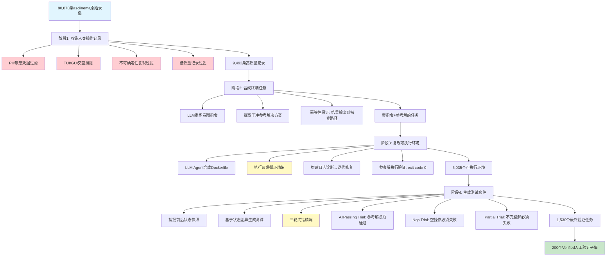
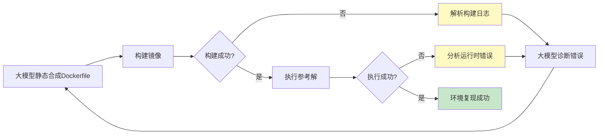

# TerminalWorld深度洞察：首个基于真实人类终端轨迹的Agent评测基准

## 摘要

TerminalWorld是由伦敦大学学院（UCL）、南京大学、腾讯联合推出的开创性终端Agent评测基准，它首次系统性地从80,870条asciinema真实人类终端录像中，通过自动化逆向工程流水线构建了1,530个可执行、可验证的真实终端任务，覆盖18个工作流类别、1,280个独特命令工具。研究团队在此基础上精选200个人工验证的Verified子集，对8个前沿大模型和6个主流Agent框架进行全面评测，发现当前最强模型（Claude Opus 4.7）在真实终端任务上的通过率仅为62.5%，所有模型平均通过率54.8%，且与现有专家设计基准（如Terminal-Bench）的得分相关性仅为Pearson r=0.20，Agent与人类命令路径重叠度中位数仅21.4%。这一发现揭示了当前Agent评测体系中存在的"高分低能"现象——专家基准上的高分难以迁移到真实开发场景。TerminalWorld的核心贡献在于提出了"真实世界自动出题"的范式，通过四阶段自动化数据引擎实现了评测基准的真实性与可扩展性的统一，构建了可持续更新的"活性基准"（Living Benchmark）。评测显示开源模型完成全部任务的平均成本仅为17美元，不到闭源模型（约71美元）的四分之一，为终端Agent的能力评估与成本优化提供了重要参考。

## 元信息

| 属性 | 值 |
|---|---|
| 论文标题 | TerminalWorld: Benchmarking Agents on Real-World Terminal Tasks |
| arXiv链接 | https://arxiv.org/abs/2605.22535 |
| 项目主页 | https://terminalworld.ai/ |
| 代码仓库 | https://github.com/EuniAI/TerminalWorld |
| 数据集 | https://huggingface.co/datasets/EuniAI/TerminalWorld |
| 数据来源 | asciinema公开平台（80,870条真实终端录像） |
| 最终任务数 | 1,530个验证任务 |
| Verified子集 | 200个人工审查的代表性任务 |
| 任务类别 | 18个真实工作流类别 |
| 覆盖命令 | 1,280个独特命令 |
| 新命令占比 | 91%（相对于Terminal-Bench） |
| 最强模型通过率 | 62.5% |
| 平均通过率 | 54.8% |
| 与Terminal-Bench相关性 | Pearson r = 0.20（弱相关） |
| 命令重叠度中位数 | 21.4% |
| 开源模型平均成本 | $17 / 全量任务 |
| 闭源模型平均成本 | $71 / 全量任务 |

## 研究背景

### 终端：AI Agent的主战场

随着LLM在多步推理和工具使用方面的能力突破，终端环境正成为自主Agent完成复杂软件工程任务的主要行动空间。从SWE-agent、OpenHands等开源框架，到Claude Code、Codex CLI、Gemini CLI等商业CLI助手，Agent通过在终端中执行命令、组合工具、解释反馈来自动化终端工作流的能力日益增强。然而，一个根本性问题始终悬而未决：**如何可靠地评估这些Agent在真实世界终端任务上的表现？**

### 现有基准的两大盲区

当前主流的终端Agent评测基准（如Terminal-Bench、LongCLI-Bench）几乎都遵循"专家手工出题"的范式，这导致了两个被集体忽视的根本性缺陷：

**盲区一：题目不够真实（Adversarial Puzzle Bias）**

领域专家为了拉开难度梯度，往往倾向于设计刁钻的、对抗性强的谜题（adversarial puzzles），但这类人工设计的题目与工程师日常面对的真实工作流之间存在本质差异。榜单上的高分并不直接等同于真实世界中的"会干活"——这就是Agent评测中的"高分低能"现象。

**盲区二：基准快速过时（Static Snapshot Problem）**

开发工具、命令行工具、工作流实践都在持续演化，但手工构建的基准从发布之日起就成为一张静态快照。当模型已经用上最新工具时，旧基准还在用过时的题目考核，无法反映模型的真实能力。

### 真实人类轨迹：被忽视的金矿

机器人领域很早就认识到：要让机器学会一项任务，最好的参照系就是人类自己的操作轨迹。在软件工程领域，开发者在终端中敲下的每一条命令——如何搭建Kubernetes集群、如何配置CI/CD流水线、如何排查容器部署错误——同样是人类工程经验最密集的结晶。asciinema平台的存在让这一思路成为可能：开发者自愿分享终端会话录像，以结构化文本形式记录每一条命令和系统响应，构成了一个自我验证、持续增长的真实开发者工作流语料库。

TerminalWorld的核心洞见非常朴素：**与其让专家绞尽脑汁出题，不如让真实世界自己出题。**

## 四阶段流水线技术解析

TerminalWorld通过一个可扩展的数据引擎，系统地解决了从原始终端录像到可执行评测任务转化过程中的三大核心挑战：
1. 录像含噪声、无明确意图
2. 录像不记录底层执行环境
3. 缺乏可靠的测试预言（test oracle）

整个流水线分为四个阶段：



### 阶段1：收集人类操作记录（Collecting Human Recordings）

**数据检索**：系统性地从asciinema平台收集公开共享的终端会话录像，获取其文本转录（包含执行命令和系统响应）以及元数据（标题、描述），总计收集80,870条记录。

**多阶段过滤**：为确保隐私、安全和任务质量，执行严格的过滤流程：
- 移除暴露PII（个人身份信息）、敏感凭据（API密钥、密码等）的记录
- 排除包含TUI/GUI交互的记录（无法纯命令行复现）
- 过滤无法确定性复现的记录（如依赖网络实时状态、时间戳敏感操作）
- 剔除质量过低的记录（如冗余的`ls`或`cat`命令刷屏）

过滤后得到9,492条高质量记录，留存率约11.7%。

### 阶段2：合成终端任务（Synthesizing Terminal Tasks）

**任务指令形式化**：使用大模型从转录内容、标题和描述中提炼开发者核心意图，生成简洁、以结果为导向的自然语言指令。关键设计原则：
- 指令仅描述预期最终状态，避免包含过程性短语、具体命令或分步枚举（防止泄露解决方案）
- 明确指定必需的输出路径和严格的结构格式
- 不提供任何中间步骤提示，保持任务的开放性

**参考解决方案提取**：同样使用大模型从原始转录中提取干净、可执行的bash脚本作为参考解决方案。对于长转录，采用分块处理策略：
- 先分块过滤噪声、隔离有效命令
- 合并提取的命令，移除重复项、错误重试、调试命令
- 组装成连贯的工作流脚本
- 为确保幂等性，脚本最终结果被重定向到明确的文件路径

### 阶段3：复现可执行环境（Reproducing Executable Environments）

这是整个流水线中技术难度最高的环节——原始录像只记录了命令序列，但没有记录执行这些命令所需的底层系统状态（操作系统版本、已安装包、环境变量、项目依赖等）。

**环境合成**：利用大模型Agent通过分析参考解决方案推断必要依赖项：
- 推断基础镜像（Ubuntu、Debian、Alpine等）
- 识别系统包、语言运行时、项目级依赖
- 如果记录包含外部仓库链接，Agent会克隆并扫描项目以推断环境需求
- 关键约束：消除幻觉依赖，确保所有安装都是真实存在的软件包

**基于执行的精炼循环**：由于大模型静态合成容易出现依赖冲突、遗漏隐藏包等问题，TerminalWorld引入了执行反馈循环：
1. 从合成的Dockerfile构建镜像
2. 解析构建日志诊断编译错误或包管理器失败
3. 迭代修复Dockerfile
4. 在容器中执行参考解决方案脚本
5. 当脚本成功执行（退出代码为0）时，环境视为复现成功；任何运行时错误反馈给Agent进行针对性修复

最终，此循环为5,035个终端任务成功复现了可执行环境。

### 阶段4：生成测试套件（Generating Test Suites）

测试生成旨在解决"测试预言问题"（test oracle problem）——如何自动判断Agent是否正确完成了任务？

**基于状态差异的测试生成**：大模型Agent在复现的Docker环境中捕捉执行前后的文件系统状态快照，记录参考解决方案引起的真实变化，利用这些状态差异生成并校准测试套件。生成时明确指示避免脆弱检查：
- 不对瞬态输出（如进度条、实时日志）进行精确匹配
- 不对非确定性值（如时间戳、随机生成的ID）进行精确字符串匹配
- 关注最终状态的语义正确性而非逐字节匹配

**三轮试错精炼循环**：生成后，Agent在全新、隔离的容器中进行三次执行试错以消除误报和漏报：
- **AllPassing Trial**：执行参考解决方案，要求所有测试通过——防止过于严格的测试拒绝正确解决方案，确保任务可解
- **Nop Trial**：不执行任何操作，容器保持初始状态，要求所有测试失败——防止任务被空状态解决，确保任务非平凡（non-trivial）
- **Partial Trials**：执行截断或删减的非完整解决方案，要求至少一个测试失败——确保测试能够拒绝不完整的解决方案，增强区分度

经过这三轮验证，最终得到1,530个高质量、可执行、可自动验证的终端任务，其中200个经过人工审查构成Verified子集用于核心评测。

## 数据集特征

### 规模与覆盖度

| 维度 | 数值 | 说明 |
|---|---|---|
| 原始录像 | 80,870条 | asciinema平台公开记录 |
| 高质量记录 | 9,492条 | 经过多阶段过滤 |
| 可复现环境 | 5,035个 | 通过执行反馈循环验证 |
| 最终任务 | 1,530个 | 通过三轮测试验证 |
| Verified子集 | 200个 | 人工审查代表性任务 |
| 任务类别 | 18个 | 覆盖真实开发场景 |
| 独特命令 | 1,280个 | 命令行工具多样性 |
| 新命令占比 | 91% | 相对于Terminal-Bench未覆盖的命令 |

### 任务类别覆盖

TerminalWorld覆盖的18个真实工作流类别反映了开发者日常终端使用的全貌，其中容器编排、云基础设施、CI/CD这些开发者天天打交道的场景，恰恰是过往专家基准里严重缺席的部分。任务难度跨度大：既有几条命令就能搞定的日常小操作，也有超过50步的复杂工作流——这种参差本就是真实开发的常态。

原文明确提及的类别包括：
- **环境配置**（平均通过率87.5%，模型表现最好）
- **软件构建与测试**（78.1%）
- **云基础设施**（Claude Opus 4.7达83.3%，遥遥领先）
- **调试与测试**（39.3%，集体拉胯）
- **脚本自动化**（39.1%，Kimi K2.6达46.9%反超Claude的37.5%）
- **性能优化**（28.1%，最弱项）
- 以及系统管理、容器编排、CI/CD、安全策略等真实场景

### 与Terminal-Bench的差异

命令重叠度分析揭示了两个基准之间的本质差异：TerminalWorld任务与Terminal-Bench任务的命令重叠度中位数仅为**21.4%**，这意味着TerminalWorld中超过3/4的命令使用是Terminal-Bench所未覆盖的，91%的命令对Terminal-Bench来说是全新的。这从数据上证实了专家设计基准在命令多样性方面的局限性。

### 活性基准（Living Benchmark）：会生长的评测

最关键的设计特征是：整套数据引擎是全自动的，而asciinema平台上的真实录像还在源源不断地涌进来。这意味着TerminalWorld不是一张拍完就过期的静态快照，而是一个**活性基准（Living Benchmark）**——它能跟着开发者的真实实践一起持续更新。真实、可扩展是它从设计之初就刻进去的底色，这是任何手工基准都做不到的事。

## 五大评测发现

研究团队在TerminalWorld-Verified子集（200个任务）上对8个前沿大模型和6个主流Agent框架进行了全面评测，得出了五个关键发现。

### 发现一：最强模型通过率仅62.5%，真实任务仍具挑战

即使是当前表现最好的前沿模型（Claude Opus 4.7），在TerminalWorld真实终端任务上的最高通过率也只有**62.5%**，所有8个被测模型的通过率区间为**49.0%-62.5%**，平均通过率为**54.8%**。这意味着近一半的真实终端任务是当前系统无法可靠完成的。

**关键发现：开源模型性价比优势显著**

| 维度 | 闭源模型 | 开源/API模型 | 差距 |
|---|---|---|---|
| 代表模型 | Claude Opus 4.7等 | Kimi K2.6、GLM 5.1等 | - |
| 通过率区间 | ~54%-62.5% | ~49%-56% | 开源低约6-8个百分点 |
| 全量任务成本（200任务） | ~$71 | ~$17 | 开源仅为闭源的24% |
| 性价比 | 基准 | 高出4-8倍 | 开源单位成功成本仅为闭源约31% |

原文特别指出：Kimi K2.6、GLM 5.1等开源模型逼近甚至反超部分闭源模型，但平均成本仅17美元，不到闭源模型（约71美元）的零头，性价比高出4到8倍。在脚本自动化类别上，Kimi K2.6（46.9%）甚至超越了Claude Opus 4.7（37.5%）。

### 发现二：烧更多算力，反而错得更狠

最反直觉的发现是：任务成功率与消耗的轮数（Pearson相关系数**-0.49**）、token消耗量（相关系数**-0.62**）均呈显著负相关——花得越多，往往做得越差。

失败尝试的成本分布尤其惊人：
- 失败任务数量仅占**43%**，却烧掉了**63%**的总成本
- 失败任务平均消耗**3.3倍**的token、**1.4倍**的时间

这揭示了一个重要问题：在真实开放环境中，动作空间巨大、处处是细节陷阱，一旦Agent缺乏靠谱的规划能力和"该收手了"的止损判断，就只会在错误方向上越钻越深，钱花光了，答案还没找到。

### 发现三：能力严重偏科，没有全能选手

评测显示，不同模型在不同任务类别上的表现差异巨大，没有任何一个模型在所有类别上都领先：

| 任务类别 | 平均通过率 | 说明 |
|---|---|---|
| 环境配置 | 87.5% | 模型表现最好的类别 |
| 软件构建与测试 | 78.1% | 较为擅长 |
| 云基础设施 | - | Claude Opus 4.7达83.3%，遥遥领先 |
| 调试与测试 | 39.3% | 集体拉胯 |
| 脚本自动化 | 39.1% | Kimi K2.6达46.9%反超Claude的37.5% |
| 性能优化 | 28.1% | 最弱项 |

这种参差恰恰是TerminalWorld宽覆盖照出来的盲区——当前模型的工具能力远没到"什么活都接得住"的程度，各模型在不同场景下各有优劣。

### 发现四：换个考场，专家榜单高分就崩了

把每个模型在Terminal-Bench和TerminalWorld上的分数摆到一起，发现两者的相关性低到只有**r=0.20**。在Terminal-Bench上模型能拿57%-82.7%，到TerminalWorld却全员跌进49%-62.5%，排名也被狠狠重排。

这说明专家基准上的高分严重高估了模型在真实世界的能力——两类基准考的根本不是同一种能力。专家基准偏爱对抗性谜题，真实世界需要的是系统性工程能力。

### 发现五：同一道题，Agent偏不走人类的路

每道题虽源自真实人类录像，但Agent解题的命令路径与人类的重叠度中位数仅为**21.4%**。

例如：
- 从pcap提取HTTP基础认证凭据的任务：人类用ettercap重放解析，Agent用tshark配Python直接解析
- 磁盘镜像修改任务：人类手动用mknod创建设备节点，Agent直接上fdisk、mkfs.ext4、mount

两例中双方命令集甚至完全不重叠，但结果验证器照样都判对。这说明面对同一个目标，Agent经常另辟蹊径，照样把活干成——评测应该关注最终结果而非执行路径，这是"结果导向"评测哲学的有力证据。

## 方法论创新

TerminalWorld的贡献不仅是提供了一个新的基准，更重要的是提出了一套可复用的"真实世界数据→评测基准"自动化构建方法论，其中包含三个核心创新点：

### 创新点一：行为逆向工程范式（Behavioral Reverse-Engineering Paradigm）

传统基准构建遵循"正向设计"范式：专家先构思题目→设计环境→编写测试→发布。TerminalWorld提出了"逆向工程"范式：

```
人类真实行为记录 → LLM提炼意图 → 环境逆向重构 → 测试自动生成
```

这一范式的核心优势在于：
- **真实性内生（Authenticity by Construction）**：任务直接来源于人类真实行为，天然避免了"对抗性谜题偏差"
- **意图与实现分离**：LLM从嘈杂的行为轨迹中蒸馏出"用户意图"和"参考实现"两个独立产物
- **自下而上涌现**：任务分布由真实开发者行为决定，而非由专家的先验偏见决定

这一方法论可以推广到代码编辑、GUI操作、API调用等其他Agent行动空间的基准构建。

### 创新点二：执行驱动的环境精炼闭环（Execution-Driven Environment Refinement Loop）

环境复现是自动化基准构建的核心难题。TerminalWorld创新性地引入了"构建→执行→诊断→修复"的执行反馈闭环：



这一闭环将"环境可复现性"从主观判断转化为客观可验证的标准（参考解exit code=0），使得大规模自动化环境构建成为可能。考虑到原始录像完全没有记录环境信息，能为5,035个任务成功复现可执行环境，这一成果是突破性的。

### 创新点三：三重验证测试精炼（Triple-Trial Test Refinement）

测试套件的质量直接决定了基准的可信度。TerminalWorld提出的三重验证机制（AllPassing/Nop/Partial Trials）系统地解决了自动生成测试的两大通病：误报（false positive，正确方案被拒绝）和漏报（false negative，错误方案被通过）：

| 试验类型 | 执行内容 | 预期结果 | 防止的问题 |
|---|---|---|---|
| AllPassing Trial | 执行参考解决方案 | 全部测试通过 | 过于严格的测试拒绝正确方案（假阴性） |
| Nop Trial | 不执行任何操作 | 全部测试失败 | 空状态/初始状态满足测试（假阳性） |
| Partial Trial | 执行截断的不完整方案 | 至少一个测试失败 | 测试无法区分完整方案和部分方案 |

这种"正反合"的验证逻辑确保了生成的测试既不会太松也不会太紧，为自动化评测的可信度提供了方法论保障。

## 可信度评估

### 优势（Strengths）

**1. 方法论严谨性**
- 四阶段流水线每个环节都有明确的验证标准（过滤规则、exit code=0、三重测试验证）
- 200个Verified子集经过人工审查，确保核心评测集质量
- 全自动化构建+人工复核的混合验证模式

**2. 生态效度（Ecological Validity）高**
- 任务直接来源于真实开发者的自发行为，而非人工设计
- 覆盖18个类别、1280个命令，工作流长度从短操作到50+步骤
- 91%新命令、21.4%命令重叠度证明其与现有基准的差异性
- asciinema平台持续更新，基准可以自然演化而不依赖人工更新

**3. 可扩展性强**
- 全流水线自动化，理论上可以无限扩展新的asciinema录像
- 自动化构建使得"持续更新基准"成为可能，解决静态快照过时问题
- 数据和代码完全开源（https://github.com/EuniAI/TerminalWorld）

**4. 成本透明**
- 明确给出了开源vs闭源模型的成本对比（$17 vs $71）
- 揭示了"烧更多算力反而错得更狠"的现象，为Agent成本优化提供了方向

### 局限（Limitations）

**1. 环境复现率有限**
- 从80,870条原始录像到1,530个最终任务，端到端转化率仅为1.9%
- 5,035个可复现环境到1,530个验证任务，测试生成阶段仍有70%淘汰率
- 这可能引入选择偏差——成功复现的任务可能偏向更简单、依赖更少、确定性更高的场景，复杂多服务、分布式场景可能被系统性低估

**2. asciinema数据本身的偏差**
- asciinema用户群体不能完全代表所有开发者（偏向开源社区、Linux用户、喜欢分享的开发者）
- 自愿上传的录像可能偏向"成功的操作"，失败的排障过程、试错过程可能较少被分享
- 企业内部开发场景、私有工具场景覆盖不足
- 视频/屏幕录制类终端操作（TUI应用）被过滤掉了

**3. 测试生成仍依赖LLM判断**
- 虽然有三重验证机制，但测试用例本身由LLM生成，可能存在LLM的认知偏差
- "语义正确性"vs"逐字节匹配"的平衡仍然是启发式的
- 没有采用Mutation Testing等更严格的测试质量验证方法

**4. 评测维度相对单一**
- 主要指标是pass@k通过率，对效率（命令数、时间、token消耗）的分析停留在描述层面
- 没有对错误类型进行系统性分类（环境理解错误、命令语法错误、逻辑推理错误、工具选择错误等）
- 多轮交互、错误恢复能力的评估不够精细

**5. 时间快照问题**
- 虽然方法论支持持续更新，但当前发布的v1版本仍然是一个时间快照
- 没有给出明确的"基准更新频率"和"版本兼容性"承诺
- 历史可比性问题：如果基准持续变化，如何比较不同时期模型的进步？

### 总体可信度判断

TerminalWorld在"真实性"维度上取得了里程碑式突破，其方法论创新（逆向工程、执行闭环、三重验证）为自动化基准构建树立了新标杆。r=0.20的弱相关性结果是一个重要的field signal，提醒社区重新思考Agent评测的范式。然而，1.9%的端到端转化率和asciinema数据固有偏差意味着它不能完全取代专家设计基准，两者是互补关系而非替代关系。

## 行业启示

基于对TerminalWorld的深度分析，我提出以下三个有深度的个人见解：

### 见解一：Agent评测正在从"考试"走向"实习"

现有基准（如Terminal-Bench）本质上是"闭卷考试"模式：专家出题→有标准答案→判分。这种模式适合测量"能力上限"，但不适合预测"真实工作表现"。TerminalWorld标志着评测范式向"实习考核"模式转变：给Agent一个真实环境→让它解决真实问题→观察结果。

这一转变的深层含义是：**Agent能力评估的核心不再是"它会不会做这道题"，而是"它能不能在真实环境中把事做成"**。未来的Agent评测将越来越像企业招聘——不是做一套卷子，而是给一个真实项目干几周，看交付质量。这要求评测框架从"题目-答案"模式转向"环境-任务-验证"模式，TerminalWorld是这一方向的重要一步。

### 见解二："规划与止损能力"是被忽视的Agent核心能力

"烧更多算力反而错得更狠"的发现（失败任务占43%却消耗63%成本）揭示了一个被现有评测严重忽视的维度：**规划能力与止损判断**。当前基准几乎只看最终通过率，但在真实场景中：
- Agent一旦走错方向，缺乏有效的自我反思和回退机制，就会在错误路径上越钻越深
- 无效探索不仅浪费成本，更可能在生产环境中造成破坏（误删文件、错误配置）
- "知道什么时候该停下来重新规划"，而不是"一条路走到黑"，是人类专家的关键能力

未来的Agent评测应该把"执行效率"和"错误恢复能力"作为与"通过率"同等重要的指标，这将倒逼Agent从"穷举试错"向"系统性推理+及时止损"进化。

### 见解三：开源-闭源成本差距将重塑Agent部署格局

$17 vs $71的成本差距（开源平均成本仅为闭源的约24%），配合"Kimi K2.6、GLM 5.1逼近甚至反超部分闭源模型"的表现，揭示了一个重要的经济账：**在很多场景下，开源模型的性价比显著高于闭源模型**。

原文明确指出：开源模型性价比高出4到8倍。考虑到：
1. 开源模型可以本地部署，无数据泄露风险
2. 开源模型可以针对终端任务进行fine-tune（TerminalWorld本身就是高质量训练数据）
3. 开源模型可以通过更好的prompting、agent框架优化进一步缩小与闭源模型的能力差距

那么一个合理预测是：**未来1-2年内，经过终端任务专项优化的开源模型，将在成本效益比上显著超越通用闭源模型，成为企业级终端Agent部署的主流选择**。这也是为什么各大厂商都在大力投入开源代码/Agent模型的战略意义所在。

### 实践建议

基于TerminalWorld发现，对Agent开发者和使用者的建议：

1. **不要迷信榜单**：在专家基准上的高分不代表真实场景好用，一定要在自己的真实任务上做A/B测试
2. **关注成本而非只是分数**：pass rate ÷ cost per task 才是真正有意义的性价比指标
3. **优化探索策略**：减少无效`ls`/`cat`/`--help`，加入"先规划再执行"、"定期反思进展"机制
4. **混合部署策略**：简单高频任务用高性价比开源模型，复杂长程任务用顶级闭源模型
5. **构建内部真实任务集**：借鉴TerminalWorld方法论，从自己团队的终端日志中构建内部评测基准

## 参考资料

1. **原论文**：Chu, Z. et al. (2026). TerminalWorld: Benchmarking Agents on Real-World Terminal Tasks. arXiv:2605.22535. https://arxiv.org/abs/2605.22535

2. **项目资源**：
   - 项目主页：https://terminalworld.ai/
   - 代码仓库：https://github.com/EuniAI/TerminalWorld
   - 数据集：https://huggingface.co/datasets/EuniAI/TerminalWorld

3. **相关基准**：
   - Terminal-Bench（专家设计的终端Agent基准）

4. **数据来源平台**：
   - asciinema: https://asciinema.org/（开发者终端录像分享平台）

<!-- changelog -->
- 2026-07-09 | feat | 创建TerminalWorld深度洞察分析报告v1.0，包含四阶段流水线Mermaid图、模型对比表格、五大评测发现、三个方法论创新点、客观可信度评估、三个行业见解
