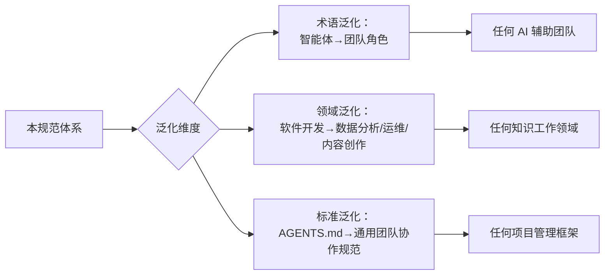

+++
id = "reuse-and-generalization"
category = "methodology"
source = "README.md#泛化与资产复用"
+++

# 泛化与资产复用

> **来源**：从 `README.md` "泛化与资产复用"章节拆分

本规范体系的设计目标不仅是"描述一个项目"，更是"可以迁移到任何项目"的**元规范框架**。本文件说明可复用资产清单、泛化路径与已有复用案例。

## 可复用资产清单

项目通过 [资产清单与复用指南](retrospective/assets/asset-inventory.md) 提供完整的复用路径：

| 复用等级 | 示例资产 | 适配工作量 |
|---|---|---|
| 直接复用 | 任务模板、交接模板、目录索引 README 模板 | 零 |
| 配置后复用 | check-gitignore.py（修改路径列表）、依赖管理协议 | 低（5-30 分钟） |
| 实例化后复用 | 三段式检查工具架构、Spec-driven 开发流程、复盘报告模板 | 中（1 小时） |
| 按场景适配 | 目录命名矩阵、依赖管理矩阵、语义匹配阈值矩阵 | 中（按需定制） |

## 泛化路径

### 三维泛化说明

1. **术语泛化**：将"智能体""角色"等 AI 原生术语映射为通用团队协作语言（如"成员""职责"），使规范体系适用于人类团队与 AI 混合团队
2. **领域泛化**：将软件开发领域的实践抽象为通用知识工作模式，适配数据分析、运维、内容创作等场景
3. **标准泛化**：将 AGENTS.md 入口契约抽象为通用的团队协作规范标准，可对接任意项目管理框架

## 已有复用案例

`vendor/flexloop/` 目录下的 AgentForge 项目是本规范体系在实际项目中的**落地案例**，验证了角色体系、协作协议、自我演进模块等核心机制的可迁移性。

详细的复用对照与技术分析参见 [.agents/cases/agentforge-adoption.md](../.agents/cases/agentforge-adoption.md)。

## 可复用模式库

本项目在实践中持续萃取可复用的开发模式，形成三层模式库，涵盖从代码级到方法论级的完整复用体系：

| 层级 | 数量 | 目录 | 说明 |
|---|---|---|---|
| 方法论模式 | 34 个 | [retrospective/patterns/methodology-patterns/](retrospective/patterns/methodology-patterns/) | 开发→复盘→优化→治理→自动化→度量完整闭环 |
| 架构模式 | 6 个 | [retrospective/patterns/architecture-patterns/](retrospective/patterns/architecture-patterns/) | 可复用的系统组织与验证架构 |
| 代码模式 | 6 个 | [retrospective/patterns/code-patterns/](retrospective/patterns/code-patterns/) | 可复用的代码实现范式 |

模式按照成熟度分为三个等级：
- **L1 实验性**：在单次实践中验证，尚未经过多场景检验
- **L2 已验证**：在 2+ 次实践中反复验证，模式结构稳定
- **L3 可复用**：经过多项目验证，具备明确的适用条件、实施步骤与反模式说明

详见 [方法论模式索引](retrospective/patterns/methodology-patterns/README.md)。

## 提示词萃取系统

独立的 Python 子项目，实现从对话记录中自动萃取可复用提示词模式的完整流水线，可迁移至其他项目构建自身的提示词资产库。

- 系统入口：[prompt_extraction/](../prompt_extraction/)
- 系统架构：[.agents/systems/prompt-extraction.md](../.agents/systems/prompt-extraction.md)

## 与其他文档的关联

- 资产详细清单见 [retrospective/assets/asset-inventory.md](retrospective/assets/asset-inventory.md)
- 项目亮点与核心优势见 [project-highlights.md](project-highlights.md)
- 方法论模式库见 [retrospective/patterns/](retrospective/patterns/)
- 落地案例见 [.agents/cases/agentforge-adoption.md](../.agents/cases/agentforge-adoption.md)
