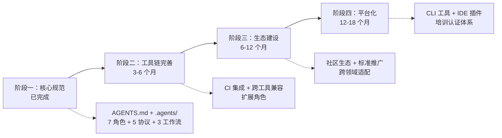

+++
id = "roadmap"
category = "planning"
source = "README.md#项目蓝图"
+++

# 项目蓝图与路线图

> **来源**：从 `README.md` "项目蓝图"章节拆分

本文件定义 SpecWeave 规范体系的短期目标、中长期战略方向、技术路线演进与功能迭代计划。

## 短期发展目标（3-6 个月）

| 目标 | 交付标志 |
|---|---|
| 完善角色体系 | 新增 devops、security 等扩展角色，覆盖更多开发场景（角色定义文件 + 提示词 + 工作流） |
| 扩展工具链 | 增加 CI 集成脚本、自动化测试脚本、性能监控脚本（scripts/ 目录新增 3+ 脚本） |
| 增强跨工具兼容性 | 测试 10+ AI 编码工具的兼容性，输出兼容性矩阵（兼容性测试报告） |
| 社区贡献流程优化 | 完善 issue/PR 模板、贡献指南、行为准则（.github/ 目录与 CONTRIBUTING.md 完善） |

## 中长期战略方向（6-18 个月）

1. **建立社区生态**：形成 AGENTS.md 标准的中文社区，定期举办分享活动，建立最佳实践案例库
2. **推动行业标准形成**：与 AGENTS.md 开放标准社区协作，推动中文场景的最佳实践反哺标准演进
3. **跨领域适配**：从软件开发扩展到数据分析、内容创作、运维等领域，形成领域专属角色与工作流
4. **工具链生态建设**：开发配套 CLI 工具、IDE 插件，降低规范体系的采用门槛

## 技术路线演进

## 功能迭代计划

| 优先级 | 功能 | 阶段 | 说明 |
|---|---|---|---|
| P0 | CI 集成 | 短期 | GitHub Actions / GitLab CI 配置模板 |
| P1 | 扩展角色 | 短期 | devops、security 等角色定义 |
| P1 | 工具链扩展 | 短期 | 自动化测试、性能监控脚本 |
| P2 | IDE 插件 | 中期 | VS Code / JetBrains 插件 |
| P2 | CLI 工具 | 中期 | 规范初始化、验证、生成 CLI |
| P3 | 培训课程 | 长期 | 智能体开发培训体系 |
| P3 | 认证体系 | 长期 | AGENTS.md 实践认证 |

## 市场拓展策略

- **目标用户**：AI 开发团队、开源项目维护者、企业 AI 转型团队、AI 工具厂商
- **推广渠道**：AtomGit/GitHub 开源社区、技术博客与公众号、开发者社区（掘金/思否）、技术会议分享
- **合作模式**：与 AI 工具厂商合作验证兼容性、社区贡献驱动迭代、企业试点与案例沉淀

## 与其他文档的关联

- 当前项目进度见 [../README.md#spec-执行进度](../README.md) Spec 执行看板
- 贡献流程见 [../CONTRIBUTING.md](../CONTRIBUTING.md)
- 自我演进模块体系见 [../.agents/modules/README.md](../.agents/modules/README.md)
