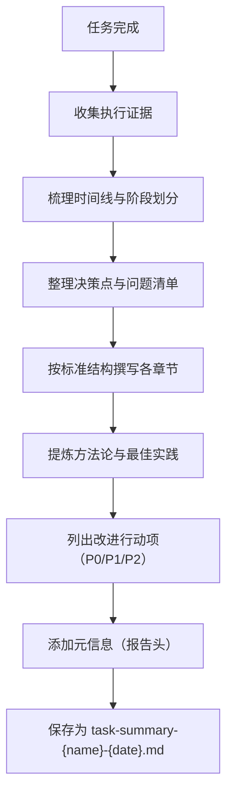

# 任务总结报告库

> **本目录**存放 SpecWeave 项目的任务执行总结报告（Task Execution Summary），记录重要任务从启动到完成的完整过程、关键决策、问题解决、经验提炼与改进建议。

## 🎯 任务总结概述

> **什么是 Task Summary？**
>
> Task Summary 是对单次任务执行过程的结构化复盘文档，在任务完成后立即生成，遵循"事实→分析→洞察→建议"的标准逻辑结构。不同于事后复盘报告（Retrospective），Task Summary 更侧重**执行过程的即时记录**与**可操作经验**的快速沉淀。

### 核心价值

| 价值维度 | 说明 |
|---------|------|
| 📝 **过程留痕** | 完整记录任务执行的时间线、决策点、问题与解决方案，避免经验流失 |
| 🔍 **问题溯源** | 当类似问题再次出现时，可快速检索历史处理方案与决策依据 |
| 📊 **效能度量** | 通过关键数据速览（达成率、耗时、问题数等）量化任务执行质量 |
| 💡 **经验复用** | 提炼可复用的方法论、最佳实践与检查清单，指导后续同类任务 |
| 🚀 **持续改进** | 明确改进行动项（P0/P1/P2），形成闭环改进机制 |

### Task Summary vs Retrospective

| 维度 | Task Summary（本目录） | Retrospective（复盘报告） |
|------|------------------------|---------------------------|
| **触发时机** | 任务完成后立即生成 | 阶段性/里程碑后系统性回顾 |
| **时间跨度** | 单次任务（小时级~天级） | 一个阶段/项目（周级~月级） |
| **侧重内容** | 执行过程、问题解决、即时经验 | 模式萃取、方法论沉淀、体系化改进 |
| **文档规模** | 中等（单文件） | 较大（可能拆分多文件） |
| **产出物** | 改进建议（Action Items） | 可复用模式（Patterns） |

---

## 📚 任务总结索引

| 日期 | 任务名称 | 文件 | 核心要点 | 标签 |
|------|---------|------|---------|------|
| **2026-07-06** | SpecWeave工作区批量变更原子化提交 | [task-summary-atomic-commit-20260706.md](task-summary-atomic-commit-20260706.md) | 5类不相关变更（37文件）拆分为5个原子提交；三查暂存法严格执行；主动发现第5类变更（模式萃取产物）；提炼原子提交批量治理SOP | `git` `atomic-commit` `SOP` `best-practice` |
| **2026-07-01** | Windows本地路径Git克隆异常排查 | [task-summary-git-local-clone-bug-20260701.md](task-summary-git-local-clone-bug-20260701.md) | 识别`BUG: refs/files-backend.c:3174`为Git内部引用事务异常；给出仓库完整性检查+`--no-local`重试方案；提炼Git工具链异常三步法 | `git` `bug-troubleshooting` `windows` `SOP` |
| **2026-06-23** | README.md文档创建与Git原子提交 | [task-summary-readme-creation-20260623.md](task-summary-readme-creation-20260623.md) | 402行专业README适配"规范体系"而非传统应用；13次原子提交（35+文件）；PowerShell heredoc兼容性问题处理；项目本质识别法+原子提交分组策略 | `documentation` `git` `atomic-commit` `mermaid` `cross-platform` |

---

## 📋 如何撰写 Task Summary

### 标准文档结构

所有 Task Summary 遵循以下十章标准结构：

| 章节 | 核心内容 | 必要性 |
|------|---------|--------|
| **第一章：执行概览** | 任务基本信息、核心成果一句话、关键数据速览、最高亮点、最大挑战、一句话总结 | ✅ 必需 |
| **第二章：任务背景与目标** | 任务背景、初始目标、目标调整记录、最终成果、约束条件 | ✅ 必需 |
| **第三章：执行过程详解** | 阶段划分与时间线（Mermaid流程图）、各阶段详细记录、关键事件标记 | ✅ 必需 |
| **第四章：关键决策分析** | 决策清单、决策详情（备选方案对比、选择依据、事后评估） | ✅ 必需 |
| **第五章：问题与解决方案** | 问题总览表、详细解决过程、问题模式分析、经验教训 | ✅ 必需 |
| **第六章：资源使用情况** | 工具依赖/技术栈、信息资源、效率评估 | ✅ 必需 |
| **第七章：多维度分析** | 目标达成度、时间效能、资源利用、问题模式、协作效果、综合评价（雷达图） | ✅ 必需 |
| **第八章：经验总结与方法论** | 核心方法论提炼、最佳实践清单（Keep/Improve/Stop）、知识图谱更新 | ✅ 必需 |
| **第九章：改进建议与行动计划** | 改进建议清单（P0/P1/P2）、后续行动计划、风险预警、工具推荐 | ✅ 必需 |
| **附录** | 文件清单、Git提交记录、术语表、其他补充材料 | ⚪ 可选 |

### 撰写流程



### 文件命名规范

```
task-summary-{任务英文简名}-{YYYYMMDD}.md
```

**示例**：
- `task-summary-atomic-commit-20260706.md`
- `task-summary-git-local-clone-bug-20260701.md`
- `task-summary-readme-creation-20260623.md`

### 报告元信息头

每个 Task Summary 开头使用引用块标注元信息：

```markdown
> **报告元信息**
>
> - **任务名称**：{任务全名}
> - **报告生成日期**：{YYYY-MM-DD}
> - **任务执行周期**：{YYYY-MM-DD}
> - **总耗时**：{短时/中等时长/长时}
> - **报告版本**：V1.0
> - **报告生成器**：Task Execution Summary Generator
```

### 撰写要点

#### ✅ 应该做的

1. **用数据说话**：关键数据速览表要包含可量化指标（达成率、文件数、问题数等）
2. **决策要记录备选方案**：关键决策必须说明"为什么选A而不选B"，并做事后评估
3. **问题要分类分级**：用严重度（🟢P2/🟡P1/🔴P0）标记问题，区分"已解决"和"待处理"
4. **方法论要可复用**：提炼的SOP/检查清单应该是下次可直接套用的，而不是空泛原则
5. **改进项要可落地**：P0/P1/P2行动项要有具体负责区域、预期完成时间、验收标准
6. **如实记录不足**：不仅写"做得好的"，也要写"需要改进的"和"应该避免的"

#### ❌ 避免做的

1. **不要流水账**：不是按时间顺序罗列操作，要结构化分析
2. **不要事后诸葛亮**：决策评估要基于当时的信息，不要用结果反推"当初应该怎样"
3. **不要空泛总结**："学到了很多"这类表述没有价值，要具体说明学到了什么
4. **不要遗漏约束条件**：任务执行时的限制（时间、环境、信息不完整）要如实记录
5. **不要只报喜不报忧**：未解决的问题、未完全闭环的目标要明确标注

---

## 📊 关键指标说明

阅读或撰写 Task Summary 时，关注以下关键指标：

| 指标 | 说明 | 健康值参考 |
|------|------|-----------|
| **目标达成率** | 初始目标完成的百分比 | ≥90% 为良好，100% 为优秀 |
| **问题解决率** | 遇到问题中已解决的比例 | 关键问题100%解决，次要问题可遗留 |
| **决策正确率** | 事后评估为"正确"的决策比例 | ≥80% 为良好 |
| **用户确认次数** | 关键决策点通过 AskUserQuestion 确认的次数 | 复杂任务≥2次 |
| **预检查通过率** | 链接/编码/规范等预提交检查通过率 | 100% |
| **改进行动项数** | 提炼的P0/P1/P2行动项数量 | P0:1-2个，P1:2-3个，P2:2-3个为佳 |

---

## 🔗 相关资源

- [📁 复盘报告目录](../retrospective/reports/) - 阶段性/里程碑式系统性复盘报告
- [📁 可复用模式库](../retrospective/patterns/) - 从多次任务中萃取的可复用模式
- [📁 超能计划目录](../superpowers/) - 任务执行前的设计文档与执行计划
- [🔧 atomic-commit-cmd Skill](../../.agents/skills/atomic-commit-cmd/SKILL.md) - 原子提交Skill（多个总结涉及）
- [🏠 文档首页](../README.md) - 返回文档总入口
