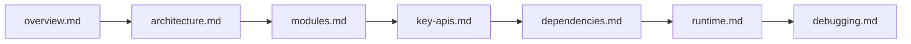

# SpecWeave Code Wiki

## 文档定位

这套 Code Wiki 面向希望理解、维护或扩展 `SpecWeave` 的开发者与智能体，重点回答 6 个问题：

1. 这个仓库到底是什么。
2. 代码与规范分别放在哪里。
3. 核心脚本与共享库如何协同。
4. 子项目与 vendor 依赖如何接入主仓库。
5. 常用运行、测试与构建入口是什么。
6. 当前工作树和规范声明之间有哪些已知差异。

本仓库的核心不是单一业务应用，而是一个以 [AGENTS.md](../../../AGENTS.md#L1-L34) 为统一入口的多智能体工作区规范仓库，叠加若干 `apps/`、`projects/`、`vendor/` 子区域以及文档站、自动化脚本和 Spec 资产。

## 文档清单

| 文档 | 说明 |
|---|---|
| [overview.md](overview.md) | 仓库定位、顶层结构、设计目标与当前工作树快照 |
| [architecture.md](architecture.md) | 路由架构、规范层与执行层、关键数据流与区域边界 |
| [modules.md](modules.md) | 顶层目录、核心子系统、脚本包与子区域职责矩阵 |
| [key-apis.md](key-apis.md) | 核心类、函数、CLI 入口与它们之间的调用关系 |
| [dependencies.md](dependencies.md) | 语言栈、共享库依赖、子项目依赖与 submodule 关系 |
| [runtime.md](runtime.md) | 仓库级、文档级、应用级、子项目级的运行与验证命令 |
| [debugging.md](debugging.md) | 常见故障、工作树漂移、日志排查与调试入口 |

## 推荐阅读顺序

## 关键结论

- 仓库的真实主入口是 [AGENTS.md](../../../AGENTS.md#L3-L32)，它定义启动协议、内容敏感度分流和四大顶层区域。
- 核心实现重心在 [`.agents/`](../../../.agents/README.md) 与 [`.agents/scripts/`](../../../.agents/scripts/README.md#L8-L23)，其中前者保存面向 AI 智能体的规则与协议，后者保存自动化脚本与共享库。
- `apps/`、`projects/`、`vendor/` 三个区域不是同一类资产：`apps/` 可直接修改，`projects/` 和 `vendor/` 以 git submodule 为主，边界由 [根 AGENTS.md](../../../AGENTS.md#L38-L47) 与 [`.gitmodules`](../../../.gitmodules#L1-L35) 共同定义。
- `docs/` 是 OKF v0.2 唯一文档中心，承载知识库、复盘、标准、模式与本 Code Wiki，并通过 Sphinx 构建对外站点；[`docs/tasks/docs.py`](../../../docs/tasks/docs.py#L72-L130) 提供 build、html、clean、linkcheck、doctest 等 invoke 任务。
- 当前 `code-wiki` 目录之前的内容已经过时，曾指向当前工作树中不存在的 `prompt_extraction` 项目；本次重写以当前 checkout 为准，同时保留“规范声明”和“工作树实况”的区分。

## 主要入口

| 入口 | 用途 |
|---|---|
| [AGENTS.md](../../../AGENTS.md#L3-L32) | 启动协议、四大区域、核心规范入口 |
| [README.md](../../../README.md#L70-L143) | 面向人类读者的项目定位与使用说明 |
| [context-routing.md](../../../.agents/context-routing.md#L21-L100) | 任务类型到规范入口的路由表 |
| [global-core-rules.md](../../../.agents/global-core-rules.md#L13-L28) | 文档边界、沟通语言、内容级别、三阶段原则 |
| [apps/AGENTS.md](../../../apps/AGENTS.md#L37-L61) | 内置应用区路由与应用分组 |
| [projects/AGENTS.md](../../../projects/AGENTS.md#L27-L33) | 第一方子项目路由 |
| [vendor/AGENTS.md](../../../vendor/AGENTS.md#L27-L39) | 第三方与协作型依赖路由 |
| [.agents/scripts/README.md](../../../.agents/scripts/README.md#L8-L23) | 自动化脚本、共享库与脚本速查表 |

## 维护约定

- 当顶层结构、脚本入口、子模块清单或运行命令发生变化时，应同步更新本目录文档。
- 文档中的“当前工作树”结论以当前 checkout 为准；若规范文件中的声明与工作树不一致，应在 [debugging.md](debugging.md) 中记录差异而不是默默覆盖。
- 对源码入口的引用优先使用带行号的相对链接，便于后续审查与增量维护。
