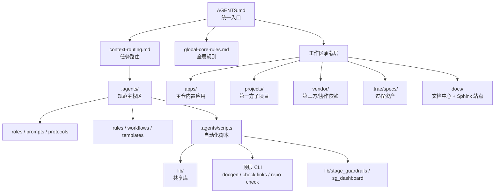
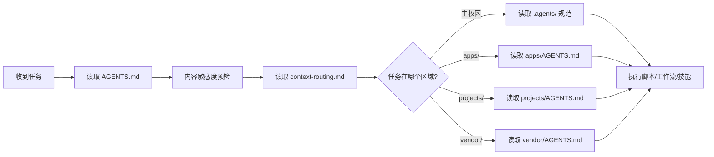
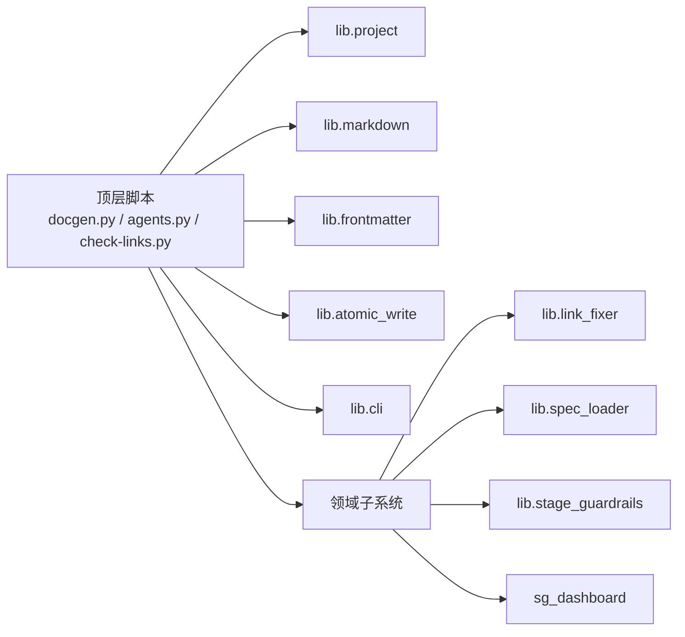
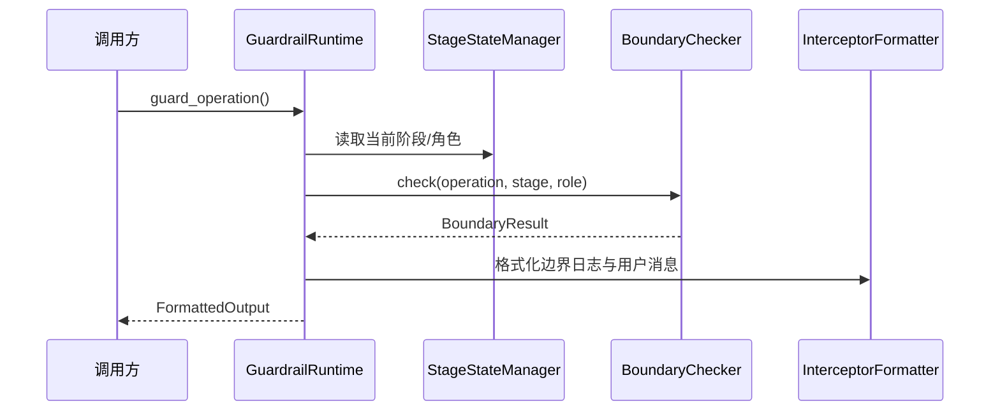

# 整体架构

## 架构摘要

`SpecWeave` 可以拆成 4 层：

1. 入口与路由层：`AGENTS.md`、`context-routing.md`
2. 规范与知识层：`.agents/roles`、`rules`、`protocols`、`workflows`、`docs`
3. 执行与自动化层：`.agents/scripts/` 与 `lib/` 共享库
4. 承载与扩展层：`apps/`、`projects/`、`vendor/`、`docs/`、`.trae/specs/`

## 仓库级架构图

## 启动与路由流程

仓库要求智能体先读 [AGENTS.md](../../../AGENTS.md#L3-L32)，完成内容敏感度预检和区域路由，再决定读取哪些规范。这个启动协议是整个架构的“总开关”。

这个机制对应的核心依据是：

- [AGENTS.md](../../../AGENTS.md#L3-L32)
- [context-routing.md](../../../.agents/context-routing.md#L21-L100)
- [global-core-rules.md](../../../.agents/global-core-rules.md#L13-L28)

## 规范层与执行层分工

### 规范层

规范层负责描述“应该怎么做”，主要位于 `.agents/`：

- `roles/` 定义角色职责与边界
- `rules/` 定义治理规则
- `protocols/` 定义协作协议
- `workflows/` 定义标准流程
- `templates/` 定义模板
- `docs/` 沉淀知识、模式与报告

### 执行层

执行层负责把规范落地为可运行工具，主要位于 `.agents/scripts/`：

- 顶层 CLI 负责命令编排
- `lib/` 提供共享能力
- `lib/stage_guardrails/` 和 `sg_dashboard/` 提供更完整的子系统

最典型的聚合工具是 [docgen.py](../../../.agents/scripts/docgen.py#L1-L17)，它将导航、看板、应用清单和统计更新组合为统一命令面。

## 脚本子系统架构

### 顶层 CLI + 共享库

大多数脚本遵循相同模式：

1. 顶层脚本负责解析参数与编排流程
2. 路径解析、frontmatter、Markdown、原子写入等基础能力由 `lib/` 统一提供
3. 特定领域能力再拆成 package 或子系统

对应的关键入口：

- [agents.py 中的 `generate_project()`](../../../.agents/scripts/agents.py#L171-L242)
- [docgen.py 中的 `cmd_nav()`](../../../.agents/scripts/docgen.py#L124-L158)
- [build-ref-index.py 中的 `build_index()`](../../../.agents/scripts/build-ref-index.py#L171-L210)
- [project.py 中的 `resolve_project_root()`](../../../.agents/scripts/lib/project.py#L18-L53)
- [frontmatter.py 中的 `parse_frontmatter_unified()`](../../../.agents/scripts/lib/frontmatter.py#L508-L536)

## 阶段守卫架构

阶段守卫是这个仓库里最完整的治理型运行时子系统之一，由 3 个核心组件组成：

- 状态机：[`StageStateManager`](../../../.agents/scripts/lib/stage_guardrails/state/manager.py#L21-L115)
- 边界校验：[`BoundaryChecker`](../../../.agents/scripts/lib/stage_guardrails/boundary.py#L450-L549)
- 运行时门面：[`GuardrailRuntime`](../../../.agents/scripts/lib/stage_guardrails/runtime.py#L83-L207)

这个子系统的特点是把“阶段状态”“权限矩阵”“拦截输出”解耦，再通过 `GuardrailRuntime` 聚合为统一运行时。

## 文档中心架构

根 `docs/` 目录是 OKF v0.2 唯一文档中心，既承载知识库、复盘、标准与模式等长期知识资产，也通过 Sphinx 构建对外静态站点。构建入口集中在 [docs/tasks/docs.py](../../../docs/tasks/docs.py#L72-L130)，通过 `invoke` 封装 `sphinx-build -M`：

- `invoke html`
- `invoke clean`
- `invoke linkcheck`
- `invoke doctest`

文档职责的分工是：

- `docs/`：知识库、复盘、标准、模式等全部对外可读文档，同时是站点构建的内容源
- `.agents/`：面向 AI 智能体的规范与执行资产（角色、规则、协议、脚本、技能、模板）

## 区域边界架构

### `apps/`

`apps/` 是主仓库的一部分，按 [apps/AGENTS.md](../../../apps/AGENTS.md#L21-L35) 可直接修改。

### `projects/`

`projects/` 是第一方 git submodule 区，由 [projects/AGENTS.md](../../../projects/AGENTS.md#L14-L25) 管理，当前实际登记见 [`.gitmodules`](../../../.gitmodules#L8-L35)。

### `vendor/`

`vendor/` 是第三方与协作依赖区，由 [vendor/AGENTS.md](../../../vendor/AGENTS.md#L15-L25) 管理，当前同样以 [`.gitmodules`](../../../.gitmodules#L1-L35) 为真实来源。

## 当前架构观察

- 架构的“权威入口”是根 `AGENTS.md`，不是任何单个应用或库。
- `.agents/scripts/lib` 是脚本生态的真正复用中心，顶层脚本多为它的门面。
- 规范文件提供的是理想或完整路由视图，而工作树反映的是当前 checkout；写工具或文档时要同时参考两者。
