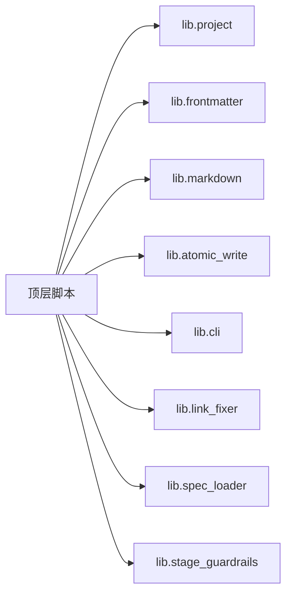

# 依赖关系

## 依赖视角

这个仓库的依赖不能只看一个 `requirements.txt`。它同时包含：

- 主仓库脚本依赖与标准库优先设计
- Sphinx 文档站依赖
- `apps/` 中独立应用的 Python/Node 依赖
- `projects/` 中子项目的独立依赖
- `vendor/` 中外部或协作型子模块的独立依赖
- git submodule 级别的仓库依赖

## 语言与工具链

| 类型 | 主要用途 | 代表依据 |
|---|---|---|
| Python | 主仓脚本、文档构建、子项目实现 | [README.md](../../../README.md#L16-L19) |
| PowerShell / Shell | CI、本地治理、平台脚本 | [global-core-rules.md](../../../.agents/global-core-rules.md#L24-L24) |
| Node.js / TypeScript | 少量 AI 应用与第三方工具 | [eve-minimal-agent/package.json](../../../apps/ai-agents/eve-minimal-agent/package.json#L10-L28) |
| C++ / CMake | 示例项目与部分子项目原生扩展 | 当前工作树中的 `apps/samples/`、`projects/xuanspace/` |
| Git submodule | 项目间依赖管理 | [`.gitmodules`](../../../.gitmodules#L1-L35) |

## 主仓脚本依赖关系

### 设计特点

主仓 `.agents/scripts/` 倾向于把依赖压在标准库和本地共享库上，而不是引入重量级第三方包。脚本之间最重要的依赖关系是“脚本 -> `lib/` 共享库”。

### 共享库依赖图

### 核心共享依赖

| 模块 | 被依赖原因 |
|---|---|
| `lib.project` | 统一项目根目录与路径解析 |
| `lib.frontmatter` | 统一文档元数据读取 |
| `lib.markdown` | 提取标题、摘要、链接与 marker 区块 |
| `lib.atomic_write` | 安全写文件 |
| `lib.link_fixer` | 修链与目录迁移 |
| `lib.spec_loader` | 规范渐进式加载 |
| `lib.stage_guardrails` | 阶段状态机与运行时拦截 |

## 文档站依赖

根 `docs/requirements.txt` 定义了公开站点构建依赖：

| 依赖 | 作用 |
|---|---|
| `Sphinx` | 文档构建核心 |
| `myst-parser` | Markdown 支持 |
| `sphinx-book-theme` | 站点主题 |
| `sphinx-copybutton` | 代码块复制按钮 |
| `sphinx-design` | 设计类组件 |
| `sphinxcontrib-mermaid` | Mermaid 渲染 |
| `invoke` | 通过 `docs/tasks/` 任务包封装构建命令 |

来源见 [docs/requirements.txt](../../../docs/requirements.txt#L1-L7)。

## `apps/` 区域依赖

### `ai-code-assistant`

[`apps/ai-agents/ai-code-assistant/pyproject.toml`](../../../apps/ai-agents/ai-code-assistant/pyproject.toml#L1-L14) 显示其是一个轻量 Flask 应用：

| 依赖 | 用途 |
|---|---|
| `flask` | Web 应用 |
| `openai` | 模型接口 |
| `python-dotenv` | 环境变量管理 |
| `langchain` | LLM 编排 |
| `markdown` | Markdown 处理 |

### `eve-minimal-agent`

[`apps/ai-agents/eve-minimal-agent/package.json`](../../../apps/ai-agents/eve-minimal-agent/package.json#L10-L28) 显示其 Node 侧依赖：

| 依赖 | 用途 |
|---|---|
| `eve` | Agent 运行时与脚手架 |
| `ai` | AI SDK |
| `@vercel/connect` | Vercel 相关连接能力 |
| `zod` | 类型验证 |
| `typescript` | 类型检查与编译 |

### `onnx_adaround`

[`apps/tests/onnx_adaround/pyproject.toml`](../../../apps/tests/onnx_adaround/pyproject.toml#L5-L66) 是当前工作树中较完整的 Python 包：

| 依赖 | 用途 |
|---|---|
| `onnx` | ONNX 模型读写 |
| `onnxruntime` | 推理执行 |
| `onnxscript` | 图操作与脚本支持 |
| `numpy` | 数值计算 |
| `Pillow` | 图像处理 |

开发依赖中额外引入：

- `pytest`
- `pytest-cov`
- `ruff`
- `torch`（仅 dev/test 参考，不是运行时依赖）

## `projects/` 区域依赖

### `xuanspace`

根项目 [`projects/xuanspace/pyproject.toml`](../../../projects/xuanspace/pyproject.toml#L5-L119) 的特征是：

- Python 版本要求高：`>=3.14.6`
- 通过 optional-dependencies 和 dependency-groups 管理 `docs/test/lint/build/dev`
- 文档栈与主仓相似，同样基于 Sphinx + MyST + Mermaid

### `xs-cli`

[`projects/xuanspace/tools/xs/pyproject.toml`](../../../projects/xuanspace/tools/xs/pyproject.toml#L5-L47) 显示 CLI 依赖非常克制：

| 依赖 | 用途 |
|---|---|
| `typer` | CLI 框架 |
| `rich` | 终端输出 |
| `packaging` | 版本与依赖处理 |
| `tomli-w` | TOML 写入 |

## `vendor/` 区域依赖

### `flexloop/apps/chaos`

[`vendor/flexloop/apps/chaos/pyproject.toml`](../../../vendor/flexloop/apps/chaos/pyproject.toml#L5-L120) 显示其本身是独立 Python 项目：

- 包名：`taolib`
- Python 要求：`>=3.13`
- 运行时依赖较轻，仅 `packaging`
- 可选依赖按场景分组：
  - `github-app`
  - `harness`
  - `flowkit`
  - `docs`
  - `test`
  - `dev`

这意味着主仓引用 `flexloop` 时，更像是在引用一个“外部方法论和工具生态”，而不是直接共享同一套 Python 依赖环境。

## Git Submodule 依赖

从 [`.gitmodules`](../../../.gitmodules#L1-L35) 可以看出，主仓对外部仓库的结构性依赖包括：

| 路径 | 来源类型 |
|---|---|
| `vendor/flexloop` | 协作型依赖 |
| `vendor/ark-cli` | 第三方依赖 |
| `vendor/knowledge-catalog` | 第三方依赖 |
| `vendor/awesome-okf` | 第三方依赖 |
| `vendor/awesome-okf-bundle` | 第三方依赖 |
| `vendor/awesome-okf-kit` | 第三方依赖 |
| `vendor/okf-bundle-template` | 第三方依赖 |
| `projects/xuanspace` | 第一方子项目 |
| `projects/awesome-okf-xs` | 第一方子项目 |

## 依赖分层结论

### 主仓层

主仓规则与脚本更强调“本地共享库复用”和“标准库优先”，这让治理脚本在不同环境下更容易运行。

### 应用层

`apps/` 中每个应用自带自己的依赖声明，不应该把它们混成一个统一环境。

### 子项目层

`projects/` 与 `vendor/` 中的依赖是各自项目自治的，主仓只负责路由、索引与边界约束。

### 文档层

文档依赖统一围绕根 `docs/` 文档中心：Sphinx、MyST、Mermaid 等站点构建依赖见 [docs/requirements.txt](../../../docs/requirements.txt#L1-L7)；`.agents/` 规范资产主要是 Markdown 文档与 Python 治理脚本，不依赖 Sphinx。
