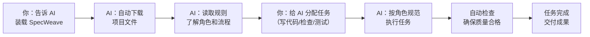

# 快速开始

使用 SpecWeave 不需要安装任何软件。你只需要把它放到项目文件夹里，AI 工具就会自动读取规则。

## 方式一：一句话装载（最推荐，最简单）

把下面这段话复制发给你的 AI 工具（ChatGPT、Claude、Trae 等都支持），AI 会自动帮你完成所有设置：

> 请帮我装载 SpecWeave Agent Workspace Hub 系统。请严格按照以下步骤执行：
>
> 【安全规则】只从官方仓库获取；写入前确认路径；不在系统目录创建文件夹；自举只读不执行脚本；验证 AGENTS.md 完整性；错误明确报告；不扫描整个文件系统；已在 SpecWeave 内则直接就绪
>
> 【步骤】环境检测 → 路径确认 → git clone（或给出 zip 下载链接）→ 验证 AGENTS.md → 自举加载 → 报告就绪

*在 Trae 环境中，直接说"装载 SpecWeave"即可。*

### 预期看到什么

AI 会依次执行 6 个步骤，最后报告：
- 项目已装载到哪个文件夹
- 有哪些 AI 角色可用（协调员、开发者、审查员等）
- 有哪些技能可用（代码审查、自动提交、链接检查等）
- 告诉你下一步可以做什么

## 方式二：手动下载

> 以下步骤涉及 **Git**（一种代码版本管理工具）和 **GitHub**（代码托管网站）。如果你不熟悉这些，推荐使用方式一，让 AI 帮你完成。

1. **安装 Git**（如果还没装）
   - 访问 [git-scm.com](https://git-scm.com) 下载安装包
   - 按默认选项安装即可

2. **下载项目**
   - 打开命令行（Windows 按 `Win+R`，输入 `cmd` 回车）
   - 输入以下命令并回车：
   ```bash
   git clone https://github.com/SpecWeave/SpecWeave.git
   ```

3. **预期看到什么**
   - 命令行会显示下载进度
   - 下载完成后，当前文件夹下会出现一个 `SpecWeave` 文件夹
   - 里面包含 `AGENTS.md` 文件和 `.agents` 文件夹

4. **开始使用**
   - 用 AI 编码工具（如 Trae、Cursor、Copilot）打开这个文件夹
   - AI 会自动读取规则并按要求工作

## 基本使用流程



---

:::{note}
本文档为初始骨架，更多详细使用指南将逐步完善。
:::
