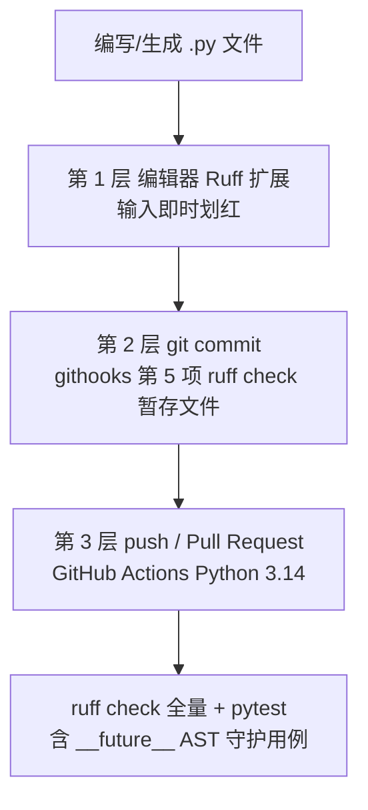

# Python Ruff 红线门禁团队接入指南

> 面向在 SpecWeave 内开发 Python 应用的团队成员：5 分钟完成本地接入，理解四层防线如何协同，并知道如何把同一套门禁复制到新的 Python 应用。

## 1. 这条红线是什么

禁止在 Python 源码中出现任何 `__future__` 导入，典型违例：

```python
from __future__ import annotations  # ❌ TID251 红线
```

本仓 Python 应用目标版本为 **Python 3.14+**（PEP 649 注解默认惰性求值，`X | None`、`list[X]` 均为原生语法），PEP 563 时代的这行样板纯属冗余，且语义与 3.14 默认行为有别，对 Typer/FastAPI 等读取运行时注解的框架没有收益。AI 代码生成存在反复加回该行的语料惯性，因此用工具链硬阻断，而非依赖人工记忆。

## 2. 四层防线



| 层级 | 触发时机 | 阻断方式 | 权威配置 |
|---|---|---|---|
| 编辑器红线 | 输入/保存时 | Ruff 扩展即时标红 | 应用 `pyproject.toml` 的 `[tool.ruff]` |
| 提交门禁 | `git commit` | 原生 githooks 阻断退出 | [pre_commit.py](../../../.agents/scripts/hooks/pre_commit.py) |
| 远端 CI | push / PR 到 main | GitHub Actions 失败 | [zhihu-checkin-hub-ci.yml](../../../.github/workflows/zhihu-checkin-hub-ci.yml) |
| 测试守护 | `pytest` | AST 扫描用例失败 | `tests/test_no_future_annotations.py` |

> 后三层互为冗余：本机没装 ruff 时提交门禁会降级提示，但 CI 与 pytest 守护仍然兜底。

## 3. 快速接入（一次性）

### 3.1 安装开发依赖（含 ruff）

在应用目录安装 dev extras（ruff >= 0.8）：

```bash
cd apps/dev-tools/zhihu-checkin-hub
pip install -e ".[dev]"
```

验证：

```bash
ruff --version          # 或 python -m ruff --version
ruff check .            # 期望 All checks passed!
```

### 3.2 启用仓库 Git 钩子

钩子随仓库版本管理，只需配置一次（已配置过可跳过）：

```bash
python .githooks/setup-hooks.py
python .githooks/setup-hooks.py --status   # 核对状态
```

之后 `git pull` 会自动带来钩子更新，无需重装。Windows 安装细节与 Git GUI 工具兼容见 [Windows 开发者快速上手指南](../../../.githooks/WINDOWS-SETUP.md)。

### 3.3 编辑器开启 Ruff（可选但推荐）

VS Code 安装 **Ruff** 扩展（charliemarsh.ruff）。配置按文件目录向上自动发现，即使工作区根在仓库根、应用位于子目录，也能读到应用的 `pyproject.toml`，无需额外设置。

## 4. 提交门禁行为说明

ruff 是 githooks 六项检查中的第 5 项（放置校验 → .temp 生命周期 → 敏感信息 → 模式质量 → **ruff** → 并发安全），行为设计：

- **发现式生效**：从每个暂存 `.py` 文件向上查找含 `[tool.ruff]` 的 `pyproject.toml`，按配置根分组执行；未启用 ruff 的应用完全不受影响
- **只查暂存文件**：扫描范围是本次 `git add` 的 `.py`，速度快且与提交内容严格对应
- **只读检查**：不自动改文件（不带 `--fix`），不会出现"钩子改了暂存区"的意外；需要自动修复时人工执行 `ruff check --fix <文件>`
- **ruff 缺失默认降级**：依次尝试 `RUFF_BIN` → 当前解释器 `python -m ruff` → PATH 上的 `ruff`，都找不到时仅警告；CI 可设 `RUFF_CHECK_REQUIRED=1` 改为硬阻断

环境变量逃生阀（仅限紧急情况）：

| 变量 | 作用 |
|---|---|
| `RUFF_CHECK_SKIP=1` | 完全跳过 ruff 检查 |
| `SKIP=ruff-check` | 同上（兼容 pre-commit 框架习惯） |
| `RUFF_BIN=/path/to/ruff` | 指定 ruff 可执行文件 |
| `RUFF_CHECK_REQUIRED=1` | 找不到 ruff 时阻断而非降级 |

PowerShell 示例：

```powershell
$env:RUFF_CHECK_SKIP=1; git commit -m "hotfix"; $env:RUFF_CHECK_SKIP=""
```

## 5. CI 行为与本地复现

[zhihu-checkin-hub-ci.yml](../../../.github/workflows/zhihu-checkin-hub-ci.yml) 在应用目录或 workflow 文件变更时触发（push/PR 到 main，亦可手动 workflow_dispatch），单 job 顺序执行：

1. Python 3.14 环境 `pip install -e ".[dev]"`
2. `ruff check .`——全量 TID251 红线
3. `python -m pytest -q`——含 `test_no_future_annotations.py` AST 守护（自动覆盖 `src/`、`tests/` 下全部文件，新增文件无需登记）

CI 挂了先在本地应用目录跑同样两条命令复现：

```bash
ruff check . && python -m pytest -q
```

## 6. 把这套门禁复制到新的 Python 应用

githooks 与 CI 机制是通用的，新应用只需四步：

1. **声明版本与依赖**：`pyproject.toml` 中 `requires-python = ">=3.14"`，dev 依赖加 `"ruff>=0.8"`
2. **加 ruff 段**（只开 TID251，不引入额外规则噪音）：

   ```toml
   [tool.ruff]
   target-version = "py314"

   [tool.ruff.lint]
   select = ["TID251"]

   [tool.ruff.lint.flake8-tidy-imports.banned-api]
   "__future__" = { msg = "Python 3.14 已默认 PEP 649 惰性注解，禁止 __future__ 导入" }
   ```

3. **复制 AST 守护测试**：以 `tests/test_no_future_annotations.py` 为模板（parametrize 自动枚举，零维护）
4. **复制 CI workflow**：拷贝 zhihu-checkin-hub-ci.yml，替换其中的应用路径与 job 名称

无需修改 githooks——发现式扫描会在第一次提交该应用的 `.py` 文件时自动生效。

## 7. FAQ

**Q：注释或文档字符串里提到这行会误报吗？**
不会。ruff TID251 按真实导入语句判定；pytest 守护基于 AST 的 `ImportFrom(module="__future__")` 节点，守护测试自身的 docstring 就包含违例全文，实测保持绿色。

**Q：CI 报 TID251，但我本机 ruff 没报错？**
通常是本机 ruff 版本过旧或读到了别的配置。执行 `python -m ruff --version` 确认 >= 0.8，并在应用目录（`pyproject.toml` 所在层）执行 `ruff check .`。

**Q：目标版本降到 3.13 以下怎么办？**
该红线只适用于 3.14+ 应用。降级时同步移除/放宽 `[tool.ruff.lint.flake8-tidy-imports.banned-api]` 与 AST 守护测试，不要保留与版本不匹配的规则。

**Q：如何彻底关闭本机钩子？**

```bash
python .githooks/setup-hooks.py --uninstall   # 恢复默认 .git/hooks
git commit --no-verify                         # 单次跳过全部检查（不推荐，CI 仍会拦截）
```

## 8. 相关文档

- [开发规范](development-standards.md)——代码风格、提交规范与 CI 门禁工具静默日志约定
- [验证与自动化](verification-automation.md)——pre-commit 检查体系全景
- [Windows 开发者快速上手指南](../../../.githooks/WINDOWS-SETUP.md)——钩子安装与 GUI 工具兼容
