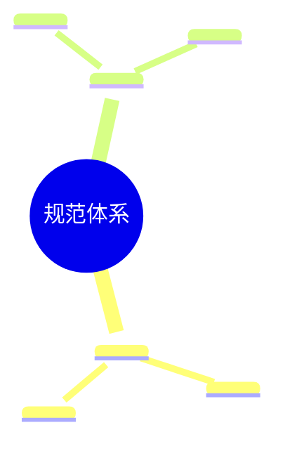
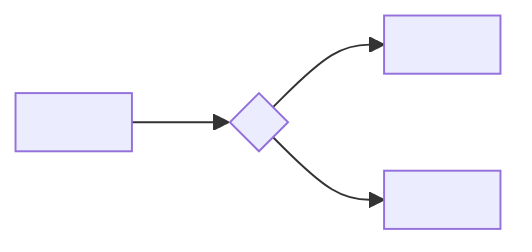

# 规范体系名称

[![License][license-badge]][license-link]
[![Standard][standard-badge]][standard-link]
[![Conventional Commits][commits-badge]][commits-link]
[![PRs Welcome][prs-badge]][prs-link]

[license-badge]: https://img.shields.io/badge/license-<!-- 许可证 -->-blue.svg
[license-link]: LICENSE
[standard-badge]: https://img.shields.io/badge/<!-- 标准名称 -->-Open%20Standard-orange.svg
[standard-link]: <!-- 标准官网链接 -->
[commits-badge]: https://img.shields.io/badge/Conventional%20Commits-1.0.0-yellow.svg
[commits-link]: https://conventionalcommits.org
[prs-badge]: https://img.shields.io/badge/PRs-welcome-brightgreen.svg
[prs-link]: #贡献指南

> <!-- 一句话简介：本规范体系做什么、面向谁、解决什么问题。 -->

## 项目概述

<!-- 规范体系的背景、设计理念、核心价值的高层描述（2-3 段）。说明本项目是规范体系而非可执行应用，核心载体是什么。 -->

### 设计理念



## 核心特性

- **特性 1**：<!-- 简要说明 -->
- **特性 2**：<!-- 简要说明 -->
- **特性 3**：<!-- 简要说明 -->

## 项目结构

```
.
├── <!-- 核心入口文件 -->    # <!-- 说明 -->
├── LICENSE                  # 许可证
├── README.md                # 项目说明文档（本文件）
├── .gitignore               # Git 忽略规则
├── <!-- 规范容器目录 -->/
│   ├── README.md            # 目录说明与使用指引
│   ├── <!-- 分类 1 -->/     # <!-- 说明 -->
│   ├── <!-- 分类 2 -->/     # <!-- 说明 -->
│   ├── <!-- 分类 3 -->/     # <!-- 说明 -->
│   ├── <!-- 分类 4 -->/     # <!-- 说明 -->
│   ├── <!-- 分类 5 -->/     # <!-- 说明 -->
│   ├── templates/           # 模板资产
│   └── scripts/             # 验证与自动化脚本
└── <!-- 其他目录 -->/
```

## 技术栈

| 类别 | 技术 / 标准 | 用途 |
|------|------------|------|
| 核心标准 | <!-- 标准名称 --> | <!-- 用途 --> |
| 元数据格式 | <!-- 如 TOML/YAML/JSON --> | <!-- 用途 --> |
| 可视化 | [Mermaid](https://mermaid.js.org/) | 流程图、架构图、关系图 |
| 提交规范 | [Conventional Commits](https://conventionalcommits.org) | 统一提交信息格式 |
| 版本控制 | [Git](https://git-scm.com/) | 源代码版本管理 |
| 验证脚本 | <!-- 语言与版本 --> | <!-- 用途 --> |
| 许可证 | <!-- 许可证名称 --> | 开源许可证 |

## 环境要求

使用本规范体系前，请确认本地已安装以下工具：

| 工具 | 最低版本 | 用途 | 必需 |
|------|----------|------|------|
| Git | <!-- 版本 --> | 版本控制 | 是 |
| <!-- 其他工具 --> | <!-- 版本 --> | <!-- 用途 --> | 否 |

> 本规范体系本身不包含可执行的业务代码，无需安装运行时依赖。

## 快速开始

### 1. 克隆仓库

```bash
git clone <!-- 仓库地址 -->
cd <!-- 项目目录 -->
```

### 2. 验证环境

```bash
# <!-- 验证命令 -->
```

### 3. 引入规范体系

<!-- 说明如何将本规范体系引入到目标项目中。 -->

## <!-- 核心内容分类 1 -->

<!-- 如角色定义、协议说明、工作流等。 -->

| 项目 | 说明 |
|------|------|
| <!-- 条目 1 --> | <!-- 说明 --> |
| <!-- 条目 2 --> | <!-- 说明 --> |

## <!-- 核心内容分类 2 -->

<!-- 同上格式 -->

## 验证与自动化

<!-- 说明规范体系自带的验证工具与自动化机制。 -->



| 机制 | 文件 | 作用 |
|------|------|------|
| <!-- 机制 1 --> | <!-- 文件 --> | <!-- 作用 --> |
| <!-- 机制 2 --> | <!-- 文件 --> | <!-- 作用 --> |

### 运行验证脚本

```bash
# <!-- 验证命令 -->
```

## 开发规范

### 代码风格

- <!-- 规范条目 -->

### 提交规范

遵循 [Conventional Commits](https://conventionalcommits.org) 规范，格式为 `type(scope): subject`：

| 类型 | 用途 |
|------|------|
| `feat` | 新功能 |
| `fix` | 缺陷修复 |
| `refactor` | 代码重构 |
| `test` | 测试相关 |
| `docs` | 文档变更 |
| `chore` | 构建、工具、依赖等杂项 |

### 文档边界

- `README.md` 面向**人类读者**，介绍项目用途、使用与贡献方式。
- `<!-- 规范文件 -->` 面向 **AI 智能体**，存放机器可读规范。
- 两者职责分离，不相互混用。

## 贡献指南

欢迎贡献！请遵循以下流程：

### 1. 准备工作

```bash
git clone <!-- 仓库地址 -->
cd <!-- 项目目录 -->
```

### 2. 创建分支

```bash
git checkout -b feat/your-feature
```

### 3. 提交变更

- 遵循 [Conventional Commits](https://conventionalcommits.org) 规范。
- 每个提交应是逻辑完整的原子单元。

### 4. 提交前检查

- [ ] <!-- 检查项 1 -->
- [ ] <!-- 检查项 2 -->
- [ ] <!-- 检查项 3 -->

### 5. 发起 Pull Request

- PR 标题遵循 Conventional Commits 格式。
- PR 描述说明：变更内容、变更原因、影响范围。

## 相关链接

- [<!-- 相关标准 1 -->](<!-- 链接 -->) — <!-- 说明 -->
- [<!-- 相关标准 2 -->](<!-- 链接 -->) — <!-- 说明 -->
- [<!-- 相关工具 1 -->](<!-- 链接 -->) — <!-- 说明 -->

## 许可证

本项目基于 [<!-- 许可证名称 -->](../../external/anthropics/claude-code/LICENSE.md) 开源。

## 联系方式

- **问题反馈**：<!-- Issues 链接 -->
- **讨论交流**：<!-- PR 链接 -->