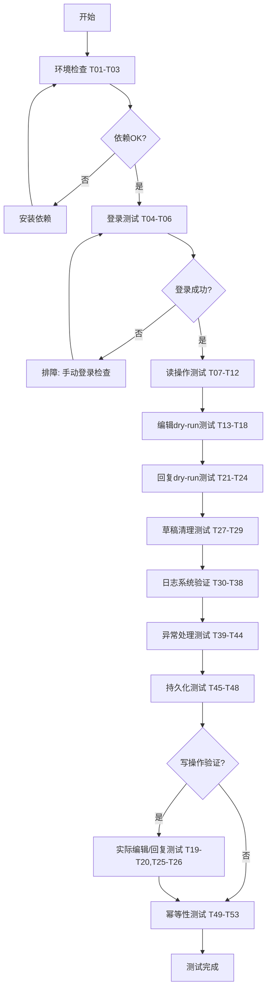

---
id = "forum-bot-playwright-test-plan"
date = "2026-06-29"
type = "test-plan"
target = "forum-bot.py (Playwright本地脚本 - 三级决策模型Level 2)"
maturity = "L1"
---

# forum-bot.py 本地 Playwright 脚本测试运行计划

> **适用场景**：三级决策模型 Level 2 — 本地独立脚本运行
> **测试对象**：`.agents/scripts/forum-bot.py`
> **测试环境**：Windows PowerShell + Playwright Python

---

## 一、三级决策模型定位说明

| 层级 | 场景 | 方案 | 本测试计划覆盖 |
|------|------|------|---------------|
| Level 1 | IDE内临时探索/调试 | integrated_browser MCP | ❌ 不覆盖 |
| **Level 2** | **本地独立脚本/批量操作/CI** | **Playwright Python (forum-bot.py)** | **✅ 本计划** |
| Level 3 | 长期服务/系统集成 | REST API / @discourse/mcp | ❌ 不覆盖 |

---

## 二、测试环境准备

### 2.1 前置依赖检查

| 检查项 | 命令 | 预期结果 |
|--------|------|---------|
| Python版本 | `python --version` | ≥ 3.9 |
| Playwright安装 | `python -c "import playwright; print(playwright.__version__)"` | 无报错 |
| Chromium浏览器 | `playwright install chromium` | 安装成功 |
| 脚本可执行 | `python .agents/scripts/forum-bot.py --help` | 显示帮助信息 |

### 2.2 测试环境初始化命令

```powershell
# 1. 确认Python环境
python --version

# 2. 确认Playwright已安装（如未安装）
pip install playwright
playwright install chromium

# 3. 验证脚本可运行
cd d:\spaces\SpecWeave
python .agents/scripts/forum-bot.py --help

# 4. 准备测试用的临时目录
mkdir -p .agents/scripts/test-data -ErrorAction SilentlyContinue
mkdir -p .agents/scripts/logs -ErrorAction SilentlyContinue
```

### 2.3 测试账号与数据准备

| 准备项 | 说明 |
|--------|------|
| 可用测试帖子ID | 使用现有已发布的测试帖（建议使用44601 Demo帖或测试专用帖） |
| 测试内容文件 | 创建 `.agents/scripts/test-data/test-content.md` 用于文件读取测试 |
| 测试回复文件 | 创建 `.agents/scripts/test-data/test-reply.md` 用于回复测试 |
| 登录状态 | 首次运行login命令完成手动登录 |

---

## 三、测试用例矩阵

### 第一阶段：基础环境与登录（P0 - 阻塞级）

| 用例ID | 测试场景 | 命令 | 预期结果 | 优先级 |
|--------|---------|------|---------|--------|
| T01 | 帮助信息显示 | `python .agents/scripts/forum-bot.py` | 显示完整帮助，列出所有子命令 | P0 |
| T02 | 帮助信息（--help） | `python .agents/scripts/forum-bot.py --help` | 显示帮助文档 | P0 |
| T03 | 调试模式帮助 | `python .agents/scripts/forum-bot.py -h` | 显示帮助文档 | P0 |
| T04 | 首次登录流程 | `python .agents/scripts/forum-bot.py login` | 打开浏览器，手动登录后保存状态到config/forum-state.json | P0 |
| T05 | 登录状态验证 | 运行login后检查config/forum-state.json | 文件存在，包含cookies和origins字段 | P0 |
| T06 | 无头模式参数解析 | `python .agents/scripts/forum-bot.py login --headless` | 参数正确解析（注意：不建议实际使用headless登录） | P1 |

### 第二阶段：读操作测试（P0 - 核心功能）

| 用例ID | 测试场景 | 命令 | 预期结果 | 优先级 |
|--------|---------|------|---------|--------|
| T07 | 读取有效帖子（有头模式） | `python .agents/scripts/forum-bot.py read 44601 --headless=false` | 显示标题和正文预览，日志无ERROR | P0 |
| T08 | 读取有效帖子（无头模式） | `python .agents/scripts/forum-bot.py read 44601` | （read默认headless=true）正常读取内容 | P0 |
| T09 | 读取有效帖子+debug日志 | `python .agents/scripts/forum-bot.py --debug read 44601` | 输出DEBUG级别日志，包含选择器命中、网络请求详情 | P0 |
| T10 | 读取不存在的帖子ID | `python .agents/scripts/forum-bot.py read 999999` | HTTP 404或页面提示不存在，脚本优雅处理不崩溃 | P1 |
| T11 | 读取帖子ID为0 | `python .agents/scripts/forum-bot.py read 0` | 错误处理，无崩溃 | P2 |
| T12 | 读取帖子ID为负数 | `python .agents/scripts/forum-bot.py read -1` | argparse报错或优雅处理 | P2 |

### 第三阶段：编辑功能测试（P0 - 核心功能）

> **⚠️ 注意**：写操作测试先使用 `--dry-run` 验证，确认无误后再执行实际操作

| 用例ID | 测试场景 | 命令 | 预期结果 | 优先级 |
|--------|---------|------|---------|--------|
| T13 | 编辑dry-run（直接内容） | `python .agents/scripts/forum-bot.py edit 44601 --content "测试内容" --dry-run` | 显示内容预览，显示"试运行完成，未实际提交" | P0 |
| T14 | 编辑dry-run（文件输入） | `python .agents/scripts/forum-bot.py edit 44601 --file .agents/scripts/test-data/test-content.md --dry-run` | 读取文件成功，显示预览，不提交 | P0 |
| T15 | 编辑prepend dry-run | `python .agents/scripts/forum-bot.py edit 44601 --prepend "📅 测试更新时间" --dry-run` | 显示组装后的内容预览 | P0 |
| T16 | 编辑无内容参数 | `python .agents/scripts/forum-bot.py edit 44601` | 报错"必须指定 --content、--file 或 --prepend 之一" | P1 |
| T17 | 编辑文件不存在 | `python .agents/scripts/forum-bot.py edit 44601 --file nonexistent.md --dry-run` | 报错"读取文件失败" | P1 |
| T18 | prepend幂等性检测 | 连续两次执行prepend（相同文本），第二次dry-run | 检测到"追加内容已存在于开头（幂等检测），跳过编辑" | P0 |
| T19 | 编辑有头模式（实际提交-可选） | `python .agents/scripts/forum-bot.py edit <测试帖ID> --content "实际编辑测试" --headless=false` | 实际执行编辑，验证页面内容已更新 | P1 |
| T20 | 编辑debug模式截图 | `python .agents/scripts/forum-bot.py --debug edit 44601 --content "fail-test"` | （如失败）生成截图到config目录 | P1 |

### 第四阶段：回复功能测试（P0 - 核心功能）

> **⚠️ 注意**：回复操作会公开发布，请使用测试帖执行

| 用例ID | 测试场景 | 命令 | 预期结果 | 优先级 |
|--------|---------|------|---------|--------|
| T21 | 回复dry-run（直接内容） | `python .agents/scripts/forum-bot.py reply 44601 --content "测试回复内容" --dry-run` | 显示回复预览，不提交 | P0 |
| T22 | 回复dry-run（文件输入） | `python .agents/scripts/forum-bot.py reply 44601 --file .agents/scripts/test-data/test-reply.md --dry-run` | 读取文件成功，显示预览 | P0 |
| T23 | 回复无内容参数 | `python .agents/scripts/forum-bot.py reply 44601` | 报错"必须指定 --content 或 --file" | P1 |
| T24 | 回复文件不存在 | `python .agents/scripts/forum-bot.py reply 44601 --file nonexistent.md --dry-run` | 报错"读取文件失败" | P1 |
| T25 | 回复有头模式（实际提交-可选） | `python .agents/scripts/forum-bot.py reply <测试帖ID> --content "🤖 自动化测试回复" --headless=false` | 提交成功，导航到最后一页 | P1 |
| T26 | 回复debug模式截图 | `python .agents/scripts/forum-bot.py --debug reply 44601 --content "fail-test"` | （如失败）生成截图到config目录 | P1 |

### 第五阶段：草稿清理测试（P1 - 辅助功能）

| 用例ID | 测试场景 | 命令 | 预期结果 | 优先级 |
|--------|---------|------|---------|--------|
| T27 | 清理草稿（无草稿时） | `python .agents/scripts/forum-bot.py clean-drafts` | 显示"没有需要清理的草稿" | P1 |
| T28 | 清理草稿+debug | `python .agents/scripts/forum-bot.py --debug clean-drafts` | 输出草稿检测详细日志 | P1 |
| T29 | 先创建草稿再清理 | 1. 手动开始编辑一个帖子不保存 2. 运行clean-drafts | 检测到草稿并清理成功 | P2 |

### 第六阶段：日志系统验证（P1 - 可观测性）

| 用例ID | 测试场景 | 验证点 | 预期结果 | 优先级 |
|--------|---------|--------|---------|--------|
| T30 | 控制台INFO级别输出 | 正常模式运行任意命令 | 控制台显示INFO/WARNING/ERROR，不显示DEBUG | P1 |
| T31 | 控制台DEBUG级别输出 | `--debug`模式运行 | 控制台显示DEBUG及以上所有级别 | P1 |
| T32 | 文件日志始终为DEBUG | 检查`.agents/scripts/logs/forum-bot-YYYYMMDD.log` | 文件包含DEBUG级详细日志 | P1 |
| T33 | 日志文件自动创建 | 运行任意命令后检查logs目录 | 自动创建按日期命名的日志文件 | P1 |
| T34 | 静态资源日志过滤 | debug模式read帖子 | 日志中不包含.css/.js/.png等静态资源请求（4xx/5xx除外） | P1 |
| T35 | 步骤日志格式 | 检查日志输出 | 步骤以"▸ "开头，门禁以"  ✅"/"  ❌"开头 | P1 |
| T36 | 重试日志格式 | （模拟失败重试场景） | 重试日志以"  🔄 重试 X/Y:"开头 | P2 |
| T37 | ANSI颜色输出 | 在TTY终端运行 | [OK]绿色、[WARN]黄色、[FAIL]红色 | P2 |
| T38 | 非TTY无颜色 | 重定向输出到文件 | 无ANSI转义码 | P2 |

### 第七阶段：异常处理与边界测试（P1 - 鲁棒性）

| 用例ID | 测试场景 | 命令/操作 | 预期结果 | 优先级 |
|--------|---------|----------|---------|--------|
| T39 | 未登录状态运行read | 删除/重命名forum-state.json后运行read | 提示"未登录，请先运行 login 命令" | P1 |
| T40 | 未登录状态运行edit | 删除状态文件后运行edit --dry-run | 提示"未登录，终止编辑" | P1 |
| T41 | 损坏的状态文件 | 将forum-state.json改为无效JSON | 提示"状态文件损坏，将创建新会话"，不崩溃 | P1 |
| T42 | 用户中断测试 | 运行过程中按Ctrl+C | 捕获KeyboardInterrupt，优雅退出，退出码130 | P2 |
| T43 | 未知命令 | `python .agents/scripts/forum-bot.py unknown` | argparse显示帮助或错误提示 | P2 |
| T44 | 网络超时处理 | （断网时）运行任意命令 | 超时错误提示，不崩溃，可重试 | P2 |

### 第八阶段：持久化与会话测试（P1 - 状态管理）

| 用例ID | 测试场景 | 操作 | 预期结果 | 优先级 |
|--------|---------|------|---------|--------|
| T45 | Cookie持久化 | 登录后关闭浏览器，再次运行read | 自动复用登录状态，无需重新登录 | P0 |
| T46 | 状态文件结构检查 | 登录后检查forum-state.json | 包含cookies数组、origins数组，格式符合Playwright storage_state规范 | P1 |
| T47 | 多次操作会话隔离 | 连续运行多个命令 | 每个命令独立创建浏览器上下文，互不干扰 | P1 |
| T48 | 浏览器参数反检测 | 检查启动参数 | 包含--disable-blink-features=AutomationControlled等反检测参数 | P2 |

### 第九阶段：幂等性与安全测试（P2 - 生产准备）

| 用例ID | 测试场景 | 操作 | 预期结果 | 优先级 |
|--------|---------|------|---------|--------|
| T49 | prepend幂等性（实际） | 对同一帖子连续两次执行相同prepend | 第二次跳过编辑，内容不重复 | P1 |
| T50 | dry-run不产生副作用 | 多次运行edit/reply --dry-run | 页面内容无任何变化，无草稿残留 | P0 |
| T51 | 操作后自动清理草稿 | 执行edit/reply实际操作后 | 自动清理操作产生的自动保存草稿 | P1 |
| T52 | 编辑后自动验证 | 执行实际edit后 | 重新加载页面验证新内容存在 | P1 |
| T53 | 频率限制遵守 | 检查ACTION_DELAY常量 | 操作间隔3秒，遵守论坛频率限制 | P2 |

---

## 四、测试执行顺序



**执行建议**：
1. **P0用例必须全部通过**才能进行后续测试
2. **dry-run测试全部通过**后，再考虑实际写操作测试
3. **实际写操作建议使用测试帖**，避免污染正式内容
4. 每个阶段测试完成后，检查logs目录下的日志文件

---

## 五、测试结果记录模板

### 5.1 测试摘要

| 测试阶段 | 用例数 | 通过 | 失败 | 阻塞 | 备注 |
|---------|--------|------|------|------|------|
| 环境与登录 | 6 | | | | |
| 读操作 | 6 | | | | |
| 编辑功能 | 8 | | | | |
| 回复功能 | 6 | | | | |
| 草稿清理 | 3 | | | | |
| 日志系统 | 9 | | | | |
| 异常处理 | 6 | | | | |
| 持久化 | 4 | | | | |
| 幂等性安全 | 5 | | | | |
| **合计** | **53** | | | | |

### 5.2 失败用例记录

| 用例ID | 失败现象 | 错误日志摘要 | 复现步骤 | 严重程度 | 修复状态 |
|--------|---------|-------------|---------|---------|---------|
| | | | | | |

---

## 六、快速验证命令集（一键冒烟测试）

执行以下命令序列进行快速冒烟验证（全部为dry-run或只读操作，安全无副作用）：

```powershell
# 0. 进入项目目录
cd d:\spaces\SpecWeave

# 1. 显示帮助（验证脚本可执行）
python .agents/scripts/forum-bot.py --help

# 2. 读取帖子（验证登录状态+读功能）
python .agents/scripts/forum-bot.py read 44601

# 3. 编辑试运行（验证编辑流程，不提交）
python .agents/scripts/forum-bot.py edit 44601 --prepend "📅 测试更新时间戳" --dry-run

# 4. 回复试运行（验证回复流程，不提交）
python .agents/scripts/forum-bot.py reply 44601 --content "🤖 [冒烟测试] 这是一条不会发布的测试回复" --dry-run

# 5. 清理草稿（验证草稿清理功能）
python .agents/scripts/forum-bot.py clean-drafts

# 6. Debug模式读取（验证日志系统）
python .agents/scripts/forum-bot.py --debug read 44601

Write-Host "`n=== 冒烟测试完成 ===" -ForegroundColor Green
Write-Host "请检查以上命令输出是否均无 [FAIL] 标记"
Write-Host "日志文件位置: .agents/scripts/logs/forum-bot-$(Get-Date -Format 'yyyyMMdd').log"
```

---

## 七、已知风险与预案

| 风险 | 影响 | 概率 | 预案 |
|------|------|------|------|
| 登录状态过期 | 需要重新登录 | 中 | 运行 `python .agents/scripts/forum-bot.py login` 重新登录 |
| 论坛DOM结构变化 | 选择器失效，操作失败 | 低 | debug模式查看截图，更新选择器常量 |
| 网络波动超时 | 操作随机失败 | 中 | 脚本已内置重试机制，失败后可重试运行 |
| 频率限制触发 | 操作被拒绝 | 低 | ACTION_DELAY已设为3秒，避免高频操作 |
| headless模式反爬 | 无头模式被拦截 | 低 | 使用--headless=false有头模式运行 |

---

## 八、测试通过标准

### 8.1 冒烟测试通过标准
- T01-T03、T05、T07、T13、T15、T21、T27、T30-T33 全部通过
- 所有命令执行无未捕获异常
- 日志文件正常生成，无乱码
- 无 [FAIL] 级别的错误日志

### 8.2 全量测试通过标准
- P0用例100%通过
- P1用例通过率≥95%
- P2用例通过率≥80%
- 无严重（P0/P1级别）的未处理异常
- 日志系统完整可用
- 实际写操作（如执行）后内容正确，无重复/损坏

---

## 九、测试后清理

```powershell
# 1. 删除测试数据文件（如需要）
# Remove-Item .agents/scripts/test-data -Recurse -Force

# 2. 检查并清理测试产生的草稿
python .agents/scripts/forum-bot.py clean-drafts

# 3. 查看本次测试日志
Get-Content ".agents/scripts/logs/forum-bot-$(Get-Date -Format 'yyyyMMdd').log" -Tail 50
```

---

**文档版本**: 1.0  
**最后更新**: 2026-06-29  
**对应脚本版本**: forum-bot.py（含日志增强版）
