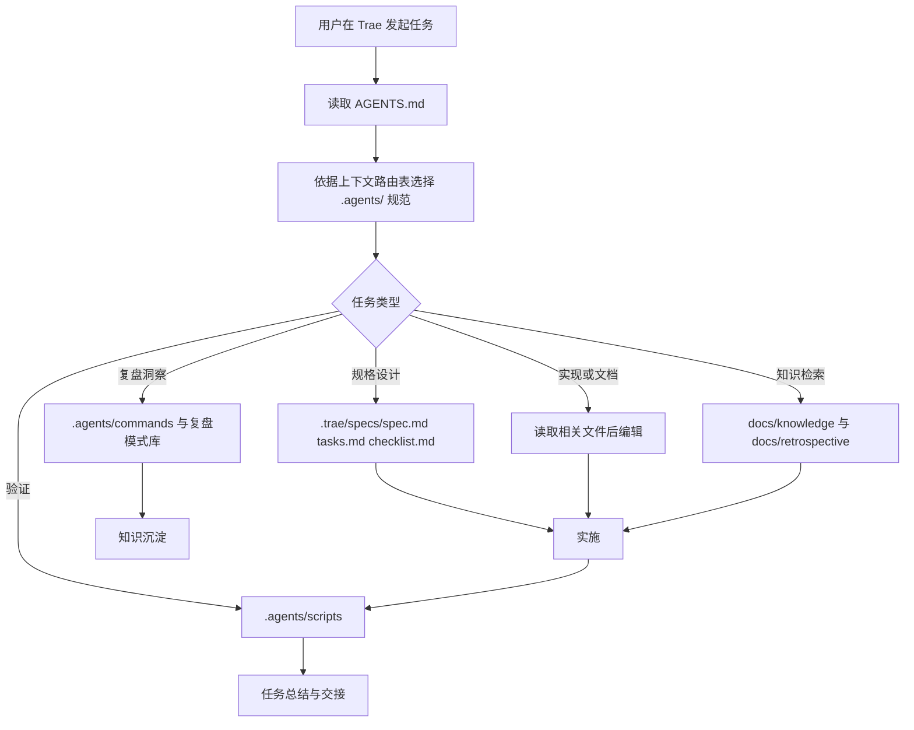
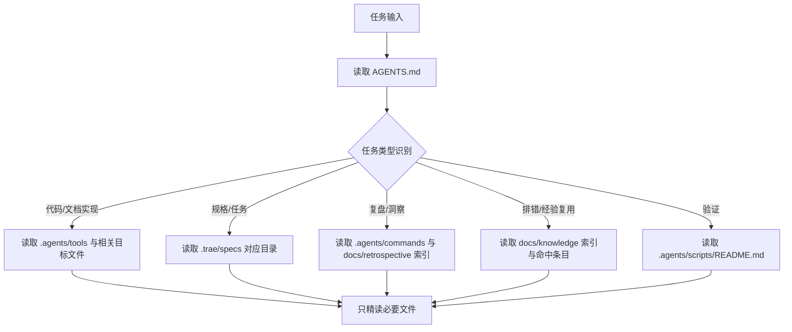
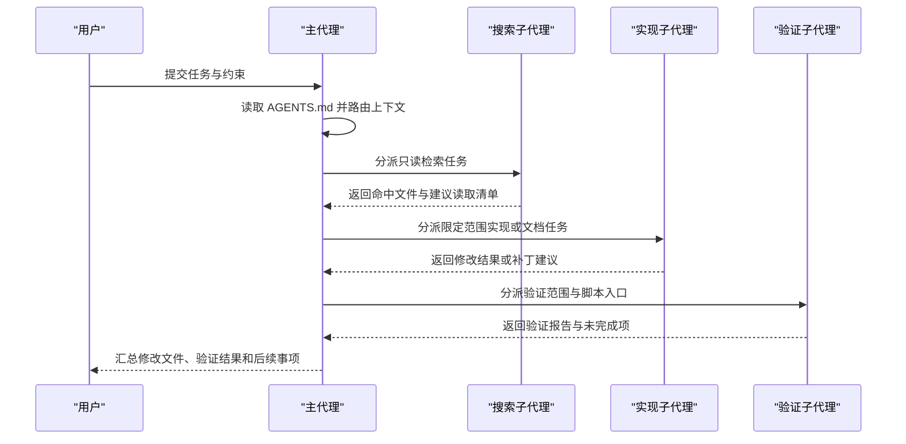

# Trae 应用优化分析与实施指南

## 1. 背景、目标与文档定位

### 1.1 背景

`d:\AI` 项目已经形成以 `AGENTS.md`、`.agents/`、`.trae/specs/`、`docs/knowledge/` 与 `docs/retrospective/` 为核心的 AI 协作规范体系。Trae 在本项目中承担了文件编辑、上下文检索、终端执行、Spec 模式协作、Skill/MCP 调用与子代理协作等入口职责，但这些能力需要与项目自建规范稳定衔接，才能避免“通用 IDE 能力可用、项目规范执行不稳定”的问题。

已有排错经验表明，若 Trae 会话跳过 `AGENTS.md` 启动协议，可能连续触发输出格式错误、文件路径错误和文档结构错误；已有 Trae 相关洞察报告也表明，Rules、Skills、Slash 命令、Spec 模式和子代理能力是 Trae 原生能力与本项目方法论衔接的关键接口。因此，本指南的重点不是重建规范，而是说明如何让 Trae 稳定执行并放大本项目已有规范资产。

### 1.2 目标

本文目标包括：

1. 梳理 Trae 在本项目中的当前使用场景，明确每类场景的入口、产出物和能力归属。
2. 明确区分 Trae 原生能力、项目自建规范、可配置增强能力，避免夸大 Trae 平台内置能力。
3. 分析当前局限性，并用“表现—影响—根因—优化方向”表格转化为可执行改进项。
4. 给出 Rules 分层、启动协议、Spec 模式、工具调用、上下文路由、Skill 去重、Slash 命令、MCP、子代理、Windows 终端和验证门禁的配置优化方案。
5. 提出项目专属 Skill、短指令库、知识检索入口、复盘生成、任务总结、使用指标和多代理模板等扩展建议。
6. 提供从任务开始到知识沉淀的端到端最佳实践，并按立即可做、短期配置、中期扩展、长期度量组织实施路线。

### 1.3 文档定位

本文面向 `d:\AI` 项目，分析 Trae 在本项目中的当前使用方式、主要局限、配置优化方案、功能扩展方向、端到端最佳实践与分阶段实施路线。本文不是新的平行规范体系，而是对既有资产的 Trae 使用层适配说明。

本文优先复用以下项目资产：

| 资产 | 在本文中的角色 |
|---|---|
| `d:\AI\AGENTS.md` | 项目智能体最高优先级入口、上下文路由表、全局约束来源 |
| `d:\AI\.agents\` | 角色、工具、协议、工作流、命令、规则、脚本等详细规范容器 |
| `d:\AI\.trae\specs\` | Trae Spec 模式承载目录，用于规格、任务与检查清单闭环 |
| `d:\AI\docs\knowledge\` | 排错经验、操作经验与架构决策知识库 |
| `d:\AI\docs\retrospective\` | 复盘报告、模式库、模板、资产清单与方法论沉淀 |
| `d:\AI\.agents\scripts\` | 规格一致性、链接、Git 忽略、命名、溯源等验证脚本 |
| `d:\AI\docs\retrospective\reports\competitive-analysis\retrospective-specweave-contest-advantage-analysis-20260624\` | 既有 Trae 相关洞察来源，用于识别 Rules、Skills、Slash 命令、Spec 模式和子代理等衔接点 |
| `d:\AI\docs\knowledge\troubleshooting\agents-md-startup-protocol-skipped.md` | 启动协议跳过故障案例，用于验证本指南的防护策略 |

### 1.4 与 README.md、AGENTS.md、`.agents/` 的职责边界

| 文档或目录 | 既有职责 | 本文边界 | 禁止越界事项 |
|---|---|---|---|
| `d:\AI\README.md` | 面向人类读者介绍项目定位、快速开始、项目亮点、路线与导航 | 本文只说明 Trae 在本项目中的使用适配，不替代项目介绍与对外传播内容 | 不重写项目定位、品牌叙事、贡献流程或许可证说明 |
| `d:\AI\AGENTS.md` | 面向智能体提供最高优先级入口、全局规则和上下文路由表 | 本文引用并强化其启动协议，说明如何在 Trae 中稳定执行 | 不另设高于 `AGENTS.md` 的入口，不改变角色、工具、路由和全局契约 |
| `d:\AI\.agents\` | 存放角色、提示词、协议、工作流、命令、规则、脚本等机器可读规范 | 本文只作为 Trae 使用层指南，把任务路由到既有规范 | 不复制或分叉 `.agents/` 内的详细规范，不创建平行规范体系 |
| `d:\AI\.trae\specs\` | 承载 Trae Spec 模式下的规格、任务与检查清单 | 本文说明该目录的使用规范和闭环方式 | 不把规格三件套散落到其他目录，不用本文替代具体 spec/tasks/checklist |

因此，本文属于“工具适配指南”，不是“项目总览”、不是“智能体全局契约”，也不是“.agents 规范容器”。后续维护时应优先修改对应源文档，本文只同步 Trae 使用层面的约束和入口说明。

## 2. 能力边界：Trae 原生能力、项目自建规范与可配置增强能力

后续所有优化建议均按以下三类能力描述，避免把项目自建规范误认为 Trae 平台内置能力。

| 类型 | 定义 | 本项目示例 | 边界说明 | 优化方式 |
|---|---|---|---|---|
| Trae 原生能力 | Trae IDE 或其运行环境直接提供的通用能力 | 文件编辑、代码检索、终端执行、Rules、Spec 模式、Skills、Slash 命令、MCP 接入、子代理任务执行 | Trae 提供能力入口和交互载体，但不会天然理解本项目的 `AGENTS.md`、目录边界、验证脚本或复盘模板 | 通过工作区规则、任务提示、操作约束和流程模板增强 |
| 项目自建规范 | 本仓库已经沉淀的规则、流程、模板、脚本与知识资产 | `AGENTS.md`、`.agents/roles/`、`.agents/tools/`、`.agents/commands/`、`.agents/scripts/`、`docs/knowledge/`、`docs/retrospective/` | 这些资产属于本项目，不是 Trae 平台默认内置能力；Trae 需要读取并遵循它们 | 通过启动协议、上下文路由、短指令和检查清单接入 |
| 可配置增强能力 | Trae 原生能力与项目自建规范之间的桥接层 | Rules 分层、项目专属 Skill、Slash 命令映射、验证门禁矩阵、MCP 使用规范、子代理模板 | 需要由项目维护者配置、验证和持续迭代，不应被描述为自动存在 | 通过 Trae 配置、项目说明、命令模板与自动化脚本实现 |

### 2.1 边界判断原则

1. **能否脱离本仓库存在**：文件编辑、终端、Rules、Skills、Slash 命令等可脱离本仓库存在，属于 Trae 原生能力；`AGENTS.md` 启动协议、`.agents/` 规范与 `.agents/scripts/` 脚本不能脱离本仓库存在，属于项目自建能力。
2. **是否需要项目维护者定义内容**：如果能力需要本项目提供规则文本、触发条件、验证脚本或模板，属于可配置增强能力。
3. **是否具备自动合规保证**：Trae 提供执行入口，不等同于自动遵守项目规范；合规性需要通过 Rules、任务清单、验证脚本和复盘机制实现。
4. **是否有外部系统依赖**：MCP、浏览器、飞书、GitHub 等能力只有在任务确实涉及外部系统时才启用，本地文件和项目文档优先使用本地读取与编辑能力。

## 3. Trae 在本项目中的当前使用场景

### 3.1 总体工作流

### 3.2 八类当前使用场景

| 场景 | 当前做法 | 主要入口 | 能力归属 | 典型产出 |
|---|---|---|---|---|
| 规格驱动开发 | 先在 `.trae/specs/<feature>/` 下维护 `spec.md`、`tasks.md`、`checklist.md`，再按任务实施 | `.trae/specs/`、`docs/retrospective/patterns/methodology-patterns/spec-driven-development.md` | Trae 原生协作 + 项目自建方法论 | 规格、任务清单、检查清单、实施结果 |
| AGENTS.md 与 Rules 路由 | 通过 `AGENTS.md` 的上下文路由表决定读取哪些 `.agents/` 规范 | `AGENTS.md`、`.agents/README.md` | 项目自建规范，可通过 Trae Rules 增强 | 正确的角色、工具、流程和输出位置 |
| 代码与文档编辑 | 先读取文件，再使用专用编辑工具或写入工具修改，避免 shell 替代文件操作 | `.agents/tools/file-operations.md` | Trae 原生能力 + 项目工具约束 | 修改后的代码、Markdown 文档、配置文件 |
| 知识库检索 | 通过 `docs/knowledge/README.md` 按分类、标签、最近更新和全文检索定位经验 | `docs/knowledge/` | 项目自建知识资产，可通过检索入口增强 | 排错方案、操作约束、架构决策引用 |
| 复盘/洞察/萃取 | 使用 `.agents/commands/` 与 `docs/retrospective/` 的模板和模式库生成报告与行动项 | `.agents/commands/`、`docs/retrospective/` | 项目自建流程，可通过 Slash 命令增强 | 复盘报告、洞察、可复用模式、知识条目 |
| 验证脚本执行 | 根据任务类型运行规格一致性、链接、Git 忽略、命名、溯源等脚本 | `.agents/scripts/` | 项目自建自动化，可由 Trae 终端执行 | 验证结果、问题清单、修复建议 |
| MCP 与 Skill 调用 | 对文档、数据、浏览器、飞书、GitHub 等外部能力按需调用 Skill/MCP | Trae Skill/MCP 能力与任务提示 | Trae 原生扩展能力，可通过触发规则增强 | 外部系统读取、报告生成、网页交互、数据处理 |
| 子代理协作 | 对无依赖、可隔离的任务使用子代理并行；有副作用任务由主代理串行控制 | `docs/retrospective/patterns/architecture-patterns/multi-agent-parallel-execution.md` | Trae 原生子代理 + 项目协作模式 | 并行分析结果、分工实施结果、验证报告 |

## 4. 当前局限性分析

以下局限均按“表现—影响—根因—优化方向”呈现，便于转化为配置或流程改进。

| 局限性 | 表现 | 影响 | 根因 | 优化方向 |
|---|---|---|---|---|
| 上下文优先级冲突 | 系统级 Skill 提示、用户指令、工作区规则和 `AGENTS.md` 同时存在时，模型可能先处理距离更近或更显性的提示 | 项目最高优先级协议被覆盖，导致输出格式、路径、结构偏移 | Trae 与模型层提示存在多源上下文，项目规则未被固化为启动门禁 | 将“先读 `AGENTS.md`”写入 Trae 工作区最高优先级 Rules，并在任务开始清单中显式自检 |
| `AGENTS.md` 启动协议被跳过 | 直接加载 Skill 或开始生成产物，未按路由表读取 `.agents/`、知识库或复盘体系 | 可能出现 DOCX 替代 Markdown、根目录误输出、单文件替代原子化结构等连锁错误 | 启动协议只存在于项目文档中，缺少 Trae 会话级强制检查 | 增加“启动协议合规检查”：任何生成或修改前必须确认已读取 `AGENTS.md` 与相关入口 |
| Skill 触发竞争 | 多个 Skill 都能处理“生成文档”“分析报告”等意图，可能同时加载或加载不匹配 Skill | 操作路径被不相关 Skill 的示例带偏，输出格式和工具选择不稳定 | Skill 描述存在重叠，缺少项目级去重和优先级规则 | 建立 Skill 选择矩阵：同一轮只加载一个主 Skill；项目规范优先于通用 Skill 输出格式 |
| 规则分散 | 规则分布在 `AGENTS.md`、`.agents/rules/`、`.agents/tools/`、`.agents/workflows/`、知识库中 | 新会话难以一次性掌握边界，容易漏读关键约束 | 项目采用模块化规范，但 Trae 缺少“按任务类型路由加载”的默认配置 | 使用 Rules 分层和上下文路由表，把强约束、任务路由、工具规则、验证规则拆分并建立读取顺序 |
| 规格与实现脱节 | `spec.md`、`tasks.md`、`checklist.md` 可能写完后未持续对照实施结果更新任务状态 | 实施完成度不可追踪，检查清单变成静态文档 | Spec 模式依赖人工维护，任务完成后缺少强制同步动作 | 在任务完成阶段固定执行“同步 tasks.md、保留未验证项、运行规格一致性检查” |
| 验证人工化 | 是否运行 `check-spec-consistency.py`、`check-links.py`、`check-gitignore.py` 等取决于智能体或用户记忆 | 容易遗漏回归检查，问题延后到审查或使用阶段暴露 | 验证脚本存在，但没有按任务类型绑定为完成门禁 | 建立验证门禁矩阵，把文档、代码、路径迁移、依赖变更分别映射到脚本 |
| 历史经验复用成本 | 知识库和复盘体系内容丰富，但需要人工知道关键词、路径和适用场景 | 已踩过的坑可能重复发生，复盘资产利用率不足 | 知识入口与任务启动流程未强绑定，缺少“先检索相关经验”的固定动作 | 在任务开始阶段加入知识库检索入口；为常见错误建立短指令和项目 Skill |
| 子代理边界不稳定 | 子代理可能读取不足、越权修改、重复实施或与主代理产生任务边界重叠 | 并行效率提升不稳定，存在冲突修改和上下文遗漏风险 | 子代理适用场景、输入上下文和交付格式未模板化 | 使用多代理协作模板：主代理分解任务，子代理只做无副作用分析或限定文件修改 |
| Windows PowerShell 约束 | Bash heredoc、Linux 命令、`grep/find/cat/sed/awk` 等习惯命令不适配或被项目禁止 | 命令失败、文件操作不合规，甚至生成临时文件未清理 | 当前环境为 Windows PowerShell 7+，且项目要求专用工具优先 | 在 Trae 终端规则中明确 PowerShell 兼容命令；文件读写搜索全部使用专用工具 |

## 5. 配置优化方案

### 5.1 Trae Rules 分层方案

建议将 Trae 工作区 Rules 按“强约束优先、任务路由其次、工具和验证兜底”的方式分层。Rules 不替代 `.agents/`，只负责把 Trae 的注意力路由到既有资产。

| 层级 | 目标 | 推荐内容 | 涉及文件 | 验证方式 | 预期收益 |
|---|---|---|---|---|---|
| L0 全局强约束 | 防止跳过启动协议和高风险操作 | 中文输出；任务开始先读 `AGENTS.md`；禁止未读文件直接修改；禁止提交临时依赖；禁止修改 `checklist.md` 等用户指定禁区 | `AGENTS.md` | 每次任务开始自检是否已读取入口 | 降低格式、路径、结构偏移风险 |
| L1 任务路由规则 | 根据任务类型按需读取上下文 | 文档任务读 `docs/retrospective/README.md`；知识任务读 `docs/knowledge/README.md`；工具任务读 `.agents/tools/`；验证任务读 `.agents/scripts/README.md` | `AGENTS.md`、`.agents/README.md` | 检查最终产出是否引用正确资产 | 减少全量读取和漏读 |
| L2 角色规则 | 明确主代理与角色边界 | 开发者不擅自变更架构；审查者不直接修改业务代码；测试工程师不改业务逻辑 | `.agents/roles/` | 对照角色职责检查执行行为 | 降低越权和职责混乱 |
| L3 工具规则 | 约束 Trae 工具使用 | 搜索用专用搜索工具；读写用文件工具；终端只做测试、构建、脚本执行；PowerShell 兼容 | `.agents/tools/` | 检查是否出现 shell 替代文件操作 | 提升可控性和跨平台稳定性 |
| L4 验证规则 | 把完成定义绑定到验证脚本 | 规格任务运行规格一致性；文档任务运行链接检查；依赖或临时目录变更运行 Git 忽略检查 | `.agents/scripts/README.md` | 记录脚本命令和结果 | 形成闭环交付 |

### 5.2 `AGENTS.md` 启动协议优化

`AGENTS.md` 已声明 Priority Zero，但在 Trae 中还应配置为会话级起点。

| 建议 | 目标 | 操作步骤 | 涉及文件 | 验证方式 | 预期收益 |
|---|---|---|---|---|---|
| 启动协议显式化 | 确保所有任务先进入项目路由 | 1. 在 Trae 工作区规则顶部声明“任何任务先读取 `d:\AI\AGENTS.md`”；2. 读取后按上下文路由表选择相关文件；3. 生成或修改前自检是否完成步骤 1-3 | `AGENTS.md` | 抽查任务执行记录是否先读入口 | 避免启动协议被 Skill 或通用提示覆盖 |
| 启动后只按需读取 | 控制上下文体积 | 1. 读取 `AGENTS.md`；2. 只读取当前任务对应的 `.agents/`、知识库或复盘入口；3. 对大目录先读 README/索引再精读目标文件 | `.agents/README.md`、`docs/knowledge/README.md`、`docs/retrospective/README.md` | 检查是否存在无关文件大范围读取 | 减少上下文噪声 |

### 5.3 `.trae/specs` 与 Spec 模式使用规范

本项目已经采用 Spec-driven 开发流程，Trae 应将 `.trae/specs/` 作为规格工作区，而不是将规格、任务和检查项散落在对话中。

| 阶段 | 文件 | 操作要求 | 模板优化建议 | 禁止事项 |
|---|---|---|---|---|
| 规格设计 | `spec.md` | 说明 Why、What Changes、Impact、ADDED/MODIFIED/REMOVED Requirements | 复用 `docs/retrospective/templates/spec-template.md` 的章节结构，需求使用 ADDED/MODIFIED/REMOVED Requirements 分组 | 禁止在规格未确认时直接实现 |
| 任务分解 | `tasks.md` | 将需求拆为 Task/SubTask，并声明依赖关系 | 复用 `docs/retrospective/templates/tasks-template.md` 的层级格式，保留 Task Dependencies，验证类任务单独列出 | 禁止任务完成后不更新勾选状态 |
| 验证设计 | `checklist.md` | 在实施前定义验收检查点 | 复用 `docs/retrospective/templates/checklist-template.md` 的分类检查方式，覆盖场景、边界、风险、可操作性和项目对齐 | 禁止为迎合实现结果事后修改检查标准，除非用户明确要求 |
| 实施执行 | 目标代码或文档 | 严格按 tasks.md 顺序执行，完成后同步状态 | 每次修改记录对应 Task/SubTask，避免范围外扩展 | 禁止脱离规格扩展范围 |
| 验证闭环 | 脚本与人工检查 | 保留未验证项，运行对应脚本 | 将验证结果回写到任务总结或交付说明，不擅自修改 checklist 标准 | 禁止把 Task 6 等验证任务误勾选为完成 |

### 5.4 工具调用约束

| 任务 | 首选能力 | 禁止或慎用 | 对应项目规范 |
|---|---|---|---|
| 查找文件 | Trae 文件匹配或专用 Glob | PowerShell `find` | `.agents/tools/search.md` |
| 搜索内容 | 专用 Grep/语义搜索 | PowerShell `grep`、`rg`、`Select-String` 替代项目工具 | `.agents/tools/search.md` |
| 读取文件 | 专用读取工具 | `cat`、`head`、`tail` | `.agents/tools/file-operations.md` |
| 修改文件 | 先读后编辑或写入 | `echo`、`sed`、`awk`、盲写覆盖 | `.agents/tools/file-operations.md` |
| 执行脚本 | PowerShell 兼容终端命令 | Bash heredoc、交互式命令 | `.agents/tools/code-execution.md`、`docs/knowledge/operations/windows-powershell-heredoc.md` |
| Skill 调用 | 单一主 Skill + 项目规范约束 | 同时加载多个产出物生成 Skill | `docs/knowledge/troubleshooting/agents-md-startup-protocol-skipped.md` |

### 5.5 上下文路由与按需读取

推荐使用以下读取顺序：

### 5.6 Skill 去重策略

| 场景 | 推荐策略 | 理由 |
|---|---|---|
| 文档撰写 | 只选择最贴近任务的文档协作或生成 Skill，并以项目 Markdown 输出约束为准 | 避免 DOCX、PDF 等格式 Skill 抢占输出路径 |
| 数据处理 | 数据文件任务才加载表格或数据分析 Skill | 避免通用分析任务误进入数据处理流程 |
| Web 任务 | 只有需要真实网页读取、交互、截图时才加载浏览器类 Skill | 避免无网页任务产生外部依赖 |
| 飞书/钉钉/Notion | 仅当任务涉及对应系统链接、文档或消息时调用 | 避免认证型工具误触发 |
| 项目规范任务 | 优先项目自建规范和 `.agents/`，Skill 只作为执行辅助 | 保持项目规则优先级 |

### 5.7 Slash 命令建议

| 短指令 | 映射流程 | 复用资产 | 输出 |
|---|---|---|---|
| `/spec <需求>` | 创建或更新 `spec.md`、`tasks.md`、`checklist.md` | `docs/retrospective/templates/`、Spec-driven 方法论 | 规格三件套 |
| `/验证 <范围>` | 按任务类型运行验证脚本并汇总结果 | `.agents/scripts/README.md` | 验证报告 |
| `/复盘 <任务>` | 生成复盘报告，记录事实、分析、洞察、建议 | `.agents/commands/retrospective.md` | 复盘文档 |
| `/洞察 <材料>` | 从任务或复盘中提炼模式、异常与机会 | `.agents/commands/insight.md` | 洞察清单 |
| `/萃取 <报告>` | 将稳定经验沉淀为模式、知识条目或模板 | `.agents/modules/self-extraction.md`、`docs/retrospective/patterns/` | 可复用资产 |
| `/同步规格` | 对照实施结果更新 `tasks.md`，保留未验证任务 | `.trae/specs/` | 更新后的任务状态 |
| `/查经验 <关键词>` | 检索知识库与复盘体系 | `docs/knowledge/`、`docs/retrospective/` | 相关经验摘要 |

### 5.8 MCP、子代理、Windows 终端与验证门禁配置

| 方向 | 配置建议 | 涉及文件 | 验证方式 | 预期收益 |
|---|---|---|---|---|
| MCP | 仅为真实外部系统访问启用 MCP；本地项目文档优先用文件读取 | Trae MCP 配置、项目规则 | 检查是否出现可本地读取却走外部 MCP 的情况 | 降低认证和权限复杂度 |
| 子代理 | 主代理负责拆分、串联和最终写入；子代理负责无副作用搜索、分析或限定范围实施 | `.agents/protocols/`、多智能体模式 | 检查子代理输出是否有明确输入、边界、交付物 | 提升并行效率并减少冲突 |
| Windows 终端 | 使用 PowerShell 7+ 兼容命令；避免 Bash heredoc；文件操作不走 shell；不使用 `cmd.exe` 或 `command.exe` | `docs/knowledge/operations/windows-powershell-heredoc.md`、`.agents/tools/code-execution.md` | 命令是否在 PowerShell 下可执行，是否未用 shell 读写搜索文件 | 降低命令失败率 |
| 验证门禁 | 按变更类型选择脚本：规格一致性、链接、Git 忽略、命名、溯源、测试 | `.agents/scripts/` | 记录命令、结果和未执行原因 | 明确完成定义 |

### 5.9 验证门禁矩阵

| 变更类型 | 必选检查 | 可选检查 | 通过标准 | 未执行时的处理 |
|---|---|---|---|---|
| `.trae/specs/` 规格变更 | `python .agents/scripts/check-spec-consistency.py --spec-dir .trae/specs/<name>` | `python .agents/scripts/check-links.py --path .trae/specs/<name>` | spec、tasks、checklist 覆盖关系无明显缺口 | 在最终报告中说明未执行原因，并保留 Task 6 未勾选 |
| `docs/` Markdown 文档变更 | `python .agents/scripts/check-links.py --path docs/` 或限定目标文件所在目录 | `python .agents/scripts/check-filename-convention.py --directory docs/` | 本地链接有效，文件名符合约定 | 标注“待验证”，不得声称已完成验证 |
| 文件移动或路径迁移 | `python .agents/scripts/check-move.py <源> <目标> --dry-run` | `python .agents/scripts/check-links.py --path docs/` | 相对链接迁移方案明确，无断链 | 先不执行真实移动，提交迁移方案 |
| 临时依赖或目录规则变更 | `python .agents/scripts/check-gitignore.py` | `git status` 只用于查看，不自动提交 | `vendor/`、`.temp/`、`__pycache__/`、`.venv/`、`node_modules/` 等未误纳入版本控制 | 停止交付并提示风险 |
| 派生产物或规范文档变更 | `python .agents/scripts/check-source-traceability.py --affected <源文件>` | `python .agents/scripts/generate-nav.py` | source 溯源关系清晰，导航按需更新 | 说明受影响派生产物待复核 |
| 代码变更 | 对应语言或项目测试、构建命令 | 覆盖率或静态检查 | 无新增失败用例，无回归问题 | 明确列出未运行测试及原因 |

## 6. 功能扩展建议

### 6.1 项目专属 Trae Skill

建议创建项目专属 Skill，用于把“读取 `AGENTS.md` → 路由上下文 → 执行任务 → 验证 → 沉淀”的固定流程封装为可复用能力。该 Skill 不替代 `AGENTS.md`，只负责确保 Trae 每次进入项目时正确加载它。

| 项目 | 建议设计 |
|---|---|
| 名称 | `ai-project-governance` 或 `agentforge-project-adaptation` |
| 触发条件 | 用户在 `d:\AI` 中要求执行规格、文档、复盘、验证、规则、知识库、子代理协作相关任务 |
| 输入 | 任务描述、目标文件或规格目录、是否允许修改、是否需要验证 |
| 输出 | 执行计划、读取的上下文清单、修改文件、验证结果、后续建议 |
| 依赖规范 | `AGENTS.md`、`.agents/README.md`、`.agents/tools/`、`.agents/scripts/README.md`、`docs/knowledge/README.md`、`docs/retrospective/README.md` |
| 验证方式 | 用历史故障案例测试：不得跳过 `AGENTS.md`，不得生成错误格式，不得写错路径 |

### 6.2 短指令库扩展

现有短指令模式已经验证“首轮长上下文 + 后续短指令”的低摩擦协作方式。建议在 Trae 侧形成项目短指令库，并映射到 `.agents/commands/`。

| 短指令 | 目标 | 操作步骤 | 涉及文件 | 验证方式 | 预期收益 |
|---|---|---|---|---|---|
| `/复盘` | 任务结束后生成结构化复盘 | 读取任务记录 → 按模板生成报告 → 提取行动项 | `.agents/commands/retrospective.md`、`docs/retrospective/templates/` | 报告是否包含事实、分析、洞察、建议 | 降低复盘启动成本 |
| `/洞察` | 从多轮任务中提炼规律 | 汇总材料 → 识别模式/异常/机会 → 输出洞察 | `.agents/commands/insight.md` | 是否产出可行动建议 | 提升经验转化率 |
| `/萃取` | 将洞察沉淀为可复用资产 | 判断资产类型 → 写入模式库或知识库 → 更新索引 | `docs/retrospective/patterns/`、`docs/knowledge/` | 是否有来源与适用场景 | 避免经验停留在报告中 |
| `/验证` | 快速执行任务完成门禁 | 判断变更类型 → 运行脚本 → 汇总结果 | `.agents/scripts/` | 是否列出通过/失败/未执行原因 | 减少人工遗漏 |
| `/同步规格` | 保持 tasks 与实施状态一致 | 对照完成项 → 勾选任务 → 保留验证项 | `.trae/specs/*/tasks.md` | Task 状态是否准确 | 防止规格与实现脱节 |

### 6.3 知识库检索入口

建议将知识检索作为 Trae 任务开始阶段的固定入口：

1. 若任务涉及错误、失败、环境、输出偏移，先查 `docs/knowledge/troubleshooting/`。
2. 若任务涉及命令、PowerShell、Git、目录操作，先查 `docs/knowledge/operations/`。
3. 若任务涉及架构取舍，先查 `docs/knowledge/decisions/`。
4. 若任务涉及方法论、模板、复用模式，先查 `docs/retrospective/patterns/` 与 `docs/retrospective/templates/`。

可配置短指令 `/查经验 <关键词>`，输出格式固定为：命中条目、相关路径、可复用经验、对当前任务的约束。

### 6.4 复盘生成、洞察萃取与任务总结

| 扩展项 | 目标 | 操作步骤 | 涉及文件 | 验证方式 | 预期收益 |
|---|---|---|---|---|---|
| 复盘生成工作流 | 将任务经验从对话转为文档资产 | 任务完成 → 读取复盘模板 → 写入报告 → 更新索引 | `docs/retrospective/templates/`、`.agents/commands/retrospective.md` | 报告是否可追溯任务事实 | 形成项目记忆 |
| 洞察萃取工作流 | 从复盘中提炼可复用模式 | 读取复盘 → 判断模式成熟度 → 写入 patterns 或 knowledge | `docs/retrospective/patterns/`、`docs/knowledge/` | 是否包含来源、场景、复用方法 | 提高知识复用率 |
| 任务总结沉淀 | 为后续任务提供轻量索引 | 结束时记录目标、变更、验证、风险 | `docs/task-summaries/` | 是否能被后续检索复用 | 降低跨会话恢复成本 |

### 6.5 Trae 使用指标统计

建议长期统计以下指标，用于判断优化是否有效：

| 指标 | 含义 | 数据来源 | 用途 |
|---|---|---|---|
| 启动协议遵守率 | 任务开始是否读取 `AGENTS.md` | 任务记录、执行摘要 | 衡量 Rules 是否生效 |
| 规格闭环率 | 有规格任务是否完成 tasks 与验证同步 | `.trae/specs/*/tasks.md` | 衡量 Spec 模式执行质量 |
| 验证执行率 | 完成任务后是否运行对应脚本 | 终端记录、任务总结 | 衡量门禁落地情况 |
| 返工原因分布 | 返工来自格式、路径、上下文、工具还是验证 | 复盘报告、知识库 | 指导下一轮优化 |
| 知识复用次数 | 任务中引用知识库/模式库次数 | 文档引用、任务总结 | 衡量历史经验利用程度 |

### 6.6 多代理协作模板

| 角色 | 适用任务 | 输入 | 禁止事项 | 输出 |
|---|---|---|---|---|
| 主代理 | 任务拆分、上下文路由、最终写入、验证汇总 | 用户需求、`AGENTS.md`、目标规格 | 禁止把最终责任交给子代理 | 计划、修改、验证结果 |
| 搜索子代理 | 大范围检索、结构对比、路径定位 | 关键词、目标目录、只读约束 | 禁止修改文件 | 命中文件、相关片段、建议读取清单 |
| 实现子代理 | 明确边界的小范围实现 | 指定文件、任务清单、验收标准 | 禁止跨范围重构 | 修改建议或限定修改结果 |
| 验证子代理 | 检查覆盖、运行脚本、结果解释 | 变更清单、脚本入口 | 禁止擅自修复业务逻辑 | 验证报告、失败原因、修复建议 |

## 7. 端到端最佳实践指南

### 7.1 任务开始

1. 先读取 `d:\AI\AGENTS.md`。
2. 根据上下文路由表判断需要读取的 `.agents/`、知识库或复盘入口。
3. 明确任务类型：规格、实现、文档、验证、复盘、排错或外部系统操作。
4. 判断是否需要 Skill/MCP；如需要，只加载一个主 Skill，并保持项目规范优先。
5. 若任务复杂，建立任务清单并按完成状态更新。

### 7.2 规格设计

1. 在 `.trae/specs/<kebab-case-name>/` 下维护规格三件套。
2. `spec.md` 说明 Why、What Changes、Impact 和 Requirements。
3. `tasks.md` 拆解为主任务、子任务和依赖关系。
4. `checklist.md` 前置验收标准，后续不得随意迎合实现结果修改。
5. 规格阶段只做设计，不直接写实现代码，除非用户明确要求进入实施。

### 7.3 上下文读取

1. 先读索引：`AGENTS.md`、`.agents/README.md`、`docs/knowledge/README.md`、`docs/retrospective/README.md`。
2. 再读命中条目：工具规范、命令定义、具体知识条目或模式文件。
3. 大文件只读取相关区段。
4. 不把无关规范一次性塞入上下文，避免注意力稀释。

### 7.4 工具选择

1. 文件读取、写入、编辑使用专用文件工具。
2. 搜索使用专用搜索工具，精确查找用 Grep，文件名匹配用 Glob，语义意图用语义搜索。
3. 终端只用于脚本、测试、构建、Git 状态等必须执行命令的场景。
4. Windows 下只使用 PowerShell 兼容命令，不使用 Bash heredoc。

### 7.5 文件编辑

1. 编辑已有文件前必须先读取。
2. Markdown 表格结构变化时整表替换。
3. 新文件仅在任务明确要求或确有必要时创建。
4. 不主动创建无关 README 或总结文档。
5. 不修改用户明确禁止修改的文件，例如本任务中的 `checklist.md`。

### 7.6 实现与文档编写

1. 严格复用项目既有目录结构、命名规范和文档边界。
2. 文档使用中文，路径使用绝对路径核对，文件名使用 kebab-case。
3. 流程图、关系图优先使用 Mermaid。
4. 对从源文档派生的结构化产物，在 frontmatter 中标注 `source`。
5. 不新增与现有 `.agents/`、知识库、复盘体系平行的规范体系。

### 7.7 验证

| 变更类型 | 推荐验证 |
|---|---|
| 规格变更 | `python .agents/scripts/check-spec-consistency.py --spec-dir .trae/specs/<name>` |
| Markdown 链接变更 | `python .agents/scripts/check-links.py --path docs/` 或指定路径 |
| 文件移动 | `python .agents/scripts/check-move.py <源> <目标> --dry-run` |
| 临时依赖或目录规则变更 | `python .agents/scripts/check-gitignore.py` |
| 文件命名变更 | `python .agents/scripts/check-filename-convention.py --directory <dir>` |
| 派生产物变更 | `python .agents/scripts/check-source-traceability.py --affected <source>` |
| 代码变更 | 运行对应测试或构建命令 |

### 7.8 复盘与知识沉淀

1. 任务完成后，如果出现新错误、新模式或可复用经验，生成复盘或知识条目。
2. 将排错经验放入 `docs/knowledge/troubleshooting/`。
3. 将操作经验放入 `docs/knowledge/operations/`。
4. 将可复用方法论放入 `docs/retrospective/patterns/`。
5. 更新索引或记录后续需要更新索引的行动项。

## 8. 常见错误规避清单

| 禁止项 | 正确做法 | 风险 |
|---|---|---|
| 禁止跳过 `AGENTS.md` | 任何任务先读取 `d:\AI\AGENTS.md` 并按路由表继续 | 输出格式、路径、结构连锁错误 |
| 禁止未读文件直接修改 | 编辑前先读取目标文件，确认唯一替换片段 | 覆盖用户内容或替换错误位置 |
| 禁止 shell 替代专用文件工具 | 读写搜索使用专用工具，终端只运行必要命令 | 不可审计、跨平台失败 |
| 禁止提交临时依赖 | `vendor/`、`.temp/`、`__pycache__/`、`.venv/`、`node_modules/` 不纳入提交 | 仓库污染、敏感或大文件误入库 |
| 禁止规格阶段直接实现 | 先完成 spec/tasks/checklist，再进入实施 | 需求未冻结导致返工 |
| 禁止同时加载多个重叠 Skill | 同一轮只选择一个主 Skill，并以项目规范约束输出 | Skill 示例互相竞争导致偏航 |
| 禁止忽视 Windows PowerShell 约束 | 使用 PowerShell 兼容命令，避免 Bash heredoc | 命令解析失败 |
| 禁止把 Task 6 等验证任务提前勾选 | 未执行验证前保持未勾选 | 任务状态失真 |
| 禁止另起平行规范体系 | 扩展现有 `AGENTS.md`、`.agents/`、知识库和复盘体系 | 规则分裂、维护成本上升 |

## 9. 实施路线

### 9.1 立即可做

| 建议 | 目标 | 操作步骤 | 涉及文件 | 验证方式 | 预期收益 |
|---|---|---|---|---|---|
| 将启动协议写入 Trae 工作区规则 | 避免再次跳过 `AGENTS.md` | 1. 在 Trae Rules 顶部加入“先读 `AGENTS.md`”；2. 规定读取后按路由表继续；3. 产出前自检 | `AGENTS.md` | 下一次任务是否先读入口 | 立即降低输出偏移风险 |
| 建立任务开始检查清单 | 统一新任务入口动作 | 1. 确认任务类型；2. 确认目标文件；3. 确认需读取规范；4. 确认验证方式 | `AGENTS.md`、`.agents/README.md` | 执行摘要是否列出读取依据 | 降低漏读上下文概率 |
| 使用验证门禁矩阵 | 让完成定义可检查 | 1. 按变更类型选择脚本；2. 运行或说明未运行原因；3. 汇总结果 | `.agents/scripts/README.md` | 是否有验证记录 | 减少人工遗漏 |
| Skill 单主策略 | 避免 Skill 竞争 | 1. 判断是否必须用 Skill；2. 只加载最相关 Skill；3. 输出格式服从项目规范 | Skill 描述、`AGENTS.md` | 是否出现多 Skill 输出冲突 | 提升执行稳定性 |

### 9.2 短期配置

| 建议 | 目标 | 操作步骤 | 涉及文件 | 验证方式 | 预期收益 |
|---|---|---|---|---|---|
| 完成 Trae Rules 分层 | 把分散规则转为可执行路由 | 1. 拆分 L0-L4；2. 每层只放必要规则；3. 复杂规则链接到 `.agents/` | `AGENTS.md`、`.agents/rules/`、`.agents/tools/` | 用典型任务测试是否路由正确 | 降低规则噪声 |
| 建立 Slash 命令映射 | 降低高频流程触发成本 | 1. 选定 `/spec`、`/验证`、`/复盘` 等；2. 映射到 `.agents/commands/`；3. 固定输出格式 | `.agents/commands/`、短指令模式 | 多轮任务中指令是否稳定复现 | 提升协作效率 |
| 规范 `.trae/specs` 使用 | 防止规格与实现脱节 | 1. 新需求独立目录；2. 三件套齐全；3. 完成后同步 tasks | `.trae/specs/`、复盘模板 | 运行规格一致性检查 | 提高需求可追踪性 |
| 固化 PowerShell 终端规则 | 减少命令失败 | 1. 明确 PowerShell 7+；2. 禁用 Bash heredoc；3. 推荐 `-m` 多参数或临时文件方案 | `docs/knowledge/operations/windows-powershell-heredoc.md` | 命令是否一次通过 | 降低环境摩擦 |

### 9.3 中期扩展

| 建议 | 目标 | 操作步骤 | 涉及文件 | 验证方式 | 预期收益 |
|---|---|---|---|---|---|
| 创建项目专属 Trae Skill | 将项目启动与路由流程自动化 | 1. 定义触发条件；2. 固定读取 `AGENTS.md`；3. 输出上下文清单和验证建议 | `AGENTS.md`、`.agents/`、Skill 配置 | 用历史故障案例回归测试 | 降低人工提示成本 |
| 建设知识库检索入口 | 提高历史经验复用率 | 1. 设计 `/查经验`；2. 按分类与标签检索；3. 输出对当前任务的约束 | `docs/knowledge/README.md`、`docs/retrospective/README.md` | 任务摘要是否引用命中经验 | 减少重复踩坑 |
| 复盘与洞察自动化 | 将任务经验稳定沉淀 | 1. 对接 `/复盘`、`/洞察`、`/萃取`；2. 生成报告；3. 更新索引或行动项 | `.agents/commands/`、`docs/retrospective/` | 报告是否含来源和行动项 | 提升知识生产效率 |
| 多代理协作模板化 | 提升并行任务质量 | 1. 定义主/搜索/实现/验证代理边界；2. 固定输入输出；3. 禁止子代理越权 | `.agents/protocols/`、多智能体模式 | 是否无冲突修改和重复劳动 | 提升复杂任务吞吐 |

### 9.4 长期度量

| 建议 | 目标 | 操作步骤 | 涉及文件 | 验证方式 | 预期收益 |
|---|---|---|---|---|---|
| 建立 Trae 使用指标 | 用数据评估优化效果 | 1. 记录启动协议遵守率；2. 记录验证执行率；3. 记录返工原因 | `docs/task-summaries/`、复盘报告 | 定期汇总趋势 | 让优化从经验走向度量 |
| 维护模式成熟度 | 判断哪些流程可标准化 | 1. 统计复用次数；2. 更新 L1-L3 成熟度；3. 升级稳定模式 | `docs/retrospective/patterns/` | 模式是否有验证次数 | 提高规范质量 |
| 形成季度规则审计 | 防止规则膨胀和冲突 | 1. 审查 Rules 与 `AGENTS.md` 重叠；2. 删除过时规则；3. 合并冲突规则 | `AGENTS.md`、`.agents/rules/` | 是否减少重复与矛盾 | 保持上下文清洁 |
| 自动化质量看板 | 将脚本结果汇总展示 | 1. 汇总验证脚本输出；2. 记录失败类别；3. 生成趋势报告 | `.agents/scripts/`、`docs/retrospective/` | 是否能定位高频失败点 | 支撑持续改进 |

## 10. 推荐执行顺序

1. 立即在 Trae 工作区层面固化“先读 `AGENTS.md`”。
2. 使用本文第 5 章配置 Rules 分层与验证门禁。
3. 用 `/验证`、`/同步规格` 等短指令先覆盖高频低风险流程。
4. 再建设项目专属 Skill，自动化启动协议、上下文路由和完成检查。
5. 最后引入指标统计和定期审计，形成持续优化闭环。

## 11. 结论

本项目已经具备较成熟的智能体规范、知识库、复盘体系和验证脚本。Trae 优化的核心不是另建一套流程，而是让 Trae 更稳定地执行既有流程：以 `AGENTS.md` 作为唯一入口，以 `.agents/` 作为规范容器，以 `.trae/specs/` 作为规格闭环，以 `docs/knowledge/` 和 `docs/retrospective/` 作为经验复用层，以 `.agents/scripts/` 作为验证门禁。只要把这些资产通过 Rules、Slash 命令、Skill 去重、子代理模板和验证矩阵串联起来，Trae 就能从通用执行工具升级为本项目的规范感知型协作入口。

## 12. 对照检查清单

| 检查维度 | 覆盖位置 | 状态 |
|---|---|---|
| 当前使用场景八类分析 | 第 3 章 | 已覆盖 |
| Trae 原生能力、项目自建规范、可配置增强能力边界 | 第 2 章 | 已覆盖 |
| 当前局限性的表现、影响、根因、优化方向 | 第 4 章 | 已覆盖 |
| Rules、启动协议、Spec、工具、上下文、Skill、Slash、MCP、子代理、Windows、验证门禁 | 第 5 章 | 已覆盖 |
| 项目专属 Skill、短指令库、知识检索、复盘、任务总结、指标、多代理模板 | 第 6 章 | 已覆盖 |
| 任务开始、规格设计、上下文读取、工具选择、文件编辑、实现、验证、复盘、知识沉淀 | 第 7 章 | 已覆盖 |
| 常见错误规避 | 第 8 章 | 已覆盖 |
| 立即可做、短期配置、中期扩展、长期度量实施路线 | 第 9 章 | 已覆盖 |
| 项目路径与既有资产对齐 | 第 1、5、6、7、9 章 | 已覆盖 |

Task 6 的正式验证仍应由后续验证阶段对照 `d:\AI\.trae\specs\optimize-trae-project-adaptation\checklist.md` 执行，本表仅作为文档内部覆盖提示，不替代验证任务。
