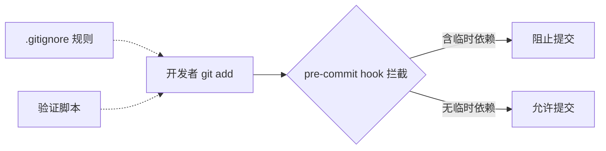

# 验证与自动化

> **文档边界**：本文件是面向人类读者的验证脚本概览，权威工具规范位于 [`.agents/tools/`](../.agents/tools/README.md) 和 [`.agents/scripts/`](../.agents/scripts/README.md) 目录（AI智能体执行时读取的机器可读版本）。阶段守卫运行时规范见 [`.agents/rules/stage-guardrails-guide.md`](../.agents/rules/stage-guardrails-guide.md)。
>
> **来源**：从 `README.md` "验证与自动化"章节拆分

## 临时依赖治理

本项目通过三重机制防止临时依赖被误提交：



| 机制 | 文件 | 作用 |
|---|---|---|
| 忽略规则 | [.gitignore](../.gitignore) | 排除 `vendor/`、`.temp/`、`__pycache__/`、`.venv/`、`node_modules/` 等路径 |
| 自动拦截 | `.git/hooks/pre-commit` | 暂存区含临时依赖时阻止提交 |
| 主动验证 | [.agents/scripts/check-gitignore.py](../.agents/scripts/check-gitignore.py) | 验证规则覆盖度与 git 状态洁净度 |

## 运行验证脚本

```bash
python .agents/scripts/check-gitignore.py
```

脚本会检查：
1. `.gitignore` 是否包含所有必需的忽略规则（共 10+ 条）。
2. `git status` 输出中是否包含临时依赖路径。

预期输出：

```
验证通过: 所有临时依赖路径已被 .gitignore 覆盖
```

## 其他验证脚本

| 脚本 | 路径 | 用途 |
|------|------|------|
| check-gitignore.py | [.agents/scripts/check-gitignore.py](../.agents/scripts/check-gitignore.py) | Git 忽略规则验证 |
| check-spec-consistency.py | [.agents/scripts/check-spec-consistency.py](../.agents/scripts/check-spec-consistency.py) | 规格文档一致性检查 |
| check-links.py | [.agents/scripts/check-links.py](../.agents/scripts/check-links.py) | Markdown 链接有效性检查 |
| generate-nav.py | [.agents/scripts/generate-nav.py](../.agents/scripts/generate-nav.py) | 文档导航表自动生成 |
| check-move.py | [.agents/scripts/check-move.py](../.agents/scripts/check-move.py) | 文件移动时路径迁移 |
| check-source-traceability.py | [.agents/scripts/check-source-traceability.py](../.agents/scripts/check-source-traceability.py) | source 溯源字段审计与影响分析 |
| check-vendor.py | [.agents/scripts/check-vendor.py](../.agents/scripts/check-vendor.py) | vendor目录合规性验证（--deep深度检查子模块） |
| check-stage-guardrails.py | [.agents/scripts/check-stage-guardrails.py](../.agents/scripts/check-stage-guardrails.py) | 阶段守卫日志SG-LOG/PDR-LOG离线分析 |
| check-role-permissions.py | [.agents/scripts/check-role-permissions.py](../.agents/scripts/check-role-permissions.py) | 角色权限边界验证 |
| ci-check.ps1/sh | [.agents/scripts/ci-check.ps1](../.agents/scripts/ci-check.ps1) | CI综合检查（链接/规范/合规） |

> **关联模块**：
> - `../README.md`
> - `../.gitignore`
> - `../.agents/protocols/dependency-management.md`
> - `tech-stack.md`