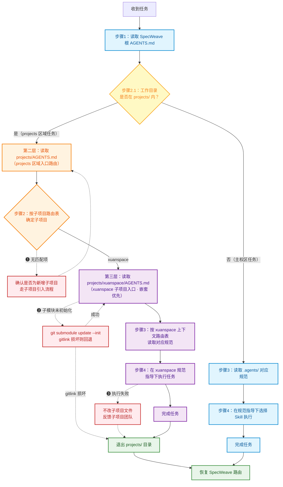

# Projects 区域智能体契约 (AGENTS Manifest)

> **启动协议（PRIORITY ZERO）**
>
> ```
> 步骤 1：读取本文件全文
> 步骤 2：按「子项目路由表」确定本次任务需要进入的子项目
> 步骤 3：进入子项目后，读取子项目的 AGENTS.md（嵌套优先）
> 步骤 4：退出 projects/ 目录后，恢复 SpecWeave 主权区路由（回到根 AGENTS.md）
> ```
>
> ⚠️ 本文件是 projects 区域的 AI 智能体入口。projects/ 存放 SpecWeave 的**第一方自有子项目**，本文件负责路由到各子项目并登记可用资产。子项目内容由各自团队维护，不直接修改子项目内部文件。

## 区域性质

projects/ 存放 SpecWeave 的第一方自有子项目（git submodules），与 `vendor/`（第三方依赖子模块）形成明确区分：

| 目录 | 用途 | 维护方式 |
|------|------|----------|
| `projects/` | 第一方自有项目（本团队/个人开发维护） | git submodule，允许子模块内开发 |
| `vendor/` | 第三方依赖（外部团队/开源项目） | git submodule，third_party 禁止本地修改，owned_collab 允许开发 |

> **.gitignore 策略**：projects/ 目录本身不被根 .gitignore 忽略，子模块 gitlink 和主权区元数据文件正常纳入版本控制。

projects/AGENTS.md 与 projects/.agents/ 由 SpecWeave 主权区维护，直接纳入版本管理；各子项目内的 AGENTS.md 与 .agents/ 由子项目自治管理，SpecWeave 不直接修改。

## 子项目路由表

| 子项目 | AGENTS.md 入口 | 说明 |
|--------|---------------|------|
| xuanspace | [projects/xuanspace/AGENTS.md](xuanspace/AGENTS.md) | 玄境（Xuanspace）Python 3.13+ monorepo 项目管理工具 |

### 嵌套优先级

```
SpecWeave 根 AGENTS.md
  └─ projects/AGENTS.md（本文件，projects 区域入口）
       └─ projects/xuanspace/AGENTS.md（xuanspace 子项目入口）
```

进入任意子目录后，优先读取**离当前工作目录最近**的 AGENTS.md。若子项目规则与本文件冲突，以子项目为准（子项目覆盖父层）。

### 路由流程图



**关键机制：**

- **实线箭头**（`-->`）主流程；**红色虚线箭头**（`-.->`）异常处理分支，编号 ❶-❸ 对应下方「异常处理分支」表格
- **嵌套优先**：进入子目录后优先读取离工作目录最近的 AGENTS.md，子项目规则覆盖父级
- **退出恢复**：正常完成（Exit）或异常回退（各 E 分支汇入 Exit）均退出 `projects/` 目录，自动恢复 SpecWeave 路由

## 可用资产索引

projects 区域内各子项目可被 SpecWeave 跨边界调用的资产清单。实际资产存放在各子项目内，本索引仅提供路由定位，不复制资产本体。

### xuanspace 子项目

| 资产 | 路径 | 说明 |
|------|------|------|
| 入门指南 | [xuanspace/.agents/ONBOARDING.md](xuanspace/.agents/ONBOARDING.md) | 快速开始、能力速查表、常用 xs 命令 |
| 全局核心规则 | [xuanspace/.agents/global-core-rules.md](xuanspace/.agents/global-core-rules.md) | Python 3.13+、多包管理器、YAML/TOML 二分法等 |
| 上下文路由表 | [xuanspace/.agents/context-routing.md](xuanspace/.agents/context-routing.md) | 任务类型→必读规范映射 |
| 文档元数据规范 | [xuanspace/.agents/rules/frontmatter.md](xuanspace/.agents/rules/frontmatter.md) | YAML/TOML 内容-元数据二分法 |
| 工作区发现协议 | [xuanspace/.agents/protocols/workspace-discovery.md](xuanspace/.agents/protocols/workspace-discovery.md) | 五步发现流程 |
| 提示词自举协议 | [xuanspace/.agents/protocols/prompt-bootstrap.md](xuanspace/.agents/protocols/prompt-bootstrap.md) | 一句话装载，零配置接入 |
| 项目模板 | [xuanspace/tools/templates/](xuanspace/tools/templates/) | Python/C++/静态项目模板 |
| xs CLI 工具 | [xuanspace/tools/xs/](xuanspace/tools/xs/) | 项目脚手架命令行工具 |

## 边界声明

| 资产 | 归属 | SpecWeave 可修改 | 说明 |
|------|------|:---:|------|
| projects/AGENTS.md | SpecWeave 主权区 | ✅ 是 | projects 区域入口路由 |
| projects/.agents/ | SpecWeave 主权区 | ✅ 是 | projects 区域元数据容器 |
| projects/README.md | SpecWeave 主权区 | ✅ 是 | projects 目录总览 |
| projects/xuanspace/ | xuanspace 子项目 | ❌ 否 | 通过 gitlink 追踪，修改需走子项目开发流程 |
| projects/xuanspace/AGENTS.md | xuanspace 子项目 | ❌ 否 | 子项目自治入口 |
| projects/xuanspace/.agents/ | xuanspace 子项目 | ❌ 否 | 子项目规范体系 |

## 跨子项目调用规范

SpecWeave 智能体需要使用 projects 区域的子项目资产时：

1. **定位**：通过本文件的「子项目路由表」和「可用资产索引」找到目标路径
2. **进入**：读取子项目的 AGENTS.md，遵循其启动协议和上下文路由表
3. **执行**：按子项目规范执行任务，使用子项目自身的工具链（如 xuanspace 的 `xs` 命令）
4. **不复制**：不在 SpecWeave 主权区复制子项目资产本体，保持单一可信源
5. **不直接修改**：不直接修改子项目内部文件，如需修改走子项目开发流程或反馈子项目团队

## 异常处理分支

| 异常场景 | 流程图节点 | 触发条件 | 处理方式 |
|----------|-----------|----------|----------|
| 未知子项目 | 子项目路由表 | 路由表无匹配项 | 确认是否为新增子项目；若否，回退到 SpecWeave 主权区路由并提示路径可能有误 |
| 子模块未初始化 | 第三层入口 | 读取子项目 AGENTS.md 失败或目录为空 | 运行 `git submodule update --init projects/<name>` 初始化子模块后重试；仍失败则检查 gitlink 是否损坏 |
| 执行失败 | 步骤 4 执行 | 子项目内任务执行报错 | 按子项目规范排查；**不直接修改子项目文件**，反馈给子项目团队 |

**通用回退原则**：任何异常无法在 projects 区域内解决时，退出 `projects/` 目录，回到 SpecWeave 主权区路由。禁止通过修改子项目文件的方式绕过异常。

## 新增子项目

```bash
# 添加第一方子模块
git submodule add https://github.com/xinetzone/<repo>.git projects/<name>

# 更新本文件路由表，新增子项目条目
# 更新 projects/README.md 的现有子项目表
```

## 参考链接

- [SpecWeave 根 AGENTS.md](../AGENTS.md) — 主权区入口
- [projects/README.md](README.md) — projects 目录总览
- [vendor/AGENTS.md](../vendor/AGENTS.md) — vendor 区域入口路由（对比参考）