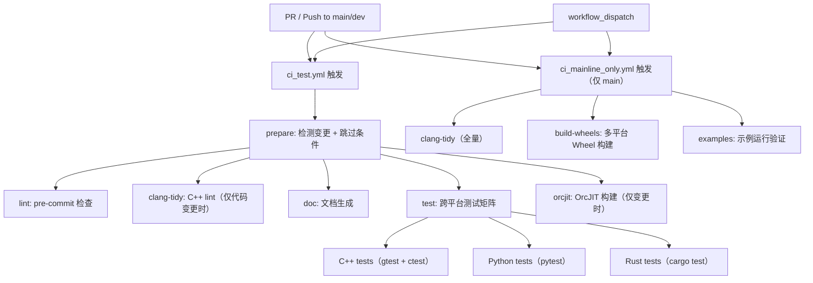

# 视角168：CI/CD 流水线

## 概述

TVM FFI 使用 GitHub Actions 作为 CI/CD 平台，包含三个主要工作流：`ci_test.yml`（常规测试）、`ci_mainline_only.yml`（main 分支发布准备）、`torch_c_dlpack.yml`（Torch/C-DLPack 扩展构建）。工作流之间通过 actions/ 目录下的复合动作复用通用逻辑。

## 流水线架构



## ci_test.yml：常规测试流水线

### 触发条件

```yaml
on:
  workflow_dispatch:
  pull_request:
  push:
    branches:
      - main
      - dev
```

### prepare 阶段

`prepare` job 是所有后续 job 的前置依赖，执行三项检测：

1. **跳过 CI 检测**：通过 `detect-skip-ci` action 检查 commit message 是否包含 `[skip ci]` 或变更是否仅为文档。
2. **C++ 文件变更检测**：`git diff --name-only` 检查 `src/` 和 `tests/` 下的 `.c/.cc/.cpp/.cxx` 文件。
3. **OrcJIT 文件变更检测**：检查 `addons/tvm_ffi_orcjit/` 和构建脚本的变更。

```yaml
- name: Get changed C++ files
  id: cpp_files
  run: |
    FILES=$(git diff --name-only --diff-filter=ACMR origin/${{ github.base_ref }}...HEAD -- \
      src/ tests/ | grep -E '\.(c|cc|cpp|cxx)$' | tr '\n' ' ')
    echo "files=$FILES" >> $GITHUB_OUTPUT
    [ -n "$FILES" ] && echo "changed=true" >> $GITHUB_OUTPUT || echo "changed=false" >> $GITHUB_OUTPUT
```

### lint 阶段

```yaml
- name: Run pre-commit
  run: uv run --no-sync pre-commit run --show-diff-on-failure --color=always --all-files
```

使用 `pre-commit` 框架执行代码格式化、文件类型检查等。

### clang-tidy 阶段

仅在 C++ 文件有变更时执行：

```yaml
- name: Run clang-tidy
  run: |
    uv run --no-project --with "clang-tidy==21.1.1" \
      python tests/lint/clang_tidy_precommit.py \
        --build-dir=build-pre-commit \
        --jobs=${{ steps.env_vars.outputs.cpu_count }} \
        ${{ needs.prepare.outputs.cpp_files }}
```

使用与 pre-commit 相同的脚本，但仅针对变更的 C++ 文件运行 clang-tidy 检查。

### test 阶段（跨平台矩阵）

```yaml
strategy:
  fail-fast: true
  matrix:
    include:
      - {os: ubuntu-latest, arch: x86_64, python_version: '3.14t'}
      - {os: ubuntu-24.04-arm, arch: aarch64, python_version: '3.14'}
      - {os: windows-latest, arch: AMD64, python_version: '3.9'}
      - {os: macos-14, arch: arm64, python_version: '3.13'}
```

每个平台执行三步：

1. **C++ 测试**：
   ```bash
   cmake . -B build_test -DTVM_FFI_BUILD_TESTS=ON -DCMAKE_BUILD_TYPE=Debug
   cmake --build build_test --clean-first --config Debug --target tvm_ffi_tests
   ctest -V -C Debug --test-dir build_test --output-on-failure
   ```
   Windows 使用 `cmd` shell，通过 `locate_vsdevcmd_bat.py` 定位 Visual Studio 编译器环境。

2. **Python 测试**：
   ```bash
   uv pip install --reinstall --verbose --group test -e .
   pytest -vvs tests/python
   ```

3. **Rust 测试**：
   ```bash
   cd rust && cargo test
   ```

## ci_mainline_only.yml：main 分支发布流水线

仅在 push to `main` 时触发，包含发布准备任务：

1. **clang-tidy（全量）**：对所有 `./src/`、`./include`、`./tests` 运行 clang-tidy。
2. **build-wheels**：构建多平台 Wheel：
   - Ubuntu x86_64（manylinux_2_28）+ sdist
   - Ubuntu aarch64（manylinux_2_28）
   - Windows AMD64
   - macOS arm64
3. **examples**：在三个平台（Ubuntu/macOS/Windows）运行示例：
   - `examples/quickstart`（CPU 推理）
   - `examples/stable_c_abi`（ABI 稳定性验证）
   - `examples/python_packaging`（Python 打包流程）

## torch_c_dlpack.yml：Torch/C-DLPack 扩展

手动触发的工作流，构建 PyTorch C-DLPack 扩展的 Wheel：

```yaml
on:
  workflow_dispatch:
    inputs:
      branch:
        description: "Branch or tag to publish"
        required: true
```

矩阵覆盖 Linux（x86_64/aarch64）、Windows、macOS，Python 版本 3.9-3.14。最终发布到 PyPI。

## 跳过机制

`detect-skip-ci` action 检查两种跳过条件：

1. **Commit 消息跳过**：commit message 包含 `[skip ci]`、`[ci skip]` 或 `[no ci]`。
2. **纯文档变更**：变更仅涉及 `.md` 文件，不涉及源码。

当任一条件满足时，`should_skip_ci_commit` 或 `should_skip_ci_docs_only` 输出为 `true`，test job 通过 `if` 条件跳过。

## 设计分析

CI/CD 流水线的设计体现了以下原则：

1. **增量执行**：clang-tidy 和 orcjit 仅在相关代码变更时执行，减少不必要的工作负载。
2. **fail-fast**：测试矩阵使用 `fail-fast: true`，任一平台失败立即取消其余平台，快速反馈。
3. **平台隔离**：Windows 使用 `cmd`/`pwsh` shell，其他平台使用 bash，通过 `if` 条件处理差异。
4. **自由线程 Python 支持**：矩阵包含 `python_version: '3.14t'`，验证自由线程（free-threaded）Python 的兼容性。
5. **sdist 单平台构建**：source distribution 仅在 Ubuntu x86_64 构建，其他平台仅构建 binary wheel。

## 扩展讨论

### 流水线即"发布门禁"：测试与发布工作流的垂直分层

CI 流水线被刻意拆成两条主线：`ci_test.yml` 是 PR/日常提交的**质量门禁**（prepare→lint→clang-tidy→test→orcjit 全链条），`ci_mainline_only.yml` 仅在 push 到 `main` 时触发，负责**发布准备**（全量 clang-tidy + 多平台 Wheel + 示例验证）。这种"开发期轻量验证、主干线严肃放行"的分层，让普通 PR 获得快速反馈，同时保证进入 `main` 的每个版本都经过更严格的 Release 级检查——如果只有单一流水线，要么 PR 过重拖慢迭代，要么发布渠道与日常检查质量相同而削弱交付保障。

### prepare 的"变更感知"：用增量过滤降低浪费

`prepare` job 通过 `git diff --name-only` 判断是否触碰 `src/`、`tests/` 或 `addons/tvm_ffi_orcjit/`，据此只对需要的工作流开闸（如仅有文档变更时跳过 clang-tidy 与 test）。配合 `detect-skip-ci` action 识别 `[skip ci]` 提交，流水线把算力浪费压到最低。这种做法承认了一个事实：并非每次提交都需要全量验证。变更感知 + 显式跳过，是大型矩阵项目控制 CI 成本、缩短反馈环的关键手段。

### fail-fast 与跨平台矩阵的配合：先暴露系统性问题

矩阵使用 `fail-fast: true`——任一平台失败立即取消其余平台。这在跨平台库的开发中是一种刻意的"尽早失败"策略：多数 bug 是通用性的，第一个平台就会暴露；若某平台有独立问题，也可被单独定位，无需等待所有平台空耗。紧随其后的平台差异（Windows 用 `cmd` 且先跑 `locate_vsdevcmd_bat.py` 设置编译器环境）则补充了"渐进污染而非连环爆炸"的设计：先让系统性问题快速出局，再处理真正平台特定的分支。

## 相关概念

- [161 C++ GoogleTest 套件](161-cpp-googletest-suite.md)
- [162 Python pytest 套件](162-python-pytest-suite.md)
- [169 跨平台测试](169-cross-platform-testing.md)
- [170 代码检查与格式化](170-code-check-formatting.md)
