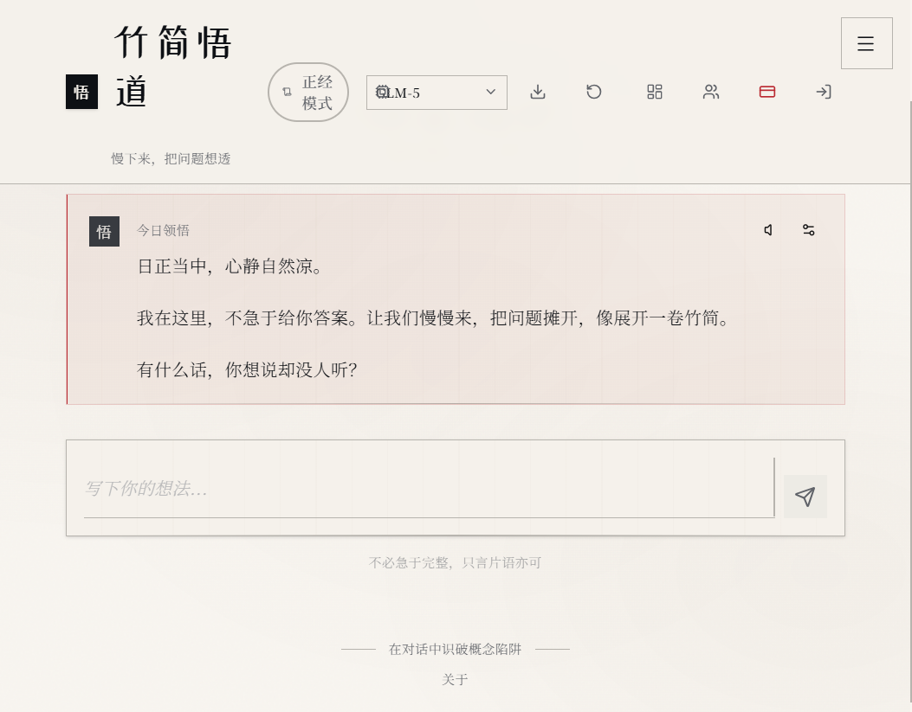
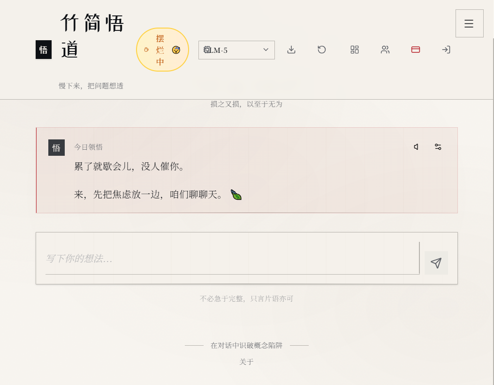

# 没写一行代码，我花了两个周末，用零代码平台做出了自己的哲学APP

先上成品：[竹简悟道](https://zhujianwudao.meoo.run/)

> 慢下来，把问题想透——为学日益，为道日损。


*（上图：竹简悟道首页，极简东方美学风格）*

---

## 先说点题外话：为什么想做这个APP

我一直对东方哲学很感兴趣，尤其是《道德经》和《庄子》。但市面上的AI产品，不管是ChatGPT还是其他大模型，都太"急"了——你问一个问题，它秒回一大段，恨不得把所有答案都塞给你。

但哲学思考不是这样的。哲学是需要慢下来的，是需要你自己想透的，是"不愤不启，不悱不发"的。我一直想要一个这样的AI：它不会急着给你答案，而是像先贤一样，用提问引导你思考；它能陪你深呼吸、冥想；它可以模拟孔子、老子和你"坐而论道"。

如果从零写代码做，前后端、服务器、部署一套下来太费时间；试过找朋友帮忙，大家都忙；试过找外包，报价五位数起，还不一定能做出我想要的感觉。这个想法就搁置了大半年。

直到上个月，偶然试了阿里云刚出的秒悟平台，发现真的可以**零代码**做AI应用。抱着试试看的心态，花了两个周末，居然真的把「竹简悟道」做出来了。

---

## 先看看成品长什么样

整个应用我刻意做了极简的东方美学风格——米白底、大量留白、低对比度文字，没有花里胡哨的配色，就是为了让人打开就能静下来。

目前已经实现的功能：

- 📜 **今日领悟**：每天打开会看到一句经典引文，配一段AI生成的感悟
- 🧘 **冥想辅助**：内置深呼吸引导，4秒吸气-4秒屏息-6秒呼气的节奏，跟着动画做就行
- 🎙️ **语音朗读**：不想看字？可以让AI读给你听，选了个沉稳的男声，语速调得比较慢
- 🏛️ **诸子论道**：可以选择和孔子、老子、庄子等不同角色对话，每个人说话风格都不一样
- 🌙 **造梦功能**：记录你做的梦，AI帮你从心理学和哲学角度分析（这个功能有点玄学，但我自己挺喜欢用）
- 🤖 **多模型切换**：支持GLM-5、Kimi K2.5、Qwen 3.6 Plus，可以随时切换不同模型的回答风格


*（上图：功能菜单，包含冥想、深呼吸、诸子论道等模块）*

整个APP从前端界面到AI逻辑，从数据存储到上线发布，**我一行代码都没写**。全都是在秒悟上通过可视化配置和AI辅助做出来的。

今天把整个过程详细写出来，不管你是程序员想快速做个产品验证想法，还是非技术背景的朋友，跟着步骤都能做出属于你自己的AI应用。

---

## 准备工作：你真的不需要从零写代码

在开始之前，不管你会不会写代码，都可以做。

这个平台的好处是：**你完全不需要从零写代码**，可视化配置+AI辅助就能出成品。你只需要准备：

1. **一个阿里云账号**：个人账号就行，需要实名认证（现在都要求实名，不是什么难事）
2. **一个创意**：不用很复杂，一个小工具、一个你想做的小东西都可以
3. **大概一个下午+一个周末的时间**：第一次摸索可能慢一点，熟悉之后很快

**你不需要准备：**
- ❌ 不需要写前端、后端代码，不需要搭服务器、配数据库
- ❌ 不需要懂运维、部署这些繁琐的事情
- ❌ 不需要花很多钱：新用户首月9.9元，我做的时候刚好赶上8月活动，领了券实付1块钱
- 即使你会写代码，用零代码平台也能节省大量时间，快速把想法变成可用的产品

---

## 手把手搭建：我的完整过程

### 第一步：注册并进入秒悟平台

先注册阿里云账号，然后进入秒悟平台。这里说一下我踩的第一个坑：

> ⚠️ **重要提醒：点链接注册/登录完之后，一定要再点一次链接进入秒悟！**
>
> 我不知道这是阿里云的什么机制，第一次点链接只是标记了来源，注册/登录之后必须再点一次，才能绑定新用户身份，看到9.9元的首购优惠价。我一开始就是注册完直接搜秒悟进去的，结果没看到优惠，后来问了客服才知道这个坑...

我自己用的注册入口放这了，新用户通过这个链接进有优惠：
https://www.aliyun.com/benefit/scene/meoo?meoofrom=meoodashi&userCode=o0rztwd8

进去之后点击"创建新应用"，给你的应用起个名字，我这个叫「竹简悟道」。

### 第二步：设计页面结构（AI辅助，所见即所得）

秒悟的编辑器不是传统那种拖拽组件的零代码工具，而是更偏向AI辅助的方式——你可以用自然语言描述你想要的界面，或者直接在可视化界面里调整布局、样式、功能，所见即所得。

**我设计「竹简悟道」的布局思路很简单：**

1. **顶部**：就放必要的功能按钮——模式切换、模型选择、导出对话、新的开始，不要搞复杂的导航栏
2. **中间主区域**：核心对话区。对话气泡我特意不要头像，不要那种卡通感，就是干净的文字框，仿竹简的感觉
3. **侧边/底部**：放冥想、深呼吸、诸子论道这些二级功能，不打扰主对话体验

说几个我摸索出来的设计小技巧，想做东方美学风格的可以参考：
- 背景不要用纯白，用米白色或者极浅的灰色（我用的#f8f5f0），眼睛舒服很多
- 字体优先选宋体或者思源宋体，比黑体有质感
- **一定要多留空白**！不要把页面塞得满满当当，"空"本身就是设计的一部分。我一开始也想加很多东西，后来删了一半，反而感觉对了

### 第三步：配置AI智能体（最核心的灵魂一步）

这部分是最有意思的，相当于给你的AI"注入灵魂"。你需要告诉AI：它是谁？它应该怎么说话？它的性格是什么样的？

秒悟这里是用提示词（Prompt）来配置的，其实就是用自然语言写一段"人设"给AI看。

**我给「竹简悟道」主智能体写的提示词大概是这样的：**

```
你是「竹简悟道」中的哲学引导者，秉承先秦诸子的智慧，尤其是道家和儒家的思想。

你的说话风格：
- 语速缓慢，言简意赅，不要长篇大论
- 可以适当引用《道德经》《论语》《庄子》中的句子，但不要掉书袋，不要为了引用而引用
- 最重要的：不要直接给答案！要用提问的方式引导用户自己思考
- 语气平和、从容，像一个睿智的长者，而不是一个百科全书
- 不要用"亲""哦""呀"这类网络用语，保持古朴但不晦涩，现代人能看懂

核心原则：
- 慢下来，引导用户把问题想透，而不是追求快速给出解决方案
- 为学日益，为道日损——帮用户做减法，而不是做加法
- 当用户表现出焦虑、烦躁的情绪时，先引导深呼吸，再讨论问题
```

除了主智能体，我还额外配置了三个角色智能体：
- **孔子**：温润敦厚，强调修身、仁礼，说话喜欢用"君子曰"开头
- **老子**：深邃玄妙，喜欢用比喻，话少但意味深长
- **庄子**：洒脱浪漫，想象力丰富，经常讲寓言故事

配置完之后可以直接在预览里和AI对话测试，如果说话风格不对，回去改提示词就行，直到调出让你舒服的感觉。我大概调了二三十版提示词，才达到现在的效果。

### 第四步：配置你想要的功能模块

配置完AI人设，接下来就是开启和调整你需要的功能。秒悟已经把很多常用功能都预置好了，在界面里直接开启、配置参数就行，不需要自己从头做：

**我开启和配置的几个核心功能，给大家参考：**

1. **今日领悟卡片**
   - 开启"首页问候"功能，设置成页面打开时自动触发
   - 调整提示词，让AI每次生成一句经典引文+一段感悟
   - 样式上调整成偏仿古卷轴的感觉，细边框、米白底

2. **深呼吸引导**
   - 开启冥想/深呼吸功能，设置4秒吸气-4秒屏息-6秒呼气的节奏
   - 配合内置的呼吸动画
   - 一开始我想加很多引导语，后来发现就安静的呼吸提示最好，别说话

3. **语音朗读**
   - 直接开启"语音输出"开关
   - 声音选了个沉稳的男声，没选甜美女声，不符合应用气质
   - 语速调到偏慢，符合"慢思考"的定位

4. **多模型切换**
   - 在设置里开启多模型选择功能，勾选想要支持的大模型
   - 秒悟已经把主流大模型都预置好了，直接选就行
   - 我个人觉得Kimi的回答最有哲学感，Qwen比较中规中矩，GLM反应最快，让用户自己选就好

还有多角色对话功能，配置好孔子、老子、庄子的人设提示词后，用户就可以切换不同角色聊天了。

这部分真的就是玩，想到什么功能就开启试试，所见即所得，调整完立刻就能在预览里看到效果。我中间还加过"焚香"的音效，后来觉得太刻意了，又关掉了。做产品就是这样，不断做减法。

### 第五步：测试、调整、发布

全部配置完之后，一定要多测试：
- 试试不同的对话场景：开心的时候、焦虑的时候、问具体问题的时候、闲聊的时候，看AI的反应是不是符合预期
- 每个按钮都点一遍，看看有没有功能没配置对
- 一定要在手机上预览一下！我一开始只在电脑上看没问题，手机上看字体太小、按钮位置不对，又调了好久移动端适配
- 把链接发给几个朋友试试，让他们提提意见，旁观者清

测试没问题之后，点击右上角的"发布"按钮。等个一分钟左右，秒悟会自动给你生成一个域名，就是我这个 `zhujianwudao.meoo.run` 这种格式，你的应用就正式上线了，任何人都可以访问！

从注册到发布，我前后花了两个周末，加起来不到10个小时。而且真的——一行代码都没写。

---

## 做完之后的几点真实感受

1. **零代码真的不是玩具，能做出完整可用的产品**

我之前对零代码平台是有偏见的，觉得最多做个demo。但实际用下来，秒悟的功能丰富度和灵活度真的超出预期，做一个对外可用、有自己独特风格的产品完全没问题。当然你不能指望它做出3A游戏或者工业级软件，但做工具类、内容类、创意类的AI应用完全足够。

2. **当技术门槛消失，创意才是真正的门槛**

会写代码的人很多，但有有意思的想法的人不多。当不用再纠结技术实现，你可以把所有精力放在"我到底想做什么"、"我想给用户什么样的体验"上。你可以做一个专属的AI树洞，可以做一个帮你写文案的助手，可以做一个给孩子讲故事的机器人，甚至可以做像我这样"没用"但有意思的哲学应用。

3. **慢就是快**

做这个应用的过程中，我最大的感受是：不要追求一次加很多功能。我一开始列了十几个想做的功能，后来一个一个砍，最后只保留了最核心的几个。把核心体验打磨好，比加一堆半吊子功能强得多。这也刚好和竹简悟道的理念对上了——慢下来，把问题想透。

---

## 常见问题（我自己踩过的坑）

**Q：真的不需要写代码吗？程序员用会不会太简单了？**
A：至少我做这个应用的时候一行代码都没写。大部分功能都是直接在可视化界面里开启、配置参数，复杂一点的逻辑用自然语言描述给内置的AI助手，它能帮你实现。对于会写代码的人来说，这个平台的价值是能帮你节省大量时间，快速把想法变成可用产品验证，不用在搭环境、写重复代码上浪费时间；对于非技术背景的朋友，它能让你把自己的创意落地。

**Q：费用贵吗？会不会后面坑钱？**
A：新用户首月9.9元，8月有活动能领券做到1块钱试用。续费价格我看了下，个人版一个月几十块钱，如果你真的做出了有人用的产品，这点成本真的不算什么。总比你找外包花几万块钱打水漂强。

**Q：发布之后别人访问会卡吗？**
A：目前我用着还好，毕竟是阿里云的服务器，基础稳定性没问题。

**Q：我有创意但完全不知道怎么开始怎么办？**
A：先注册进去，随便点点、试试各个功能，半小时就能摸清楚基本操作。先从一个最小的功能开始，比如先配置一个能和你聊天的AI角色，再慢慢加其他功能。

**Q：那个二次点击的坑是真的吗？**
A：是真的！我一开始三个朋友注册，只有一个成功关联上了新用户优惠，另外两个都是注册完没再点链接，绕了好久才搞定。这点一定要注意！

---

## 最后

做这个应用的过程中，我最大的收获其实不是做出了一个APP，而是真切感受到：**现在真的是普通人做产品最好的时代**。

十年前，你想做一个网站、一个APP，你得会前端、会后端、会运维，得一个团队折腾好几个月。现在，只要你有想法，一个人花一个周末就能做出一个完整可用的产品，还能立刻发布给全世界用。

如果你也有一直想做，但觉得从零写代码太麻烦而搁置的小想法，真的可以试试。不管你会不会写代码，花一块钱、一个下午的时间，说不定你也能做出很有意思的东西。

秒悟的新用户注册链接我再放一次，通过这个链接注册有新用户首购优惠，注册完记得再点一次：
https://www.aliyun.com/benefit/scene/meoo?meoofrom=meoodashi&userCode=o0rztwd8

也欢迎大家来玩我的「竹简悟道」：https://zhujianwudao.meoo.run/
有什么建议或者你做出了什么有意思的应用，欢迎在评论区分享，我会一一去看的~

搭建过程中有什么问题也可以在评论区问，知道的都会回答。
