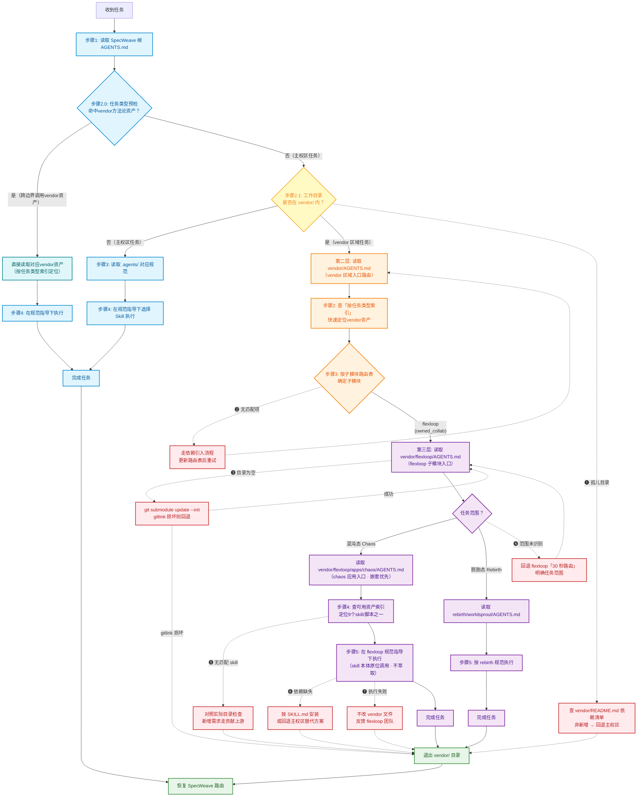

# Vendor 区域智能体契约 (AGENTS Manifest)

> **启动协议(PRIORITY ZERO)**
>
> ```
> 步骤 1:读取本文件全文
> 步骤 2:先查「按任务类型索引」快速定位 vendor 方法论资产（步骤2.0预检延伸到vendor区域）
> 步骤 3:按「子模块路由表」确定本次任务需要进入的子模块
> 步骤 4:进入子模块后,读取子模块的 AGENTS.md(嵌套优先)
> 步骤 5:退出 vendor/ 目录后,恢复 SpecWeave 主权区路由(回到根 AGENTS.md)
> ```
>
> ⚠️ 本文件是 vendor 区域的 AI 智能体入口。vendor/ 存放 SpecWeave 引入的外部依赖,本文件负责路由到各子模块并登记可用资产。不直接编写业务代码,不修改子模块内容。

## 区域性质

vendor/ 存放 SpecWeave 引入的外部依赖,分为两类:

- **git 子模块(owned_collab)**:自有协作项目,允许子模块内开发,通过 gitlink 追踪
- **手动管理依赖**:通过 .gitignore 忽略,不提交源码

vendor/AGENTS.md 与 vendor/.agents/ 由 SpecWeave 主权区维护,直接纳入版本管理;vendor/flexloop/ 内的所有内容由 flexloop 子模块自治管理,SpecWeave 不直接修改。

## 子模块路由表

| 子模块 | 类型 | AGENTS.md 入口 | 说明 |
|---|---|---|---|
| flexloop | owned_collab | [vendor/flexloop/AGENTS.md](flexloop/AGENTS.md) | AgentForge AI Agent 协作框架(跟踪 main 分支) |
| └ apps/chaos | (flexloop 子应用) | [vendor/flexloop/apps/chaos/AGENTS.md](flexloop/apps/chaos/AGENTS.md) | 混沌态:核心开发与探索区,含完整 .agents/ 规则体系 |

### 嵌套优先级

```
SpecWeave 根 AGENTS.md
  └─ vendor/AGENTS.md (本文件,vendor 区域入口)
       └─ vendor/flexloop/AGENTS.md (flexloop 子模块入口)
            └─ vendor/flexloop/apps/chaos/AGENTS.md (chaos 应用入口,完整规则体系)
```

进入任意子目录后,优先读取**离当前工作目录最近**的 AGENTS.md。若子项目规则与本文件冲突,以子项目为准(子项目覆盖父层)。

### 三层路由流程图

主流程(实线)与异常处理分支(红色虚线 ❶-❼)的完整跳转逻辑可视化。编号对应下方「异常处理分支」表格:



**图例与关键机制:**

- **实线箭头**(`-->`)主流程;**红色虚线箭头**(`-.->`)异常处理分支,编号 ❶-❼ 对应下方「异常处理分支」表格前 7 行
- ❽ **边界违反检测**贯穿全流程,不单独画分支,由 `python .agents/scripts/check-vendor.py --deep` 在任意节点检测,触发后按子模块流程回退
- **触发条件**:步骤 2.0 任务类型预检先执行——即使工作目录不在 vendor/ 内,命中vendor方法论资产（如Skill开发→skill-creator）也直接跨边界调用（青色路径）;步骤 2.1 判断工作目录是否在 `vendor/` 内,是则进入三层路由
- **双索引机制**:「按任务类型索引」用于快速定位（"我要做Skill开发,应该读什么"）,「可用资产索引」用于详细查阅（"skill-creator的依赖和路径是什么"）,两者互补
- **嵌套优先**:进入子目录后优先读取离工作目录最近的 AGENTS.md,子项目规则覆盖父级
- **不萃取策略**:9 个 skill 本体保留在 `vendor/flexloop/apps/chaos/.agents/skills/` 原位,通过双索引跨边界定位调用
- **退出恢复**:正常完成(Exit)或异常回退(各 E 分支汇入 Exit)均退出 `vendor/` 目录,自动恢复 SpecWeave 路由

## 按任务类型索引（启动协议步骤2.0预检·必查）

> **为什么需要按任务类型索引？** 防范"就近直觉"偏差（可得性启发）——开发者容易只看工作目录附近的文件，忽略 vendor 子模块中更成熟的方法论资产。按任务类型索引让 Agent 在启动协议阶段快速定位需要读取的 vendor 规范，即使工作目录不在 vendor/ 内也能命中。

| 任务类型 | 必读 vendor 资产 | 为什么必须读 |
|---|---|---|
| Skill 创建/优化/调试/评估 | [skill-creator SKILL.md](flexloop/apps/chaos/.agents/skills/skill-creator/SKILL.md) + [skills.md 规范](flexloop/apps/chaos/.agents/rules/skills.md) | Skill 开发方法论权威来源：description触发词优化、渐进式披露、长度控制、Why解释原则、eval测试循环、benchmark对比 |
| 任务执行总结/复盘报告生成 | [task-execution-summary SKILL.md](flexloop/apps/chaos/.agents/skills/task-execution-summary/SKILL.md) | 10章结构化复盘报告生成器，含TOML frontmatter、变更日志、经验教训模板 |
| Windows 文件夹归档（三段式可验证） | [archive-folder SKILL.md](flexloop/apps/chaos/.agents/skills/archive-folder/SKILL.md) | robocopy + 校验 + 删除的完整归档流程，含幂等性检查和错误处理 |
| PDF 转结构化 Markdown（中文学术/古籍） | [pdf-to-markdown SKILL.md](flexloop/apps/chaos/.agents/skills/pdf-to-markdown/SKILL.md) | 基于 pdfplumber 的中文PDF结构化提取，支持标题层级/段落/列表/引用块/表格识别 |
| 知乎内容获取（搜索/热榜/直达/全站搜索） | [zhihu-search](flexloop/apps/chaos/.agents/skills/zhihu-search/SKILL.md) / [zhihu-hot-list](flexloop/apps/chaos/.agents/skills/zhihu-hot-list/SKILL.md) / [zhihu-zhida](flexloop/apps/chaos/.agents/skills/zhihu-zhida/SKILL.md) / [zhihu-global-search](flexloop/apps/chaos/.agents/skills/zhihu-global-search/SKILL.md) | 知乎平台数据获取工具集，覆盖热榜、搜索、问题直达、全站搜索 |
| 静态站点冗余资源分析 | [asset-redundancy-analyzer SKILL.md](flexloop/apps/chaos/.agents/skills/asset-redundancy-analyzer/SKILL.md) | 声明但缺失/存在但未引用的资源分析，PowerShell实现 |
| flexloop 子模块开发/规则查阅/技能规范 | [vendor/flexloop/AGENTS.md](flexloop/AGENTS.md) → [vendor/flexloop/apps/chaos/AGENTS.md](flexloop/apps/chaos/AGENTS.md) | 三层路由嵌套入口，flexloop完整规则体系（context-economy、python、skills、browser-agent等） |

> **使用说明**：启动协议步骤2.0任务类型预检时，无论工作目录是否在 vendor/ 内，都先查本表。命中任务类型则必须读取对应资产，不得跳过。

## 可用资产索引

vendor 区域内可被 SpecWeave 跨边界调用的资产清单。实际资产存放在各子模块内,本索引仅提供路由定位,不复制资产本体。

### Skills

所有 skill 存放在 [vendor/flexloop/apps/chaos/.agents/skills/](flexloop/apps/chaos/.agents/skills/),遵循 flexloop 的[技能规范](flexloop/apps/chaos/.agents/rules/skills.md)。

| Skill | 功能 | 依赖 | 路径 |
|---|---|---|---|
| archive-folder | Windows 文件夹三段式可验证归档(robocopy + 校验 + 删除) | PowerShell + robocopy | [flexloop/apps/chaos/.agents/skills/archive-folder/](flexloop/apps/chaos/.agents/skills/archive-folder/) |
| asset-redundancy-analyzer | 静态站点冗余资源分析(声明但缺失/存在但未引用) | PowerShell | [flexloop/apps/chaos/.agents/skills/asset-redundancy-analyzer/](flexloop/apps/chaos/.agents/skills/asset-redundancy-analyzer/) |
| pdf-to-markdown | PDF 转结构化 Markdown(中文学术/古籍) | Python + pdfplumber | [flexloop/apps/chaos/.agents/skills/pdf-to-markdown/](flexloop/apps/chaos/.agents/skills/pdf-to-markdown/) |
| skill-creator | 创建/改进/评估 skill 的元工具 | Python + Claude API | [flexloop/apps/chaos/.agents/skills/skill-creator/](flexloop/apps/chaos/.agents/skills/skill-creator/) |
| task-execution-summary | 任务执行总结报告生成器(10 章复盘报告) | 对话历史 + 文件读写 | [flexloop/apps/chaos/.agents/skills/task-execution-summary/](flexloop/apps/chaos/.agents/skills/task-execution-summary/) |
| zhihu-global-search | 知乎全站搜索 | ZHIHU_ACCESS_SECRET + 网络 | [flexloop/apps/chaos/.agents/skills/zhihu-global-search/](flexloop/apps/chaos/.agents/skills/zhihu-global-search/) |
| zhihu-hot-list | 知乎热榜 | ZHIHU_ACCESS_SECRET + 网络 | [flexloop/apps/chaos/.agents/skills/zhihu-hot-list/](flexloop/apps/chaos/.agents/skills/zhihu-hot-list/) |
| zhihu-search | 知乎搜索 | ZHIHU_ACCESS_SECRET + 网络 | [flexloop/apps/chaos/.agents/skills/zhihu-search/](flexloop/apps/chaos/.agents/skills/zhihu-search/) |
| zhihu-zhida | 知乎直达 | ZHIHU_ACCESS_SECRET + 网络 | [flexloop/apps/chaos/.agents/skills/zhihu-zhida/](flexloop/apps/chaos/.agents/skills/zhihu-zhida/) |

### Scripts

flexloop 的验证与检查脚本存放在 [vendor/flexloop/apps/chaos/.agents/scripts/](flexloop/apps/chaos/.agents/scripts/),包含 25+ 验证脚本。SpecWeave 主权区的脚本不依赖这些,需要跨边界调用时通过沙箱工具运行(见 [VENDOR-INTEGRATION.md 第 4.6 节](../docs/knowledge/VENDOR-INTEGRATION.md))。

## 边界声明

| 资产 | 归属 | SpecWeave 可修改 | 说明 |
|---|---|---|---|
| vendor/AGENTS.md | SpecWeave 主权区 | ✅ 是 | vendor 区域入口路由 |
| vendor/.agents/ | SpecWeave 主权区 | ✅ 是 | vendor 区域元数据容器 |
| vendor/README.md | SpecWeave 主权区 | ✅ 是 | vendor 依赖总览(由 check-vendor 自动生成) |
| vendor/VERSION.md | SpecWeave 主权区 | ✅ 是 | vendor 版本元数据 |
| vendor/flexloop/ | flexloop 子模块 | ❌ 否 | 通过 gitlink 追踪,修改需走子模块开发流程 |
| vendor/flexloop/apps/chaos/.agents/skills/ | flexloop 子模块 | ❌ 否 | 9 个 skill 的本体,SpecWeave 仅跨边界调用 |

## 跨边界调用规范

SpecWeave 智能体需要使用 vendor 区域的 skill 时:

1. **定位**:通过本文件的「可用资产索引」找到 skill 路径
2. **调用**:进入 vendor/flexloop/apps/chaos/.agents/skills/<skill-name>/ 读取 SKILL.md
3. **执行**:按 SKILL.md 中的说明调用脚本(scripts/ 下的实现)
4. **不复制**:不在 SpecWeave 主权区复制 skill 本体,保持单一可信源
5. **不修改**:不直接修改 vendor 内的 skill 文件,如需改进走[贡献上游流程](../docs/knowledge/VENDOR-INTEGRATION.md)

## 异常处理分支

对应上方「三层路由流程图」的各决策节点,当正常路径无法走通时按以下分支处理:

| 异常场景 | 流程图节点 | 触发条件 | 处理方式 |
|---|---|---|---|
| 孤儿目录 | 步骤 2.1 | 工作目录在 `vendor/` 内,但不在任何已登记子模块路径下 | 检查是否为新增依赖(查阅 [vendor/README.md](README.md) 依赖清单);若否,回退到 SpecWeave 主权区路由并提示路径可能有误 |
| 未知子模块 | 子模块路由表 | 路由表无匹配项 | 确认依赖是否已登记;未登记则需先走依赖引入流程(`git submodule add` 或手动管理依赖初始化),再更新本文件路由表 |
| 子模块未初始化 | 第三层入口 | 读取 `vendor/flexloop/AGENTS.md` 失败或目录为空 | 运行 `git submodule update --init vendor/flexloop` 初始化子模块后重试;仍失败则检查 gitlink 是否损坏(见 [VENDOR-INTEGRATION.md 版本控制章节](../docs/knowledge/VENDOR-INTEGRATION.md)) |
| 任务范围未识别 | 任务范围判断 | flexloop 任务范围既非 Chaos 也非 Rebirth | 回退到 `vendor/flexloop/AGENTS.md` 的「30 秒路由」,提示用户明确任务范围或确认是否需要新增应用入口 |
| skill 索引定位失败 | 可用资产索引 | 索引无匹配 skill | 对照 `vendor/flexloop/apps/chaos/.agents/skills/` 实际目录检查 skill 是否已被移除或重命名;若为新增需求,走[贡献上游流程](../docs/knowledge/VENDOR-INTEGRATION.md) |
| skill 依赖缺失 | 步骤 4 执行 | skill 执行时缺少 PowerShell / Python / uv / robocopy 等运行环境 | 按 SKILL.md 的依赖说明安装;无法满足时回退到 SpecWeave 主权区寻找替代方案(见 [alternatives-guide.md](../.agents/rules/alternatives-guide.md)) |
| skill 执行失败 | 步骤 4 执行 | 脚本运行报错或校验未通过 | 读取 skill 目录下的 CHANGELOG / 日志定位原因;**不直接修改 vendor 内文件**,反馈给 [flexloop 治理团队](../.agents/teams/flexloop-team.md) |
| 边界违反检测 | 全流程 | 意外修改了 `vendor/flexloop/` 内文件 | 运行 `python .agents/scripts/check-vendor.py --deep` 检测;通过 `git -C vendor/flexloop status` 查看变更并按子模块流程回退 |

**通用回退原则:** 任何异常无法在 vendor 区域内解决时,退出 `vendor/` 目录(对应流程图 Exit → Restore 分支),回到 SpecWeave 主权区路由,并在 [flexloop-team.md](../.agents/teams/flexloop-team.md) 登记问题待 flexloop 团队处置。禁止通过修改 vendor 内文件的方式绕过异常。

## 参考链接

- [SpecWeave 根 AGENTS.md](../AGENTS.md) — 主权区入口
- [VENDOR-INTEGRATION.md](../docs/knowledge/VENDOR-INTEGRATION.md) — 外部子模块协同集成方案(边界划分/版本控制/更新同步/测试隔离/模式萃取)
- [vendor/README.md](README.md) — vendor 依赖总览(由 check-vendor 自动生成)
- [vendor/VERSION.md](VERSION.md) — vendor 版本元数据
- [flexloop-team.md](../.agents/teams/flexloop-team.md) — SpecWeave 的 flexloop 治理团队角色映射与交接协议
